# 세션 (14:00 ~ 18:00): Agile 방식과 협업 문화 / 김두현 강사님 (duhyeon.kim7@gmail.com)

## 초반
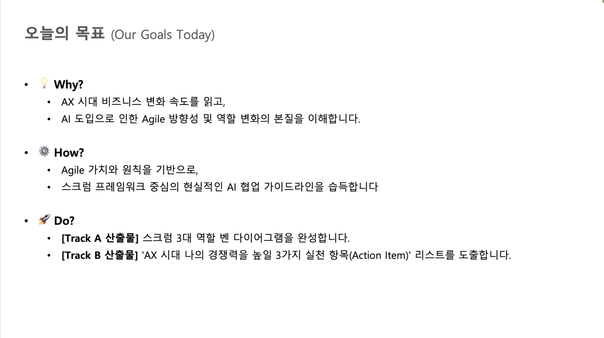
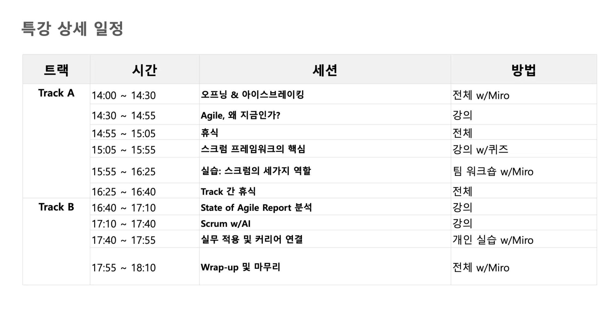
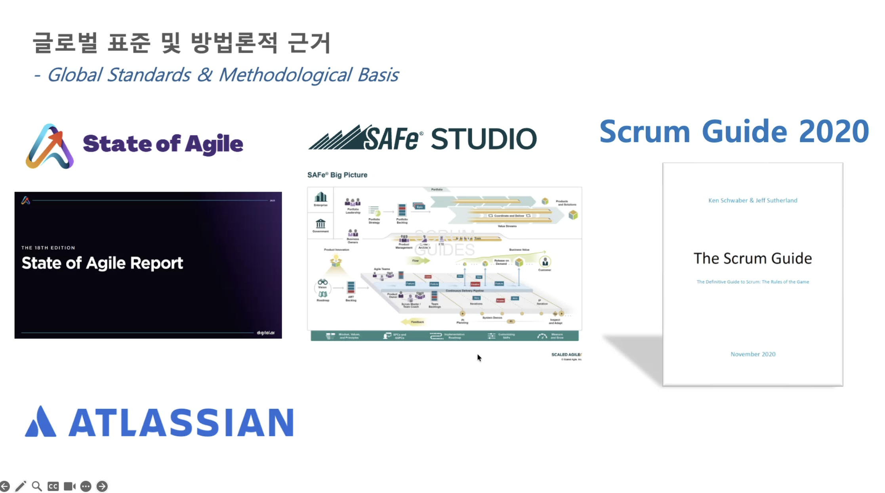


## 일하는 방법
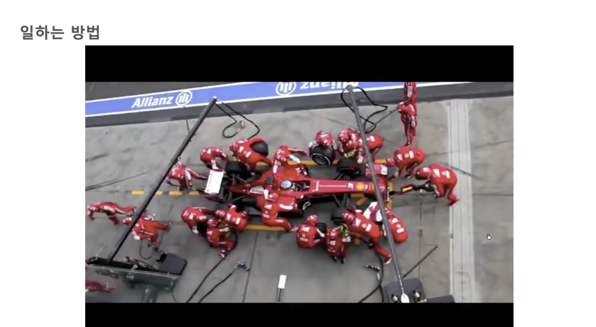

- 사진 4에 있는 영상 + 유튜브 영상: F1 영상, 피트 스톱(Pit Stop)
  - 1950년대: 정비공 4명 정도가 망치로 바퀴를 두드려 빼고 주유까지 하느라 60초 이상(1~2분)이 걸림.
  - 1990년대: 약 10초 내외 소요
  - 2010년대: 3~4초 대 (2013년 영상이 약 3초대)
  - 2020년대: 현재는 20명 안팎의 크루가 일사불란하게 움직여 1.8초~2초대(심하면 1초대)라는 경이로운 속도로 타이어를 갈아치움
- 영상을 보고 느낀점: 1950년 때의 타이터 가는 시간이 너무나도 오래걸려서 보다가 너무 답답했다.

## Agile이 필요한 이유

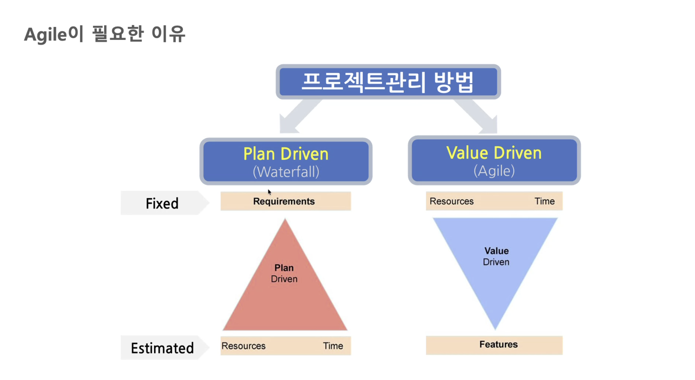
- Plan Driven(Waterfall): 계획 주도, 고객의 요구사항을 fixed 한다.
- Value Driven(Agile): 고객의 요구사항 + 고객의 피드백, Outcome(성과/결과)

```text
전통적 방식: "계획대로 다 만들었어!" (Output 중심)
애자일 방식: "고객의 요구사항과 피드백을 바탕으로, 진짜 가치 있는 결과를 냈어!" (Outcome 중심)
```

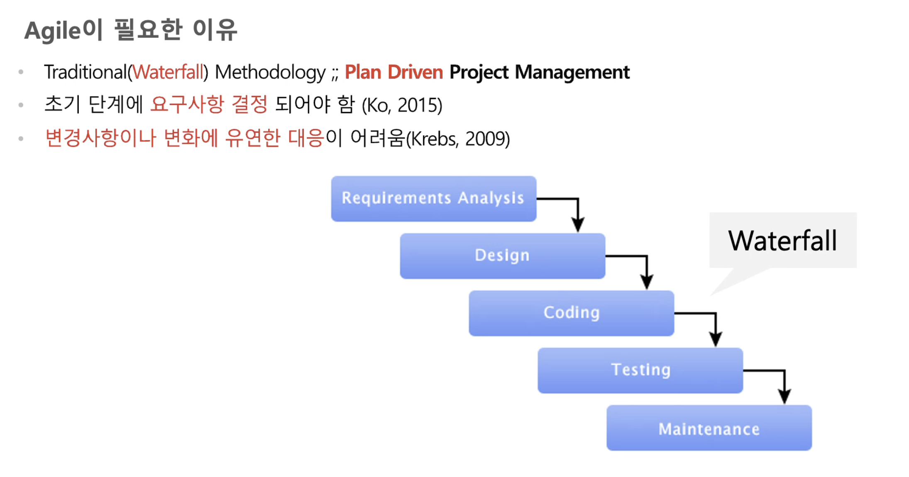
- 처음에 설문 했을때의 요구사항에 비해 10%만 충족한다. 6개월 후에 다 만들고 고객에 준다면 "어? 이건 제가 원한게 아니에요."
- AI로 바이브 코딩할 경우, 하네스 또는 프롬포트를 통해 지정한 작업만 하도록 해야한다.

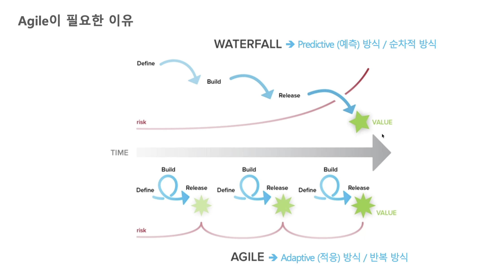

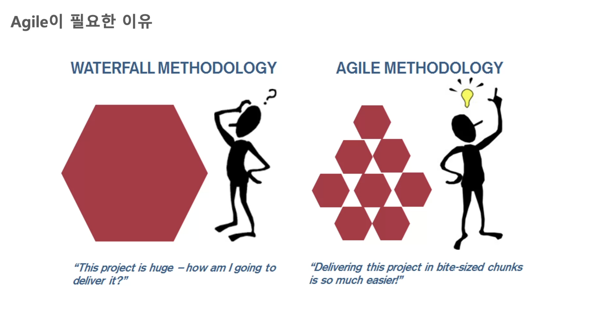
- 육각형 큰 거 가지고 가면, "어 이거 아닌데..."
- 2주의 스프린트가 지나고 나면 육각형 3개가 나오는거다. 그때마다 고객한테 "이게 맞습니까?" 요구사항 확인.
  - AI가 나오면서 AI agent를 이용해 2주동안에 여러 팀이 모여서 해야할 일들을 한 사람이 할 수 있게 됐다.
  - 가이드라인이나 보안 부분에 있어서는 기술에 비해 속도가 느리다. 뒤따라 오는중

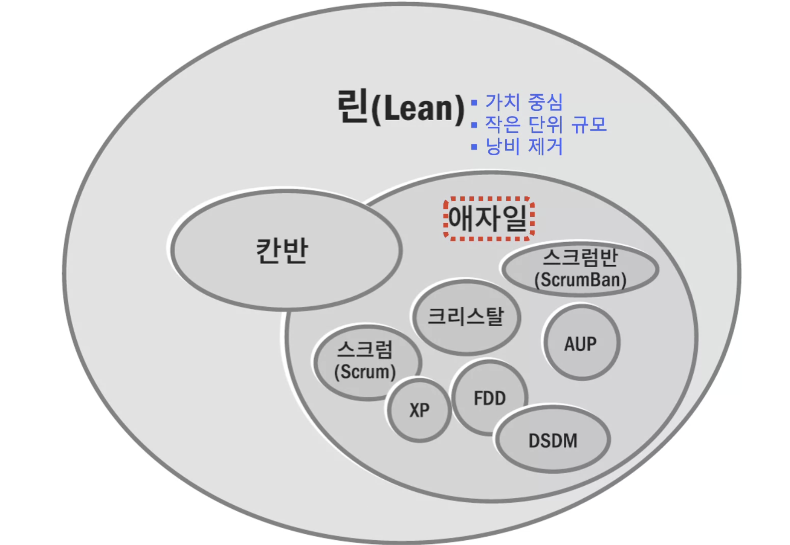
- 칸반: 1950년대 도요타의 부사장이었던 오노 다이이치는 미국의 대형 마트를 보고 영감을 받음. 마트에서는 고객이 물건을 사서 매대가 비면(털리면), 점원이 그 수량만큼만 창고에서 가져와 다시 채워 넣음. 도요타는 공장에 이걸 도입. 부품 상자에 부품 번호와 수량이 적힌 '칸반(Kanban, 간판/신호 카드)'을 붙여두고, 뒷공정에서 부품을 써서 카드가 남으면, 그 카드(신호)를 보고 앞공정에서 딱 그만큼만 부품을 새로 만들었음.
  - 소프트웨어에서의 칸반: 현재 IT에서 쓰는 칸반 보드(To Do ➔ Doing ➔ Done)도 여기서 유래. 할 일(Task)을 무작정 많이 쌓아두고 일하는 게 아니라, 팀이 소화할 수 있는 만큼만 '당겨와서(Pull)' 처리하는 방식
- 한국에서는 스크럼을 많이 쓴다.
- 칸반도 많이 쓰긴 한다.

## Agile의 가치와 원칙
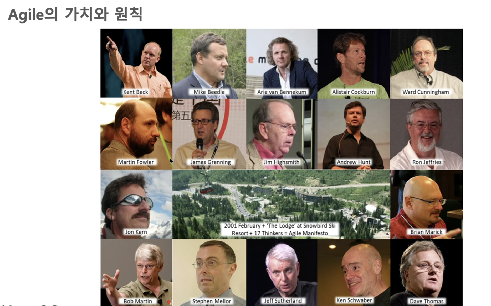

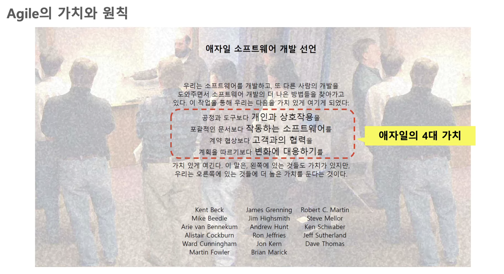

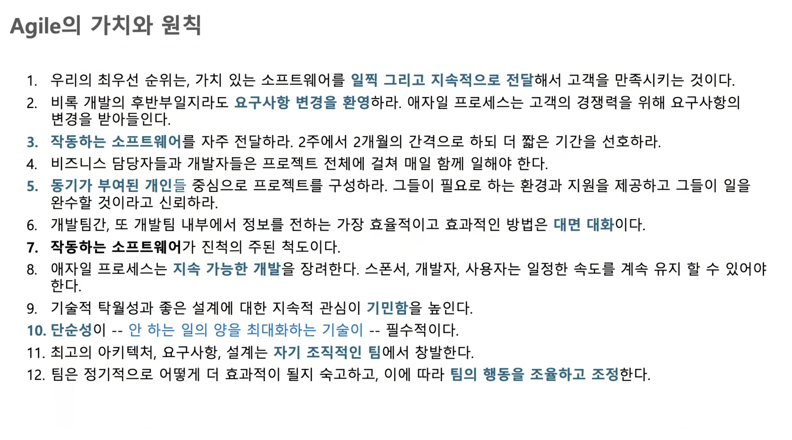

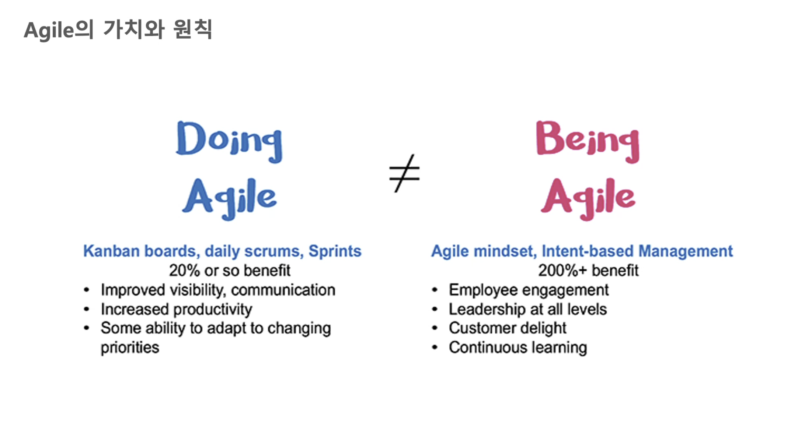
- Being Agile: Agile에서는 이게 먼저다. 이 이후에 Doing Agile로 가거나 한다.

## Scrum
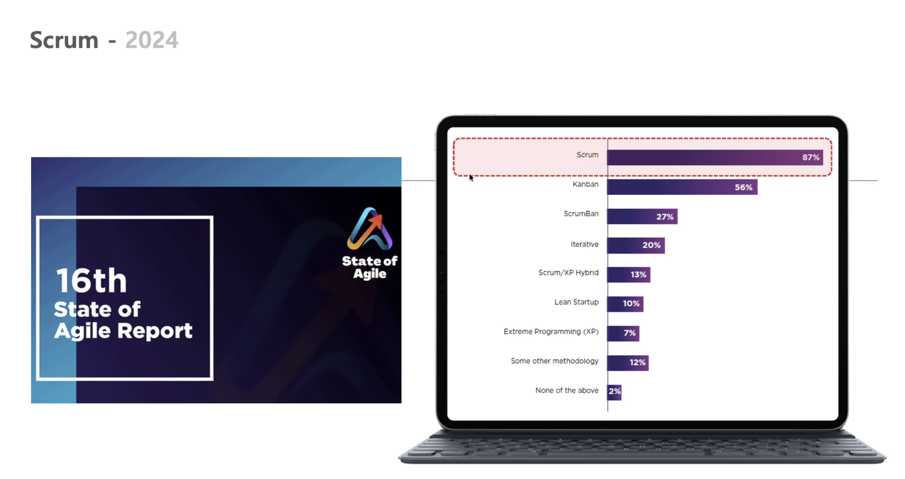
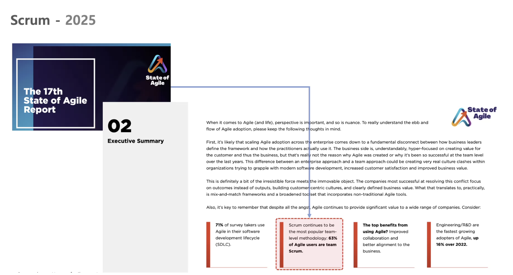
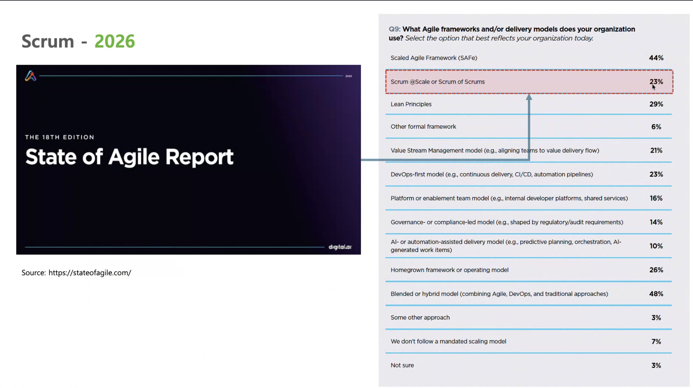
- Scrum 사용률 변화: 87% → 63% → 23%

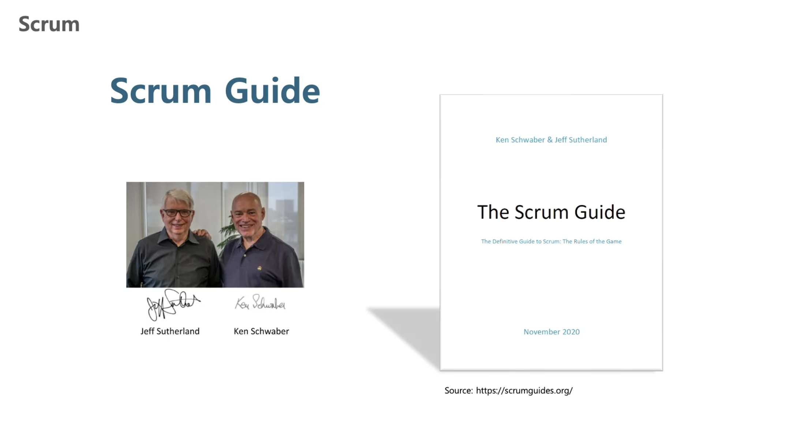
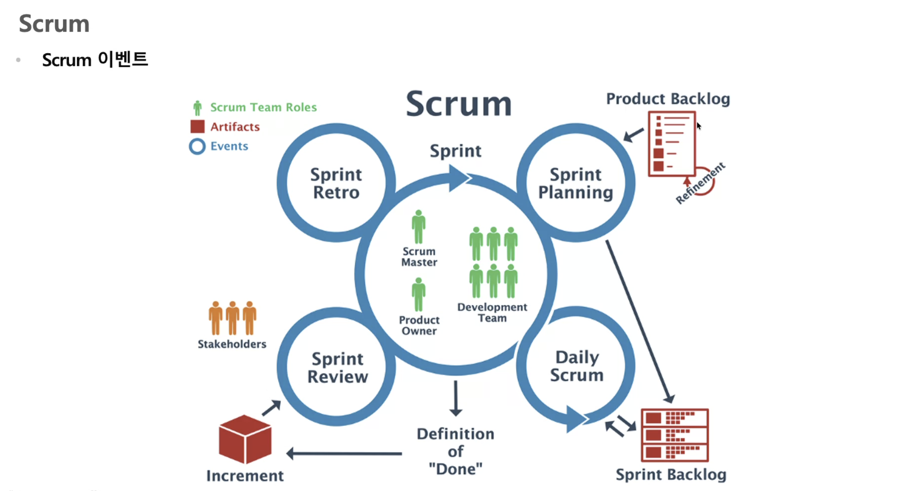
- Scrum Team Roles: 3 [Scrum Master(Scrum이 잘 돌아갈 수 있도록 하는, 중립적이려고 하는데 그래도 개발팀에 가깝다?), Product Owner(고객과 이해관계자에 있어서 개발팀이 잘 개발할 수 있도록 정제해주고, 시장분석 등등. 작은 CEO. 팀장이 아니다. 결정 권한이 있긴 하더라도, Scrum Master과 Development Team의 권위는 동등하다. 고객이랑 가깝다?), Development Team(2주동안에 해야할 일을 정제해서 품질 좋은 산출물)]
- Artifacts: 3 [Product Backlog(태워야하는 장작들), Increment(2주동안의 하나의 산출물 나오는 것), Sprint Backlog(우리가 해야할 일들, 어떻게 가져오냐면 계획 단계에서 우리팀이 몇 명이고 휴가도 생각해서 전체적으로 2주동안 할 수 있는 작업을 정하는 것에서 20% 뺀 것. 언제 어떤 사고가 터질지 모르는 방어?)]
- Events
  - Sprint Planning: 원래 하던 팀이라면 2주동안에 4시간이면 된다. 하지만, 처음 하는 팀이라면 좀 더 오래 걸릴 것.
  - Sprint: Sprint Planning 이후 2주동안 도는 사이클. - Development Team이 개발에만 집중할 수 있도록 Scrum Master가 방해요소를 다 차단해줌.
  - Daily Scrum: 2주동안 매일 한다. 해야할 일들만 공유. 무슨 일이 있었으면 공유.
  - Sprint Review: 고객을 불러서 "우리 2주동안 뭐했다~" 이러고 요구사항 파악
  - Sprint Retro: Development Team을 불러다가 다음에는 이거 하면 될 거고, 이런 요구사항이 있으니 고쳐달라, 이건 잘했다 등등의 회의

- Sprint 중에는 다른 요구사항이 들어오지 않는게 원칙이다. 하지만, 현실은 그렇지 않기에 Scrum Team끼리 협의해서 원래 할당됐던 부분을 빼고 넣던가 한다.

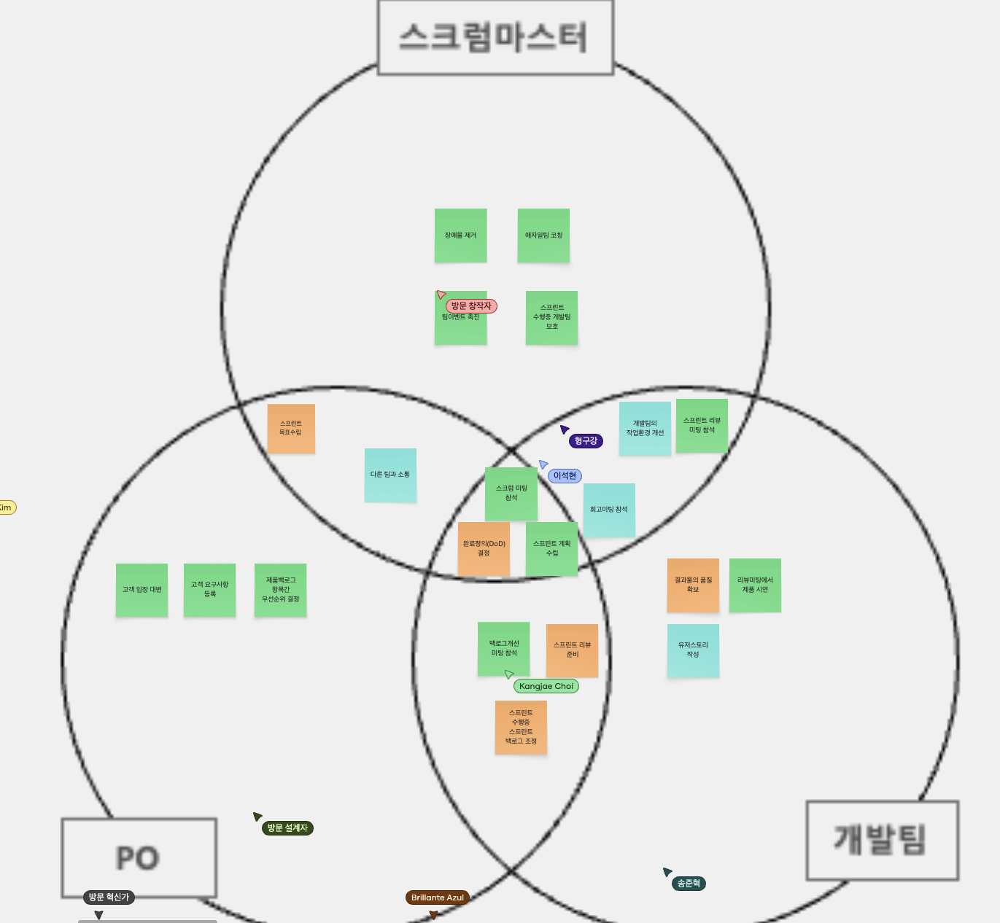
- 회고 미팅의 경우에는 PO가 들어오는 경우가 있긴하지만, 개념적으로는 아니다.

## Agile Report
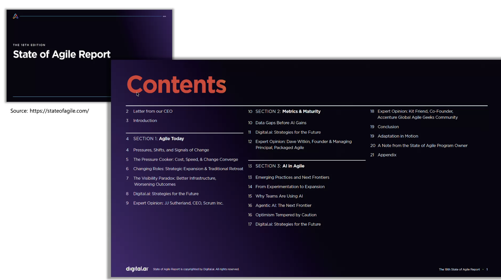
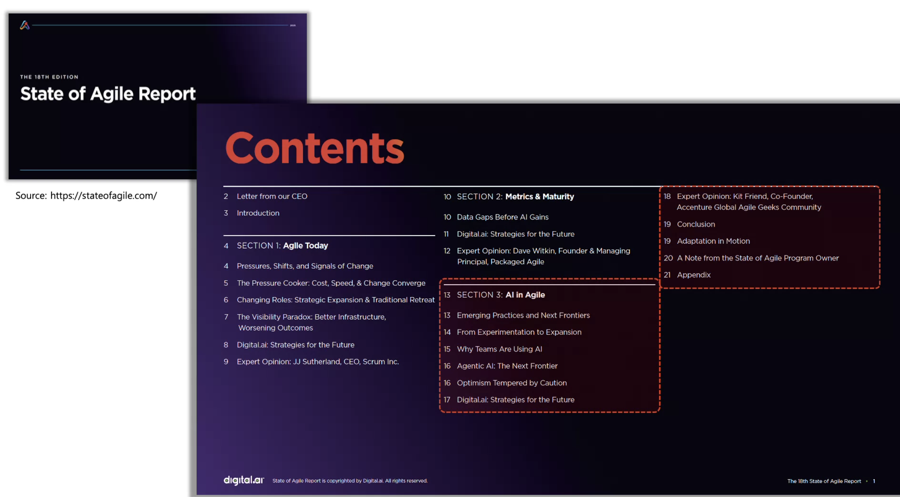
- AI 관련이 생겼다.

## AI 열풍 속 Agile의 현주소
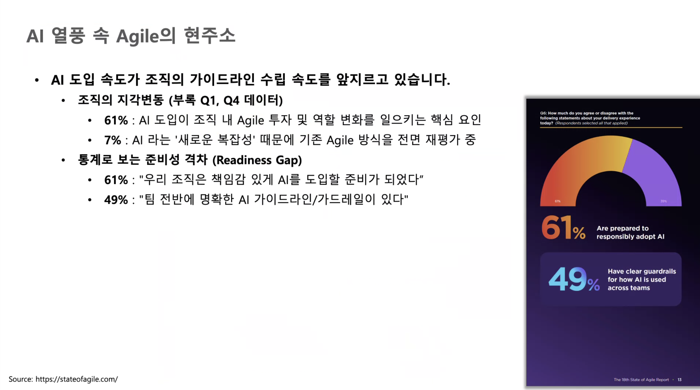
- AI Agent가 나오기 전에 Agile 코치들은 우리의 시대는 끝났다. AI가 다 해줘버리니까 라는 얘기가 있었다.
- Agile이 묻혀서 사라지지 않을까 라는 말이 나왔었다.
- 시간이 지나서 AGI가 나오고 할 때는 모르겠지만, AI에 따른 일자리도 생기기도 한다. 우리가 예상했던 AI가 사람의 일자리를 뺏는다라는 방향에서 약간 틀어져서 가는중이다.
- 정리: AI가 발전할수록 제품이 나오는 속도는 빨라진다. 그렇기 때문에 고객의 피드백을 받아 올바른 가치(Outcome)를 찾아가는 애자일 철학은 더더욱 중요해지며, 인간은 AI에게 자리를 뺏기는 게 아니라 AI를 통제하고 협업하는 새로운 형태의 일자리로 진화하고 있다.

## AI 도입 현황 - 파편화된 실험에서 실제 작동 모델로
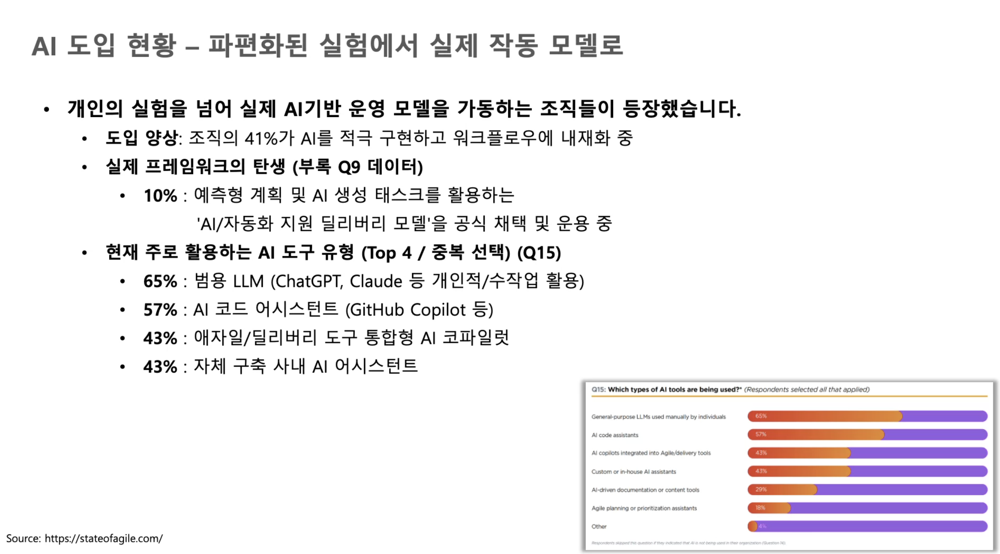

## AI 도입의 본질 - 단순 효율성을 넘어선 데이터 인프라의 경고
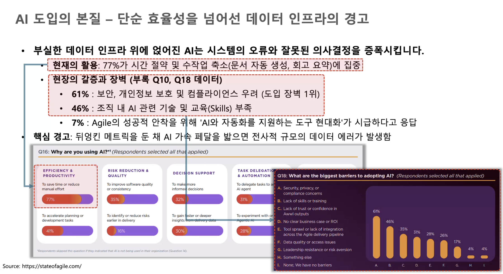

## Agile에서 새로운 팀원 - 에이전틱 AI(Agentic AI)의 등장과 역할의 이분화
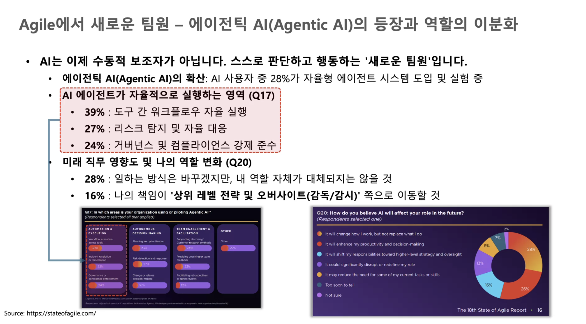

## AX시대 Agile의 생존 전략 - 미래는 "가장 거버넌스를 잘하는 조직"의 것이다.
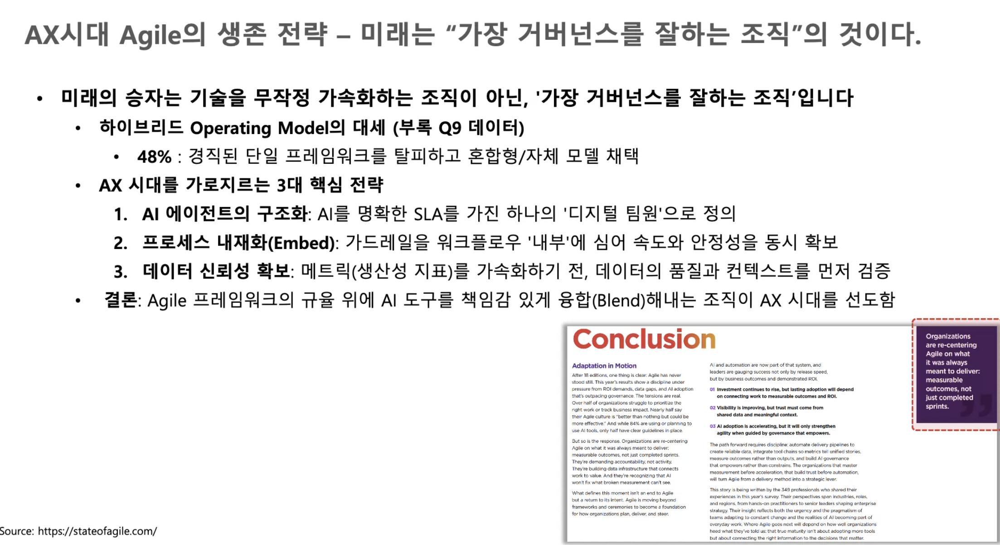

## 왜 AX시대에도 여전히 "Scrum"인가?
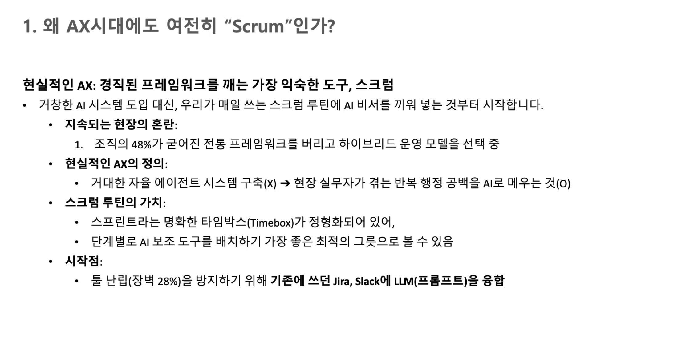
- 필요하다.

## 스프린트 계획 & 백로그 관리와 AI의 융합
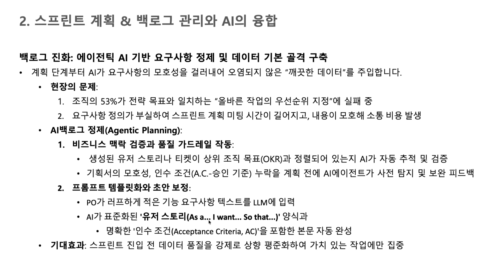

## 데일리 스크럼 & 스프린트 수행과 AI의 융합
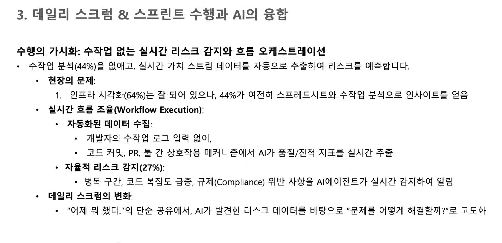

## 인간 스크럼 마스터/PO와 AI 에이전트의 협업 모델
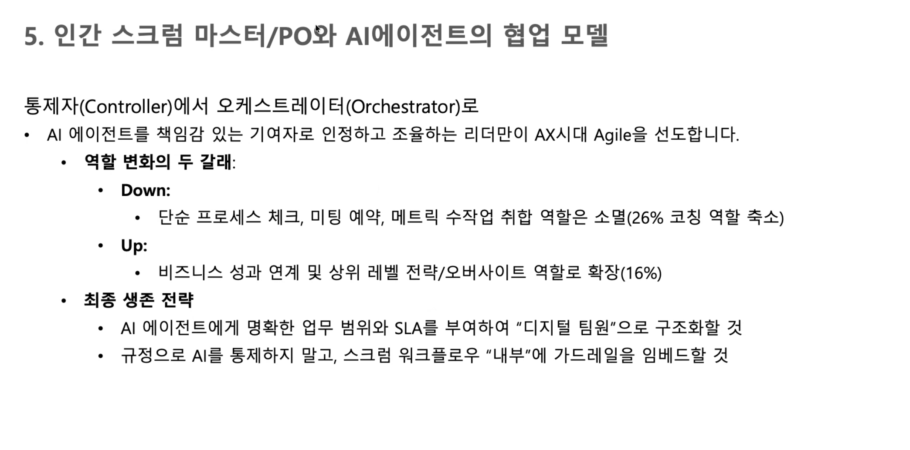

- 벤치마킹(Benchmarking)은 단순히 남을 따라 하는 '모방'을 넘어, 가장 잘하는 팀의 기준을 보고 우리의 일하는 방식을 개선(Outcome 중심)하기 위한 분석법

- PRD는 Product Requirement Document의 약자로, 우리말로는 ‘제품 요구사항 정의서’라고 부른다. 쉽게 말해, “우리가 이번에 어떤 제품(또는 기능)을, 왜 만들고, 그 제품이 어떤 문제를 해결해야 하는지”를 상세하게 적어둔 기획 문서의 끝판왕이라고 생각. 주로 PO(Product Owner)나 기획자가 작성.
  - PRD에는 도대체 뭐가 적혀있을까? 전통적인 방식의 두꺼운 기획서와 달리, 애자일에서의 PRD는 Value-Driven(가치 중심)과 Outcome(성과)에 집중한다. 보통 다음과 같은 내용이 들어감.
    - 목적 (Why): 이 기능을 왜 만드는가? 고객의 어떤 불편함을 해결하려는 것인가?
    - 목표 및 핵심 지표 (Outcome): 이걸 만들어서 어떤 성과를 낼 것인가? (예: 결제 전환율 5% 상승)
    - 사용자 스토리 (User Story): 사용자가 이 제품을 어떻게 사용하는가? (예: "고객은 장바구니에서 버튼 하나로 바로 결제할 수 있어야 한다.")
    - 기능적 요구사항: 제품이 반드시 갖춰야 하는 핵심 기능 목록과 제약 조건.
  - 정리: PRD는 제품이 나아가야 할 올바른 방향(Outcome)을 전 팀원(및 AI)에게 공유하여, 엉뚱한 배를 만들지 않도록 나침반 역할을 해주는 제품 요구사항 정의서

## 마무리
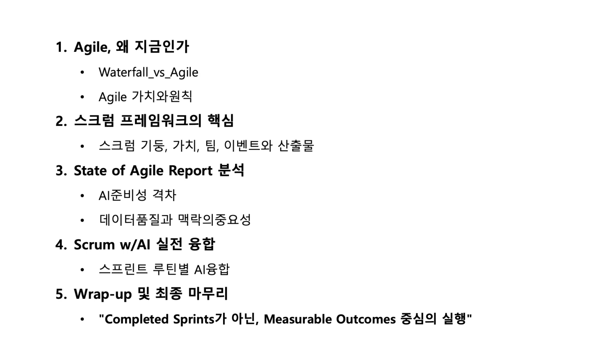

## 특강 강사님
- 애자일이 무조건 정답이라고 말을 해주시는 거는 아니다. 코치로서 말을 해주는 거긴 하다.
- TDD: Test-Driven Development (테스트 주도 개발): 애자일 방법론에서 개발의 퀄리티를 높이고 빠르게 피드백을 받기 위해 정말 중요하게 여기는 개발 기술 중 하나
  - 보통 우리는 코드 짜기 ➔ 실행해 보기 ➔ 버그 있으면 고치기 순서로 개발.
  - TDD는 이걸 완전히 거꾸로 뒤집어서 "코드를 짜기 전에, 테스트 코드부터 먼저 만드는 개발 방식"
- AI oversight, AI governance
  - governance는 기준을 잡는 것이다. 강제할 수는 없지만, 해당 기준을 벗어 날 수 없게 한다. 다른 의미이다.
  - AI governance = 규칙을 만드는 것
  - AI oversight = 그 규칙이 제대로 지켜지는지 감독하는 것