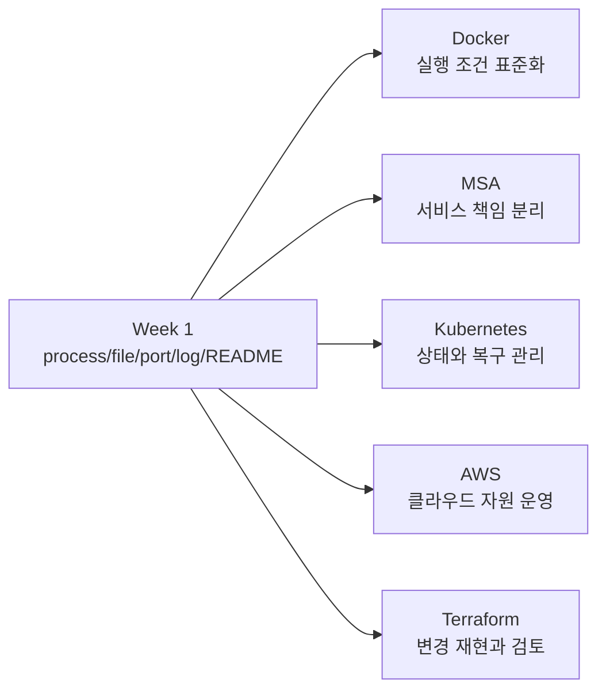

# 2세션: 5주 커리큘럼 로드맵 - Week 1 spine과 Week 2~5 기술 연결

## 실습 확인 기록

| 명령/확인 | 결과 |
|---|---|

## 확인 질문 답변

| 질문 | 답변 |
|---|---|
| Week 1 spine과 Week 2~5 기술의 연결을 설명할 수 있는가? | Week 1의 process, file, port, config, log, README가 각각 Docker의 container, volume, port binding, environment variable, 로그, Dockerfile/Compose로 확장된다. Kubernetes, AWS, Terraform도 같은 spine을 다른 이름으로 확장한다. |
| Kubernetes를 빨리 배우면 Cloud Native를 이해한 것인가? | 아니다. 실행, 네트워크, 설정, 관찰 가능성의 기초 없이는 cluster 문제를 해석하기 어렵다. Week 1 spine이 없으면 Week 4 Kubernetes의 오류 원인을 파악할 수 없다. |
| Docker는 앱을 자동으로 좋은 서비스로 만드는가? | 아니다. Docker는 실행 조건을 표준화하지만 보안, 비용, 장애 대응은 별도 설계가 필요하다. |
| AWS는 콘솔에서 클릭해서 만들면 운영이 끝나는가? | 아니다. 권한, 비용, region, network, cleanup, 문서화가 운영 품질을 좌우한다. 생성보다 운영 책임이 더 중요하다. |
| Terraform은 단순히 인프라를 만드는 명령어인가? | 아니다. Terraform은 변경 의도와 state를 관리하는 방식까지 포함한다. 어떤 인프라를 원하는지를 코드로 남기고 변경을 추적한다. |
| 기대/불안 매핑에서 가장 큰 학습 위험 1개를 어떻게 다뤄야 하는가? | 불안 요소를 개념, 실습, 환경, 영어 문서, 협업, 평가 중 하나로 분류하고, 필요한 도움을 한 문장으로 쓴다. 위험을 조기에 드러내야 대응 계획으로 바꿀 수 있다. |

## notes

### 5주 로드맵

| Week | Focus | Week 1 spine 연결 | 학생이 답해야 할 질문 |
|---|---|---|---|
| 1 | 컴퓨팅 펀더멘털과 운영 증거 | process, file, port, log, README | 이 서비스는 어디서 실행되고 무엇으로 정상 판단하는가? |
| 2 | Docker | process와 filesystem을 image/container로 표준화 | 같은 앱을 다른 환경에서 어떻게 재현할 것인가? |
| 3 | MSA | 여러 process/service의 network와 data boundary | 서비스 사이 책임과 통신 실패를 어떻게 설명할 것인가? |
| 4 | Kubernetes | container lifecycle, service discovery, desired state | 원하는 상태와 실제 상태가 다를 때 무엇을 볼 것인가? |
| 5 | AWS + Terraform/IaC | cloud service 운영과 infrastructure 변경 관리를 연결 | 비용, 권한, 보안, 가용성과 인프라 변경을 어떻게 관리할 것인가? |

### Week 1 spine

| Component | 초급 정의 | 이후 확장 |
|---|---|---|
| Process | 실행 중인 프로그램 | container, pod, service lifecycle |
| File/System | 코드, 설정, 의존성이 놓이는 위치 | image layer, volume, object storage |
| Port/Network | 서비스가 요청을 받는 입구 | service discovery, ingress, load balancer |
| Configuration | 실행 환경을 바꾸는 값 | env var, secret, config map, IaC variable |
| Observability | 정상/비정상을 판단하는 증거 | log, metric, trace, alert, dashboard |
| Handoff | 다른 사람이 이어받을 수 있는 문서 | README, runbook, PR, postmortem |

### Week 1 spine에서 이후 기술로 확장



Week 1의 기초 개념이 오른쪽 기술로 이름을 바꾸어 확장된다. 각 주차의 기술은 따로 떨어진 과목이 아니라 운영 문제의 확장이다.

### AI coding agent 시대 관점

agent는 컨테이너 실행 환경 정의, Kubernetes manifest, Terraform 초안을 생성할 수 있다. 하지만 어떤 운영 문제를 해결하려는지 모르면 그럴듯한 파일만 만든다.

사람은 이것을 agent에게 요구해야 한다:
- "이 앱의 실행 조건은 무엇인가"
- "정상 상태 증거는 무엇인가"
- "비용과 권한 위험은 무엇인가"

5주 로드맵은 agent가 만든 결과물을 검토하는 기준을 단계적으로 쌓는 과정이다.

### 핵심 문장

```text
Cloud Native를 Kubernetes부터 시작하면 초급자는 외워야 할 단어만 늘어납니다.
우리는 먼저 작은 서비스가 어떻게 실행되고, 어떤 파일을 읽고,
어떤 port를 열고, 어떤 log를 남기는지 봅니다.
그 다음 같은 질문을 container, cluster, cloud, IaC로 확장합니다.
```

## Blocker Log

| 증상 | 확인한 것 |
|---|---|
| | |
