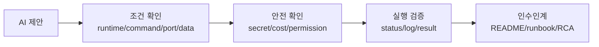

# 3세션: AI coding agent 시대의 Cloud Native/DevOps 마인드셋 특강

## 실습 확인 기록

| 명령/확인 | 결과 |
|---|---|

## 확인 질문 답변

| 질문 | 답변 |
|---|---|
| AI가 코드를 만들면 DevOps 지식은 덜 중요해지는가? | 아니다. 코드 생성 속도가 빨라질수록 검증, 배포, 보안, 비용 판단의 중요성이 커진다. agent output을 운영 기준으로 검증하고 개선하는 능력이 핵심이다. |
| 에러를 많이 만나면 실력이 부족한 것인가? | 아니다. 에러를 증거로 바꾸고 재현 가능하게 설명하는 능력이 현업 실력이다. 에러 자체보다 에러를 어떻게 기록하고 분석하는지가 더 중요하다. |
| 공식 문서는 전문가만 읽는가? | 아니다. 초급자는 모든 문서를 읽는 것이 아니라 필요한 정의, 제한, 예제를 찾아 검증한다. 사전 조건과 주의 사항을 찾는 연습이 문서 읽기의 핵심이다. |
| agent가 알려준 명령은 그대로 실행해도 되는가? | 아니다. 권한, 삭제, 비용, secret 영향이 있는 명령은 실행 전 의미를 확인해야 한다. agent output에는 항상 검증 단계가 필요하다. |
| "작은 앱이 보인다"와 "비즈니스 서비스다"는 어떻게 다른가? | 작은 앱은 코드가 실행된 상태다. 비즈니스 서비스는 누가 접근하는지, 비용이 얼마인지, 장애 시 무엇을 볼지, 보안은 어떻게 하는지가 모두 갖춰진 상태다. |
| blocker를 증거 기반 형식으로 다시 쓰는 방법은? | 증상(사용자가 본 현상), 내가 시도한 것(실행한 절차, 참고한 문서), 부족했던 증거(명령어, 경로, 버전, 로그 중 빠진 것), 다음에 남길 증거를 기록한다. |
| 서비스화 체크리스트에서 AI에게 요구해야 할 것은 무엇인가? | 실행 환경(runtime, command, port), 보안(secret 비노출, 권한 범위), 비용(리소스 종류, cleanup), 관찰(log, status, metric), 인수인계(README, runbook, known issue)를 요구한다. |

## notes

### 작은 앱 제작 vs 비즈니스 서비스화

| 단계 | 사람이 알아야 하는 질문 | AI에게 맡길 때 필요한 기준 |
|---|---|---|
| 요구사항 | 누구의 어떤 문제를 해결하는가? | 기능 목록보다 사용자 흐름과 제약을 먼저 쓴다. |
| 실행 조건 | 어떤 runtime, command, port, data가 필요한가? | start/check/stop evidence를 요구한다. |
| 보안 | secret, 권한, 인증, 개인정보는 어떻게 보호되는가? | 민감정보 비노출과 권한 범위를 검증한다. |
| 인프라 | compute, storage, network, identity는 어디에 있는가? | Docker/AWS/Kubernetes 선택 이유를 설명한다. |
| 배포 | 변경을 어떻게 build, release, deploy, rollback하는가? | 배포 절차와 실패 시 되돌림 기준을 요구한다. |
| 관찰 | 정상/비정상을 무엇으로 판단하는가? | log, status, metric, alert 기준을 요구한다. |
| 비용 | 어떤 리소스가 비용을 발생시키는가? | 예상 비용, free-tier 범위, cleanup을 요구한다. |
| 장애 대응 | 실패하면 누가 무엇을 보고 조치하는가? | RCA, runbook, known issue를 요구한다. |

### DevOps/Cloud Engineer 핵심 태도

| 태도 | 의미 | 수업 적용 |
|---|---|---|
| 증거 기반 | command, log, status, screenshot filename, README로 말한다. | 질문할 때 증상과 시도를 함께 쓴다. |
| 작은 단위 | 큰 시스템을 process, file, port, config로 쪼갠다. | 에러를 "전체가 안 됨"이 아니라 실패 지점으로 좁힌다. |
| 공개 가능한 기록 | 민감정보를 제외하고 동료가 도울 수 있는 맥락을 남긴다. | token, MFA, 결제 정보는 공유하지 않는다. |
| 공식 문서 우선 | AI 답변과 블로그는 공식 문서와 실행으로 검증한다. | vendor 문서와 실행 결과를 함께 본다. |
| blocker 공유 | 막힌 지점을 숨기지 않고 증상과 시도한 일을 기록한다. | 막힌 시간보다 기록 품질을 본다. |
| 절차 이해 | AI에게 시키기 전에 필요한 단계와 검증 기준을 말한다. | agent prompt에 완료 조건을 포함한다. |
| 운영 관점 | 코드 너머 인프라, 배포, 보안, 비용, 관찰 가능성을 함께 본다. | 작은 앱을 서비스 checklist로 평가한다. |

### AI output 검증 경로



agent가 만든 결과는 바로 완료가 아니다. 조건, 안전, 실행, 인수인계의 네 단계를 지나야 서비스 후보가 된다.

### blocker rewrite 형식

| 항목 | 기록 |
|---|---|
| 증상 | 사용자가 본 현상 또는 에러 요약 |
| 내가 시도한 것 | 실행한 절차, 참고한 문서, 바꾼 설정 |
| 부족했던 증거 | 명령어, 경로, 버전, 로그, screenshot 중 빠진 것 |
| 다음에는 남길 증거 | 동료가 재현할 수 있게 남길 정보 |

### 강사 코멘트

```text
AI에게 좋은 답을 받는 사람은 프롬프트를 예쁘게 쓰는 사람이 아니라,
실행 조건과 검증 기준을 정확히 아는 사람입니다.
이 과정에서 여러분은 agent에게 일을 시키는 기준과
agent 결과를 의심하는 기준을 배웁니다.
```

미래의 강한 엔지니어는 agent를 많이 쓰는 사람이 아니라 agent output을 운영 기준으로 검증하고 개선하는 사람이다.

## Blocker Log

| 증상 | 확인한 것 |
|---|---|
| | |
