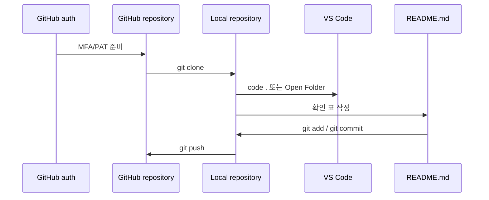

# 3교시: Git/GitHub/VS Code 기본 실습 - clone, MFA/PAT, commit, push

## 실습 확인 기록

| 명령/확인 | 결과 |
|---|---|

## 확인 질문 답변

| 질문 | 답변 |
|---|---|
| commit은 push와 같은가? | 아니다. commit은 로컬 기록이고 push는 원격 전송이다. commit을 해야 로컬에 이력이 남고, push를 해야 GitHub에 공유된다. |
| README는 마지막에 쓰는 문서인가? | 아니다. README는 실행 조건과 확인 기록을 계속 누적하는 문서다. 처음부터 작성하고 매 교시 기록을 추가한다. |
| MFA를 켜면 HTTPS push도 자동으로 되는가? | 아니다. MFA는 웹 로그인 보호이고, HTTPS push에는 PAT 또는 credential manager 인증이 별도로 필요할 수 있다. |
| PAT는 GitHub 비밀번호와 같은가? | 아니다. PAT는 범위와 만료가 있는 access token이다. 값은 비밀번호처럼 보호하고 필요 최소 권한으로 만든다. |
| 인증 오류는 Git 문제인가? | 아니다. 토큰 권한, credential manager, repository 권한, URL 오타 문제일 수 있다. 증상을 기록하고 단계별로 확인한다. |
| Git/GitHub/VS Code 연결을 어떻게 확인하는가? | repository를 clone하고 VS Code에서 열어 README를 수정한 뒤 commit하고 push하거나, 실패 증상을 비밀값 없이 기록한다. |
| 토큰, MFA 코드, 복구 코드를 어디에 기록하면 안 되는가? | README, 스크린샷, 채팅, 공개 repository에 절대 남기지 않는다. 토큰 값이 아니라 설정 여부와 만료일만 기록한다. |

## notes

### clone부터 push까지 흐름



### 실습 명령 절차

```bash
git clone <YOUR_REPOSITORY_URL>
cd <YOUR_REPOSITORY_NAME>
git status
```

VS Code CLI가 등록되어 있으면:

```bash
code .
```

README 수정 후:

```bash
git status
git add README.md
git commit -m "Add week 1 확인 표"
git push
```

### PAT 생성 기준

| 설정 | 권장값 |
|---|---|
| Token type | Fine-grained token |
| Expiration | 수업 기간에 맞춘 짧은 만료일 |
| Repository access | Only select repositories |
| Selected repository | 오늘 만든 repository |
| Repository permissions | Contents: Read and write, Metadata: Read-only |
| 기록 금지 | 토큰 값, 복구 코드, MFA 코드 |

### Git 단계별 확인 기록

| 단계 | 보이는 확인 기록 | 운영 의미 |
|---|---|---|
| MFA 확인 | GitHub 로그인 후 2FA challenge 통과 | 계정 보호 기준을 충족했다. |
| PAT 준비 | 토큰 값이 아니라 설정 여부와 만료일만 기록 | HTTPS push 인증 수단을 준비했다. |
| clone 직후 | repository 폴더 생성 | 원격 기준을 로컬로 가져왔다. |
| VS Code 열기 | Explorer에 repository 파일 표시 | 수정할 작업공간을 확인했다. |
| commit 직후 | commit hash 출력 | 변경 이유가 로컬 이력에 남았다. |
| push 직후 | GitHub README 표시 | 팀원이 같은 확인 기록을 볼 수 있다. |

### 실패 증상 분류

| 증상 | 먼저 확인할 것 | 기록 금지 |
|---|---|---|
| Authentication failed | PAT permission/expiration, credential cache | 토큰 값 |
| 403 | repository permission, selected repository scope | 토큰 값 |
| Repository not found | repository URL, owner/name typo | 토큰 값 |
| credential prompt 반복 | credential manager cache, wrong token | 토큰 값 |

### 이후 주차 연결

컨테이너 실행 환경 정의, Kubernetes manifest, Terraform file도 모두 Git에 남는다. commit message와 README 확인 기록은 나중에 배포 변경과 장애 원인을 추적하는 최소 단서가 된다.

## Blocker Log

| 증상 | 확인한 것 |
|---|---|
| | |
