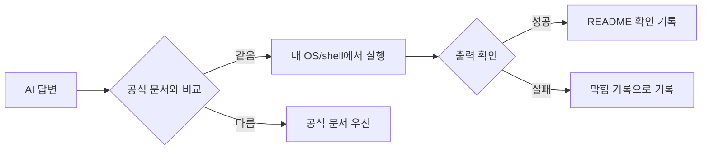

# 4교시: 공식 문서 읽기와 AI 답변 검증

## 실습 확인 기록

| 명령/확인 | 결과 |
|---|---|

## 확인 질문 답변

| 질문 | 답변 |
|---|---|
| 오늘 읽은 공식 문서의 사전 조건은 무엇인가? | Git, GitHub README, VS Code 문서 중 읽은 문서의 OS별 차이, 계정 조건, 인증 보안 조건, 설치 전제를 기록한다. |
| AI 답변에서 실행으로 검증한 부분과 검증하지 못한 부분은 무엇인가? | 내 환경에서 실행하여 출력이 나온 명령은 검증됨이고, 실행하지 않은 명령이나 내 OS와 다른 환경의 설명은 미검증으로 남긴다. |
| 주의 사항을 무시하면 어떤 운영 문제가 생길 수 있는가? | 비밀값 노출, 예상치 못한 비용 발생, 버전 불일치로 인한 실행 실패 등이 발생할 수 있다. |
| 공식 문서는 챌린저에게 너무 어려운가? | 아니다. 전체를 읽지 말고 사전 조건, 버전, warning, 명령부터 찾는다. 필요한 정의와 제한을 찾는 연습이 핵심이다. |
| AI가 알려준 명령은 검증하지 않아도 되는가? | 아니다. 내 환경에서 실행 결과가 나와야 확인 기록이다. AI 답변은 공식 문서와 실행으로 검증해야 한다. |
| 블로그가 최신이면 공식 문서보다 낫다고 볼 수 있는가? | 아니다. 공식 문서와 충돌하면 공식 문서를 우선한다. 블로그는 특정 환경과 시점의 기록이라 내 환경에 맞지 않을 수 있다. |

## notes

### 공식 문서가 기준이 되는 이유

AI 답변과 블로그 글은 빠른 출발점이 될 수 있지만, 현재 버전과 내 환경에 맞는다는 보장은 없다. 공식 문서는 도구 제작자가 유지하는 기준 문서이며, 버전, 사전 조건, warning, deprecation을 확인할 수 있는 곳이다.

문서를 읽는 목적은 모든 문장을 외우는 것이 아니다. 실행 전에 반드시 알아야 하는 전제 조건을 찾는 것이다.

### 공식 문서 읽기 위치

| 문서에서 찾을 위치 | 확인 질문 | 기록 예시 |
|---|---|---|
| 사전 조건 | 실행 전에 필요한 조건은 무엇인가? | OS, 계정, 설치 도구 |
| 주의 사항 | 실수하면 위험한 부분은 무엇인가? | 비밀값 노출, 비용 발생 |
| 명령 section | 실제로 따라 할 명령은 무엇인가? | 명령과 출력 요약 |

### AI 답변 검증 경로

### AI 답변 검증 체크리스트

| 검증 질문 | 확인 기록 |
|---|---|
| 공식 문서와 같은가? | URL/section |
| 명령을 실제 실행했는가? | 명령/출력 |
| 내 OS와 shell에 맞는가? | OS/shell |
| 비밀값이나 토큰 노출을 요구하는가? | 예/아니오 |
| 비용이나 외부 서비스를 만들게 하는가? | 예/아니오 |

### 캡처/기록 기준

| 캡처/기록 대상 | 확인 기록으로 인정되는 조건 |
|---|---|
| 공식 문서 URL | 읽은 section이나 keyword가 함께 있어야 한다. |
| AI 답변 일부 | 공식 문서와 실행 결과로 확인한 부분만 사용한다. |
| 오류 메시지 | 토큰, email, private URL은 가리고 증상만 남긴다. |

### 이후 주차 연결

Docker, Kubernetes, AWS, Terraform은 모두 공식 문서가 방대하다. 오늘의 읽기 방식은 이후 Docker 실행 문서, Kubernetes manifest, AWS IAM, Terraform provider 문서를 읽을 때 그대로 사용한다.

공식 문서, 실행 결과, 보안 기준을 함께 보는 습관이 production 사고를 줄인다.

## Blocker Log

| 증상 | 확인한 것 |
|---|---|
| | |
