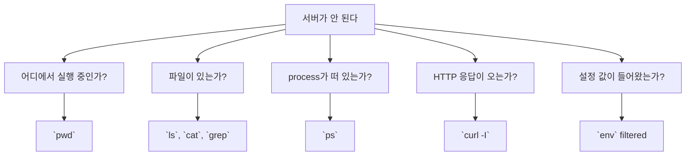

# 5교시: Linux/CLI 기본 - pwd, ls, cd, cat, grep, curl, ps, kill, env

## 실습 확인 기록

| 명령/확인 | 결과 |
|---|---|

## 확인 질문 답변

| 질문 | 답변 |
|---|---|
| 파일 존재 여부를 확인하는 명령은 무엇인가? | `ls`로 파일 목록을 확인하고, `cat 파일명`으로 파일 내용을 확인한다. 파일이 없으면 `ls`에서 보이지 않고, `cat`은 파일을 찾지 못한다는 오류를 출력한다. |
| HTTP 응답을 확인할 때 브라우저 대신 `curl`을 쓰는 이유는 무엇인가? | `curl -I`는 header와 status code를 명확한 텍스트로 출력해 확인 기록으로 남기기 좋다. 브라우저는 시각적으로 보여주지만 status code와 header를 기록으로 추출하기 어렵다. |
| `ps`와 `env`가 각각 보여주는 상태는 무엇인가? | `ps`는 현재 실행 중인 process 목록을 보여주고, `env`는 현재 shell에 들어온 환경변수(설정값)를 보여준다. |
| `kill`은 오류를 고치는 명령인가? | 아니다. process 종료 명령이다. 원인을 이해하지 못하면 증거를 잃을 수 있으므로 신중하게 사용한다. |
| `env` 출력은 전부 README에 붙여도 되는가? | 아니다. 토큰, key, credential이 섞일 수 있으므로 필요한 key 이름만 기록한다. `env | grep -E 'SHELL|HOME|PATH'`처럼 필터링해서 사용한다. |
| "서버가 안 된다"는 말을 CLI 질문으로 어떻게 나눌 수 있는가? | "파일이 있는가"(`ls`, `cat`), "process가 떠 있는가"(`ps`), "HTTP 응답이 오는가"(`curl -I`), "설정 값이 들어왔는가"(`env`)로 나눌 수 있다. |

## notes

### CLI 명령 매핑

| 명령 | 확인하는 것 | 운영 질문 |
|---|---|---|
| `pwd` | 현재 경로 | 어디에서 실행 중인가? |
| `ls` | file/storage 상태 | 필요한 파일이 있는가? |
| `cd` | 작업 위치 변경 | 올바른 directory로 이동했는가? |
| `cat` | file content | 파일 내용이 기대와 같은가? |
| `grep` | text 확인 기록 검색 | 로그/문서에 단서가 있는가? |
| `curl` | HTTP response | 네트워크 요청에 응답하는가? |
| `ps` | process | 실행 중인 program이 있는가? |
| `kill` | process lifecycle | 종료해야 할 process는 무엇인가? |
| `env` | environment | 어떤 설정이 들어왔는가? |

### 운영 질문에서 CLI 선택하기



### 명령 절차

```bash
pwd
ls
printf 'status=ok\nport=8000\n' > cli-check.txt
cat cli-check.txt
grep port cli-check.txt
env | grep -E 'SHELL|HOME|PATH'
ps
curl -I https://example.com
```

`kill`은 실제 대상 process를 이해한 뒤 사용한다. 오늘은 개념만 확인:

```bash
kill -l
```

### 안전한 CLI 기록 기준

| 주의 표시 | 학생 행동 |
|---|---|
| `env` 출력에 토큰/key가 보임 | 전체 복사하지 말고 key 이름만 기록한다. |
| `ps` 출력이 길게 나옴 | 오늘 실행한 shell/process 중심으로 요약한다. |
| `kill` 대상이 불명확함 | 종료하지 않고 `kill -l` 개념 확인만 한다. |

### 예상 결과

- `cat cli-check.txt`는 `status=ok`, `port=8000`을 출력한다.
- `grep port cli-check.txt`는 `port=8000` 줄만 출력한다.
- `curl -I https://example.com`은 HTTP header와 status line을 출력한다.
- `env | grep ...`은 비밀값이 아니라 일반 환경 키 일부만 보여야 한다.

### 이후 주차 연결

이후 주차의 container 상태 조회, cluster 상태 조회, cloud identity 확인, infrastructure 변경 검토도 모두 CLI로 시스템 상태를 묻는 확장판이다.

운영 자동화는 수동 관찰 절차를 코드로 바꾸는 일에서 시작한다. 오늘의 명령은 이후 자동화 스크립트와 health check의 원형이다.

## Blocker Log

| 증상 | 확인한 것 |
|---|---|
| | |
