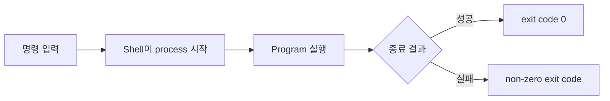

# 6교시: Compute와 process - CPU, process, thread, 명령, exit code

## 실습 확인 기록

| 명령/확인 | 결과 |
|---|---|

## 확인 질문 답변

| 질문 | 답변 |
|---|---|
| `ls no-such-file`의 증상과 exit code 확인 기록은 무엇인가? | 파일을 찾지 못한다는 오류 메시지가 출력되고, `echo $?`를 실행하면 0이 아닌 값(보통 1 또는 2)이 나온다. 이것이 실패를 나타내는 exit code다. |
| CI/CD가 exit code를 사용하는 이유는 무엇인가? | CI/CD pipeline은 사람처럼 화면을 읽지 않고 exit code로 다음 단계를 계속할지 멈출지 판단한다. exit code 0은 성공, 0이 아닌 값은 실패다. |
| Docker container가 감싸는 핵심 실행 단위는 무엇인가? | process다. Docker container는 일반적으로 하나의 주 process를 실행한다. Kubernetes Pod는 container를 감싸고 재시작 정책을 적용한다. |
| 명령과 process는 같은 말인가? | 아니다. 명령은 실행 요청이고 process는 실행 중인 상태다. 명령을 입력하면 shell이 process를 만들고, process가 끝나면 exit code를 남긴다. |
| 화면에 오류가 보이면 항상 프로그램 버그인가? | 아니다. 경로, permission, config, dependency 실패일 수 있다. 오류 메시지를 증거로 기록하고 원인을 좁혀야 한다. |
| exit code는 사람이 볼 필요가 없는가? | 아니다. 자동화 시스템은 exit code를 핵심 판단 기준으로 쓴다. 사람도 디버깅 시 `echo $?`로 직전 명령의 성공 여부를 확인해야 한다. |

## notes

### Compute 핵심 개념

| 개념 | 설명 | Week 1 확인 기록 |
|---|---|---|
| CPU | 명령을 실행하는 계산 자원 | concept 기록 |
| Program | 실행 가능한 코드나 명령 | 명령/file 경로 |
| Process | 실행 중인 program | `ps` 출력 |
| Thread | process 내부 실행 흐름 | concept only |
| Exit code | 명령 종료 결과 | `$?` |

### 명령 실행 흐름



### 명령 절차

```bash
pwd
echo $?
date
echo $?
ls no-such-file
echo $?
ps
```

### exit code 관찰 지점

| 캡처할 순간 | 읽어야 할 단서 |
|---|---|
| `pwd` 뒤 `echo $?` | 성공 명령의 exit code |
| `ls no-such-file` 출력 | 실패 증상 메시지 |
| 실패 뒤 `echo $?` | 자동화가 실패로 판단할 숫자 |

### 예상 결과

- `pwd`와 `date` 뒤의 `echo $?`는 보통 `0`을 출력한다.
- `ls no-such-file`은 파일이 없다는 오류를 출력한다.
- 실패한 `ls` 뒤의 `echo $?`는 보통 `0`이 아닌 값을 출력한다.
- `ps`는 현재 shell과 실행 중인 process 목록을 보여준다.

### 이후 주차 연결

| 오늘 개념 | 로컬 확인 기록 | 이후 확장 |
|---|---|---|
| 명령 | 입력한 명령 | container 명령 |
| process | `ps` 출력 | Pod 안 실행 단위 |
| exit code | `echo $?` | CI/CD 성공/실패 판단 |

Kubernetes의 restart, readiness, liveness도 결국 process 상태와 연결된다. AWS ECS, Lambda, EC2도 compute 실행 단위를 제공한다.

## Blocker Log

| 증상 | 확인한 것 |
|---|---|
| | |
