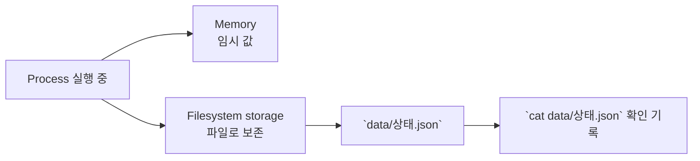

# 7교시: Memory와 storage - RAM, filesystem, 경로, persistence, permission

## 실습 확인 기록

| 명령/확인 | 결과 |
|---|---|

## 확인 질문 답변

| 질문 | 답변 |
|---|---|
| `data/상태.json`은 memory인가 storage인가? | storage다. 파일은 filesystem에 저장되므로 process가 재시작되어도 파일을 지우지 않으면 남는다. process 내부 변수가 memory이고, 파일은 storage다. |
| 경로가 틀리면 서비스는 어떤 증상을 보일 수 있는가? | 파일을 찾지 못한다는 오류, `No such file or directory`, empty result 등의 증상이 나타난다. 같은 파일 이름도 어느 directory에서 실행하느냐에 따라 찾을 수도 있고 못 찾을 수도 있다. |
| 파일 권한 문제는 application bug와 어떻게 다르게 관찰되는가? | 권한 실패는 보통 "Permission denied" 메시지로 드러난다. `ls -la`로 권한, 소유자를 확인해서 application logic 문제와 구분할 수 있다. |
| JSON 파일을 만들었으니 memory에 저장한 것인가? | 아니다. 파일은 storage에 저장된다. process 내부 변수는 memory다. |
| 경로 문제는 초보 실수라 운영과 관계없는가? | 아니다. production 장애에서도 잘못된 mount 경로와 working directory는 흔한 원인이다. |
| permission은 보안 수업에서만 중요한가? | 아니다. 실행 가능 여부, log 작성, 업로드 저장에 직접 영향을 준다. `ls -la`로 권한 상태를 확인하는 습관이 필요하다. |

## notes

### Memory vs Storage 차이

| 구분 | 특성 | 예시 |
|---|---|---|
| Memory (RAM) | 빠르지만 임시. process 종료 시 사라짐 | process 내부 변수, 계산 중간 값 |
| Storage (Filesystem) | 느리지만 지속. 명시적으로 지워야 삭제됨 | 파일, log, DB data |



### 명령 절차

```bash
pwd
mkdir -p week1-lab/data
cd week1-lab
printf '{"상태":"ok"}\n' > data/상태.json
ls -la
ls -la data
cat data/상태.json
```

### 데이터 위치와 보존성

| 데이터 위치 | 재시작 후 기대 | 오늘의 확인 기록 |
|---|---|---|
| process memory | 사라질 수 있다. | 개념 기록 |
| `data/상태.json` 파일 | 파일을 지우지 않으면 남는다. | `ls -la data`, `cat` |
| Git에 추가된 파일 | 다른 컴퓨터로 공유 가능하다. | `git status`에서 추적 여부 확인 |

### 증상 분류표

| 증상 | 먼저 확인할 것 | 관련 명령 |
|---|---|---|
| 파일을 못 찾음 | 현재 경로와 file 경로 | `pwd`, `ls` |
| 읽기 실패 | permission | `ls -la` |
| 재시작 후 데이터 사라짐 | memory에만 저장했는지 | README/data 기록 |
| 다른 컴퓨터에서 실행 실패 | 필요한 data file 누락 | `git status`, `ls` |

### 이후 주차 연결

Docker volume은 container lifecycle과 data lifecycle을 분리한다. Kubernetes Volume과 PersistentVolume은 Pod 재시작과 storage 보존을 분리한다. AWS S3, EBS, RDS는 storage 성격이 서로 다르며 Terraform은 그 선택을 코드로 고정한다.

핵심 질문:
```text
데이터가 process 안에 있는가, filesystem에 있는가, 외부 저장소에 있는가?
```

이 질문은 Week2 Docker volume, Week4 Kubernetes PersistentVolume, Week5 AWS S3/RDS에서 반복된다.

## Blocker Log

| 증상 | 확인한 것 |
|---|---|
| | |
