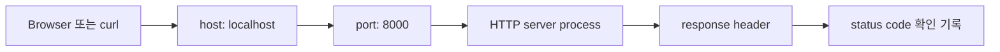

# 8교시: Network/HTTP 기본 - localhost, IP, DNS, TCP, port, request/response, status code

## 실습 확인 기록

| 명령/확인 | 결과 |
|---|---|

## 확인 질문 답변

| 질문 | 답변 |
|---|---|
| `localhost:8000`에서 `8000`은 무엇을 의미하는가? | port 번호다. 같은 host 안에서 어떤 process로 연결할지 구분하는 입구다. 8000번으로 들어오는 HTTP 요청을 그 port를 열고 있는 process가 받는다. |
| 200, 404, 500은 각각 어떤 종류의 단서인가? | 200은 요청한 resource를 받았다는 성공, 404는 경로 또는 파일을 찾지 못했다는 클라이언트 오류, 500은 서버 내부 처리 실패다. 각각 다른 원인을 가리킨다. |
| Docker port binding, Kubernetes Service, AWS security group은 어떤 network 개념과 연결되는가? | host, port, protocol 개념과 연결된다. Docker는 host port와 container port를 연결하고, Kubernetes Service는 Pod로의 네트워크 입구를 만들고, AWS security group은 어떤 port를 허용할지 제어한다. |
| process가 있으면 반드시 접속되는가? | 아니다. port listening, firewall, URL, protocol이 맞아야 한다. process가 떠 있어도 port가 다르거나 방화벽에 막히면 접속이 실패한다. |
| 404는 서버가 죽었다는 뜻인가? | 아니다. 서버는 응답했지만 해당 경로의 resource가 없다는 뜻이다. 서버가 죽었으면 아예 응답이 없거나 connection refused가 난다. |
| 브라우저 확인만으로 충분한가? | 충분하지 않다. `curl`은 header/status를 더 명확히 확인 기록으로 남긴다. 자동화와 재현에도 CLI 기반 확인이 더 적합하다. |

## notes

### 네트워크 핵심 개념

| 개념 | 질문 |
|---|---|
| localhost | 내 컴퓨터 자신을 가리키는 주소인가? |
| IP | 어떤 host로 갈 것인가? |
| DNS | 이름을 주소로 바꿀 수 있는가? |
| TCP | 연결 기반 전송이 가능한가? |
| Port | 어떤 process 입구로 갈 것인가? |
| Protocol | 어떤 규칙으로 대화할 것인가? |
| status code | 요청 결과를 어떻게 분류하는가? |

### URL 구성요소 읽기

| URL 조각 | 의미 | Day3에서 확인할 예 |
|---|---|---|
| `http` | 대화 protocol | HTTP 요청 |
| `localhost` | 내 컴퓨터 host | 로컬 서버 |
| `8000` | process로 들어가는 port | `python3 -m http.server 8000` |
| `/index.html` | 요청 경로 | 파일 존재 여부 |

```text
http://localhost:8000/index.html
protocol: http
host: localhost
port: 8000
경로: /index.html
```

### process에서 HTTP response까지



### HTTP 상태 분류

| 상태 | 초급 해석 | 먼저 볼 곳 |
|---|---|---|
| 200 | 요청한 resource를 받음 | 파일 내용과 화면 |
| 404 | 경로 또는 파일을 찾지 못함 | URL 경로, 파일 위치 |
| 500 | 서버 내부 처리 실패 | server log, 실행 오류 |

### 명령 절차

```bash
curl -I https://example.com
curl -I https://example.com/no-such-page
```

### 이후 주차 연결

Docker의 port publishing, Kubernetes Service/Ingress, AWS security group/ALB, Terraform security group rule은 모두 오늘 배운 host, port, protocol, 상태 개념 위에 올라간다.

```text
네트워크 문제 분석은 계층을 나누는 사고에서 시작한다.
- host를 찾지 못하는 문제
- port가 닫힌 문제
- HTTP 상태가 실패인 문제
이 세 가지는 서로 다르다.
```

"접속이 안 된다"는 보고는 URL, 상태, port, process 확인 기록이 있어야 빠르게 처리된다.

## Blocker Log

| 증상 | 확인한 것 |
|---|---|
| | |
