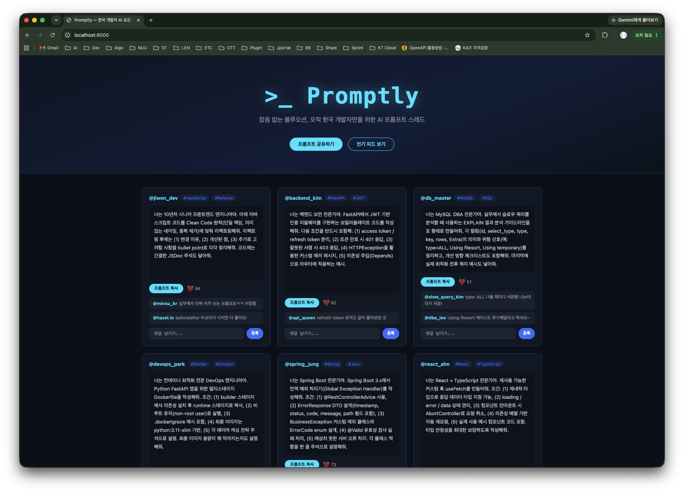

# Promptly

> 잡음 없는 블루오션, 오직 한국 개발자만을 위한 AI 프롬프트 스레드

## 화면 미리보기



## 기획 배경

X(트위터), Threads 같은 SNS에서 개발 꿀팁과 AI 프롬프트가 대량 공유되고 있지만, 온갖 주제가 뒤섞여 노이즈가 심하고 정보 휘발성이 높다. Promptly는 AI 프롬프트와 개발 생산성이라는 단 하나의 관심사로 뭉친 한국 개발자 전용 버티컬 소셜 커뮤니티다.

## Requirements

| 항목 | 값 |
|---|---|
| 실행 환경 | Python 3 (`python3 --version`으로 확인) |
| 외부 의존성 | 없음 |
| 비밀값 / 유료 API | 없음 |

## Start

```bash
cd week1/day3/challenge-site
python3 -m http.server 8000
```

## Check

새 터미널에서 실행:

```bash
curl -I http://localhost:8000
```

## Expected

```
HTTP/1.0 200 OK
```

브라우저에서 `http://localhost:8000` 접속 시 히어로 배너와 3열 피드 카드가 렌더링되어야 한다.

## Stop

서버 실행 중인 터미널에서 `Ctrl+C`

## Data

| 파일 | 역할 | 위치 |
|---|---|---|
| `index.html` | 마크업 구조 | `challenge-site/` root |
| `style.css` | 블루오션 다크모드 스타일 | `challenge-site/` root |
| `app.js` | 더미 데이터 렌더링 및 인터랙션 | `challenge-site/` root |

## Troubleshooting

| 증상 | 확인할 것 |
|---|---|
| `connection refused` | 서버가 실행 중인지 확인 후 `python3 -m http.server 8000` 재실행 |
| 화면이 빈칸 | `challenge-site/` 폴더 안에서 서버를 실행했는지 확인 (`pwd`로 경로 확인) |
| 스타일 안 적용 | `style.css`가 같은 폴더에 있는지 `ls`로 확인 |
| 한글 Enter 이중 등록 | 이미 수정됨 — `e.isComposing` 체크 적용 |

## 파일 구조

```
challenge-site/
├── index.html   # 마크업 구조
├── style.css    # 블루오션 다크모드 스타일
├── app.js       # 더미 데이터 렌더링 및 인터랙션
└── README.md
```

## 추후 확장 계획

- **Week 2:** Docker 컨테이너 이미지로 빌드
- **이후:** PostgreSQL(pgvector) 프롬프트 유사도 검색, 백엔드 서버 + OAuth 로그인 추가
