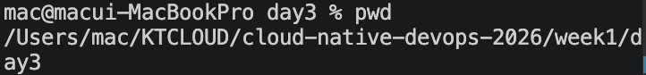
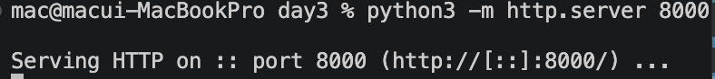
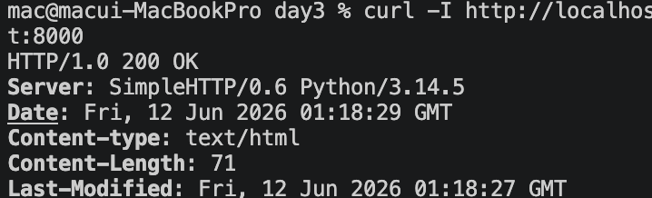
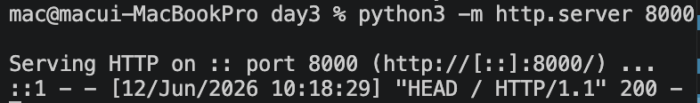

# 1교시: 로컬 정적 서버 실행 - 브라우저와 curl 확인

## 실습 확인 기록

| 명령 | 결과 |
|---|---|
| `pwd` |  |
| `python3 -m http.server 8000` |  |
| `curl -I http://localhost:8000` |   |
| `curl http://localhost:8000` |   |

## 확인 질문 답변

| 질문 | 답변 |
|---|---|
| 서버를 실행한 디렉터리는 어디인가? | `/Users/mac/KTCLOUD/cloud-native-devops-2026/week1/day3` — `index.html`과 같은 위치에서 실행했으므로 `http://localhost:8000/`으로 바로 파일이 서빙된다. `curl`은 HTTP 요청만 보내므로 실행 위치는 무관하다. |
| 브라우저와 `curl -I`은 각각 어떤 확인 기록을 제공하는가? | 브라우저는 렌더링된 HTML 화면(사용자 관점), `curl -I`는 HTTP status code와 header(운영 관점) — 같은 요청을 두 각도에서 확인한다. |
| `Ctrl+C` 후 다시 `curl`하면 어떤 증상이 나와야 하는가? | `curl: (7) Failed to connect to localhost port 8000` — 서버 프로세스가 종료되어 포트가 닫혔기 때문이다. |
| 파일을 수정했다는 기록과 수정 결과가 서비스에 반영됐다는 기록은 어떻게 다른가? | 파일 수정 기록은 에디터 저장 또는 `git status`로 확인하는 것이고, 서비스 반영 기록은 `curl http://localhost:8000` 응답에 수정된 내용이 실제로 포함되는지 확인하는 것이다. 파일을 고쳤어도 서버가 다른 경로에서 실행 중이면 반영되지 않는다. |

## notes

### 서버 실행 위치가 중요한 이유
- `python3 -m http.server`는 실행한 디렉터리를 root로 파일을 제공한다.
- 서버를 잘못된 경로에서 실행하면 파일이 있어도 404가 난다.
- 이후 Docker container, Kubernetes Pod도 동일하게 "어느 경로에서 실행되는가"가 중요하다.

### 브라우저 vs curl
- 브라우저는 사용자 관점 — 렌더링 결과만 보인다.
- `curl -I`는 운영 관점 — status code와 header를 직접 확인한다.
- 운영에서는 브라우저만으로 판단하지 않고 `curl`로 응답 상태를 기록으로 남긴다.

### 정적 서버와 동적 앱의 차이
- 정적 서버: 파일을 그대로 제공한다. 로직 없음.
- 동적 앱: 요청에 따라 서버가 처리해서 응답을 만든다.
- 오늘 실습은 정적 서버 — 기능 개발이 아니라 서버/포트/HTTP 흐름 확인이 목적이다.

### curl -I vs curl
- `curl -I` → HTTP **HEAD** 요청 — 헤더와 상태 코드만 받고 body는 받지 않는다. 서버 로그에 `HEAD /` 로 찍힌다.
- `curl` (옵션 없이) → HTTP **GET** 요청 — 헤더와 body를 모두 받는다. 서버 로그에 `GET /` 로 찍힌다.

### 실제 운영에서의 로그
- 로그를 최소한으로 한다. 과도한 로그가 서버를 다운시키는 경우도 있다.
- 참고: https://missing.csail.mit.edu/

## Blocker Log

| 증상 | 확인한 것 |
|---|---|
| | |
