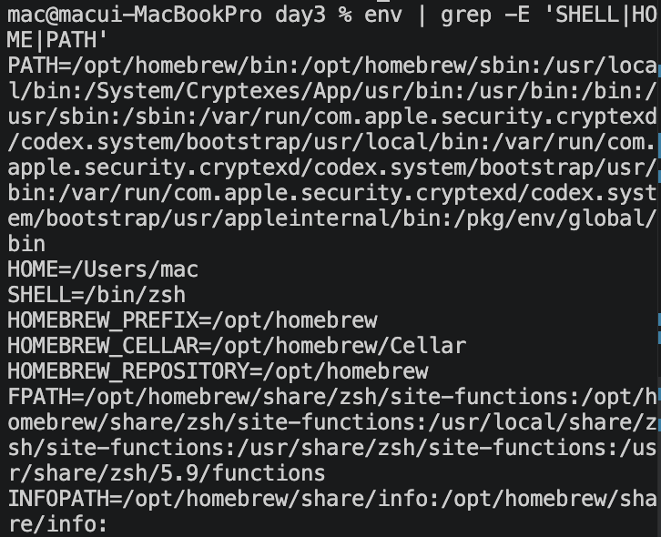
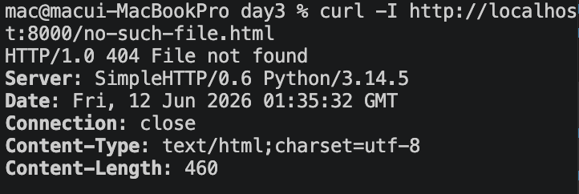
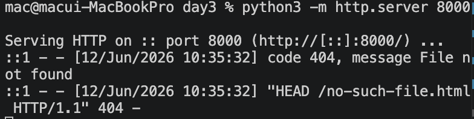

# 2교시: Log, 설정, 비밀값 - stdout/stderr, error message, env var, 비밀값 비노출

## 실습 확인 기록

| 명령 | 결과 |
|---|---|
| `env \| grep -E 'SHELL\|HOME\|PATH'` | |
| `curl -I http://localhost:8000/no-such-file.html` |   |

## 확인 질문 답변

| 질문 | 답변 |
|---|---|
| `PORT=8000`은 설정인가 비밀값인가? | 설정이다. 포트 번호는 노출되어도 피해가 없는 값이므로 README에 기록 가능하다. |
| token 값을 README에 쓰면 어떤 위험이 생기는가? | public repo에 올라가면 누구나 볼 수 있고, 해당 token으로 계정이나 서비스에 무단 접근할 수 있다. |
| request log에서 symptom을 찾는 방법은 무엇인가? | 서버 터미널에 찍히는 로그에서 상태 코드와 메시지를 읽는다. `code 404, message File not found` → 해당 경로에 파일이 없다는 뜻이고, `"HEAD /no-such-file.html HTTP/1.1" 404` → 요청 경로와 메서드를 함께 확인할 수 있다. 상태 코드가 문제 종류를 알려주는 첫 번째 단서다. |

## 실습 확인 기록 표

| 확인 항목 | 값 |
|---|---|
| 설정 key list | SHELL, HOME, PATH |
| request log example | |
| 404 log example | |
| 비밀값 비노출 note | token 값은 기록하지 않고 key 이름과 관리 위치만 기록한다. |

## notes

### Log / 설정 / 비밀값 구분

| 항목 | 예 | README에 적어도 되는가 |
|---|---|---|
| Log | `GET / HTTP/1.1" 200` | 일부 가능 |
| 설정 key | `PORT` | 가능 |
| 설정 값 | `PORT=8000` | 민감하지 않으면 가능 |
| 비밀값 key name | `GITHUB_TOKEN` | 필요 시 가능 |
| 비밀값 값 | 실제 token 문자열 | 불가 |
| Error message | `File not found` | 가능 |

### Twelve-Factor App
- 설정은 코드와 분리한다. key 이름은 문서화하되 값은 안전한 저장소에 둔다.
- 이후 Docker `-e`, Kubernetes Secret/ConfigMap, AWS Parameter Store/Secrets Manager, Terraform sensitive variable로 이어진다.

### OWASP Secrets Management
- 비밀값은 값 자체가 아니라 **존재와 관리 위치**만 문서화한다.
- 캡처 전 "이 줄을 공개 채팅에 붙여도 되는가" 먼저 확인한다.
- GitHub에 token이 올라가면 Secret Scanning이 탐지하지만, 올라간 순간 이미 노출된 것으로 간주하고 즉시 폐기 후 재발급한다.
- 참고: https://cheatsheetseries.owasp.org/cheatsheets/Secrets_Management_Cheat_Sheet.html

## Blocker Log

| 증상 | 확인한 것 |
|---|---|
| | |
