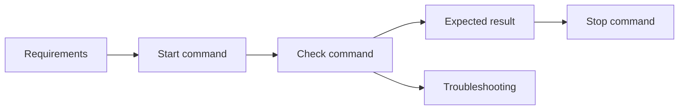

# 4교시: 재현 가능성 - README, 경로, expected result, clean 디렉터리

## 실습 확인 기록
- 앞서 했던 실습을 토대로 작성해 보았다.

| 확인 항목 | 값 | 설명 |
|---|---|---|
| start command | `python3 -m http.server 8000` | 서버를 시작하는 명령 |
| check command | `curl -I http://localhost:8000` | 서버가 정상 응답하는지 확인 |
| expected 상태 코드 | 200 | 성공 기준 — 이 값이 나와야 정상 |
| stop command | 서버 터미널에서 `Ctrl+C` | 서버 프로세스 종료 방법 |
| known issue | 포트 충돌, 실습/개발용 서버, HTTPS 미지원 | 8000번 포트가 이미 사용 중이면 `address already in use` 발생. `python3 -m http.server`는 운영 환경에 적합하지 않음 |

> **known issue란?**
> - 환경 문제: 포트 충돌처럼 실행 환경에 따라 생기는 문제
> - 도구 자체의 한계: `python3 -m http.server`는 실습/개발용이며 HTTPS 미지원 등 원래부터 가진 제약
> - 지식 부족으로 막혔던 건 known issue가 아니라 **blocker log**에 적는다

> **Troubleshooting이란?**
> 시스템에서 문제가 발생했을 때 원인을 찾고 해결하는 체계적인 과정.
> 증상 → 원인 후보 좁히기 → 확인 → 수정 → 재확인 순서로 진행한다.
> 감으로 고치는 게 아니라 증거 기반으로 원인을 좁히는 것이 핵심이다.

> **Blocker log란?**
> 내가 실습 중 실제로 막혔던 경험을 기록하는 것. "이 명령 실행했는데 이런 오류가 났다"처럼 증상과 확인한 것을 남긴다.
> Troubleshooting이 가이드라면, blocker log는 내 경험 기록이다.

## 확인 질문 답변

| 질문 | 답변 |
|---|---|
| clean 디렉터리에서 필요한 첫 명령은 무엇인가? | `python3 --version` — 실행 환경이 있는지 먼저 확인하고, 없으면 서버 자체를 시작할 수 없다. |
| README에 stop 절차가 없으면 어떤 운영 문제가 생기는가? | 서버를 어떻게 멈춰야 하는지 알 수 없어서 포트가 계속 점유된다. 다음 실행 시 `address already in use` 오류가 난다. |
| expected result와 실제 result가 다르면 어떻게 기록해야 하는가? | expected와 actual을 나란히 기록하고 차이를 막힘 기록으로 남긴다. 감으로 판단하지 않고 두 값을 비교해서 원인을 좁힌다. |

## notes

### README 최소 구조 (Runbook)

| 섹션 | 작성할 내용 | 이 서버의 값 |
|---|---|---|
| Requirements | 실행 전 필요한 도구 | Python 3 |
| Start | 서비스를 시작하는 명령 | `python3 -m http.server 8000` |
| Check | 성공 여부를 확인하는 명령 | `curl -I http://localhost:8000` |
| Expected | 기대 결과 | HTTP 200 OK |
| Stop | 서비스를 멈추는 방법 | 서버 터미널에서 `Ctrl+C` |
| Data | 읽는 파일과 위치 | 저장소 root의 `index.html` |
| Troubleshooting | 실패 증상별 첫 확인 | 프로세스, 포트, URL 경로 |



### 강사님 예시 README
- 참고: https://github.com/ace-step/ACE-Step-1.5/blob/main/README.md
- Quick Start → 플랫폼별 설치 → 실행 옵션(Gradio UI / REST API) → GPU별 모델 선택 기준 순으로 구성
- 실행 환경(VRAM), 시작 명령(`uv run acestep`), 포트(7860 / 8001), 중지(`Ctrl+C`) 등 runbook 요소가 자연스럽게 포함된 좋은 예시
- 글로벌 오픈소스 프로젝트라 한국어를 포함한 여러 언어로 문서를 제공한다.

### 강사님 AI 활용 예시
수업 중 ChatGPT에 아래 프롬프트를 입력해서 runbook 구조를 인포그래픽으로 만드는 시연을 하셨다.

```
항목 포함 여부 Requirements Start command Check command Expected result Stop instruction Troubleshooting
이 부분이 표로 정리되어야 하고, React + vite Frontend를 쓰고, Container 환경을 이용해야 하며,
AWS 기반으로 배포할거야. 컨테이너 관리는 편하게 할 수있으면 좋겠고, observability도 확보 되어 있어야 해.
그리고 백엔드서버는 서버리스로 작업했으면 좋겠어.
```

이후 "인포그래픽 png로 만들어줘" 추가 요청.
- 참고 링크: https://chatgpt.com/share/6a2b7db2-c0bc-83e8-b0e6-baa3e473fd93
- **주의:** 강사님이 공유를 취소하시면 링크가 열리지 않는다. 중요한 내용은 직접 기록해두는 것이 안전하다.
- AI가 생성한 그림은 틀린 부분이 있을 수 있다. 지식이 있어야 검증하고 수정할 수 있다.

### 재현 가능성 핵심 원칙
- README를 runbook처럼 정리해두면 다른 사람에게 설명할 때도 그대로 쓸 수 있다. 내가 이해하지 못한 것은 설명할 수 없으므로, 정리 자체가 이해의 확인이다. 강사님도 직접 정리하신다고 하셨다.
- 절대 경로(`/Users/mac/...`) 대신 저장소 기준 **상대 경로**를 쓴다. 절대 경로는 내 컴퓨터에서만 동작한다.
- README를 쓴 뒤 새 터미널에서 직접 따라 해본다. 실행 안 되는 README는 runbook이 아니다.
- `expected result`가 없으면 성공/실패 판단이 사람마다 달라진다.

### RCA 연결
- README의 expected result와 실제 result가 다를 때 RCA(Root Cause Analysis)가 시작된다.
- expected가 없으면 "뭔가 안 된다"에서 멈추지만, expected가 있으면 "200이 와야 하는데 404가 왔다" → 경로 문제로 원인을 좁힐 수 있다.
- start/check/stop/troubleshooting이 갖춰진 README가 RCA의 출발점이다. → lesson-05에서 이어짐

### 다음 주차 연결
- Docker: README의 start 조건 → Dockerfile + container command
- Kubernetes: 실행 상태 → manifest로 선언
- Terraform: 환경 자체 → 재현 가능한 코드로 고정

## Blocker Log

| 증상 | 확인한 것 |
|---|---|
| | |
