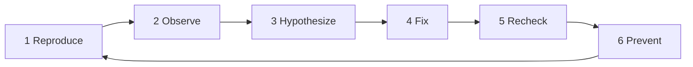

# 5교시: 실패 분석 라이프사이클 - reproduce, observe, hypothesize, fix, recheck, prevent

## 실습 확인 기록
- 앞서 했던 실습을 토대로 작성해 보았다.

| 확인 항목 | 값 |
|---|---|
| failing URL | `http://localhost:8000/no-such-file.html` |
| failing 상태 코드 | 404 |
| server log excerpt | |
| fixed check URL | `http://localhost:8000/index.html` |
| fixed 상태 코드 | 200 |
| fixed body 확인 | |
| prevention note | |

## RCA 템플릿

| Step | Record |
|---|---|
| Reproduce | |
| Observe | |
| Hypothesize | |
| Fix | |
| Recheck | |
| Prevent | |

## 확인 질문 답변

| 질문 | 답변 |
|---|---|
| 이번 실패의 symptom은 무엇인가? | `curl -I http://localhost:8000/no-such-file.html` 결과 404 상태 코드. 서버 로그에 `code 404, message File not found` 출력됨 |
| root cause candidate는 프로세스, 포트, file 경로 중 어디에 가까운가? | file 경로 — 404는 서버가 응답한 것이므로 프로세스와 포트는 정상. 요청한 경로에 파일이 없는 것이 원인 후보 |
| recheck에 같은 명령을 다시 써야 하는 이유는 무엇인가? | "고쳤다"는 말만 남으면 검증이 없는 것이다. 같은 관찰 기준으로 다시 확인해야 fix가 실제로 반영됐는지 알 수 있다 |
| 오류 로그에서 전체 복사 대신 어떤 부분만 발췌해야 안전한가? | 요청 경로와 상태 코드만 발췌한다. 전체 로그에는 token, email, 개인정보가 섞일 수 있다 |

## notes

### RCA 6단계

| Step | 설명 |
|---|---|
| Reproduce | 같은 실패를 다시 만든다. 재현 못 하면 비교도 없다. |
| Observe | log, 상태 코드, command output을 관찰한다. |
| Hypothesize | 원인 후보를 세운다. 증상과 원인을 분리한다. |
| Fix | 원인 후보를 제거한다. |
| Recheck | 같은 방법으로 다시 확인한다. |
| Prevent | 재발 방지 방법을 README나 주의 문장으로 남긴다. |

### RCA 기본 흐름 이미지 정리

> 문제의 근본 원인을 찾고, 재발을 막는 체계적 과정

| 단계 | 이름 | 핵심 질문 | Evidence |
|---|---|---|---|
| 1 | 증상 | 무엇이 문제인가? | 에러 메시지, 로그, 이슈 |
| 2 | 영향 | 누구에게, 어떤 영향인가? | |
| 3 | Timeline | 언제부터, 어떻게 발생했나? | Evidence(증거 수집) [로그, 메트릭, 명령 결과, 변경 이력] |
| 4 | 가설 | 가능한 원인은 무엇인가? | |
| 5 | 수정 | 근본 원인을 수정/개선한다 | |
| 6 | 재확인 | 문제 해결됐는지 검증한다 | Evidence(검증 근거) [로그, 메트릭, 명령 결과, 변경 이력] |
| 7 | 예방 | 재발 방지 조치를 문서화로 정착한다 | |

**핵심 원칙 (이미지 하단)**
- 사실 기반
- 작은 단위로 검증
- 근본 원인을 검증
- 재발 방지가 목표

### 상태 코드별 첫 판단

| Symptom | 프로세스 상태 | 먼저 볼 것 |
|---|---|---|
| `connection refused` | 서버 프로세스 없음 또는 포트 다름 | 서버 터미널, 포트 |
| `404` | 프로세스 정상, 경로/파일 문제 | URL 경로, `ls`, request log |
| `500` | 프로세스 정상, 내부 처리 실패 | error log, 최근 변경사항 |
| 브라우저 blank | HTML 내용 또는 잘못된 파일 | `curl`, `cat index.html` |

### 강사님 예시 - Recheck 미흡으로 인한 AWS 비용 사고
- 개발자가 잘못된 코드를 배포 → GitHub Actions에서 계속 실패 → 실패할 때마다 AWS 리소스를 재생성하는 작업이 반복됨
- 결과: AWS 비용 **170만원** 발생
- Recheck를 제대로 했다면 배포 후 Actions 성공 여부와 AWS 리소스 상태를 확인해서 비용이 크게 불어나기 전에 문제를 발견할 수 있었다.
- **한 번의 실수가 신뢰를 잃게 만들 수 있다.** fix 후 반드시 같은 기준으로 재확인해야 한다.

### 강사님 예시 - 트래픽 10배 사고
- 같은 시간대에 같은 인원수가 접속했는데 트래픽이 평소보다 10배 발생
- 원인: Django 버그 — 한 페이지를 한 번만 줘야 하는데 API 호출을 여러 번 반복해서 데이터를 가져옴
- Framework 버그라 손쉽게 수정해서 배포하기 어려웠다고 하심
- **Fix:** Django 버전업으로 해결. 단, 버전업 시 기존 기능이 안 될 수 있음 → 업그레이드 시 경고(deprecation warning) 로그로 "이 버전부터 이 기능 지원 안 됨"을 알려줌
- 개발자들은 보통 안 되면 그때 고치는 방식으로 대응
- **ORM 관련:** ORM을 쓰면 실제 쿼리가 얼마나 나가는지 확인하기 어렵다. 쿼리 하나가 100KB인데 몇 백번만 했어도 실제로는 몇 천번 호출되는 일이 생긴다. 이런 경우 "몇 천번 호출되고 있으니 고쳐달라"고 근거를 제시해야 수정이 이뤄짐
- **교훈:** 트래픽 이상은 사용자 수만 보면 안 된다. 요청 수와 사용자 수를 분리해서 봐야 원인을 좁힐 수 있다.

### QA Engineering
- 약 3년 전부터 AI가 도입되면서 기존 수동 테스트 중심의 QA에서 **QA Engineering**으로 역할이 확장됨
- 테스트 자동화를 다루게 됨

### 핵심 원칙
- RCA는 누군가를 탓하는 문서가 아니라 같은 실패를 줄이기 위한 학습 기록이다.
- 404는 서버가 죽은 게 아니다. 서버는 응답했지만 해당 경로의 파일을 찾지 못한 것이다.
- fix 후 recheck 없이 "고쳤다"는 말만 남기면 검증이 없는 것이다.
- 참고: https://sre.google/sre-book/postmortem-culture/

### 다음 주차 연결
- Docker: 잘못된 파일 경로 → image build context 문제
- Kubernetes: 잘못된 경로 → readiness 실패
- AWS: ALB target health와 application 상태 코드를 분리해서 봐야 함

### 쉬는시간 - 로그 비용과 관리 전략
- 클라우드에서 로그가 많이 쌓이면 **Datadog** 같은 도구를 씀
- 비용이 너무 많이 나오면 저장 기한을 줄이는 방식으로 제재
- 경보(alert)는 필터링 안 함. 보안 감사가 있을 때만 적극 개입
- 비용이 엄청 많이 나오지 않는 이상 개입하지 않음
- 로그 많이 쓰는 곳은 Datadog 비용만 **1억**, 클라우드 전체 비용은 **10억** 수준

**로그 레벨링**
- 로그는 레벨로 조절 가능 → 환경마다 다르게 설정

| 환경 | 로그 수준 | 이유 |
|---|---|---|
| 개발(dev) | 가장 낮은 수준까지 (DEBUG) | 개발자가 모든 정보를 봐야 함 |
| 검증(staging) | 원인 수준 (WARN) | 이상 원인 파악 정도만 |
| 운영(production) | 에러만 (ERROR) | 노이즈 줄이고 비용 절감 |

### 쉬는시간 - SonarQube / ESLint 현업 사용 현황
- AI 코딩이 많아졌어도 SonarQube, ESLint는 여전히 많이 사용됨
- **SonarQube:** 배포 파이프라인에 태우면 통과 시간이 걸림 → 초긴급 배포 시 스킵하는 경우 있음
  - 개발 → 운영 테스트: SonarQube 태움
  - 운영 테스트 → 운영: 빠른 기능 적용이 우선이라 선택 사항으로 가는 경우 많음
  - 회사마다 다름
- **ESLint:** 요즘 AI가 코드 스타일을 잡아주기 때문에 선택 사항이 되는 추세. SonarQube와는 별개

### 쉬는시간 - 인프라 취업 시 네트워크 지식 수준
- 질문: 인프라 쪽 취업한다면 네트워크를 어느 정도 알아야 하나?
- **신입 기준 필요한 수준:**
  - **OSI 레이어** — 네트워크 통신을 7계층으로 나눈 모델. "네이버에 접속할 때 어떤 계층을 거치는가" 설명 가능한 수준
  - **홉(Hop)** — 패킷이 목적지까지 가는 경로에서 거치는 라우터 단위
  - **통신 패킷 구조** — 데이터가 네트워크로 전달될 때 헤더/페이로드로 구성되는 단위
- 나머지는 실무에서 직접 보면서 배우게 됨
- 클라우드 엔지니어와는 요구 수준이 다름

## Blocker Log

| 증상 | 확인한 것 |
|---|---|
| | |
