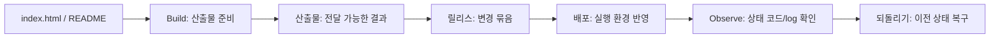

# 6교시: 관찰 가능성과 배포 미리보기 - logs/상태 코드 확인 기록, build, 산출물, 릴리스, 배포, 되돌리기

## 실습 확인 기록

| 명령/확인 | 결과 |
|---|---|
| | |

## 확인 질문 답변

| 질문 | 답변 |
|---|---|
| 오늘의 산출물은 무엇이라고 볼 수 있는가? | `index.html`과 README 실행 절차 — 다른 사람이 clone해서 바로 실행할 수 있는 전달 가능한 결과물 |
| 200과 404를 metric으로 바꾼다면 무엇을 셀 수 있는가? | 단위 시간당 200 응답 수(성공률), 404 응답 수(실패율) — 수치로 추세를 볼 수 있다 |
| 되돌리기 판단에는 어떤 확인 기록이 필요할까? | 배포 전 정상 상태 코드와 로그, 배포 후 변경된 상태 코드와 로그 — 두 기록을 비교해야 되돌릴지 판단할 수 있다 |

## notes

### 관찰 가능성 signal 4가지
- 시간(타임스탬프)만 보고는 가져갈 수 있는 게 별로 없다. 4가지를 함께 봐야 원인을 좁힐 수 있다.
- 4가지 모두 **"오류의 힌트를 주는 것"** — 카테고리는 같다
- 예: "오후 3시에 에러 났다"는 시간 정보만으로는 원인 불명. 그 시간대의 로그 + 상태 코드 + 요청 수를 같이 봐야 함

| Signal | 역할 | Week 1 수준 | 이후 확장 |
|---|---|---|---|
| Log | 오류가 난 증거 정보 — 무슨 일이 있었는지 기록 | request/error 텍스트 | Docker/K8s/CloudWatch logs |
| 상태 코드 | 요청 결과를 분류 — 200/404/500으로 문제 종류를 좁힘 | HTTP 200/404/500 | health check/readiness |
| Metric | 수치화된 상태 — 요청 수, 응답 시간, 에러율 등 추세 파악 | 개념만 | CloudWatch/Prometheus/Grafana |
| Trace | 요청이 어떤 경로를 거쳤는지 — 어디서 느려지거나 실패했는지 추적 | 개념만 | distributed tracing |

### 배포 용어 정리

| 용어 | 의미 |
|---|---|
| Build | 실행 가능한 산출물을 준비하는 과정 |
| 산출물 | 전달 가능한 결과물 |
| 릴리스 | 사용자에게 의미 있는 변경 묶음 |
| 배포 | 실행 환경에 반영하는 행위 |
| 되돌리기 | 이전 상태로 되돌리는 조치 — 실패가 아니라 사용자 영향을 줄이는 정상 운영 전략 |

### 강사님 - Trace가 중요한 이유
- 보통 인증, 로그인, 결제 등 기능을 **분산**해서 서비스를 구성한다
- 이유: 해커가 털어도 하나의 기능만 털리도록 — 연쇄 작용이 일어나지 않도록 하기 위함
- 요청이 X 서버 → N 서버 → X 서버 → M 서버처럼 여러 서버를 왔다 갔다 함
- **Trace가 없으면** 어느 서버에서 문제가 났는지 모르기 때문에 모든 서버를 다 확인해야 함
- **Trace가 있으면** 요청 경로를 따라가면서 어느 구간에서 실패했는지 바로 좁힐 수 있음

### 강사님 - AI 검증 도입 현황
- **스타트업:** 엔지니어가 없거나 부족해서 AI 검증을 주로 씀. 운영 리스크보다 편의성을 선택
- **대기업:** AI에게 모두 맡기기엔 리스크가 너무 커서 도입 안 하는 경우도 있음
- 결국 **운영 리스크 vs 편의성 트레이드오프** — 회사 규모와 상황에 따라 다름

### 롤백 vs 롤포워드
- 보통 엔지니어들은 **롤백(Rollback)** — 이전 정상 상태로 되돌리는 방식을 선택
- 공격적인 서비스(빠른 배포가 중요한 경우)는 **롤포워드(Roll Forward)** — 문제를 수정한 새 버전을 바로 배포하는 방식을 가져가기도 함

| 방식 | 설명 | 선택 기준 |
|---|---|---|
| 롤백 | 이전 정상 버전으로 되돌림 | 안정성 우선, 일반적인 선택 |
| 롤포워드 | 수정된 새 버전을 바로 배포 | 속도 우선, 빠른 배포 문화 |

### 배포 용어 추가 설명
- Build/산출물/릴리스/배포/되돌리기 흐름은 **GitHub Actions만으로도 확인 가능**하다
- **OIDC** — AWS와 GitHub Actions를 잘 연결할 수 있도록 쓰는 프로토콜. AWS 자격증명을 직접 저장하지 않고 인증할 수 있게 해줌

### 관찰 도구 예고
- **Grafana** — 나중에 Kubernetes 관련 실습에서 사용하게 될 예정
- **Datadog** — demo는 아마 회사 계정이 필요할 것. lesson-05에서 나온 로그 비용 사례에서 언급된 도구

### 다음 주차 연결
- Docker image → 산출물
- Kubernetes rollout → 배포/되돌리기
- AWS CloudWatch → log/metric 수집
- Terraform → infrastructure 변경을 plan/apply로 기록

### 강사님 - 배포 시간과 엔지니어의 역할
- 배포 시간이 너무 오래 걸리면 개발자들이 불만을 가짐
- 빠르면 말 안 하지만, 엔지니어 입장에서는 "여기서 더 빠르게 할 수 없나"를 계속 고민함
- 배포 속도 최적화도 엔지니어의 중요한 역할 중 하나

### Week 2 Docker 예고
- Dockerfile 구문 자체는 간단하다. 하지만 조합을 어떻게 하느냐에 따라 성능 차이가 명확하다.
- Image 최적화를 잘하면 용량을 크게 줄일 수 있다.
- **강사님 경험:** M1 맥북을 받고 업무를 처리하려 했는데, 관련 아키텍처(ARM)를 지원하는 Image가 없어서 며칠간 일을 못 한 적이 있었다고 하심 → Docker Image는 아키텍처(x86/ARM)에 따라 호환성 문제가 생길 수 있음. 지금은 이런 문제는 없다고 하심.

## Blocker Log

| 증상 | 확인한 것 |
|---|---|
| | |
