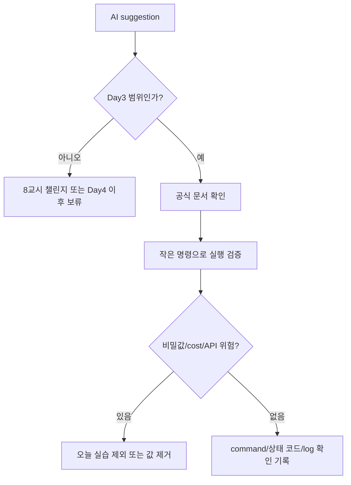

# 7교시: AI Coding Tool 사용 원칙 - 공식 문서 확인, 실행 검증, 비밀값/cost/API 위험

## 실습 확인 기록

| 명령/확인 | 결과 |
|---|---|
| | |

## 확인 질문 답변

| 질문 | 답변 |
|---|---|
| AI 답변에서 오늘 실행으로 검증한 부분은 무엇인가? | 실행한 명령과 상태 코드가 나온 부분만 확인 기록으로 인정한다. 실행하지 않은 내용은 보류 사유로 남긴다. 실행 전 검증 방법으로는 해당 스택의 공식 docs를 확인하거나, 작은 명령 단위로 먼저 실행해보는 방법이 있다. |
| 비밀값/cost/API 위험이 있는 부분은 무엇인가? | API key 요구, 유료 서비스 연동, cloud 배포 제안 — 오늘 실습에서 제외한다. |
| Day3 범위를 넘는 작업을 어떻게 기록하고 보류할 것인가? | "Day4 이후 보류" 또는 "8교시 챌린지 후보"로 기록하고 이유를 남긴다. |

## notes

### AI 답변 검증 흐름

### AI 답변 검증표

| Check | 확인 기록 |
|---|---|
| 공식 문서와 충돌하지 않는가 | URL |
| 실행했는가 | command/상태 코드 |
| 비밀값을 요구하는가 | yes/no |
| 비용이 생기는가 | yes/no |
| 외부 API/외부 의존성이 생기는가 | yes/no |
| Week 1 Day3 범위를 넘는가 | excluded note |
| log/상태 코드 확인 방법이 있는가 | 확인 기록 |

### 제안 문장 위험 표시

| 제안에 보이는 말 | 위험 | 결정 |
|---|---|---|
| "API key를 넣고" | 비밀값 노출 | 제외 |
| "바로 배포" | 비용/계정/권한 | 보류 |
| "작은 정적 웹사이트" | 범위 관리 필요 | 8교시 챌린지 후보 |
| "backend/API 연동 앱 구현" | 범위 초과 | Day4 이후 또는 제외 |
| "공식 문서 없이" | 검증 부족 | 문서 확인 전 보류 |
| "curl로 확인" | 실행 확인 기록 가능 | 범위 안에서 사용 |

### 핵심 원칙
- AI 답변은 "후보"일 뿐이다. 실행 책임과 운영 책임은 사람에게 남는다.
- 실행하지 않은 내용은 확인 기록으로 쓰지 않는다.
- 거절은 학습 실패가 아니다. 범위를 지키는 것이 나중에 안정적인 구현의 기반이 된다.
- lesson-06의 AI 검증 도입 현황과 연결 — 회사 규모에 따라 AI 도입 수준이 다르다.

### 안티패턴 (Anti-pattern)
- AI가 올바르지 않거나 이상한 방향으로 코드를 짜줄 수 있다
- 동작은 하지만 나쁜 방식 — 성능 저하, 보안 취약점, 유지보수 어려움 등을 유발할 수 있음
- AI 답변이 실행된다고 해서 올바른 코드라는 뜻은 아니다. 공식 문서와 비교해서 검증해야 한다

### 최소 권한 원칙 (Principle of Least Privilege)
- AWS뿐만 아니라 전반적으로 권장되는 보안 원칙
- 필요한 최소한의 권한만 부여한다 — 필요 이상의 권한은 사고 발생 시 피해 범위를 키운다
- AI가 제안하는 코드에 과도한 권한 설정이 포함되어 있는지도 검증 대상이다

### 다음 주차 연결
- Docker/K8s YAML 제안, cloud resource 제안, Terraform 코드 제안에도 같은 검증표 적용
- cloud credential과 비용 발생 resource는 AI가 제안해도 즉시 실행하지 않는다

## Blocker Log

| 증상 | 확인한 것 |
|---|---|
| | |
