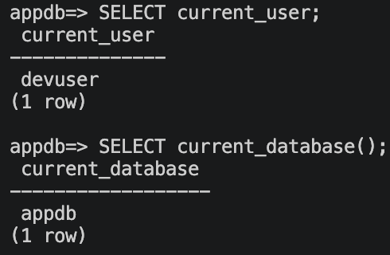
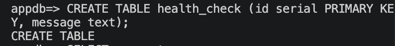
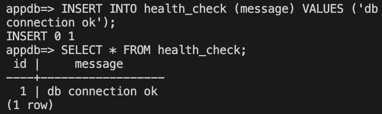

# 2-1교시: DB 직접 설치해 보기

## 실습 확인 기록

| 명령 | 결과 |
|---|---|
| `SELECT current_user;` & `SELECT current_database();` |  |
| `CREATE TABLE health_check (id serial PRIMARY KEY, message text);` |  |
| `INSERT INTO health_check (message) VALUES ('db connection ok');` & `SELECT * FROM health_check;` |  |

## 실습 명령 기록

### Linux / WSL

```bash
sudo apt update
sudo apt install postgresql postgresql-contrib
sudo service postgresql start
sudo service postgresql status
```

### macOS

```bash
brew install postgresql@16
brew services start postgresql@16
brew services list
```

### 수업용 계정 및 DB 생성 (공통)

> 아래 명령은 모두 **일반 터미널**에서 실행한다. `psql` 안에 들어간 상태가 아니다.

```text
DB_HOST=localhost
DB_PORT=5432
DB_USER=devuser
DB_PASSWORD=devpass
DB_NAME=appdb
```

```bash
# Linux/WSL — 터미널에서 실행
sudo -u postgres psql -c "CREATE USER devuser WITH PASSWORD 'devpass';"
sudo -u postgres psql -c "CREATE DATABASE appdb OWNER devuser;"

# macOS — 터미널에서 실행
psql postgres -c "CREATE USER devuser WITH PASSWORD 'devpass';"
psql postgres -c "CREATE DATABASE appdb OWNER devuser;"
```

### 비밀번호 접속 확인

> 마찬가지로 **일반 터미널**에서 실행한다. 이 명령을 치면 비밀번호를 물어보고 `psql` 안으로 들어간다.

```bash
psql -h localhost -p 5432 -U devuser -d appdb
```

```sql
SELECT current_user;
SELECT current_database();
CREATE TABLE health_check (id serial PRIMARY KEY, message text);
INSERT INTO health_check (message) VALUES ('db connection ok');
SELECT * FROM health_check;
\q
```

## 확인 질문 답변

| 질문 | 답변 |
|---|---|
| 프로젝트 폴더를 삭제하면 DB 데이터도 같이 삭제될까? | 아니다. DB 데이터는 프로젝트 폴더가 아니라 OS의 별도 data path(예: `/var/lib/postgresql/...`)에 저장된다. 프로젝트 폴더를 지워도 DB 데이터는 그대로 남는다. |
| DB 프로그램을 삭제하면 DB 데이터도 항상 같이 삭제될까? | 반드시 그렇지 않다. 삭제 방식에 따라 data path가 남을 수 있다. 완전히 지우려면 data path도 직접 삭제해야 한다. |
| 다른 프로젝트가 같은 port를 쓰면 어떻게 될까? | `address already in use` 오류가 발생해 두 번째 서비스가 시작되지 않는다. port는 한 번에 하나의 프로세스만 점유할 수 있다. |
| 비밀번호가 맞지 않으면 앱에서는 어떤 오류가 날까? | `password authentication failed` 오류가 발생한다. host, port, user, password, database 중 하나라도 맞지 않으면 앱은 DB에 연결되지 않는다. |

## notes

### DB 설치가 남기는 것

```text
DB 설치 = 실행 파일 + 백그라운드 서비스 + 포트 + 계정 + 데이터 폴더 + 설정 파일
```

| 관찰 항목 | 질문 | 예시 |
|---|---|---|
| 실행 파일 | DB 프로그램은 어디에 설치되었는가? | `/usr/bin`, Homebrew 경로 |
| service | DB가 백그라운드에서 실행되는가? | `postgresql`, `postgresql@16` |
| port | 클라이언트가 어디로 접속하는가? | `5432` |
| account | 어떤 계정으로 접속하는가? | `postgres`, `devuser` |
| password | 비밀번호 인증이 되는가? | `devpass` |
| data path | 데이터는 어디에 저장되는가? | `/var/lib/postgresql/...` |
| config | 설정 파일은 어디에 있는가? | `postgresql.conf` |

### 대표 연결 오류

| 증상 | 가능한 원인 | 확인할 것 |
|---|---|---|
| `connection refused` | DB service가 꺼져 있음 | service 상태 |
| `password authentication failed` | 비밀번호가 다름 | `DB_PASSWORD`, 계정 비밀번호 |
| `database "appdb" does not exist` | DB를 만들지 않음 | DB 목록 |
| `role "devuser" does not exist` | 사용자를 만들지 않음 | 사용자 생성 |
| 명령이 멈춘 것처럼 보임 | 비밀번호 입력 대기 중 | 터미널 prompt |

### 직접 설치 방식의 장단점

> Docker로 넘어가기 위한 수업이라고 해서 직접 설치를 나쁘게만 말하지 않는다. — 강사님

| 장점 | 설명 |
|---|---|
| OS와 직접 통합 | service, log, client 도구를 그대로 쓸 수 있다. |
| 성능과 경로 확인이 쉽다 | 실제 로컬 디스크와 프로세스를 직접 본다. |
| 기초 개념을 배운다 | port, process, account, data path를 몸으로 익힌다. |

다만 협업과 반복 실습에서는 부담이 커진다:
- 모두가 같은 버전으로 설치했는가?
- 모두가 같은 port를 쓰는가?
- 데이터 폴더가 섞이지 않았는가?
- 삭제할 때 무엇을 지워야 하는가?

### DB 쿼리와 부하 — 필요한 데이터만 가져오는 것이 중요하다

쿼리를 많이 하는 것 자체보다, **한 번 쿼리할 때 불필요한 데이터까지 가져오는 것**이 부하와 비용을 키운다.

| 문제 유형 | 예시 | 증상 |
|---|---|---|
| 컬럼 과다 조회 | `SELECT *` — 필요한 컬럼이 2개인데 50개를 전부 가져옴 | 네트워크 전송량 증가, 앱 메모리 낭비 |
| 행 과다 조회 | WHERE/LIMIT 없이 전체 테이블을 가져옴 | DB 부하, 응답 느려짐 |
| 쿼리 횟수 과다 (N+1) | 목록 1번 + 각 항목마다 쿼리 N번 | DB 커넥션 폭증, 비용 증가 |

- `SELECT *` 대신 필요한 컬럼만 지정한다.
- 필요한 행만 가져오도록 WHERE 조건과 LIMIT을 건다.
- ORM을 쓰면 실제로 쿼리가 몇 번 나가는지 확인하기 어렵다 — 쿼리 로그를 켜서 확인하는 습관이 중요하다.
- 참고: week1/day3 lesson-05 강사님 사례 — Django ORM 버그로 API 호출이 수천 번 반복돼 트래픽 10배 발생

### 버전 선택 기준 — 홀수/짝수 규칙

수업 중 "홀수 = 새 기능, 짝수 = stable"이라는 이야기가 나왔는데, 소프트웨어마다 다르다.

| 소프트웨어 | 규칙 | 비고 |
|---|---|---|
| **Node.js** | 짝수(18, 20, 22…) = **LTS**(stable, 운영 권장) / 홀수(17, 19, 21…) = Current(새 기능, 짧은 지원) | 현재도 유효 |
| **Linux 커널** (구버전) | 홀수 = 개발 버전 / 짝수 = stable | 3.0 이후 폐기된 관례 |
| **PostgreSQL** | 홀수/짝수 구분 없음. 14 → 15 → 16 → 17 순서로 매 major 버전이 production-ready | `@16`을 고른 건 짝수여서가 아니라 당시 최신 안정 버전이었기 때문 |

- Node.js는 짝수가 stable — 말로 들었던 것과 반대다.
- PostgreSQL 버전 고를 때는 홀수/짝수가 아니라 **현재 지원 중인 major 버전인지**를 확인한다.
  - 참고: https://www.postgresql.org/support/versioning/

### Week 2 Docker 연결

```text
DB를 직접 설치해 보니 DB는 OS에 service, port, account, data, config를 남긴다.
앱이 DB에 연결되려면 host, port, user, password, database가 모두 맞아야 한다.
Docker는 이 조건들을 container, port binding, volume, env로 더 명시적으로 다루게 해 준다.
```

## Blocker Log

| 증상 | 확인한 것 |
|---|---|
| | |
