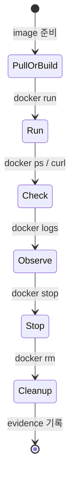

# 1교시: Week 1 실행 환경 문제와 Docker가 등장한 이유

## 실습 확인 기록

| 명령/확인 | 결과 |
|---|---|
| | |

## 확인 질문 답변

| 질문 | 답변 |
|---|---|
| image와 container의 차이는? | image는 실행에 필요한 파일, binary, library, 설정을 담은 패키지다. container는 그 image에서 시작된 실행 중인 process다. |
| VM과 container의 차이는? | VM은 Guest OS 전체를 포함해 격리한다. container는 host kernel을 공유하며 process 단위로 격리한다. macOS/Windows Docker Desktop은 내부에 Linux VM/WSL 2를 사용하지만 container 모델 자체가 VM은 아니다. |
| Docker가 해결하지 못하는 문제는? | Dockerfile에 잘못된 조건을 넣으면 잘못된 조건도 재현 가능해진다. secret을 image에 넣으면 secret도 같이 복제된다. port와 volume을 정리하지 않으면 로컬이 더 지저분해진다. |
| lifecycle 순서는? | image 준비 → `docker run` → `docker ps` / `curl` 확인 → `docker logs` → `docker stop` → `docker rm` → evidence 기록 |

## notes

### Week 1 → Docker 연결

| Week 1 | Docker |
|---|---|
| app folder | build context |
| start command | container start command (CMD) |
| localhost port | port binding |
| README run step | Docker run/build section |
| log/status evidence | `docker logs` / `docker ps` / HTTP check |

Docker는 새로운 실행 조건을 만드는 게 아니라 이미 확인한 실행 조건을 표준 실행 단위로 포장한다.

### Multi PC → VM → Docker 흐름

| 단계 | 해결한 문제 | 새로 생긴 비용 |
|---|---|---|
| Multi PC / 수동 설치 | PC마다 필요한 프로그램 직접 설치 | OS/runtime/DB version 차이, 재설치 어려움 |
| VM / 가상 머신 | Guest OS 단위 격리와 재현성 확보 | OS 전체 포함해 무겁고, 앱 하나에도 VM 운영 비용 |
| Docker / 컨테이너 | image로 실행 패키지화, container로 격리 process 실행 | host kernel/daemon/port/volume/secret 관리 책임 필요 |

### "내 컴퓨터에서는 되는데" 분류

| 문제 증상 | Docker에서 다룰 표현 | 확인 evidence |
|---|---|---|
| 다른 PC에서 실행 실패 | base image, image layer | Dockerfile, build log |
| browser 접속이 안 됨 | host port, container port | `docker ps`, `curl` |
| 데이터가 사라짐 | bind mount, named volume | volume list, app log |
| 설정이 바뀌지 않음 | `-e`, `.env`, Compose environment | container env, README |
| 원인을 모르겠음 | `docker logs`, exit code | RCA note |

### lifecycle

`run`에서 끝나지 않는다. stop → rm → 기록까지 끝나야 하나의 사이클이 닫힌다.

### 흔한 오해

- Docker = VM이다 → container는 host kernel 공유, VM처럼 OS 전체를 부팅하지 않는다.
- image = container다 → image는 패키지, container는 실행 상태.
- Docker를 쓰면 README가 덜 중요하다 → run/stop/cleanup 절차를 README에 남겨야 다른 사람이 같은 결과를 만든다.
- 설치가 안 되면 수업을 따라갈 수 없다 → 설치 실패도 OS, 권한, error evidence가 있으면 해결 가능한 blocker가 된다.

## Blocker Log

| 증상 | 확인한 것 |
|---|---|
| | |
