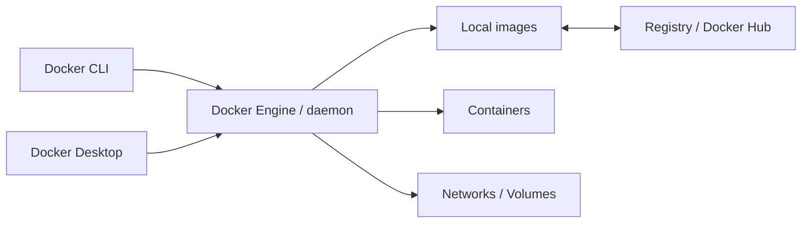
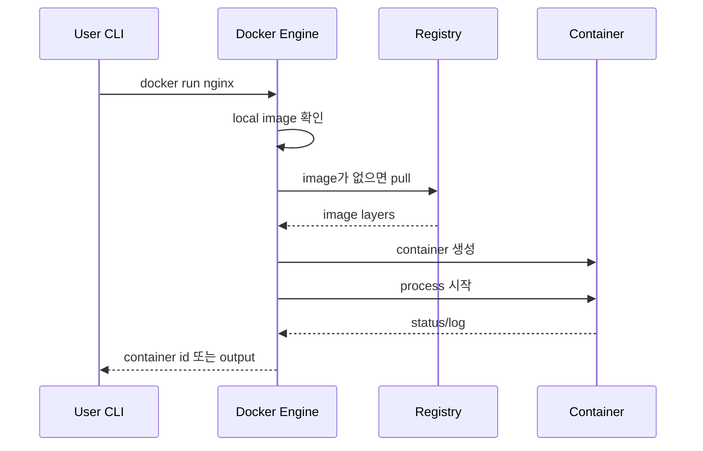

# 3교시: Docker의 컨셉과 작동 방식

## 실습 확인 기록

| 명령/확인 | 설명 | 결과 |
|---|---|---|
| `docker images` | 로컬에 내려받은 image 목록 확인 |  |
| `docker ps` | 현재 실행 중인 container 목록 확인 |  |
| `docker ps -a` | 종료된 container 포함 전체 목록 확인 |  |

## 확인 질문 답변

| 질문 | 답변 |
|---|---|
| image와 container의 차이는? | image는 container를 만들기 위한 실행 패키지(읽기 전용). container는 그 image에서 시작된 실행 상태. 같은 image에서 여러 container를 만들 수 있다. |
| container는 작은 VM인가? | 아니다. VM은 Guest OS를 포함해 격리하지만, container는 host kernel을 공유하며 격리된 process로 실행된다. macOS에서는 Docker Desktop이 내부 Linux VM 계층을 관리하지만, container 모델 자체가 VM은 아니다. |
| `docker run nginx` 한 줄에서 실제로 어떤 단계가 일어나는가? | local image 확인 → 없으면 registry에서 pull → container 생성 → process 시작. port를 지정하지 않으면 host에서 접근이 안 될 수 있다. |
| `docker: command not found`와 `Cannot connect to the Docker daemon`의 차이는? | `command not found`는 CLI 자체가 없는 것. `Cannot connect`는 CLI는 있지만 daemon이 꺼져 있는 것. 해결 방법이 다르다. |
| Docker Hub의 모든 image는 안전한가? | 아니다. 출처, 공식 이미지 여부, tag, 업데이트 상태를 확인해야 한다. |

## notes

### PC 부품과 Docker 컴포넌트 연결

| PC 구성요소 | Docker 표현 | 확인 질문 |
|---|---|---|
| CPU | container process 실행 | 어떤 process가 CPU를 쓰는가 |
| RAM | running container memory | container가 너무 많은 memory를 쓰는가 |
| SSD/disk | image, layer, volume, build cache | image와 volume이 disk를 얼마나 차지하는가 |
| Network | port binding, Docker network | host port와 container port가 어떻게 연결되는가 |
| OS kernel | process 격리, resource 제어 | container가 host kernel에 의존한다는 점을 이해했는가 |
| Remote storage | registry, Docker Hub | image 출처와 tag를 신뢰할 수 있는가 |

Docker는 새 하드웨어가 아니다. 기존 PC 자원을 더 명확한 실행 단위로 나누어 쓰는 계층이다.

### image vs container

| 구분 | Image | Container |
|---|---|---|
| 상태 | 실행 전 package | 실행 중 또는 종료된 instance |
| 바뀌는가 | immutable로 다룸 | 실행 상태, log, writable layer가 생김 |
| 확인 명령 | `docker images` | `docker ps`, `docker ps -a` |

### VM vs container

| 관점 | VM | Docker container |
|---|---|---|
| 실행 단위 | Guest OS를 포함한 가상 머신 | host kernel을 공유하는 격리된 process |
| OS/kernel | VM마다 Guest OS가 있을 수 있음 | container마다 별도 kernel을 갖지 않음 |
| 무게 | OS 전체 포함으로 상대적으로 무거움 | app/library 중심으로 상대적으로 가벼움 |
| macOS에서 Linux container | Linux VM 계층 필요 | Docker Desktop이 내부 Linux VM 계층을 관리 |
| Windows에서 Linux container | - | WSL 2 backend 또는 가상화 조건 필요 |

### VM vs Container 자원 할당 방식

VM은 하이퍼바이저가 자원을 미리 나눠서 고정 할당한다. Guest OS 1에 30%를 주면 다른 VM이 놀고 있어도 그 30%는 묶여 있다.

Container는 기본적으로 host 자원을 동적으로 공유한다. Container 1이 바쁘면 더 쓰고, 끝나면 반환해서 다른 container가 쓴다.

| | VM | Container |
|---|---|---|
| 기본 방식 | 자원을 미리 고정 할당 | host 자원을 동적으로 공유 |
| 안 쓸 때 | 할당량이 묶여 낭비 가능 | 반환되어 다른 container가 사용 |
| 제한 설정 | 가능 | 가능 (`--memory`, `--cpus`) |

container도 상한선을 설정할 수 있다. 설정하지 않으면 host 자원을 경쟁적으로 사용한다.

```bash
docker run --memory 512m --cpus 1.5 nginx
```

### Docker 구성요소 관계



- CLI → daemon에 요청
- daemon → image, container, network, volume 관리
- Desktop → daemon 실행을 보조하는 GUI 환경

### `docker run` 내부 흐름



실패 메시지를 읽을 때 pull 실패 / daemon 실패 / port 충돌 / process 실패를 구분한다.

### 증상으로 보는 구성요소 문제

| 증상 | 가능성 | 확인할 것 |
|---|---|---|
| `docker: command not found` | CLI 설치/PATH 문제 | Docker Desktop 설치, terminal 재시작 |
| `Cannot connect to the Docker daemon` | daemon/Desktop 미실행 | Desktop running, `systemctl status docker` |
| image pull 실패 | network, registry, 인증 문제 | 인터넷, Docker Hub, login |
| container 실행 후 접속 실패 | port binding 또는 app process 문제 | `docker ps`, `docker logs`, `curl` |
| container는 뜨지만 데이터 없음 | volume/config 문제 | volume mount, env var |

### Docker가 "경량"이라는 말의 의미

WSL은 Microsoft 하이퍼바이저 위에서 돌아가는 VM이다. 켜면 Linux 커널째로 메모리를 잡아먹는다. Docker가 WSL을 가볍게 만들어주는 게 아니다. Docker는 WSL 위에서 돌아간다.

Docker의 "경량"은 **VM 여러 개 대신 container 여러 개**를 쓸 때의 이야기다.

```
기존 방식 (VM 여러 개)              Docker 방식
┌──────────┐  ┌──────────┐         ┌─────────────────┐
│ Guest OS │  │ Guest OS │         │  Container A     │
│  App A   │  │  App B   │         │  Container B     │
│  kernel  │  │  kernel  │         │  Container C     │
└──────────┘  └──────────┘         │  (kernel 공유)   │
   VM 1           VM 2             └─────────────────┘
                                     Linux kernel 1개
```

앱마다 VM(Guest OS + kernel)을 따로 띄우는 대신, kernel 하나를 여러 container가 공유하니까 가볍다는 뜻이다. WSL 자체의 메모리 사용량이 줄어드는 게 아니다.

### Docker Desktop은 필수인가

Docker Desktop은 선택이다. Engine만으로도 충분한 경우가 있다.

| 환경 | Docker Desktop 필요 여부 | 이유 |
|---|---|---|
| Linux | 불필요 | OS가 이미 Linux — Engine만 설치하면 daemon이 바로 실행됨 |
| Windows + WSL | 불필요 | WSL이 Linux 기반 — WSL 안에 Engine만 설치하면 됨 |
| macOS | 필요 (또는 대안) | macOS에는 Linux kernel이 없음 — Docker Desktop이 내부 Linux VM을 띄워 kernel을 제공 |
| Windows (WSL 없이) | 필요 | 같은 이유 — Linux kernel을 제공할 수단이 없음 |

Docker Desktop = Engine + CLI + Compose + GUI를 한 번에 묶은 패키지다. `docker version`이 되는 건 Desktop 안에 Engine이 포함되어 있어서다.

macOS 대안으로 Colima, OrbStack 같은 도구도 있지만, 내부적으로 결국 Linux VM을 띄운다. macOS에서 Linux kernel 없이 container를 실행하는 방법은 없다.

### Windows + WSL + Docker 3중 구조와 host networking

Windows에서 WSL 안에 Docker를 설치하면 3개의 계층이 생긴다.

```
Windows (호스트 OS)
  └── WSL (Linux VM)
        └── Docker daemon
              └── Container
```

`--network host` (host 모드)를 쓰면 container가 공유하는 "host"는 **WSL 네트워크**다. Windows가 아니다. WSL2는 자체적으로 WSL 안의 포트를 Windows로 포워딩해주는 기능이 있어서 완전히 차단되지는 않지만, Windows 네트워크에 직접 붙는 건 아니다.

macOS는 Docker Desktop이 내부 Linux VM을 투명하게 처리해 사용자 입장에서 VM이 보이지 않는다. 그래서 macOS ↔ container 간 네트워킹이 더 직접적으로 느껴진다.

- macOS도 내부적으로는 Linux VM이 있다. 다만 Docker Desktop이 그 계층을 숨겨준다.
- host mode 공식 지원은 Docker Desktop 4.29 (2024년) 이후 macOS/Windows 모두 추가됐다.

### FROM — base image 고르기

`FROM`은 Dockerfile의 첫 줄로, **어떤 OS/환경 위에서 앱을 실행할 것인지** 정한다.

```dockerfile
FROM ubuntu:22.04
FROM node:20-alpine
FROM python:3.11-slim
```

- `ubuntu:22.04` → Ubuntu 22.04 위에서 실행
- `node:20-alpine` → Alpine Linux 기반의 Node.js 20 환경
- `python:3.11-slim` → 최소화된 Python 3.11 환경

base image는 **Docker Hub Explore**에서 검색해서 찾는다.
- https://hub.docker.com/explore
- 원하는 언어/런타임/DB 이름으로 검색하면 공식 image와 tag 목록이 나온다.
- `Official Image` 배지가 붙은 것을 우선적으로 확인한다. → 뱃지가 없는 것은 리스크가 클 수 있다.

### EBS — AWS 스토리지 예고

EBS (Elastic Block Store) 는 AWS에서 EC2 인스턴스에 붙이는 네트워크 연결 스토리지다.

```
EC2 인스턴스 (가상 서버)
  └── EBS 볼륨 (네트워크로 연결된 디스크)
        └── OS, Docker 이미지, DB 데이터 등이 저장됨
```

- "물리 디스크처럼 동작"하는 것이지 실제 물리 디스크가 아니다.
- EC2가 꺼져도 EBS의 데이터는 남는다 → Docker named volume과 같은 개념.
- Week 5 AWS에서 자세히 다룬다.

### 흔한 오해

- image를 실행하면 image가 바뀐다 → 실행으로 생기는 상태는 container 쪽에서 다룬다. image는 재사용 가능한 package다.
- container image 안에는 완전한 OS와 kernel이 있다 → image에는 사용자 공간 파일과 library가 들어가지만, kernel은 host 것을 쓴다.
- macOS에서 Docker를 쓰면 WSL 2가 필요하다 → macOS는 WSL 2를 쓰지 않는다. Docker Desktop이 내부 Linux VM 계층을 관리한다.
- Windows에서 host mode를 쓰면 Windows 네트워크에 직접 붙는다 → WSL 네트워크에 붙는 것이다.
- Docker Hub의 모든 image는 안전하다 → 출처, 공식 이미지 여부, tag, 업데이트 상태를 확인해야 한다.

## Blocker Log

| 증상 | 확인한 것 |
|---|---|
| | |
