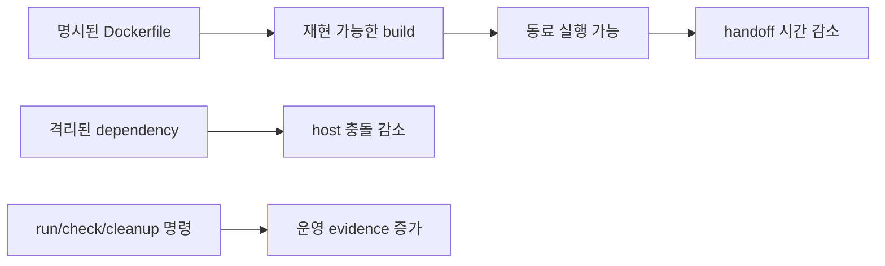

# 4교시: Docker vs Local Computer

## 실습 확인 기록

| 명령/확인 | 설명 | 결과 |
|---|---|---|
| | | |

## 확인 질문 답변

| 질문 | 답변 |
|---|---|
| Docker는 local 실행의 어떤 요소를 바꾸는가? | process → container process, file path → image layer/volume, localhost port → host/container port binding, env/config → `-e`/`.env`, log → `docker logs`. 요소가 없어지는 게 아니라 이름과 경계가 바뀐다. |
| Docker를 쓰면 항상 더 좋은가? | 아니다. image가 커지면 build/pull이 느려지고, container/volume을 방치하면 disk와 port가 지저분해지고, secret을 image에 넣으면 삭제하기 어렵다. 운영 책임이 없어지는 게 아니라 책임의 경계가 바뀐다. |
| Docker를 쓰지 말아야 할 경우는? | 단일 HTML 파일 확인, 일회성 CLI 연습, secret 관리 기준이 없는 상태, host 장치/GUI를 직접 의존하는 작업 등은 local 실행이 더 명확할 수 있다. |
| container를 삭제하면 데이터도 사라지는가? | container 안에만 있던 데이터는 사라진다. named volume에 저장한 데이터는 container 삭제 후에도 남는다. volume과 data lifecycle을 구분해야 한다. |

## notes

### local 실행 vs Docker 비교

| 관점 | Local | Docker |
|---|---|---|
| Compute | host에서 process 실행 | image에서 container process 실행 |
| Storage | host file path 직접 사용 | image layer, bind mount, volume |
| Network | localhost와 host port | container port와 host port binding |
| Configuration | host env/config file | `-e`, `.env`, Compose environment |
| Observability | terminal log, process status | `docker logs`, `docker ps`, exit code |
| Cleanup | process 종료, 파일 삭제 | stop/rm, image/volume 정리 |

Docker는 Week 1의 구성요소를 없애지 않는다. 각 요소에 더 명확한 경계와 명령을 붙인다.

### Docker 장점

- 실행 조건을 image로 포장해 다른 장비에서 재현하기 쉬워진다.
- runtime/dependency를 host에 직접 설치하지 않아 충돌을 줄인다.
- Dockerfile과 Compose로 handoff 문서가 코드와 가까워진다.
- cloud resource를 만들기 전에 local container로 검증하면 비용 낭비를 줄인다.



### Docker 도입으로 생기는 위험

| 위험 | 증상 | 예방/완화 |
|---|---|---|
| image 비대화 | pull/build 시간이 길어짐 | `.dockerignore`, 작은 base image 선택 |
| secret 포함 | image/repository에 credential 노출 | env var 주입, build context 점검 |
| port 충돌 | container는 실행됐지만 접속 실패 | `docker ps`, host port 변경, cleanup |
| volume 오해 | DB 데이터가 사라지거나 의도치 않게 남음 | named volume과 cleanup 절차 구분 |
| debugging 복잡도 | host에서는 보이지 않는 실패 | `docker logs`, `docker exec`, `docker inspect` |

### Docker 사용 판단

| 상황 | 권장 | 보류 가능 |
|---|---|---|
| 팀원이 같은 앱을 반복 실행 | ✓ | |
| DB/cache 등 여러 service 필요 | ✓ | |
| runtime version 충돌이 잦음 | ✓ | |
| 단일 HTML 파일 확인 | | ✓ local server로 충분 |
| 일회성 CLI 연습 | | ✓ host command 학습 우선 |
| secret 관리 기준이 없음 | | ✓ 기준 수립 후 사용 |
| host 장치/GUI 직접 의존 | | ✓ local 실행이 더 명확 |

### image 크기 관리

실무에서는 image를 80~200MB 내외로 유지하는 것을 목표로 한다. 200MB를 넘기 시작하면 pull/build 시간이 1분을 넘어가기 시작한다.

base image tag에 붙은 텍스트가 크기를 결정한다.

| tag 예시 | 특징 |
|---|---|
| `node:20` | 기본 이미지 — 크고 무거움 |
| `node:20-alpine` | Alpine Linux 기반 — 초경량. 기본 명령어(bash 등)가 빠져있어 디버깅이 불편할 수 있음 |
| `node:20-slim` | Debian 기반 경량화 — alpine보다는 크지만 기본 명령어는 있음 |
| `node:20-bookworm-slim` | Debian bookworm 기반 slim — slim과 비슷한 수준 |

- **alpine**: 진짜 초경량 Linux. 기본 커맨드가 빠져있어서 `bash`도 없는 경우가 있다. 크기를 최우선으로 줄여야 할 때 사용.
- **slim / slimbuster**: alpine만큼 작지는 않다. 기본 명령어는 갖추고 있어서 디버깅이 더 편하다.
- 개발/실습 단계에서는 slim, 배포 최적화 단계에서 alpine을 검토하는 순서가 일반적이다.

`slimbuster`와 `bookworm-slim`은 같은 slim 계열이지만 Debian 버전이 다르다.

| tag | Debian 버전 | 비고 |
|---|---|---|
| `slim-buster` | Debian 10 (2019) | 구버전 |
| `bullseye-slim` | Debian 11 (2021) | |
| `bookworm-slim` | Debian 12 (2023) | 현재 최신 |

강사님이 언급한 "슬림버스터"는 `slim-buster` (Debian 10) 태그다. 크기 차이는 크지 않고 둘 다 같은 Debian slim 계열이다.

### MSA (Microservice Architecture)

하나의 큰 앱을 기능별로 작은 서비스들로 쪼개서 운영하는 구조다.

```
모놀리식 (Monolith)              MSA
┌─────────────────┐              ┌──────┐ ┌──────┐ ┌──────┐
│  로그인          │              │ 로그인│ │ 결제 │ │ 추천 │
│  결제            │    →         └──────┘ └──────┘ └──────┘
│  추천            │              ┌──────┐ ┌──────┐
│  검색            │              │ 검색 │ │ 배송 │
└─────────────────┘              └──────┘ └──────┘
```

| | 모놀리식 | MSA |
|---|---|---|
| 배포 | 전체를 한 번에 배포 | 서비스별 독립 배포 |
| 장애 | 한 곳 문제가 전체에 영향 | 해당 서비스 container만 재시작/롤백 |
| 스케일 | 전체를 늘려야 함 | 특정 서비스만 스케일 업 가능 |
| 운영 복잡도 | 낮음 | 서비스가 늘어날수록 높아짐 |

결제 container에 문제가 생기면 결제 container만 재시작하면 된다. 로그인, 검색 등 나머지 서비스는 계속 돌아간다.

단, **결제 서비스가 다운됐을 때 다른 서비스가 결제를 호출하면 어떻게 처리할 것인가**를 미리 설계해야 한다. 이게 MSA의 복잡도다.

Docker/container가 MSA와 잘 맞는 이유: 서비스마다 실행 환경이 달라도 각각 container로 포장하면 독립 배포가 쉬워진다.

### 실제 사례 — secret과 대규모 container 운영

**secret 하드코딩 위험**

private repository라도 secret을 코드에 하드코딩하면 안 된다. 실제로 국내 스트리밍 서비스에서 private GitHub에 secret을 하드코딩했다가 유출됐다는 소문이 있다. private라는 것은 접근 제어일 뿐, 개발자 계정이 털린다면 노출된다. image layer에 secret이 들어간 경우도 마찬가지다.

**대규모 MSA 배포 시 자원 문제**

container를 많이 쓰는 조직(예: 스트리밍 서비스)은 MSA 구조로 배포할 때 20~30개 이상의 서비스가 동시에 올라간다. 이때 필요한 자원(CPU/메모리)이 미리 확보되어 있지 않으면 배포가 실패하거나 서비스가 불안정해진다.

| 선택지 | 특징 |
|---|---|
| EC2 (고정 서버) | 미리 자원을 확보해두어야 함. 비용은 저렴하지만 자원 계획이 필요 |
| ECS | container 단위 관리. Kubernetes보다 운영 복잡도가 낮음 |
| Serverless | 필요할 때만 자원을 사용(파괴형). 자원 계획 불필요하지만 EC2보다 비쌈 |

- 한 번에 수십 개를 동시 배포하면 자원이 부족해질 수 있다 → 순차 배포, 자원 예약 전략이 필요하다.
- Serverless로 피할 수 있지만 비용이 올라간다. 트레이드오프다.

### 흔한 오해

- Docker를 쓰면 production과 완전히 같다 → host OS, network, resource, cloud permission 차이는 여전히 남는다.
- Docker는 항상 성능과 비용을 줄인다 → image 크기, build 시간, disk 사용량, container 수를 관리해야 한다.
- container 삭제는 항상 안전하다 → volume과 data lifecycle을 구분하지 않으면 필요한 데이터를 잃을 수 있다.
- local 실행은 이제 배울 필요 없다 → Docker 문제도 process, file, network, config evidence로 분석한다.

## Blocker Log

| 증상 | 확인한 것 |
|---|---|
| | |
