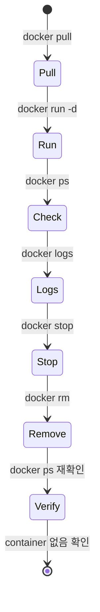

# 5교시: Docker 기본 명령어 1 - 실행 80% 사이클

## 실습 확인 기록

| 명령/확인 | 설명 | 결과 |
|---|---|---|
| `docker version` | CLI(Client)와 daemon(Server) 연결 확인 |  |
| `docker pull nginx:latest` | Docker Hub에서 nginx image 내려받기 | |
| `docker image` | image 관련 서브커맨드 목록 확인 |  |
| `docker run -d --name paperclip-day1-nginx -p 18080:80 nginx:latest` | nginx container를 백그라운드로 실행, host 18080 → container 80 연결 |  |
| `docker ps --filter name=paperclip-day1-nginx` | 실행 중인 container 상태와 port binding 확인 |  |
| `curl http://localhost:18080` | nginx 응답 확인 |  |
| `docker logs paperclip-day1-nginx` | container 내부 process log 확인 |  |
| `docker stop paperclip-day1-nginx` | container 정상 중지 |  |
| `docker rm paperclip-day1-nginx` | 중지된 container 삭제 |  |
| `docker ps --filter name=paperclip-day1-nginx` | 삭제 후 container가 남아있지 않음 확인 |  |

## 확인 질문 답변

| 질문 | 답변 |
|---|---|
| `docker run`만 성공하면 실습이 끝난 것인가? | 아니다. `ps`, `logs`, `stop`, `rm`까지 해야 lifecycle이 닫힌다. container가 남아있으면 다음 실습에서 이름/port 충돌이 난다. |
| `-p 18080:80`의 의미는? | host의 18080 port로 들어온 요청을 container 내부의 80 port로 전달한다. 왼쪽이 host port, 오른쪽이 container port다. |
| `Image is up to date`는 실패인가? | 아니다. 이미 최신 image가 local에 있다는 뜻이다. 처음 받으면 `Downloaded newer image`가 보인다. 둘 다 정상이다. |
| `docker rm`을 `stop` 전에 하면 어떻게 되는가? | 실행 중인 container는 `rm`이 실패한다. 보통 `stop` 후 `rm` 순서로 한다. |
| `docker ps`와 `docker ps -a`의 차이는? | `docker ps`는 실행 중인 container만 보인다. `docker ps -a`는 종료된 container도 포함해 전체가 보인다. |

## notes

### 명령 목적표

| 명령 | 확인하려는 상태 | 정상 evidence |
|---|---|---|
| `docker version` | CLI와 daemon 연결 상태 | Client/Server 정보 모두 보임 |
| `docker pull nginx:latest` | registry에서 image 확보 가능 여부 | digest와 status 출력 |
| `docker image ls` (`docker image`와 동일) | local에 어떤 image가 있는지 | `nginx`, `hello-world` 등 표시 |
| `docker run` | image에서 container를 시작 | container ID 출력 |
| `docker ps` | 실행 중인 container와 port binding | STATUS, PORTS, NAMES 확인 |
| `docker logs` | process가 남긴 stdout/stderr | entrypoint/start log |
| `docker stop` | container 정상 중지 | container 이름 반환 |
| `docker rm` | 중지된 container 삭제 | container 이름 반환 |

### 옛날 방식 vs 최신 방식

Docker는 점점 `docker <object> <verb>` 형태의 서브커맨드로 정리하는 추세다. 둘 다 현재 작동하고 결과도 동일하다.

| 옛날 방식 | 최신 방식 |
|---|---|
| `docker images` | `docker image ls` |
| `docker ps` | `docker container ls` |
| `docker rmi` | `docker image rm` |
| `docker rm` | `docker container rm` |

### port binding 읽는 법

```text
PORTS
0.0.0.0:18080->80/tcp
```

- `18080` → host port (브라우저/curl로 접속하는 포트)
- `80` → container 내부 nginx가 듣는 포트
- `->` → host port가 container port로 포워딩됨

다음 교시 PostgreSQL 실습에서는 `15432:5432`, `15433:5432`로 같은 원리를 적용한다.

### port 번호 범위

| 범위 | 이름 | 설명 |
|---|---|---|
| 0 ~ 1023 | Well-known ports (System ports) | OS가 점유. root/관리자 권한 없이 사용 불가. HTTP(80), HTTPS(443), SSH(22) 등 |
| 1024 ~ 49151 | Registered ports | IANA에 등록된 서비스용. 일반 사용자도 사용 가능. PostgreSQL(5432), MySQL(3306) 등 |
| 49152 ~ 65535 | Dynamic/Ephemeral ports | 임시 사용용. 클라이언트가 서버에 연결할 때 OS가 자동 배정 |

- 1023 이하 포트를 쓰려면 root 권한이 필요하다. 굳이 쓰면 문제 생겼을 때 본인 책임.
- 실습에서 host port를 `18080`, `15432`, `15433`처럼 높은 번호로 쓰는 이유가 여기 있다. 권한 문제 없이 자유롭게 쓸 수 있어서다.
- container 내부 port(nginx 80, PostgreSQL 5432)는 container 안에서 실행되므로 host 권한 제약을 받지 않는다.

### lifecycle 순서



`run`에서 끝내면 안 된다. `stop → rm → ps 재확인`까지 해야 하나의 cycle이 닫힌다.

### 실습 전 기존 container 확인

```bash
docker ps -a --filter name=paperclip-day1-nginx
```

헤더만 나오면 진행 가능. 같은 이름의 container가 보이면 먼저 정리한다.

### `docker logs` 정상 출력 예시

```text
/docker-entrypoint.sh: Configuration complete; ready for start up
2026/06/04 04:07:14 [notice] 1#1: nginx/1.31.1
2026/06/04 04:07:14 [notice] 1#1: start worker processes
```

### 흔한 오해

- `docker image ls`에 기존 이미지가 많으면 문제다 → 기존 실습 이력이 있을 수 있다. 오늘 image인 `nginx`를 구분해 기록하면 된다.
- container ID가 강사 화면과 다르다 → 장비마다 다르게 생성된다. 정상이다.
- `docker rm`을 먼저 하면 된다 → running container는 먼저 `stop` 후 `rm`한다.

## Blocker Log

| 증상 | 확인한 것 |
|---|---|
| | |
