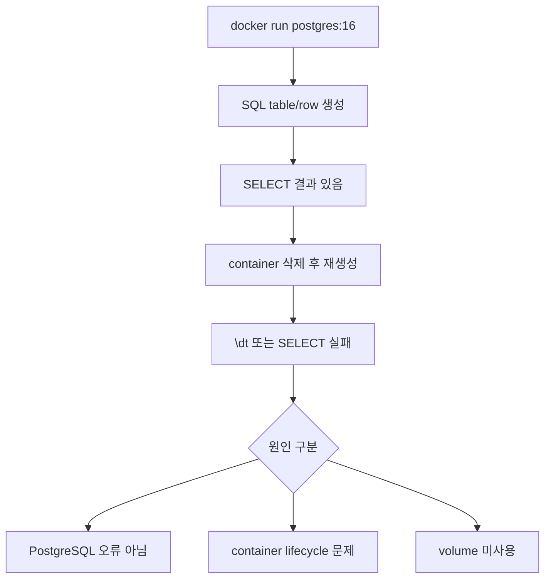

# 1교시: Day 1 DB container 재생성과 데이터 소실 확인

## 실습 확인 기록

| 명령/확인 | 설명 | 결과 |
|---|---|---|
| `docker ps -a --filter name=paperclip-pg16` | 기존 container 상태 확인 |  |
| `docker stop paperclip-pg16 \|\| true` && `docker rm paperclip-pg16 \|\| true` | 기존 container 정지 및 삭제 | 기존 container가 없으므로 skip |
| `docker run -d --name paperclip-pg16 -e POSTGRES_PASSWORD=postgres -e POSTGRES_DB=paperclip -p 15432:5432 postgres:16` | volume 없이 새 container 실행 |   |
| `docker logs paperclip-pg16 --tail 30` | 시작 로그 확인 |  |
| `docker exec paperclip-pg16 psql -U postgres -d paperclip -c "\dt"` | table 목록 — 이전 table이 없음을 확인 | |

## 확인 질문 답변

| 질문 | 답변 |
|---|---|
| container를 삭제하면 DB 데이터도 사라지는 이유는? | SQL data는 image가 아니라 container writable layer에 기록된다. `docker rm`으로 container를 삭제하면 writable layer도 함께 제거된다. |
| 같은 image로 새 container를 만들면 이전 데이터가 남는가? | 아니다. 새 container는 image 기준의 초기 상태로 시작한다. volume을 연결하지 않으면 이전 데이터를 이어받지 못한다. |
| `\dt`에 table이 없으면 PostgreSQL이 망가진 것인가? | 아니다. PostgreSQL 자체는 정상이다. container writable layer가 삭제되면서 그 안에 있던 DB 변경사항이 사라진 것이다. |
| container가 실행되지 않을 때 먼저 확인할 것은? | `docker logs <name> --tail 30`으로 이름 충돌, port 충돌, POSTGRES_PASSWORD 누락을 순서대로 확인한다. |

## notes

### container writable layer와 data lifecycle

| 구분 | 읽기/쓰기 | container 삭제 후 |
|---|---|---|
| image layer | read-only | 남아 있음 |
| container writable layer | read-write | 함께 삭제됨 |
| named volume | Docker-managed storage | 남아 있음 (별도 삭제 필요) |
| bind mount | host filesystem | host 파일은 남아 있음 |

### 실패 관찰 흐름



### docker run 옵션 정리

```bash
docker run -d --name paperclip-pg16 -e POSTGRES_PASSWORD=postgres -e POSTGRES_DB=paperclip -p 15432:5432 postgres:16
```

| 옵션 | 의미 |
|---|---|
| `-d` | detached mode — container를 백그라운드에서 실행한다. 터미널이 container 출력에 붙지 않는다. |
| `--name paperclip-pg16` | container에 이름을 지정한다. 이름이 없으면 Docker가 랜덤 이름을 붙인다. |
| `-e POSTGRES_PASSWORD=postgres` | 환경변수 주입. PostgreSQL superuser 비밀번호를 설정한다. 필수값이며 없으면 container가 시작되지 않는다. |
| `-e POSTGRES_DB=paperclip` | 환경변수 주입. container 시작 시 자동으로 생성할 DB 이름을 지정한다. |
| `-p 15432:5432` | port publish. `host port : container port` 순서. host의 15432로 들어온 요청을 container 내부 5432로 전달한다. 여기서 host는 외부 도메인이 아니라 Docker가 실행되고 있는 내 컴퓨터(MacBook)를 말한다. `-p` 없으면 내 컴퓨터에서 접근 불가, 같은 Docker network의 container끼리만 통신 가능하다. |
| `postgres:16` | 사용할 image와 tag. Docker Hub의 공식 PostgreSQL 16 image를 사용한다. |

### PostgreSQL container 시작 2단계

container를 처음 실행할 때 로그에 서버가 잠깐 떴다 꺼지는 구간이 보인다. 비정상이 아니라 초기화 순서다.

**1단계 — initdb (DB 초기화)**
- data directory가 비어 있으면 `initdb`로 DB 파일 구조를 초기화한다.
- 초기화 후 `/docker-entrypoint-initdb.d/` 안의 스크립트(.sql, .sh)를 실행하기 위해 임시로 서버를 잠깐 띄웠다가 끈다.
- 로그에서 `server started` → `server stopped`로 보이는 부분이 이 구간이다.

**2단계 — 본 서버 시작**
- `PostgreSQL init process complete; ready for start up.` 이후가 실제 서비스용 PostgreSQL이 올라오는 것이다.
- `database system is ready to accept connections` = 여기서부터 실제 접속이 가능하다.

volume이 없으면 매번 새 container를 만들 때마다 data directory가 비어 있으므로 이 initdb 과정이 반복된다.

### `|| true` 의미

`||`는 앞 명령이 **실패했을 때** 뒤 명령을 실행하라는 의미다.

```bash
docker stop paperclip-pg16 || true
docker rm paperclip-pg16   || true
```

`paperclip-pg16` container가 없는 상태에서 `docker stop`을 실행하면 에러가 난다. 스크립트에서 에러가 나면 이후 명령이 중단될 수 있는데, `|| true`를 붙이면 앞 명령이 실패해도 `true`(성공)를 반환해서 그냥 통과한다.

"없어서 실패해도 괜찮다, 계속 진행해라"는 방어 코드다.

### 삭제 대상 3가지 구분

| 삭제 대상 | 명령 | 없어지는 것 |
|---|---|---|
| container | `docker rm` | process + writable layer |
| volume | `docker volume rm` | 데이터 (복구 불가) |
| network | `docker network rm` | 통신 경로 |

셋을 구분하지 않으면 실습은 성공해도 운영 사고를 배운 셈이 된다. cleanup 전에 지금 지우는 대상이 무엇인지 먼저 확인한다.

### 흔한 오해

- `\dt`에 table이 없다 = PostgreSQL이 망가졌다 → 실제로는 writable layer가 없어진 것이다.
- 같은 image로 다시 만들면 이전 상태가 유지된다 → image는 초기 상태이고, 실행 중 변경은 writable layer에만 남는다.
- container를 stop만 하면 데이터가 유지된다 → stop 후 rm까지 하면 writable layer가 사라진다. 완전한 분리는 volume이 필요하다.
- host port 5432와 15432를 혼동한다 → `docker run -p 15432:5432`에서 앞은 host port, 뒤는 container port다.

### MariaDB와 MySQL

Oracle이 Sun Microsystems를 인수하면서 MySQL도 Oracle 손에 넘어갔다. MySQL 원작자인 Monty Widenius를 포함한 개발자들이 유료화·상업화에 반발해 2009년 MySQL을 fork해서 MariaDB를 만들었다. 이름도 딸 이름에서 따왔다 (MySQL의 My도 딸 이름).

| 항목 | MySQL | MariaDB |
|---|---|---|
| 출발점 | 원본 | MySQL fork (2009) |
| 만든 이유 | — | Oracle 유료화·상업화 반발 |
| 내부 구조 | 공통 뿌리 | 초기엔 거의 동일 |
| 현재 | 기능 격차 좁혀짐 | 기본 SQL 문법은 거의 동일 |

기본 SQL 문법과 connection string 수준에서는 거의 동일하게 사용할 수 있다. 고급 기능이나 내부 스토리지 엔진 수준에서는 차이가 있다.

## Blocker Log

| 증상 | 확인한 것 | 시도한 것 |
|---|---|---|
| | | |
