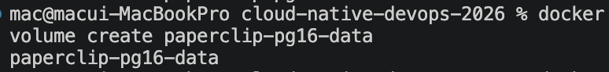
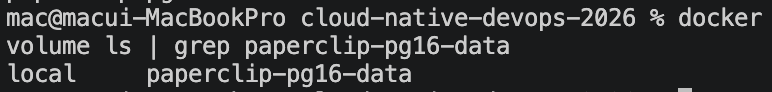
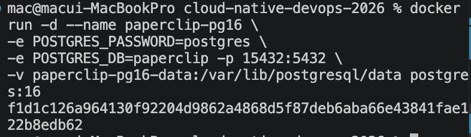
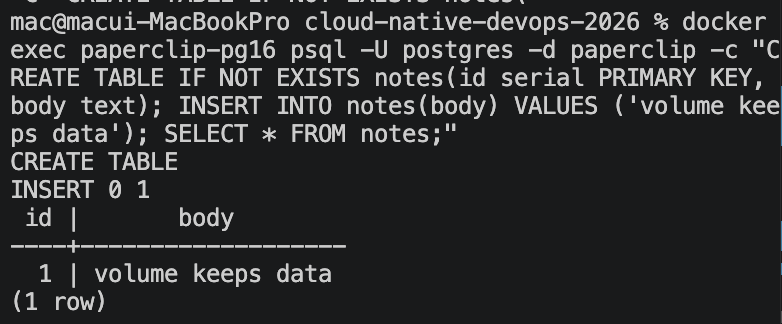
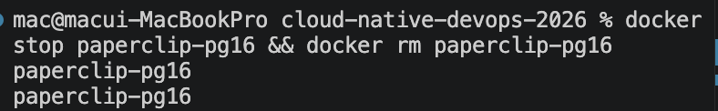
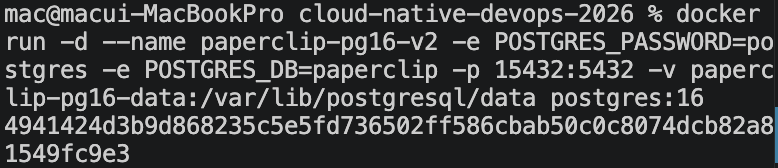
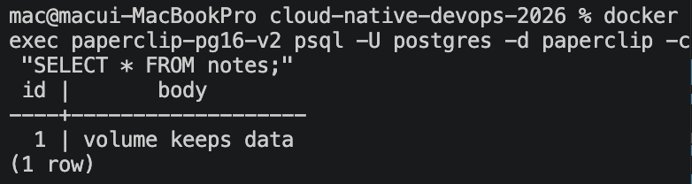
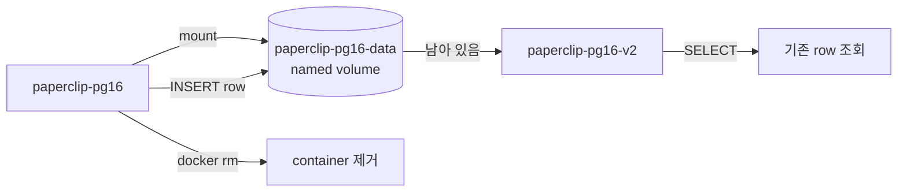

# 2교시: named volume과 database persistence

## 실습 확인 기록

| 명령/확인 | 설명 | 결과 |
|---|---|---|
| `docker volume create paperclip-pg16-data` | named volume 생성 |  |
| `docker volume ls \| grep paperclip-pg16-data` | volume 생성 확인 |  |
| `docker run -d --name paperclip-pg16 -e POSTGRES_PASSWORD=postgres -e POSTGRES_DB=paperclip -p 15432:5432 -v paperclip-pg16-data:/var/lib/postgresql/data postgres:16` | volume을 mount해서 container 실행 |  |
| `docker exec paperclip-pg16 psql -U postgres -d paperclip -c "CREATE TABLE IF NOT EXISTS notes(id serial PRIMARY KEY, body text); INSERT INTO notes(body) VALUES ('volume keeps data'); SELECT * FROM notes;"` | table 생성 및 row 삽입 |  |
| `docker stop paperclip-pg16` && `docker rm paperclip-pg16` | container 삭제 (volume은 남음) |  |
| `docker run -d --name paperclip-pg16-v2 -e POSTGRES_PASSWORD=postgres -e POSTGRES_DB=paperclip -p 15432:5432 -v paperclip-pg16-data:/var/lib/postgresql/data postgres:16` | 같은 volume으로 새 container 실행 |  |
| `docker exec paperclip-pg16-v2 psql -U postgres -d paperclip -c "SELECT * FROM notes;"` | 이전 row가 남아 있는지 확인 |  |

## 확인 질문 답변

| 질문 | 답변 |
|---|---|
| named volume과 container writable layer의 차이는? | writable layer는 container lifecycle에 종속돼 container가 삭제되면 함께 사라진다. named volume은 Docker가 별도로 관리하는 storage로 container를 삭제해도 데이터가 남는다. |
| `-v paperclip-pg16-data:/var/lib/postgresql/data`에서 앞뒤의 의미는? | 앞(`paperclip-pg16-data`)은 Docker가 관리하는 named volume 이름이고, 뒤(`/var/lib/postgresql/data`)는 container 내부에서 volume이 연결될 경로다. PostgreSQL이 실제로 데이터를 쓰는 경로와 일치해야 한다. |
| container를 교체해도 데이터가 남는 이유는? | 데이터가 container writable layer가 아니라 named volume에 기록되기 때문이다. 새 container가 같은 volume을 mount하면 기존 데이터를 그대로 이어받는다. |
| `docker volume rm`을 실행하면 어떻게 되는가? | volume 안의 데이터가 영구 삭제된다. container 삭제와 달리 복구가 안 되므로 실습용 volume인지 먼저 확인해야 한다. |

## notes

### named volume lifecycle



container가 아니라 volume을 중심으로 읽는다. container는 사라져도 volume은 같은 이름으로 다시 mount될 때 데이터를 이어준다.

### `-v` 옵션 구조

```bash
-v paperclip-pg16-data:/var/lib/postgresql/data
```

| 구분 | 값 | 설명 |
|---|---|---|
| volume name | `paperclip-pg16-data` | Docker가 관리하는 named volume 이름 |
| container target path | `/var/lib/postgresql/data` | container 내부에서 volume이 연결되는 경로 |

target path가 PostgreSQL이 실제로 데이터를 쓰는 경로(`PGDATA`)와 일치해야 한다. 경로가 틀리면 volume이 연결돼도 데이터가 남지 않는다.

### volume mount 시 데이터 저장 경로

volume을 mount하면 해당 경로는 writable layer를 완전히 우회한다. 둘 다 저장되는 게 아니라 경로에 따라 둘 중 하나로만 간다.

```
데이터 입력
    ↓
해당 경로가 volume mount된 경로인가?
    ├── YES  →  volume에 직접 저장 (writable layer 거치지 않음)
    └── NO   →  writable layer에 저장
```

PostgreSQL이 `/var/lib/postgresql/data`에 데이터를 쓸 때, 그 경로에 volume이 mount돼 있으면 writable layer는 거치지 않고 volume으로 바로 간다. 그래서 container를 삭제해도 데이터가 남는다. writable layer는 삭제되지만 데이터는 volume에 있기 때문이다.

| 상황 | 데이터 저장 위치 | container 삭제 후 |
|---|---|---|
| volume 없음 | writable layer | 사라짐 |
| volume mount됨 (해당 경로) | volume | 남아 있음 |
| volume mount됨 (그 외 경로) | writable layer | 사라짐 |

volume과 실제 SQL 환경은 별개가 아니다. volume이 곧 PostgreSQL의 데이터 저장소다.

```
PostgreSQL (SQL 엔진)
        ↓ 데이터 쓰기
/var/lib/postgresql/data  ←  이게 volume
```

PostgreSQL은 데이터를 `/var/lib/postgresql/data`에 파일로 저장한다. volume을 그 경로에 mount하면 그 저장소가 Docker volume으로 연결되는 것이다. "SQL 환경 따로, volume 따로" 두 곳에 저장되는 게 아니라 **volume = PostgreSQL의 데이터 디렉토리**다. volume이 없으면 같은 경로가 writable layer에 연결되고, volume이 있으면 volume에 연결된다.

### `\dt` 란

`\dt`는 PostgreSQL psql 클라이언트 명령어로 현재 DB에 있는 table 목록을 보여준다.

- `d` = describe, `t` = tables 약자
- SQL 문법이 아니라 psql 쉘에서만 동작하는 메타 명령어다
- table이 없으면 아무것도 출력되지 않는다 — volume 없이 container를 재생성했을 때 데이터 소실을 확인하는 용도로 사용한다

### named volume vs bind mount

| 구분 | named volume | bind mount |
|---|---|---|
| 경로 관리 | Docker가 관리 | host path를 직접 지정 |
| host path 노출 | 없음 | 있음 |
| 이식성 | 높음 | OS/환경에 따라 다름 |
| 주요 용도 | DB data 등 영구 저장 | 개발 중 host 파일 실시간 반영 |

### 흔한 오해

- container를 삭제하면 volume도 같이 지워진다 → `docker rm`은 container만 삭제한다. volume은 명시적으로 `docker volume rm`을 실행해야 삭제된다.
- volume이 있으면 어떤 경로에 mount해도 된다 → target path가 PostgreSQL의 data directory와 일치해야 한다. 경로가 다르면 빈 directory가 연결되는 것과 같다.
- 새 container에서 데이터가 안 보이면 volume이 망가진 것이다 → volume name이 같은지, target path가 맞는지 먼저 확인한다.

## Blocker Log

| 증상 | 확인한 것 | 시도한 것 |
|---|---|---|
| | | |
