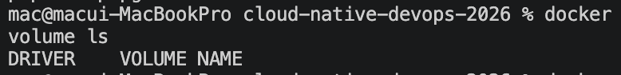
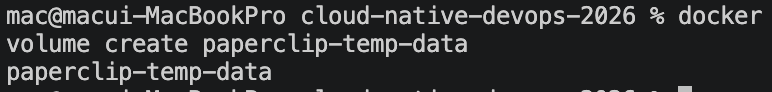
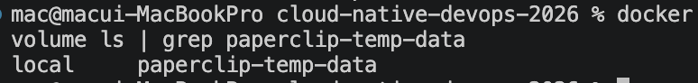
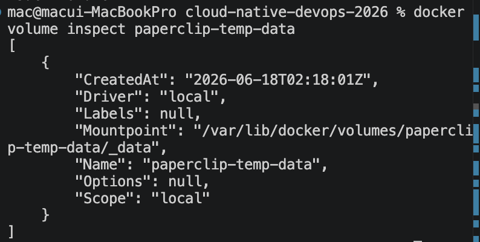
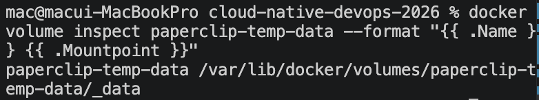
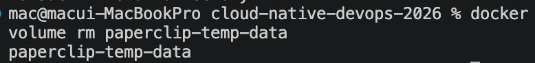
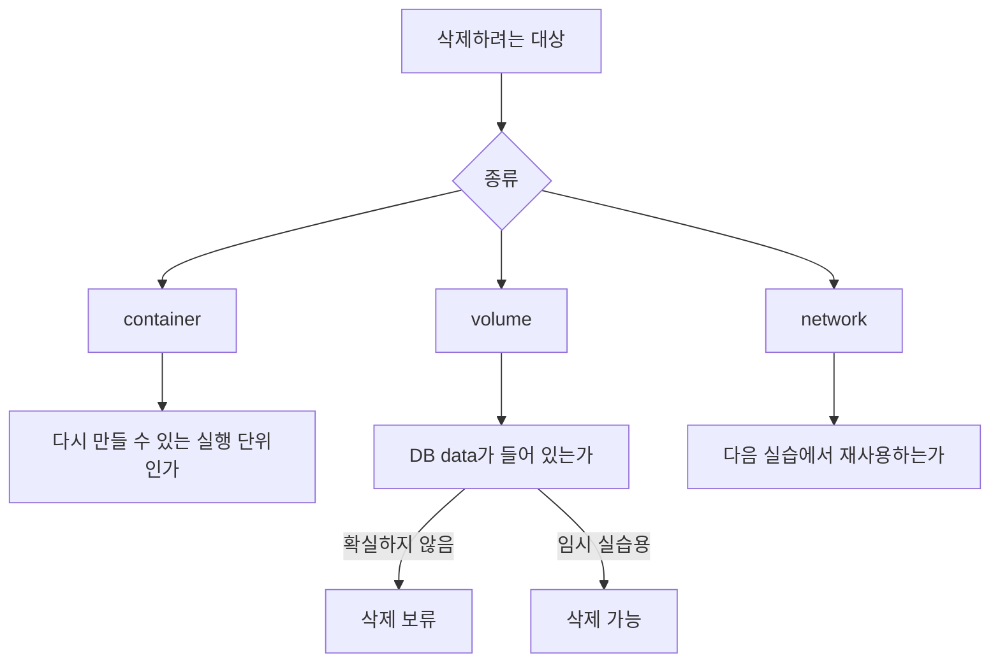

# 3교시: volume 명령과 cleanup 위험

## 실습 확인 기록

| 명령/확인 | 설명 | 결과 |
|---|---|---|
| `docker volume ls` | 전체 volume 목록 확인 |  |
| `docker volume create paperclip-temp-data` | 임시 volume 생성 |  |
| `docker volume ls \| grep paperclip-temp-data` | 임시 volume 생성 확인 |  |
| `docker volume inspect paperclip-temp-data` | DB volume 상세 정보 확인 |  |
| `docker volume inspect paperclip-temp-data --format "{{ .Name }} {{ .Mountpoint }}"` | 이름과 mountpoint만 출력 |  |
| `docker volume rm paperclip-temp-data` | 임시 volume 삭제 |  |

## 확인 질문 답변

| 질문 | 답변 |
|---|---|
| `docker volume ls`와 `docker volume rm`의 차이는? | `ls`는 조회만 한다. `rm`은 volume 안의 데이터를 영구 삭제한다. 같은 volume 명령이지만 성격이 완전히 다르다. |
| `docker volume inspect`에서 Mountpoint를 그대로 공유해도 되는가? | 안 된다. Mountpoint에는 개인 경로가 포함될 수 있으므로 공개 문서에는 필요한 정보만 남긴다. |
| 사용 중인 container가 있는 volume을 삭제하면 어떻게 되는가? | 삭제 명령이 실패한다. container 연결을 먼저 끊거나 container를 삭제한 뒤 volume을 지워야 한다. |
| dangling volume이란? | 어떤 container에도 연결되지 않은 volume이다. 실습 흔적일 수 있지만 실제 데이터가 들어있을 수 있으므로 확인 전 삭제하지 않는다. |

## notes

### volume 명령 역할 구분

| 명령 | 역할 | 데이터 영향 |
|---|---|---|
| `docker volume ls` | 존재 여부 확인 | 없음 |
| `docker volume inspect` | 상세 정보 확인 | 없음 |
| `docker volume create` | volume 생성 | 없음 |
| `docker volume rm` | volume 삭제 | **데이터 영구 삭제** |

`ls`와 `inspect`는 조회 명령이고 `rm`은 데이터 삭제 명령이다. 같은 `docker volume` 하위 명령이지만 성격이 다르다.

### cleanup 판단 흐름



cleanup을 "깔끔하게 지우기"가 아니라 대상의 성격을 나누는 판단으로 본다. volume은 container보다 삭제 위험도가 높다.

### `docker volume inspect` 출력에서 볼 것

```bash
docker volume inspect paperclip-pg16-data --format "{{ .Name }} {{ .Mountpoint }}"
```

| 항목 | 확인 내용 |
|---|---|
| Name | volume 이름 — 어떤 volume인지 식별 |
| Driver | 보통 `local` — Docker가 관리하는 로컬 volume |
| Mountpoint | Docker가 실제로 데이터를 저장하는 host 경로 — 개인 경로 포함 가능 |

Mountpoint 전체를 그대로 공유하지 않는다. 개인 경로가 포함될 수 있다.

### macOS에서 Mountpoint 경로가 없는 이유

```bash
ls /var/lib/docker/volumes/paperclip-temp-data/_data
# No such file or directory
```

`docker volume inspect`의 Mountpoint는 macOS 파일시스템 경로가 아니라 **Docker Desktop이 내부적으로 띄운 Linux VM 안의 경로**다. macOS 터미널에서는 그 VM 내부에 직접 접근할 수 없으므로 `No such file or directory`가 나온다.

```
macOS (내 터미널)
    └── Docker Desktop
            └── Linux VM
                    └── /var/lib/docker/volumes/paperclip-temp-data/_data  ← 실제 데이터 위치
```

macOS에서 volume 내용을 보려면 volume을 mount한 임시 container를 띄워서 그 안에서 확인한다.

```bash
docker run --rm -v paperclip-temp-data:/data alpine ls -la /data
```

또는 Docker Desktop GUI의 **Volumes 탭**에서 volume을 클릭하면 파일 목록을 볼 수 있다.

### 흔한 오해

- dangling volume은 쓸모없는 것이다 → 실제 DB 데이터가 들어있을 수 있다. 확인 전 삭제하지 않는다.
- volume rm이 실패하면 volume이 망가진 것이다 → 사용 중인 container가 있으면 삭제가 막힌다. `docker ps -a`로 연결된 container를 먼저 확인한다.
- container를 지우면 volume도 같이 지워진다 → `docker rm`은 container만 삭제한다. volume은 명시적으로 `docker volume rm`을 실행해야 삭제된다.

## Blocker Log

| 증상 | 확인한 것 | 시도한 것 |
|---|---|---|
| | | |
