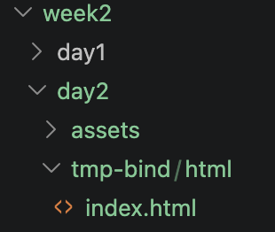
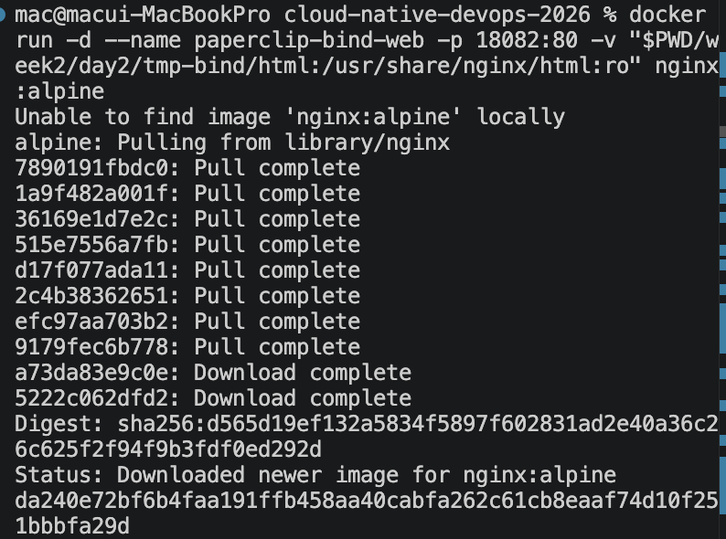
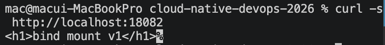
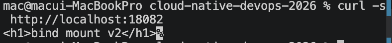
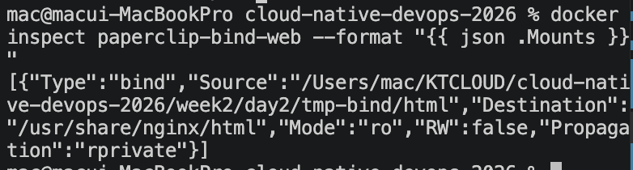
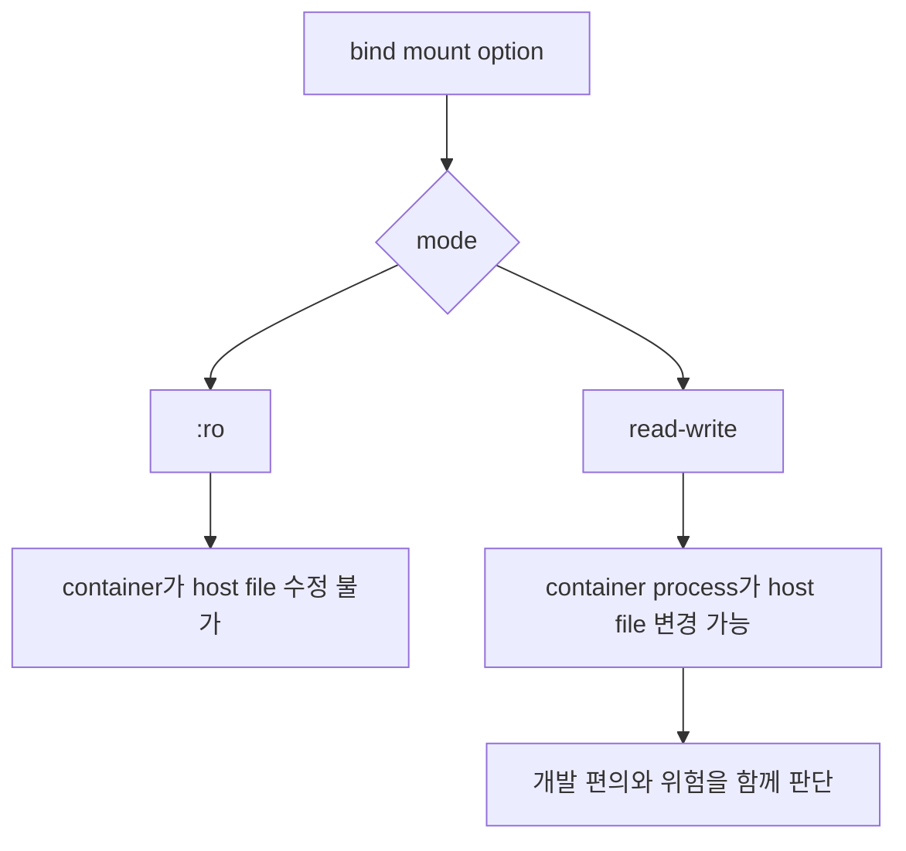

# 4교시: bind mount와 host path 주의

## 실습 확인 기록

| 명령/확인 | 설명 | 결과 |
|---|---|---|
| `mkdir -p week2/day2/tmp-bind/html` & `printf "<h1>bind mount v1</h1>" > week2/day2/tmp-bind/html/index.html` | host에 실습용 디렉토리 생성 & host에 index.html 생성 |  |
| `docker run -d --name paperclip-bind-web -p 18082:80 -v "$PWD/week2/day2/tmp-bind/html:/usr/share/nginx/html:ro" nginx:alpine` | host directory를 `:ro`로 mount해서 nginx 실행 |  |
| `curl -s http://localhost:18082` | v1 내용 확인 |  |
| `printf "<h1>bind mount v2</h1>" > week2/day2/tmp-bind/html/index.html` & `curl -s http://localhost:18082` | host file 변경 & container 재빌드 없이 v2 내용 반영 확인 |  |
| `docker inspect paperclip-bind-web --format "{{ json .Mounts }}"` | mount 정보 확인 (source, destination, mode) |  |

## 확인 질문 답변

| 질문 | 답변 |
|---|---|
| bind mount와 named volume의 차이는? | bind mount는 host path를 직접 container에 연결한다. named volume은 Docker가 경로를 관리한다. bind mount는 host path가 드러나고, named volume은 숨겨진다. |
| `:ro`는 무슨 의미인가? | read-only의 약자다. container 쪽에서 host 파일을 수정할 수 없게 막는 옵션이다. 기본값은 read-write다. |
| host 파일을 변경하면 container를 재빌드해야 반영되는가? | 아니다. bind mount는 host 파일시스템을 직접 연결하므로 host 파일을 변경하면 container 재시작 없이 즉시 반영된다. |
| bind mount에서 host path가 틀리면 어떻게 되는가? | container는 실행되지만 expected 파일이 보이지 않거나 빈 디렉토리가 mount된다. `docker inspect ... .Mounts`로 source path를 확인한다. |

## notes

### bind mount를 배우는 이유

bind mount는 **개발 중 host 파일을 container에 실시간으로 반영**하기 위해 사용한다.

파일을 수정할 때마다 image를 다시 빌드하고 container를 재시작하면 너무 느리다. bind mount를 쓰면 host에서 파일을 수정하는 순간 container에 즉시 반영된다.

```
host에서 index.html 수정
        ↓ 즉시 반영
container의 nginx가 새 파일 서빙
```

| 환경 | bind mount 사용 여부 | 이유 |
|---|---|---|
| 개발 환경 | 사용 | 코드/파일 수정을 즉시 반영하기 위해 |
| 운영 환경 | 사용 안 함 | 코드를 image에 넣어서 배포 |

### bind mount를 쓰는 또 다른 이유 — 운영 환경 근사

bind mount로 container 안에서 실행하면 운영 서버와 같은 OS, 같은 설정으로 테스트할 수 있다. 내 MacBook에서 그냥 파일을 열면 macOS 환경이라 운영 서버(Linux)와 차이가 생길 수 있다.

```
운영 서버              내 개발 환경
Linux + nginx   ≈   container (Linux + nginx)
                         ↑
                    bind mount로 내 코드 연결
```

| 이유 | 설명 |
|---|---|
| 실시간 반영 | 코드 수정할 때마다 빌드 없이 바로 확인 |
| 운영 환경 근사 | container 안에서 돌리므로 운영과 같은 조건으로 테스트 |

### 개발자마다 독립적인 bind mount

bind mount는 내 컴퓨터 안에서만 host ↔ container가 연결된다. 개발자마다 자기 컴퓨터에서 Git으로 코드를 받아서 자기 container를 띄우고 자기 bind mount로 연결한다. 서로의 mount는 완전히 독립적이다.

```
개발자 A (내 MacBook)          개발자 B (다른 MacBook)
내 코드 폴더                    내 코드 폴더
    ↓ bind mount                    ↓ bind mount
  내 container                    내 container
        └──────── Git으로 코드 공유 ────────┘
```

| 역할 | 담당 |
|---|---|
| 내 컴퓨터에서 코드 수정 → container 즉시 반영 | bind mount |
| 다른 개발자와 코드 공유 | Git |

### bind mount 경로 연결 구조

```bash
-v "$PWD/week2/day2/tmp-bind/html:/usr/share/nginx/html:ro"
```

| 구분 | 값 | 설명 |
|---|---|---|
| source | `$PWD/week2/day2/tmp-bind/html` | host의 실제 디렉토리 경로 |
| destination | `/usr/share/nginx/html` | container 내부에서 연결되는 경로 |
| mode | `ro` | read-only — container가 host 파일 수정 불가 |

### read-only 안전 경계



`:ro`는 단순 옵션이 아니라 host 파일 보호 경계다. 기본 실습은 read-only로 시작한다.

### named volume vs bind mount

| 구분 | named volume | bind mount |
|---|---|---|
| 경로 관리 | Docker가 관리 | host path를 직접 지정 |
| host path 노출 | 없음 | 있음 |
| 이식성 | 높음 | OS/환경에 따라 다름 |
| host 파일 즉시 반영 | 안 됨 | 됨 |
| 주요 용도 | DB data 등 영구 저장 | 개발 중 host 파일 실시간 반영 |

### Cleanup

```bash
docker stop paperclip-bind-web || true
docker rm paperclip-bind-web || true
rm -rf week2/day2/tmp-bind
```

bind mount는 container를 삭제해도 host 파일은 남는다. host 파일까지 정리하려면 `rm -rf`로 따로 삭제해야 한다.

### 흔한 오해

- host path를 틀리게 써도 container가 실행된다 → container는 뜨지만 빈 디렉토리나 엉뚱한 파일이 mount된다. `docker inspect ... .Mounts`로 source를 확인한다.
- `:ro`를 빼도 개발할 때는 괜찮다 → container process가 host 파일을 수정할 수 있으므로 의도치 않은 파일 변경이 생길 수 있다.
- bind mount하면 macOS에서도 경로가 바로 보인다 → named volume과 달리 bind mount는 host path를 직접 연결하므로 macOS 터미널에서 바로 접근 가능하다.

## Blocker Log

| 증상 | 확인한 것 | 시도한 것 |
|---|---|---|
| | | |
