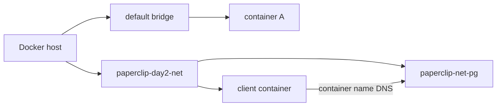

# 5교시: Docker network 기본

## 실습 확인 기록

| 명령/확인 | 설명 | 결과 |
|---|---|---|
| `docker network ls` | 전체 network 목록 확인 |  |
| `docker network create paperclip-day2-net` | custom bridge network 생성 |  |
| `docker run -d --name paperclip-net-pg --network paperclip-day2-net -e POSTGRES_PASSWORD=postgres -v paperclip-pg16-data:/var/lib/postgresql/data postgres:16` | custom network에 DB container 실행 |  |
| `docker network inspect paperclip-day2-net --format "{{ json .Containers }}"` | network에 붙은 container 확인 |  |
| `docker ps --filter name=paperclip-net-pg` | container 실행 상태 확인 |  |

## 확인 질문 답변

| 질문 | 답변 |
|---|---|
| default bridge와 custom bridge의 차이는? | default bridge는 Docker가 자동으로 만드는 network다. custom bridge는 사용자가 직접 만들며, 같은 network 안의 container끼리 container name으로 통신할 수 있다. default bridge에서는 container name DNS가 동작하지 않는다. |
| `--network` 옵션 없이 container를 실행하면 어떻게 되는가? | default bridge network에 자동으로 연결된다. custom network에서의 container name DNS 실습이 되지 않는다. |
| host port publish 없이도 container가 실행될 수 있는가? | 그렇다. `-p` 없이도 container는 정상 실행된다. host에서 접근할 수 없을 뿐이고, 같은 Docker network 안의 container끼리는 통신 가능하다. |
| `docker network inspect`에서 확인할 것은? | network 이름, driver, 붙어 있는 container 목록이다. IP 자체보다 어떤 container가 같은 network 안에 있는지를 확인하는 데 집중한다. |

## notes

### Docker 기본 network 3개

Docker를 설치하면 자동으로 생성되는 network다. `docker network ls`로 항상 확인할 수 있다.

| NAME | DRIVER | 설명 |
|---|---|---|
| `bridge` | bridge | default bridge. `--network` 없이 실행한 container가 자동으로 붙는 곳 |
| `host` | host | container가 host(내 MacBook) network를 그대로 사용. port publish 없이 host port에 직접 붙음 |
| `none` | null | network 없음. 완전히 격리된 container가 필요할 때 사용 |

`docker network create`로 만드는 custom network는 이 3개와 별개로 추가된다.

### Docker network 종류

| 종류 | 설명 | container name DNS |
|---|---|---|
| default bridge | Docker 자동 생성, `docker run` 기본값 | 동작 안 함 |
| custom bridge | 사용자가 직접 생성 | 동작함 |
| host | container가 host network를 그대로 사용 | — |
| none | network 없음 | — |

실습에서는 custom bridge를 만들어 container name으로 통신하는 것이 핵심이다.

### custom bridge 구조



같은 custom network 안에 있어야 container name으로 통신할 수 있다. 다음 교시의 DNS 실습은 이 구조가 전제다.

### host port 없이 container 통신

```
host에서 접근  →  -p (port publish) 필요
같은 Docker network의 container끼리  →  -p 없이 container name으로 통신 가능
```

`-p`가 없다고 container가 잘못 실행된 게 아니다. 내부 통신 전용으로 실행한 것이다.

### `docker exec -it` — container 안에 직접 들어가기

`docker exec -it <container> bash`로 실행 중인 container 안에 직접 들어가서 명령을 실행하거나 파일을 수정할 수 있다.

```bash
docker exec -it paperclip-net-pg bash  # container 안으로 진입
exit                                    # 나올 때
```

`-it` 옵션은 두 개가 합쳐진 것이다.

| 옵션 | 의미 |
|---|---|
| `-i` | interactive — 표준 입력(stdin)을 열어둔다. 키보드로 입력할 수 있게 한다. |
| `-t` | tty — 터미널처럼 동작하게 한다. 프롬프트(`#`, `$`)가 보이게 한다. |

둘 중 하나만 쓰면 터미널처럼 동작하지 않거나 입력이 안 된다. 보통 세트로 `-it`를 쓴다.

### VPC subnet과 Docker network 비교

Docker network 개념은 클라우드의 VPC(Virtual Private Cloud) subnet 구조와 유사하다.

**Public subnet** — Internet Gateway가 붙어 있어서 인터넷 직접 통신 가능

**Private subnet** — Internet Gateway 없음. 인터넷 연결하려면 별도 구성 필요

```
Private subnet → NAT Gateway (Public subnet에 위치) → Internet
```

| 구분 | Internet Gateway | NAT Gateway | VPC Endpoint |
|---|---|---|---|
| 방향 | 양방향 | 아웃바운드만 | AWS 서비스 전용 |
| 위치 | Public subnet | Public subnet | — |
| 비용 | 무료 | 유료 | 유료 |

- **NAT Gateway** — Private subnet에서 인터넷으로 나가는 것(아웃바운드)만 가능. 패키지 설치, 업데이트 등에 사용
- **VPC Endpoint** — 인터넷을 거치지 않고 AWS 서비스(S3, ECR 등)에 직접 연결

Docker custom bridge 안의 container가 `-p` 없이 외부에서 접근 못 하는 것처럼, Private subnet도 외부에서 직접 접근이 막혀 있는 구조다.

### 흔한 오해

- `--network` 없이 실행해도 나중에 network를 붙일 수 있다 → `docker network connect`로 나중에 붙일 수 있지만, 처음부터 `--network`로 지정하는 것이 명확하다.
- host port가 없으면 container가 잘못된 것이다 → host port는 외부 접근용이고 내부 통신에는 필요 없다.
- default bridge에서도 container name으로 통신된다 → default bridge에서는 container name DNS가 동작하지 않는다. custom bridge를 써야 한다.

## Blocker Log

| 증상 | 확인한 것 | 시도한 것 |
|---|---|---|
| | | |
