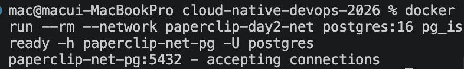
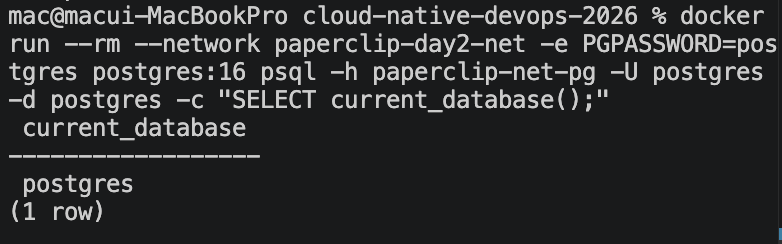
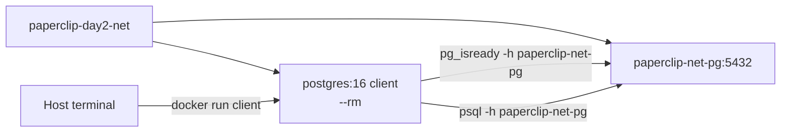
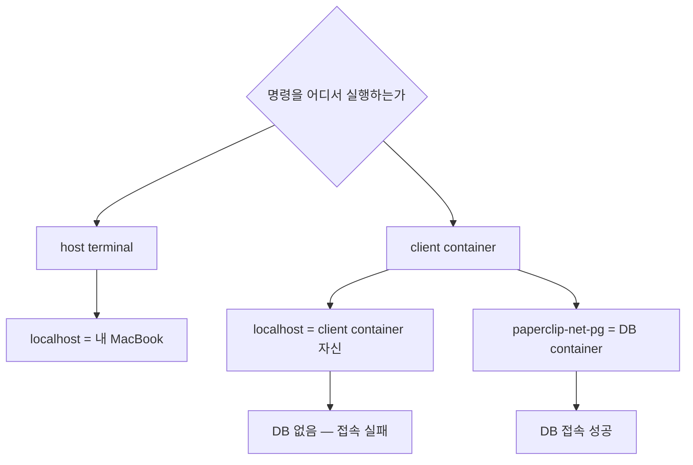
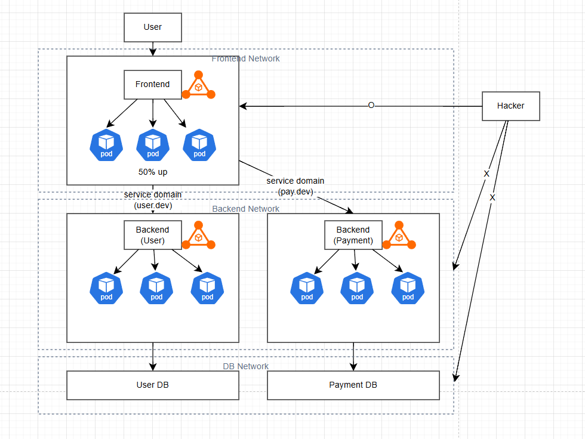

# 6교시: container name DNS와 DB client container

## 실습 확인 기록

| 명령/확인 | 설명 | 결과 |
|---|---|---|
| `docker run --rm --network paperclip-day2-net postgres:16 pg_isready -h paperclip-net-pg -U postgres` | 일회성 client container로 DB readiness 확인 |  |
| `docker run --rm --network paperclip-day2-net -e PGPASSWORD=postgres postgres:16 psql -h paperclip-net-pg -U postgres -d postgres -c "SELECT current_database();"` | container name으로 DB 접속 및 SQL 실행 |  |

> **참고** 실습 명령 원본은 `-d paperclip`이나, `paperclip-net-pg` container 실행 시 `-e POSTGRES_DB=paperclip`을 누락해 `paperclip` DB가 없는 상태였다. 강사님 실습에 맞춰 `-d postgres`(기본 DB)로 변경해서 진행했다.

## 확인 질문 답변

| 질문 | 답변 |
|---|---|
| container name DNS란? | 같은 custom bridge network 안에서 container name을 host 주소처럼 사용할 수 있는 것이다. Docker가 내부적으로 container name을 IP로 변환해준다. |
| client container 안에서 `-h localhost`를 쓰면 어떻게 되는가? | client container 자신을 가리키므로 DB 접속이 실패한다. `-h paperclip-net-pg`처럼 DB container name을 써야 한다. |
| `--rm` 옵션은 무슨 의미인가? | container가 종료되면 자동으로 삭제된다. 일회성 명령 실행 후 container가 남지 않도록 할 때 사용한다. |
| host port publish 없이 DB에 접속할 수 있는 이유는? | 같은 Docker network 안의 container끼리는 host port 없이 container name과 container port로 직접 통신하기 때문이다. |

## notes

### 전체 실행 순서

```
1. docker volume create paperclip-pg16-data     # volume 먼저 만들고
2. docker network create paperclip-day2-net     # network 만들고
3. docker run ... -v paperclip-pg16-data:...    # container 실행할 때 연결
              ... --network paperclip-day2-net
```

| 단계 | 비유 |
|---|---|
| volume 생성 | 외장하드 구입 |
| network 생성 | 공유 와이파이 개설 |
| container run | 노트북 켜면서 외장하드 꽂고 와이파이 연결 |

volume과 network는 container와 독립적으로 먼저 존재하고, container는 실행될 때 그것들에 연결된다. 그래서 container를 삭제해도 volume과 network는 남아 있다.

### container name DNS 구조



host terminal이 직접 DB에 붙는 게 아니라, 같은 Docker network에 일회성 client container를 띄워 DB 이름으로 접근하는 구조다.

### localhost 오해



`localhost`는 항상 내 컴퓨터를 뜻하지 않는다. 명령을 실행하는 위치에 따라 달라진다.

| 실행 위치 | localhost가 가리키는 것 |
|---|---|
| host terminal | 내 MacBook |
| client container 안 | client container 자신 |

### `--rm` 옵션

```bash
docker run --rm --network paperclip-day2-net postgres:16 pg_isready -h paperclip-net-pg -U postgres
```

`--rm`을 붙이면 명령이 끝난 뒤 container가 자동 삭제된다. 일회성 도구로 사용할 때 container 잔여물이 남지 않아 편리하다.

| 옵션 | container 종료 후 |
|---|---|
| `--rm` 있음 | 자동 삭제 |
| `--rm` 없음 | stopped 상태로 남음 (`docker ps -a`에 보임) |

### 서비스 전체 아키텍처



### 실제 운영에서 추가되는 것들

위 아키텍처는 최소 구성이다. 실제 운영에서는 더 붙는다.

| 구성 요소 | 역할 |
|---|---|
| 로드밸런서 | Frontend 앞에서 트래픽 분산 |
| CDN | 정적 파일 캐싱 |
| API Gateway | Backend 앞에서 인증, 라우팅 |
| 캐시 (Redis) | DB 앞에서 자주 쓰는 데이터 캐싱 |
| 메시지 큐 (Kafka, SQS) | 서비스 간 비동기 통신 |
| 모니터링 (Prometheus, Grafana) | 서버 상태 추적 |
| 로그 수집 (ELK) | 로그 통합 관리 |
| Replica DB | DB 읽기 분산 |

### 오토스케일링과 DB 구성

**백엔드/프론트 — 오토스케일링**

CPU, 메모리, 요청 수 등을 기준으로 서버를 자동으로 늘렸다 줄인다. container 환경에서는 Kubernetes의 HPA(Horizontal Pod Autoscaler)가 이 역할을 한다.

```
트래픽 증가 → CPU 50~60% 초과 → 서버 자동 추가
트래픽 감소 → 서버 자동 축소
```

**DB — 기본적으로 하나, 구성에 따라 다름**

| 구성 | 설명 |
|---|---|
| Single | 기본. DB 서버 하나 |
| Primary - Replica | Primary(쓰기) + Replica(읽기) 분리. 읽기 트래픽을 Replica로 분산 |
| Sharding | 데이터를 여러 DB에 나눠서 저장. 대규모 서비스에서 사용 |

Sharding은 게임 회사에서 많이 사용한다. 유저 ID 등을 해시키로 변환해서 어느 DB에 저장할지 결정한다.

```
해시키 → db1
해시키 → db2
해시키 → db3
```

DB를 여러 대로 늘리기 어려운 이유는 **데이터 정합성** 때문이다. 백엔드는 서버를 10대로 늘려도 각자 독립적으로 요청을 처리할 수 있지만, DB는 여러 대가 같은 데이터를 동시에 수정하면 충돌이 생긴다. 그래서 쓰기는 Primary 하나로 몰고, 읽기만 Replica로 분산하는 방식을 많이 쓴다.

### Pod이란

Pod은 서버가 아니라 **서버 위에서 실행되는 container 묶음**이다. Kubernetes에서 container를 감싸는 가장 작은 배포 단위다.

```
서버 (EC2 등 — Node)
    └── Docker
            └── Pod
                    └── Container (실제 앱)
```

| 개념 | 설명 |
|---|---|
| 서버 (Node) | 실제 물리/가상 머신. EC2 같은 것 |
| Pod | Kubernetes에서 container를 감싸는 가장 작은 배포 단위. 서버 위에서 실행됨 |
| Container | 실제 앱이 돌아가는 곳 |

보통 Pod 하나에 container 하나가 들어가는 경우가 많고, 사이드카 패턴처럼 여러 container가 한 Pod에 들어가는 경우도 있다.

**오토스케일링 레벨 2가지**

| 레벨 | 설명 |
|---|---|
| Pod 스케일링 (HPA) | 같은 서버 위에서 Pod(container)를 더 띄움 — 강의에서 다루는 내용 |
| Node 스케일링 (Cluster Autoscaler) | 서버 자체를 추가함 |

### 흔한 오해

- host port가 없으면 DB에 접속할 수 없다 → 같은 Docker network 안에서는 host port 없이 container name으로 접속 가능하다.
- container name 오타가 나도 에러 메시지로 알 수 있다 → DNS lookup 실패 또는 connection refused가 나므로 container name을 먼저 확인한다.
- `--rm`을 붙이면 volume도 같이 삭제된다 → `--rm`은 container만 삭제한다. named volume은 삭제되지 않는다.

## Blocker Log

| 증상 | 확인한 것 | 시도한 것 |
|---|---|---|
| | | |
