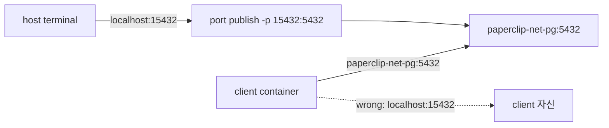

# 7교시: port publish와 network 차이

## 실습 확인 기록

| 명령/확인 | 설명 | 결과 |
|---|---|---|
| `docker run -d --name paperclip-net-pg --network paperclip-day2-net -e POSTGRES_PASSWORD=postgres -p 15432:5432 -v paperclip-pg16-data:/var/lib/postgresql/data postgres:16` | network + port publish 함께 실행 |  |
| `docker ps --filter name=paperclip-net-pg` | PORTS 컬럼에서 `15432->5432` 확인 |  |
| `PGPASSWORD=postgres psql -h localhost -p 15432 -U postgres -d postgres -c "SELECT 1;"` | host terminal에서 published port로 접속 |  |
| `docker run --rm --network paperclip-day2-net -e PGPASSWORD=postgres postgres:16 psql -h paperclip-net-pg -U postgres -d postgres -c "SELECT 1;"` | client container에서 container name으로 접속 |  |

## 확인 질문 답변

| 질문 | 답변 |
|---|---|
| host에서 DB에 접속할 때와 container에서 접속할 때 host/port가 다른 이유는? | 접속 위치가 다르기 때문이다. host terminal에서는 published port(`localhost:15432`)를 사용하고, 같은 Docker network의 container에서는 container name과 container port(`paperclip-net-pg:5432`)를 사용한다. |
| `docker ps` PORTS 컬럼에서 `0.0.0.0:15432->5432/tcp`의 의미는? | host의 모든 네트워크 인터페이스(0.0.0.0) 15432 포트로 들어온 요청을 container 내부 5432로 전달한다는 뜻이다. |
| client container 안에서 `localhost:15432`로 접속하면 어떻게 되는가? | client container 자신의 15432 포트를 찾으므로 실패한다. container 안에서는 container name과 container port를 써야 한다. |
| port publish와 Docker network는 함께 쓸 수 있는가? | 그렇다. 같은 container에 `-p`와 `--network`를 동시에 지정할 수 있다. host 접근과 container 간 통신을 둘 다 지원하게 된다. |

## notes

### 접속 위치에 따른 host/port 선택

```
접속 위치를 먼저 결정한다
    ├── host terminal  →  -h localhost -p 15432
    └── 같은 Docker network의 container  →  -h paperclip-net-pg -p 5432
```

| 접속 위치 | host | port |
|---|---|---|
| host terminal | `localhost` | `15432` (published port) |
| 같은 network의 container | `paperclip-net-pg` (container name) | `5432` (container port) |

### host port와 container port 흐름



host에서 들어가는 경로와 container끼리 통신하는 경로가 다르다. `15432`는 host 쪽 입구이고, `5432`는 PostgreSQL container 내부 service port다.

### failure drill — 잘못된 접속 시도

| 잘못된 접속 | 실제 결과 |
|---|---|
| container 안에서 `localhost:15432` | client 자신의 포트를 찾으므로 실패 |
| container 안에서 `localhost:5432` | client 자신의 5432를 찾으므로 실패 |
| host에서 `paperclip-net-pg:5432` | Docker network 내부 주소라 host에서 접근 불가 |

### 흔한 오해

- port publish를 하면 container 간 통신도 published port를 써야 한다 → container끼리는 container name과 container port를 사용한다. published port는 host 접근용이다.
- `-p` 없이는 container가 아무것도 못 한다 → container 간 내부 통신은 `-p` 없이도 가능하다.
- host port와 container port가 같아야 한다 → 달라도 된다. `-p 15432:5432`처럼 host port와 container port를 다르게 지정할 수 있다.

## Blocker Log

| 증상 | 확인한 것 | 시도한 것 |
|---|---|---|
| | | |
