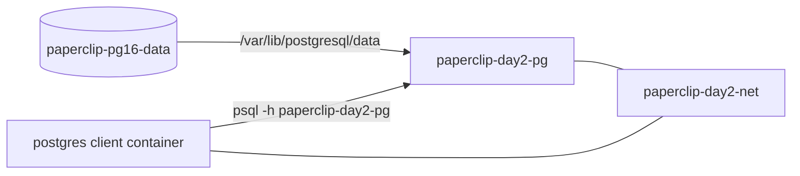
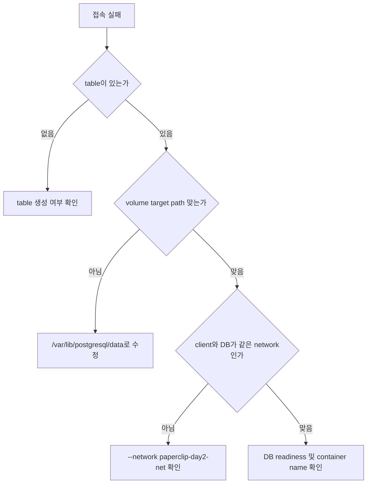

# 8교시: storage/network 통합 실험

## 실습 확인 기록

| 명령/확인 | 설명 | 결과 |
|---|---|---|
| `docker volume ls` && `docker network ls` | volume과 network 존재 확인 |  |
| `docker run -d --name paperclip-day2-pg --network paperclip-day2-net -e POSTGRES_PASSWORD=postgres -v paperclip-pg16-data:/var/lib/postgresql/data postgres:16` | volume + network 동시 연결해서 DB container 실행 |  |
| `docker run --rm --network paperclip-day2-net -e PGPASSWORD=postgres postgres:16 psql -h paperclip-day2-pg -U postgres -d postgres -c "SELECT current_database();"` | client container로 DNS 접속 확인 |  |
| `docker stop paperclip-day2-pg` && `docker rm paperclip-day2-pg` | container 삭제 (volume/network는 남음) |  |
| `docker run -d --name paperclip-day2-pg-v2 --network paperclip-day2-net -e POSTGRES_PASSWORD=postgres -v paperclip-pg16-data:/var/lib/postgresql/data postgres:16` | 같은 volume + network로 새 container 실행 |  |
| `docker run --rm --network paperclip-day2-net -e PGPASSWORD=postgres postgres:16 psql -h paperclip-day2-pg-v2 -U postgres -d postgres -c "SELECT current_database();"` | v2 container에 DNS 접속 확인 |  |

## 확인 질문 답변

| 질문 | 답변 |
|---|---|
| container를 교체해도 데이터가 남는 이유는? | 데이터가 named volume에 저장되어 있기 때문이다. container를 삭제해도 volume은 남고, 새 container가 같은 volume을 mount하면 데이터를 이어받는다. |
| container 교체 후 client가 새 container name으로 접속해야 하는 이유는? | container name이 바뀌면 DNS도 바뀐다. `paperclip-day2-pg`가 삭제되면 그 이름으로 접속할 수 없고, 새 이름 `paperclip-day2-pg-v2`로 접속해야 한다. |
| cleanup 시 container, volume, network 중 기본 삭제 대상은? | container와 network다. volume은 데이터가 들어있을 수 있으므로 의도적으로 확인 후 삭제한다. |
| 통합 실습에서 SELECT가 실패할 때 확인 순서는? | table 생성 여부 → volume target path → client와 DB가 같은 network인지 → DB readiness 순서로 확인한다. |

## notes

### Day 2 통합 구조



volume은 data lifecycle을 분리하고, network는 통신 경계를 만든다. DB container는 두 경계 위에서 실행된다.

### 통합 실패 분석 흐름



통합 실습에서 실패하면 한 번에 모든 것을 의심하지 않는다. 순서대로 좁혀간다.

### cleanup audit

```bash
docker stop paperclip-day2-pg-v2 || true
docker rm paperclip-day2-pg-v2   || true
docker network rm paperclip-day2-net || true
# volume은 데이터 확인 후 결정
# docker volume rm paperclip-pg16-data
```

| 대상 | 기본 처리 | 이유 |
|---|---|---|
| container | 삭제 | 다시 만들 수 있는 실행 단위 |
| network | 삭제 | 다음 실습에서 새로 만들 수 있음 |
| volume | 보류 | 데이터가 들어있을 수 있음 |

### Day 2 핵심 정리

| 개념 | 명령 | 없어지는 것 |
|---|---|---|
| container 삭제 | `docker rm` | process + writable layer |
| volume 삭제 | `docker volume rm` | 데이터 (복구 불가) |
| network 삭제 | `docker network rm` | 통신 경로 |

### htop — 서버 리소스 모니터링

`htop`은 Linux 서버에서 CPU, 메모리, 프로세스 상태를 실시간으로 보는 모니터링 도구다. 기본 `top` 명령보다 보기 편한 인터페이스를 제공한다.

```bash
htop
```

| 항목 | 설명 |
|---|---|
| CPU 바 | 코어별 사용률 |
| Mem 바 | 메모리 사용량 |
| 프로세스 목록 | PID, CPU%, MEM%, 명령어 |
| Load average | 1분/5분/15분 평균 부하 |

오토스케일링 기준인 CPU 50~60%를 실제로 눈으로 확인할 때 사용한다.

### `&&` vs `&`

| 연산자 | 동작 | 설명 |
|---|---|---|
| `&&` | 순차 실행 | 앞 명령이 **성공해야** 뒤 명령 실행 |
| `&` | 백그라운드 실행 | 앞 명령을 백그라운드로 보내고 뒤 명령을 **동시에** 실행 |

```bash
docker volume ls && docker network ls
# volume ls 성공 → network ls 실행
# volume ls 실패 → network ls 실행 안 함

docker volume ls & docker network ls
# volume ls를 백그라운드로 보내고
# network ls를 바로 실행 (두 명령이 동시에 돌아감)
# 출력이 섞일 수 있음
```

실습에서는 `&&`를 쓴다. 순서대로 확인하고 앞 명령이 실패하면 멈추는 게 안전하기 때문이다.

### 흔한 오해

- container를 교체하면 DNS도 자동으로 바뀐다 → container name이 바뀌면 DNS도 바뀐다. client 접속 명령의 `-h` 값도 새 이름으로 바꿔야 한다.
- cleanup은 container만 지우면 된다 → network와 volume은 별도로 남는다. 다음 실습 전에 무엇을 남길지 판단한다.
- volume이 있으면 어떤 container에서도 같은 데이터에 접근할 수 있다 → 같은 volume name과 올바른 target path로 mount해야 한다.

## Blocker Log

| 증상 | 확인한 것 | 시도한 것 |
|---|---|---|
| | | |
