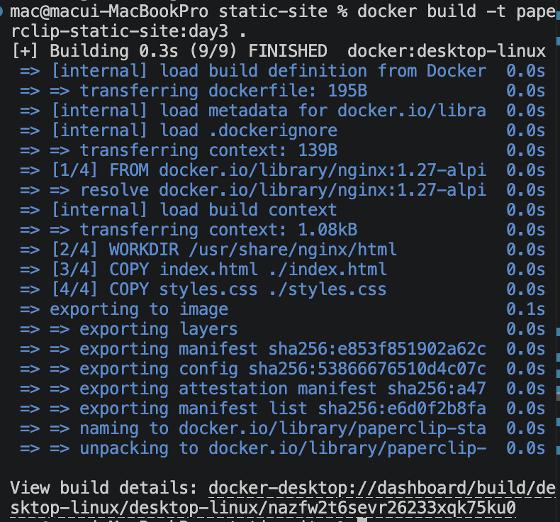
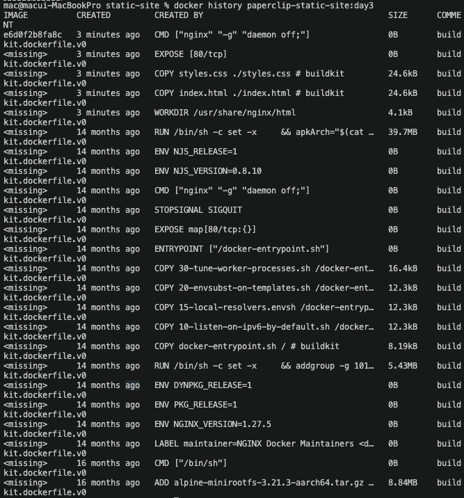

# 2교시: Dockerfile contract - FROM, WORKDIR, COPY, EXPOSE, CMD

## 실습 확인 기록

| 명령 | 설명 | 결과 |
|---|---|---|
| `docker build -t paperclip-static-site:day3 .` | static-site Dockerfile로 image build |  |
| `docker history paperclip-static-site:day3` | build한 image의 layer 흔적 확인 |  |

## 확인 질문 답변

| 질문 | 답변 |
|---|---|
| `FROM`은 무엇을 정하는가? | image의 출발점(base image)을 정한다. 여기서는 nginx가 이미 설치된 image 위에 HTML/CSS만 얹는다. |
| `WORKDIR`의 `./`는 host 현재 directory인가? | 아니다. `WORKDIR` 이후의 `./`는 image 안의 directory다. `WORKDIR /usr/share/nginx/html`이면 `./index.html`은 image 안의 `/usr/share/nginx/html/index.html`이다. |
| `COPY`의 왼쪽과 오른쪽은 각각 어디 기준인가? | 왼쪽은 build context 기준 host 파일, 오른쪽은 image 안의 target path다. |
| `EXPOSE 80`이 있으면 host에서 바로 접근 가능한가? | 아니다. `EXPOSE`는 container port를 문서화할 뿐이다. host에서 접근하려면 `docker run -p 18083:80`처럼 port publish가 필요하다. |
| `CMD ["nginx", "-g", "daemon off;"]`에서 `daemon off;`가 필요한 이유는? | container는 main process가 살아 있어야 계속 실행된다. nginx는 기본적으로 background로 동작하려 하기 때문에 `daemon off;`로 foreground 실행을 유지해야 container가 바로 종료되지 않는다. |
| COPY 단계에서 build가 실패하면 어떤 문제인가? | runtime 문제가 아니라 build 단계 문제다. `index.html`이 build context 안에 없거나 파일명이 다르면 이 단계에서 실패한다. |

## notes

### Dockerfile 확인 명령

```bash
cat Dockerfile
# 또는 길 경우 앞부분만
sed -n '1,120p' Dockerfile
```

`sed -n '1,120p'`는 파일의 1~120번째 줄만 출력하는 명령이다.
- `-n` : 기본 출력을 끄고 명시적으로 지정한 줄만 출력
- `'1,120p'` : 1번째 줄부터 120번째 줄까지 print

실습 Dockerfile은 6줄짜리라 `cat Dockerfile`로 충분하다. Dockerfile이 길어질 경우 앞부분만 빠르게 확인하는 용도로 쓴다.

### 실습 대상 Dockerfile (`week2/day3/labs/static-site/`)

```dockerfile
FROM nginx:1.27-alpine
WORKDIR /usr/share/nginx/html
COPY index.html ./index.html
COPY styles.css ./styles.css
EXPOSE 80
CMD ["nginx", "-g", "daemon off;"]
```

### instruction별 운영 해석

| instruction | 역할 | 주의 |
|---|---|---|
| `FROM nginx:1.27-alpine` | base image 지정 | tag는 content 보장 안 함, 재현성 필요 시 digest 함께 확인 |
| `WORKDIR /usr/share/nginx/html` | image 안 기준 directory 설정 | directory가 없으면 자동 생성됨, 이후 모든 instruction의 기준이 됨 |
| `COPY index.html ./index.html` | build context의 파일을 image 안으로 복사 | `./`는 host가 아닌 WORKDIR 기준 image 안 경로. 파일이 build context에 없으면 이 단계에서 build 실패 |
| `COPY styles.css ./styles.css` | CSS 파일 복사 | 없어도 HTTP 200은 나오지만 페이지가 깨짐 |
| `EXPOSE 80` | container port 문서화 | host port publish 아님, `docker run -p`로 별도 지정 필요 |
| `CMD ["nginx", "-g", "daemon off;"]` | container 시작 시 실행할 main process | 잘못되면 build 성공해도 container가 바로 종료됨 |

### 실패 위치 구분

| 실패 증상 | 원인 위치 | 확인 방법 |
|---|---|---|
| `COPY` 단계에서 build 실패 | build 단계 — 파일이 build context에 없음 | build context 경로와 파일명 확인 |
| container가 바로 종료됨 | run 단계 — CMD 문제 | `docker ps -a`, `docker logs` |
| HTTP 200이 안 나옴 | run 단계 — port publish 누락 | `docker run -p 18083:80` 확인 |
| 페이지가 깨짐 | build 단계 — CSS COPY 누락 | `docker history`에서 COPY 흔적 확인 |
| `index.html`을 COPY에서 빼고 build | 이상한 에러 화면 (nginx 기본 에러 또는 403/404) | `index.html`이 image 안에 없어서 nginx가 보여줄 파일이 없음 |
| `styles.css`를 COPY에서 빼고 build | 페이지는 뜨지만 디자인이 깨진 화면 | HTML은 있지만 CSS가 없어서 스타일이 적용 안 됨 |

### `docker history` 기대 패턴

build 후 `docker history paperclip-static-site:day3`에서 아래 흔적이 보여야 한다:

```text
COPY styles.css ./styles.css
COPY index.html ./index.html
WORKDIR /usr/share/nginx/html
EXPOSE map[80/tcp:{}]
CMD ["nginx" "-g" "daemon off;"]
```

`COPY index.html`, `COPY styles.css` 흔적이 있어야 앱 파일이 image에 들어갔다는 증거다.

### cache 단위 vs 무효화 전파

1교시에서 "캐시가 깨지는 순간부터 아래를 전부 새로 실행한다"고 했고, 인포그래픽에는 "캐시는 각 명령 단위로 사용한다"고 쓰여 있다. 모순처럼 보이지만 둘 다 맞다.

- **각 명령 단위로 캐싱** → cache의 **단위**가 instruction 하나하나라는 뜻
- **깨지는 순간부터 아래 전부 재실행** → cache miss가 발생했을 때의 **결과**

layer는 아래 layer 위에 쌓이는 구조이기 때문에, 한 instruction의 cache가 깨지면 그 위에 쌓인 모든 layer의 cache key가 자동으로 무효화된다.

```
FROM    ✓ cache hit
WORKDIR ✓ cache hit
COPY    ✗ 파일 바뀜 → cache miss 발생
RUN     ✗ COPY 결과가 달라졌으니 이전 cache가 의미 없음
CMD     ✗ 마찬가지
```

인포그래픽은 **어떻게 캐싱하는지(단위)**, 1교시 설명은 **한 곳이 깨졌을 때 어떻게 되는지(전파)**를 각각 설명한 것이다.

### build 결과가 이상할 때

파일을 수정했는데 cache hit로 처리되어 변경이 반영 안 된 채로 build가 통과될 수 있다. 이때는 `--no-cache`로 강제 전체 재빌드한다.

```bash
docker build --no-cache -t paperclip-static-site:day3 .
```

### nginx 외부 접근 - network 레벨 이야기

container 안 nginx는 기본적으로 외부에서 접근 불가다. `-p 18083:80`은 host 레벨에서 포트를 여는 것이고, 그 host 자체가 private network 안에 있으면 인터넷에서 접근 자체가 안 된다.

```
인터넷 (외부)
    ↓ network 레벨 허용 필요
host (서버)
    ↓ -p 18083:80 (port publish)
container 안 nginx (:80)
```

외부에서 내부 서비스에 접근하는 방법:

| 방법 | 설명 | 주로 쓰는 상황 |
|---|---|---|
| VPC + VPN | 회사 내부 network에 VPN으로 접속 | 사내 인프라 (강사님 회사 방식) |
| Public IP + Security Group | cloud VM에 public IP 붙이고 방화벽에서 포트 허용 | AWS EC2, GCP VM 등 가장 단순한 방법 |
| Load Balancer | ALB/NLB 같은 로드밸런서를 앞에 두고 내부 서비스로 연결 | 실제 운영, 트래픽 분산 필요할 때 |
| Reverse Proxy | nginx/Traefik을 앞단에 두고 내부 서비스로 라우팅 | 도메인 기반 라우팅, HTTPS 처리 |
| Tunnel (ngrok 등) | 로컬/내부 서비스를 외부에 임시로 노출 | 개발 중 테스트, 데모용 |
| SSH Port Forwarding | SSH 통해 원격 서버 포트를 로컬로 끌어옴 | 서버 직접 접근 가능할 때 |

실습에서는 localhost라서 신경 안 써도 되지만, 실제 운영에서는 이 network 레벨이 하나 더 있다.

### 강사님 경험담 - cache 배신

**GitHub Actions cache**: Docker layer cache를 저장하는 방식 사용 중, 오래된 cache가 쌓여서 수정한 코드가 반영 안 된 채로 배포됨. GitHub 저장소 Actions → Caches에서 캐시 삭제 또는 cache key 전략 변경으로 해결.

→ cache는 빠르게 해주지만 쌓이면 배신한다. build 결과가 이상하면 cache를 먼저 의심한다.

## Blocker Log

| 증상 | 확인한 것 |
|---|---|
| | |
