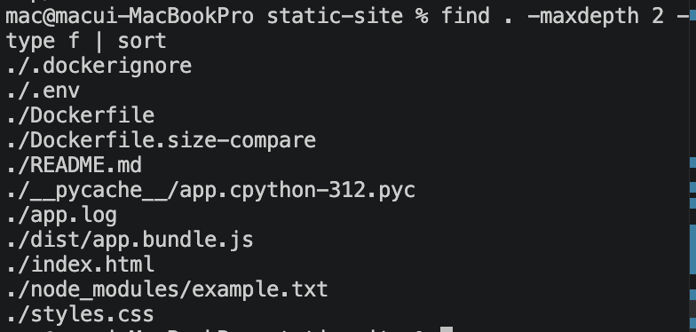
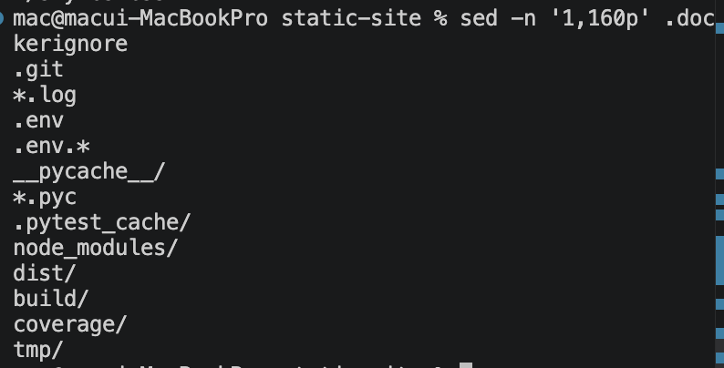
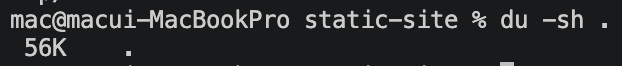

# 3교시: Build context gate - image에 들어가면 안 되는 것 막기

## 실습 확인 기록

| 명령 | 설명 | 결과 |
|---|---|---|
| `find . -maxdepth 2 -type f \| sort` | build context 안 파일 목록 확인 |  |
| `sed -n '1,160p' .dockerignore` | .dockerignore 내용 확인 |  |
| `du -sh .` | build context 전체 크기 확인 |  |

## 확인 질문 답변

| 질문 | 답변 |
|---|---|
| `docker build -t name .`에서 `.`은 무엇인가? | build context다. Docker가 build 입력으로 사용할 directory를 지정한다. Dockerfile의 `COPY`는 이 context 안에서만 source를 찾는다. |
| `.dockerignore`와 `.gitignore`의 차이는? | `.gitignore`는 Git commit에서 제외할 파일을 정하고, `.dockerignore`는 Docker build context에서 제외할 파일을 정한다. 겹치는 경우가 많지만 별도로 관리해야 한다. |
| `.env`가 build context에 있으면 왜 위험한가? | `COPY . .`를 쓰면 `.env` 안의 password, token, API key가 image에 그대로 들어간다. image를 push하면 secret이 외부에 노출된다. |
| `COPY failed`가 나면 먼저 확인할 것은? | Dockerfile의 source path와 build context 위치다. 파일이 context 밖에 있거나 파일명이 다르면 이 에러가 난다. |
| `node_modules`를 `.dockerignore`에 넣는 이유는? | host OS에 묶인 dependency가 image 안으로 들어가면 OS 환경이 달라 실행이 안 될 수 있다. image 안에서 별도로 install하는 것이 올바른 방식이다. |

## notes

### `du` 명령어

`du`는 disk usage의 약자로 파일이나 directory의 용량을 확인하는 명령어다.

```bash
du -sh .
# 예시 출력: 48K    .
```

- `-s` : summary — 하위 항목 하나하나 말고 전체 합계만 출력
- `-h` : human-readable — 바이트 대신 KB, MB, GB 단위로 출력
- `.` : 현재 directory

비슷한 명령어 구분:

| 명령어 | 용도 |
|---|---|
| `du` | 특정 파일/directory가 얼마나 차지하는지 |
| `df` | 디스크 전체에서 남은 공간이 얼마인지 |

### build context 개념

`docker build -t name .`에서 `.`은 장식이 아니라 build context다. Docker는 이 directory 안의 파일 전체를 daemon에 전달하고, `COPY`는 이 context 안에서만 source를 찾는다.

build context가 만드는 두 가지 위험:
- 필요한 파일이 context 밖에 있으면 → `COPY failed`
- `.env`, log, cache 등이 context 안에 있으면 → image에 들어가거나 build가 느려짐

### `.dockerignore` 패턴별 제외 이유

| 패턴 | 제외 이유 |
|---|---|
| `.git` | Git history는 image 실행에 불필요, context만 커짐 |
| `*.log` | 이전 실행 흔적이 image에 들어가면 안 됨 |
| `.env`, `.env.*` | password, token, API key 등 secret 포함 가능 |
| `__pycache__/`, `*.pyc`, `.pytest_cache/` | Python 실행/테스트 cache, 재생성 가능 |
| `node_modules/` | host OS에 묶인 dependency, image 안에서 별도 install 필요 |
| `dist/`, `build/` | build 결과물, 의도적으로 복사할 때만 포함 |
| `coverage/` | test coverage 결과물, 실행에 불필요 |
| `tmp/` | 임시 파일, 재현성과 보안에 방해 |

### 위험 재현 → 정리 흐름

```bash
# 위험 파일 생성
mkdir -p __pycache__ node_modules dist build coverage tmp
printf "DO_NOT_COMMIT_TOKEN=example" > .env
printf "debug log" > app.log

# context 확인
find . -maxdepth 2 -type f | sort

# 정리
rm -rf .env app.log __pycache__ node_modules dist build coverage tmp
```

### `.dockerignore` 효과가 안 보일 때

`printf`로 만든 placeholder 파일은 수십 바이트 수준이라, nginx base image(~22MB) 대비 MB 단위에서 차이가 표시되지 않는다. `.dockerignore`의 효과는 실제로 무거운 파일이 있을 때 의미가 있다.

실제 차이를 확인하려면:

```bash
# 50MB짜리 파일 생성
dd if=/dev/zero of=node_modules/big.bin bs=1M count=50

# .dockerignore에서 node_modules/ 제외 해제 후 build
docker build -t paperclip-static-site:test-big .

# 크기 비교
docker images paperclip-static-site
```

수업에서 `printf`로 만든 파일은 개념 확인용이고, 실제 `node_modules`나 `dist`는 수백 MB가 되는 경우가 많다.

### 판단 기준

| 증상 | 첫 확인 위치 |
|---|---|
| `COPY failed` | Dockerfile source path와 build context 위치 |
| image/context가 과하게 큼 | `du -sh .`, `.dockerignore` 누락 패턴 |
| secret 포함 위험 | `.env`, `.env.*`, token, credential 파일 존재 여부 |
| build가 느림 | context 크기와 dependency/cache 포함 여부 |

## Blocker Log

| 증상 | 확인한 것 |
|---|---|
| | |
