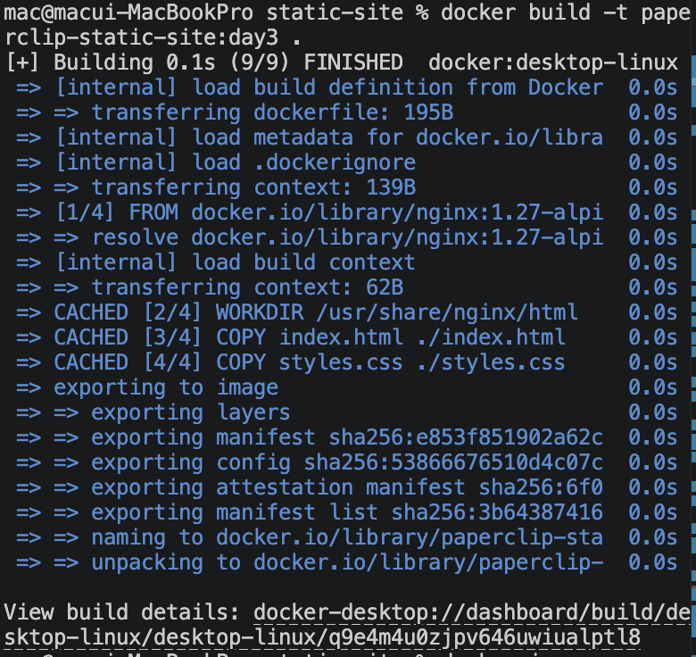
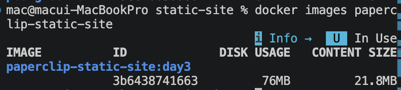
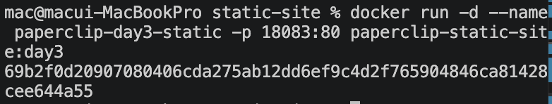
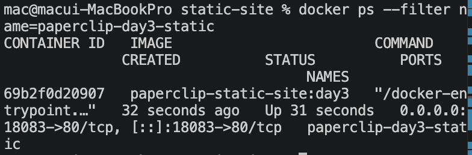
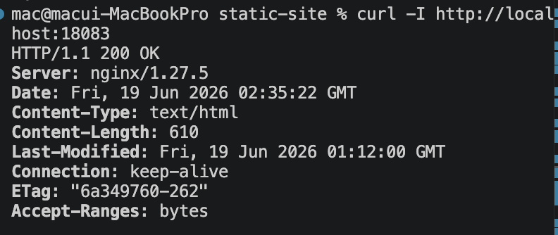
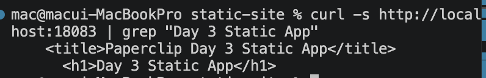
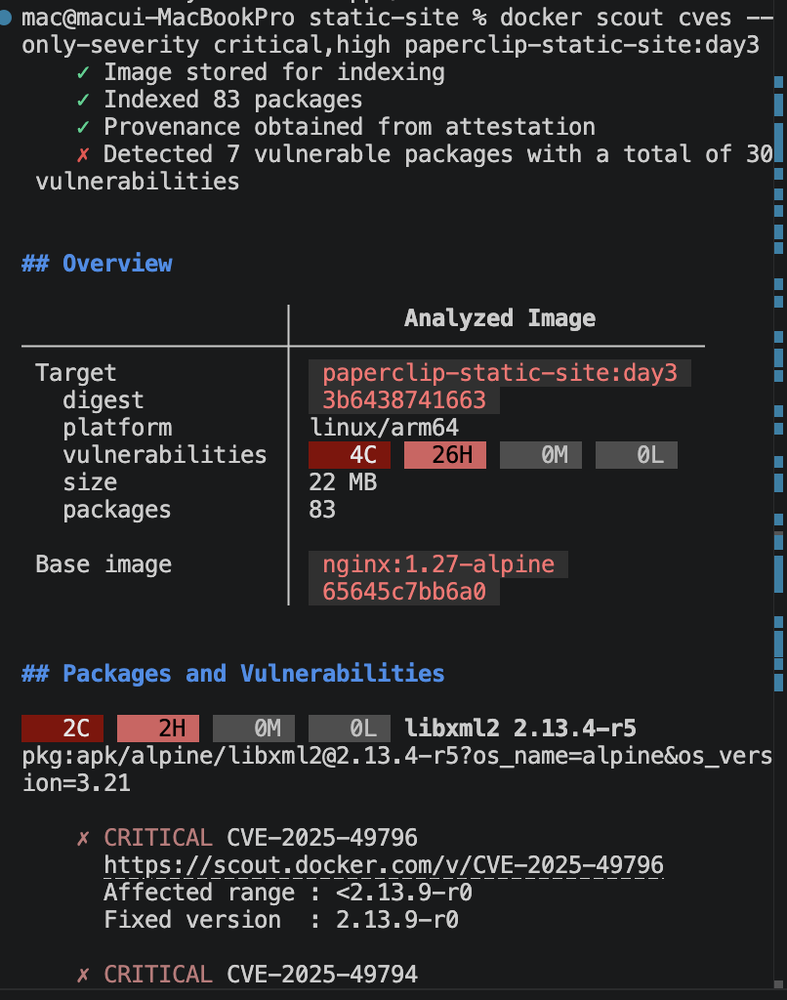

# 4교시: Build/run/verify/scan - 안전한 image 후보 만들기

## 실습 확인 기록

| 명령 | 설명 | 결과 |
|---|---|---|
| `docker build -t paperclip-static-site:day3 .` | image build |  |
| `docker images paperclip-static-site` | 생성된 image 확인 |  |
| `docker run -d --name paperclip-day3-static -p 18083:80 paperclip-static-site:day3` | container 실행 |  |
| `docker ps --filter name=paperclip-day3-static` | container 상태 확인 |  |
| `curl -I http://localhost:18083` | HTTP 응답 코드 확인 |  |
| `curl -s http://localhost:18083 \| grep "Day 3 Static App"` | HTML 본문 확인 |  |
| `docker scout cves --only-severity critical,high paperclip-static-site:day3` | 취약점 점검 |  |

## 확인 질문 답변

| 질문 | 답변 |
|---|---|
| build 성공이 서비스 정상을 의미하는가? | 아니다. build 성공은 image artifact가 만들어졌다는 뜻이다. 서비스 정상은 run/verify까지 해야 알 수 있다. |
| `docker ps`에서 `Up`이면 서비스 정상인가? | 아니다. process가 살아 있다는 뜻이다. `curl`로 HTTP 응답까지 확인해야 사용자가 접근 가능한 정상 상태다. |
| `curl -I`와 `curl -s`의 차이는? | `-I`는 HTTP header만 출력(응답 코드 확인용), `-s`는 응답 본문을 출력(HTML 내용 확인용)이다. |
| scout CVE가 나오면 무조건 실패인가? | 아니다. severity, fix 가능성, base image 대안, 예외 사유를 판단해야 한다. critical/high가 있으면 base image 변경, package update, 예외 기록 중 하나를 선택한다. |
| scout가 실행되지 않는 환경이면? | 미수행 사유를 기록하는 것도 운영 기록이다. scan blocker로 남긴다. |
| `docker scout cves`는 container가 실행 중이어야 하는가? | 아니다. image만 있으면 된다. container가 꺼져 있어도, registry에만 있는 image도 분석 가능하다. |
| `--only-severity critical,high`는 무슨 옵션인가? | severity 필터다. 옵션 없이 실행하면 모든 severity(critical/high/medium/low)가 전부 출력된다. 실무에서는 CVE가 수십~수백 개 나오는 경우도 있어 이 옵션으로 당장 조치가 필요한 것만 먼저 본다. |

## notes

### 단계별 역할 구분

| 단계 | 역할 | 성공 기준 |
|---|---|---|
| `docker build` | image artifact 생성 | image가 local store에 존재 |
| `docker run` | image에서 container process 시작 | `docker ps`에서 `Up` |
| verify (`curl`) | 사용자 관점 정상 확인 | `HTTP/1.1 200 OK` + HTML 본문 |
| scan (`docker scout`) | image 보안 위험 확인 | critical/high CVE 없음 또는 조치/예외 기록 |

### 기대 결과 패턴

```text
docker ps  →  STATUS: Up, PORTS: 0.0.0.0:18083->80/tcp
curl -I    →  HTTP/1.1 200 OK
curl -s    →  <h1>Day 3 Static App</h1>
```

### 안전한 image 후보 기준

| 단계 | 성공 증거 | 실패하면 먼저 볼 곳 |
|---|---|---|
| build | image 생성 | Dockerfile, build context |
| run | container `Up` | image tag, container name, `docker logs` |
| verify | `HTTP/1.1 200 OK` + HTML 문구 | `-p host:container`, app port |
| scan | critical/high CVE 없음 또는 조치/예외 기록 | base image tag, Scout output |
| handoff | 실행 명령, 확인 URL, scan 결과가 README에 남음 | lab README 누락 |

### image와 build 기록은 별도로 저장된다

image를 삭제해도 Docker Desktop Builds 탭에 기록이 남는 것은 정상이다. image와 build 기록은 저장 위치가 다르다.

| 대상 | 설명 | 삭제 방법 |
|---|---|---|
| image | 실행 가능한 artifact (`docker images`에서 보이는 것) | `docker image rm <image>` |
| build cache | layer cache (build 재사용을 위해 저장) | `docker builder prune` |
| build history | BuildKit이 남기는 build 실행 기록 (Builds 탭) | Docker Desktop Builds 탭에서 수동 삭제 또는 `docker buildx prune` |

### CVE란

CVE(Common Vulnerabilities and Exposures)는 공개된 보안 취약점에 붙이는 표준 식별자다. `CVE-2024-1234` 형식으로 번호가 붙고, 전 세계에서 같은 번호로 해당 취약점을 추적한다.

severity(심각도) 분류:

| severity | 의미 |
|---|---|
| critical | 즉시 조치 필요 |
| high | 빠른 조치 필요 |
| medium | 일정 안에 조치 |
| low | 모니터링 수준 |

### CVE 발견 시 대응 순서

1. **코드/설정 수준 조치** — 취약한 package를 직접 업데이트하거나 해당 기능을 쓰지 않도록 수정
2. **base image 버전업** — 위 조치로 안 되면 더 최신 버전으로 올려 이미 패치된 버전 사용
3. **예외 기록** — 그래도 남으면 "우리 서비스에서 해당 기능 미사용으로 영향 없음" 등 사유를 남기고 배포 판단

버전업을 먼저 시도하지 않는 이유: base image를 올리면 다른 의존성이 깨질 수 있어 코드 수준 조치를 먼저 시도하는 게 안전하다.

### `docker scout` 사용 여부 확인

```bash
docker scout version || true
```

설치/로그인이 안 된 경우 scan 미수행 사유를 Blocker Log에 남긴다.

## Blocker Log

| 증상 | 확인한 것 |
|---|---|
| Dockerfile에서 FROM 버전 수정 후 build했는데 이전 버전으로 build됨 | `cat Dockerfile` 확인 → 파일에 반영이 안 돼 있었음. 해당 탭 포커스 상태로 저장했고 미저장 표시도 없었으나 반영 안 됨. 원인 불명. `sed -i '' 's/nginx:1.27-alpine/nginx:1.31-alpine/' Dockerfile`로 터미널에서 직접 수정해서 해결 |
