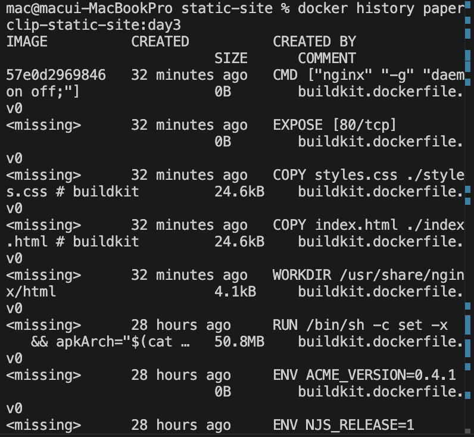
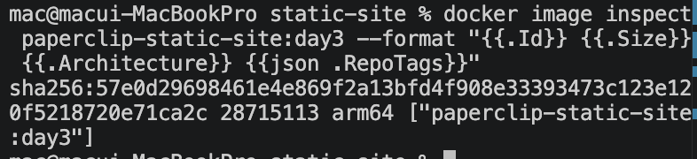
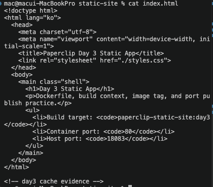
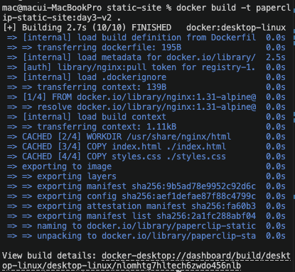
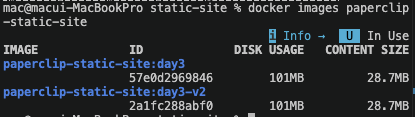
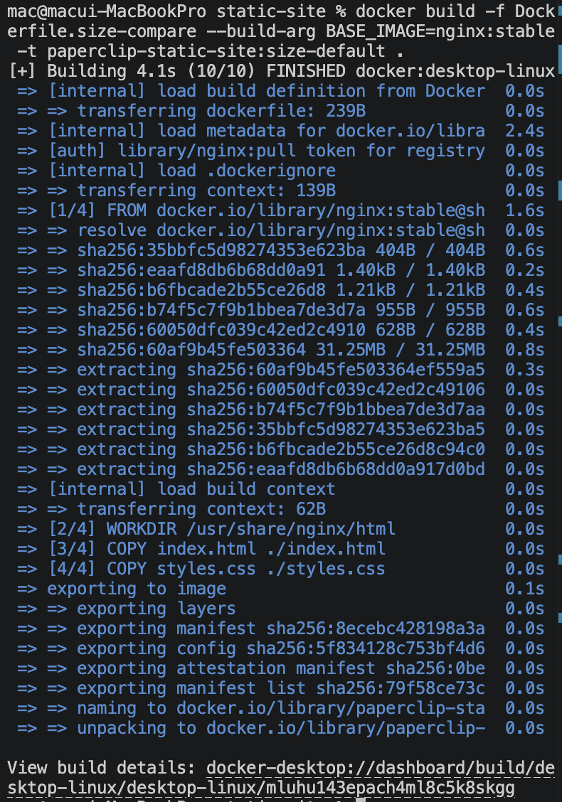
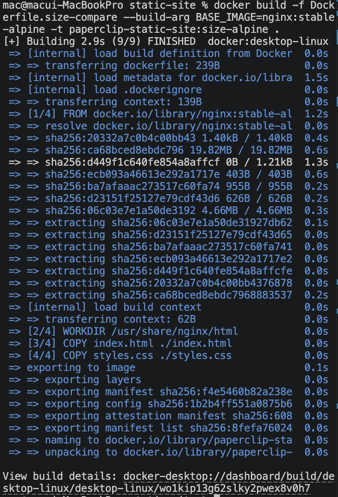
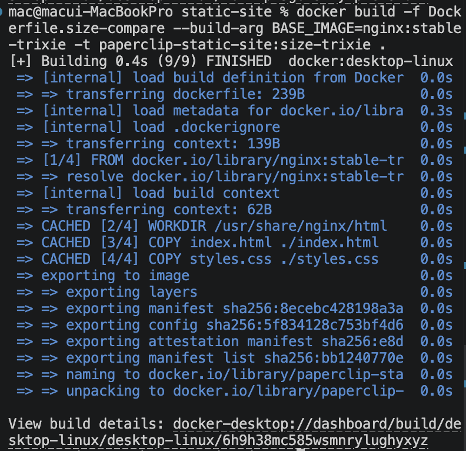
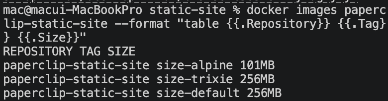

# 5교시: Layer/cache/size evidence - 이미지 크기와 rebuild 비용 설명하기

## 실습 확인 기록

### 실습 1: 현재 image evidence

| 명령 | 설명 | 결과 |
|---|---|---|
| `docker history paperclip-static-site:day3` | layer 흔적 확인 |  |
| `docker image inspect paperclip-static-site:day3 --format "{{.Id}} {{.Size}} {{.Architecture}} {{json .RepoTags}}"` | image 메타데이터 확인 |  |

### 실습 2: source 변경 후 cache 확인

| 명령 | 설명 | 결과 |
|---|---|---|
| `printf '\n<!-- day3 cache evidence -->\n' >> index.html` | index.html 수정 |  |
| `docker build -t paperclip-static-site:day3-v2 .` | 변경 후 rebuild |  |
| `docker images paperclip-static-site` | v2 image 확인 |  |

### 실습 3: base image별 size 비교

| 명령 | 설명 | 결과 |
|---|---|---|
| `docker build -f Dockerfile.size-compare --build-arg BASE_IMAGE=nginx:stable -t paperclip-static-site:size-default .` | default build |  |
| `docker build -f Dockerfile.size-compare --build-arg BASE_IMAGE=nginx:stable-alpine -t paperclip-static-site:size-alpine .` | alpine build |  |
| `docker build -f Dockerfile.size-compare --build-arg BASE_IMAGE=nginx:stable-trixie -t paperclip-static-site:size-trixie .` | trixie build |  |
| `docker images paperclip-static-site --format "table {{.Repository}}	{{.Tag}}	{{.Size}}"` | size 비교 |  |

### size 비교 기록

| Variant | Base image | Local image size | 해석 |
|---|---|---|---|
| default | `nginx:stable` | | 일반 계열 기준 |
| alpine | `nginx:stable-alpine` | | 보통 가장 작음 |
| trixie | `nginx:stable-trixie` | | Debian trixie 기반 |

## 확인 질문 답변

| 질문 | 답변 |
|---|---|
| `CACHED`가 뜨는 조건은? | 이전 build에서 같은 instruction + 같은 파일 내용으로 만든 layer가 있을 때 재사용된다. |
| index.html을 수정하면 어느 layer부터 다시 실행되는가? | `COPY index.html` layer부터 다시 실행된다. 그 아래 `COPY styles.css`, `CMD`도 모두 새로 실행된다. |
| image size가 커지면 어떤 문제가 생기는가? | build/push/pull 시간 증가, network/registry storage 비용 증가, 새 node에서 deploy 속도 저하, security scan 시간 증가 및 취약점 표면 확대. |
| Alpine이 항상 정답인가? | 아니다. 필요한 패키지, glibc/musl 차이, 디버깅 편의성, 보안 정책, 조직 표준을 함께 봐야 한다. |
| `docker image inspect`의 Size는 어떤 단위인가? | byte 단위다. `docker images`의 SIZE 컬럼은 사람이 읽기 쉽게 변환된 값이고, inspect는 raw byte값이다. |

## notes

### image size가 커질 때 생기는 문제

| 영향 | 내용 |
|---|---|
| Build speed | context와 layer가 커지면 build/export 시간이 늘어남 |
| Push/Pull time | CI runner, registry, Kubernetes node 간 전송 시간 증가 |
| Network cost | registry에서 여러 환경으로 pull 시 egress 비용 증가 |
| Storage cost | registry, local disk, node image cache 사용량 증가 |
| Deploy speed | 새 node/runner가 image pull하는 시간이 길어져 rollout 느려짐 |
| Security scan | 패키지가 많을수록 scan 시간 증가, 취약점 표면 확대 |

### cache 동작 요약 (1교시/2교시 연결)

```
FROM    ✓ cache hit  (base image 변경 없음)
WORKDIR ✓ cache hit
COPY index.html  ✗ 파일 바뀜 → cache miss
COPY styles.css  ✗ 위가 깨지면 아래도 재실행
CMD     ✗ 마찬가지
```

- **cache 단위**: instruction 하나하나가 독립적인 cache entry
- **무효화 전파**: 한 곳이 깨지면 그 아래는 전부 새로 실행

### base image 선택 기준

| 계열 | 특징 | 고려 사항 |
|---|---|---|
| `nginx:stable` | Debian 기반, 일반 계열 | 크지만 패키지 호환성 좋음 |
| `nginx:stable-alpine` | Alpine 기반, 가장 작음 | musl libc, 일부 패키지 호환 문제 가능 |
| `nginx:stable-trixie` | Debian trixie 기반 | 최신 Debian, 패키지/운영 표준 확인 필요 |

Alpine은 작지만 항상 정답이 아니다. glibc가 필요한 패키지, 디버깅 편의성, 조직 표준을 함께 고려한다.

### Mac(arm64) vs 서버(amd64) - multi-platform build

Apple Silicon Mac에서 build하면 `arm64` image가 만들어진다. 대부분의 서버/클라우드(AWS EC2, GCP 등)는 `amd64`라서 그냥 push하면 서버에서 실행이 안 된다.

`docker image inspect`에서 `arm64`가 뜨는 이유가 이것이다.

해결 방법은 **multi-platform build + manifest index**다:

```bash
docker buildx build \
  --platform linux/amd64,linux/arm64 \
  -t username/app:latest \
  --push .
```

registry에 manifest index(인덱스) 하나가 만들어지고, 그 안에 플랫폼별 image가 들어간다. pull할 때 Docker가 자기 architecture에 맞는 걸 자동으로 선택한다.

```
username/app:latest  ← manifest index
  ├── linux/amd64   ← 서버에서 pull 시 선택됨
  └── linux/arm64   ← Mac에서 pull 시 선택됨
```

배포할 때 이 인덱스 설정을 따로 해줘야 Mac에서 build한 image가 서버에서도 정상 실행된다.

### AWS Lambda와 Docker image

Lambda는 요청이 왔을 때만 실행되고 끝나면 꺼지는 서버리스 실행 환경이다. 일반 서버(EC2, nginx)는 요청이 없어도 24시간 켜놔야 하지만, Lambda는 실행된 횟수만큼만 비용이 나온다.

| 구분 | 일반 서버 | Lambda |
|---|---|---|
| 비용 | 24시간 실행 비용 | 호출 횟수만큼만 |
| 스케일 | 수동 또는 별도 설정 | 자동 스케일 아웃 |
| 적합한 상황 | 상시 트래픽 | 이벤트 기반, 불규칙 트래픽 |

Docker image로도 Lambda 배포가 가능하다. AWS가 Lambda용 base image를 공식 제공한다.

```dockerfile
FROM public.ecr.aws/lambda/python:3.12
COPY app.py .
CMD ["app.handler"]
```

**콜드 스타트 문제**: 한동안 호출이 없다가 요청이 오면 image를 새로 띄우는 시간이 걸려 첫 응답이 느리다. image가 크면 콜드 스타트가 더 길어지기 때문에 Lambda에서 image size 최적화가 특히 중요하다.

## Blocker Log

| 증상 | 확인한 것 |
|---|---|
| | |
