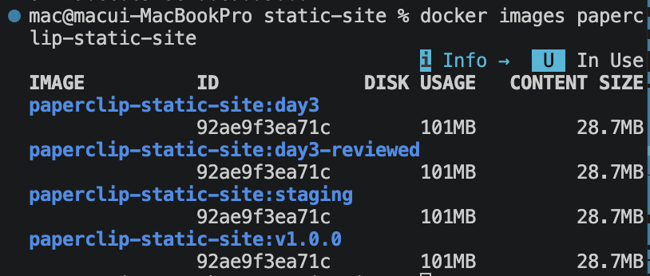
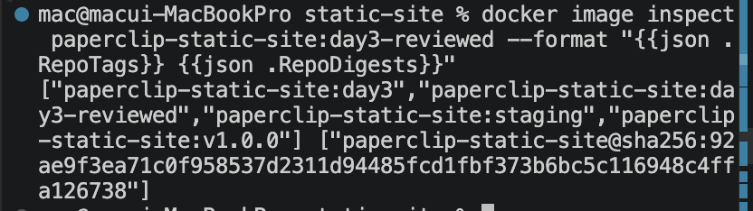

# 7교시: Tag/digest/registry gate - image 공유 기준 판단하기

## 실습 확인 기록

| 명령 | 설명 | 결과 |
|---|---|---|
| `docker tag paperclip-static-site:day3 paperclip-static-site:day3-reviewed` | 검수 완료 tag 추가 |  |
| `docker tag paperclip-static-site:day3 paperclip-static-site:v1.0.0` | version tag 추가 |  |
| `docker tag paperclip-static-site:day3 paperclip-static-site:staging` | 환경 tag 추가 |  |
| `docker images paperclip-static-site` | 전체 tag 목록 확인 |  |
| `docker image inspect paperclip-static-site:day3-reviewed --format "{{json .RepoTags}} {{json .RepoDigests}}"` | tag와 digest 확인 |  |

## 확인 질문 답변

| 질문 | 답변 |
|---|---|
| tag와 digest의 차이는? | tag는 사람이 붙인 이름표로 같은 tag가 다른 image를 가리킬 수 있다. digest는 registry 기준 content 식별자로 내용이 바뀌면 값도 바뀐다. |
| `docker tag`는 새 build를 만드는가? | 아니다. 같은 image에 reference(이름표)를 하나 더 추가하는 것이다. image id는 동일하다. |
| `latest` tag를 운영 배포 기준으로 쓰면 안 되는 이유는? | latest는 계속 덮어써질 수 있어서 어떤 build인지 흐려진다. rollback 기준이 없어진다. |
| local image에서 RepoDigests가 비어 있으면? | 오류가 아니다. registry에 push/pull된 적 없는 image의 정상 상태다. |
| push 전에 확인할 것은? | public/private 범위, secret 포함 여부, tag 의미, credential이 output에 남지 않는지 4가지다. |
| 같은 image에 tag를 여러 개 붙이는 이유는? | tag마다 목적이 다르다. `v1.0.0`은 앱 릴리즈, `sha-<short>`는 source 추적, `staging`은 현재 배포 환경을 각각 표현한다. |

## notes

### tag 적용 기준

| 기준 | 예시 | 적합한 상황 | 주의 |
|---|---|---|---|
| application version | `v1.4.2` | 웹 앱 릴리즈와 image를 맞출 때 | 회사마다 버전 정책이 다름 (semver, calendar, sprint 등) |
| environment | `dev`, `staging`, `prod` | 환경별 배포 흐름을 빠르게 볼 때 | 같은 tag가 계속 바뀌므로 재현성 기준으로 단독 사용 금지 |
| latest | `latest` | local demo나 기본 pull 편의 | 운영 배포 기준으로 쓰면 어떤 build인지 흐려짐 |
| build number | `build-128`, `ci-20260619-128` | CI 실행 번호와 image를 연결할 때 | 앱 version 없이 단독 사용하면 릴리즈 의미가 약함 |
| git sha | `sha-a1b2c3d` | source commit 추적과 rollback evidence | 사람이 읽기 어려워 version tag와 함께 쓰는 편이 좋음 |
| release candidate | `v1.4.2-rc.1` | QA, staging, pre-release 검증 | prod 승격 시 정식 version으로 이어졌는지 남겨야 함 |
| review/status | `day3-reviewed`, `scan-passed` | 수업/검수 상태 표시 | 시간이 지나면 사실과 달라질 수 있으므로 scan note와 함께 관리 |

### tag 선택 예시

| 상황 | 권장 tag 조합 | 이유 |
|---|---|---|
| 수업 실습 | `day3`, `day3-reviewed` | 학습 단계와 검수 상태를 빠르게 확인 |
| 웹앱 정식 릴리즈 | `v1.4.2`, `sha-<short>`, 필요 시 `prod` | 앱 버전/source/환경을 분리해서 추적 |
| staging 검증 | `v1.4.2-rc.1`, `sha-<short>`, `staging` | 정식 전 후보와 commit 추적 |
| CI 임시 build | `build-128`, `sha-<short>` | pipeline 결과와 source를 연결 |
| 운영 배포 | `v1.4.2` + digest pin | tag 가독성과 digest 재현성을 함께 확보 |

### Registry란

image를 저장하고 공유하는 창고다. `docker pull nginx` 할 때 nginx가 어디서 오는지가 registry다.

```text
내 컴퓨터                    Registry (Docker Hub)
docker build →  local image
docker push  →              → 저장
docker pull  ←              ← 다른 컴퓨터/서버/CI가 가져감
```

| Registry | 설명 |
|---|---|
| Docker Hub | 기본 public registry (`docker pull nginx`가 여기서 옴) |
| AWS ECR | AWS에서 쓰는 private registry |
| GitHub Container Registry | GitHub 연동 |
| 사내 private registry | 회사 내부용 |

### Digest란

image 내용물을 해시한 고유 식별자다. 내용이 1바이트라도 바뀌면 값이 달라진다.

```text
paperclip-static-site:day3     ← tag (사람이 붙인 이름, 덮어쓸 수 있음)
sha256:a3f2b1c9d8e7...         ← digest (내용이 같으면 항상 같은 값)
```

```bash
# tag로 pull → 언제 받느냐에 따라 내용이 다를 수 있음
docker pull nginx:latest

# digest로 pull → 항상 동일한 image 보장
docker pull nginx@sha256:a3f2b1c9...
```

local에서 build한 image는 registry에 push하기 전까지 digest가 비어 있는 게 정상이다.

### `docker tag` 동작 원리

```bash
docker tag paperclip-static-site:day3 paperclip-static-site:v1.0.0
docker tag paperclip-static-site:day3 paperclip-static-site:sha-demo123
docker tag paperclip-static-site:day3 paperclip-static-site:staging
```

세 tag가 모두 같은 image id를 가리킨다. 새 build가 아니라 reference 추가다.
중요한 것은 tag가 많다는 사실이 아니라 **각 tag의 의미를 설명할 수 있는가**다.

### inspect에서 RepoTags가 여러 개 나오는 이유

```text
image id: abc123...
  ├── paperclip-static-site:day3
  ├── paperclip-static-site:day3-reviewed
  ├── paperclip-static-site:staging
  └── paperclip-static-site:v1.0.0
```

`docker tag`는 새 image를 만드는 게 아니라 같은 image에 이름표를 추가하는 것이다. 그래서 그 중 어느 tag를 inspect해도 해당 image에 붙은 **모든 tag 목록**이 나온다.

`docker images`로 봐도 4줄이 나오지만 IMAGE ID가 전부 동일하다.

digest도 하나만 나오는 이유가 같다. tag가 몇 개든 image 내용이 같으면 content 기반인 digest는 하나다.

### push gate 체크리스트

```text
1. public/private repository 범위를 설명할 수 있는가?
2. .dockerignore와 context 점검으로 secret 포함 위험을 줄였는가?
3. tag가 앱 버전 / 환경 / 빌드 출처 / 검수 상태 중 무엇을 표현하는지 설명할 수 있는가?
4. password/token/MFA가 README, screenshot, terminal output에 남지 않는가?
5. version tag는 웹 애플리케이션의 실제 릴리즈 버전과 맞는가?
```

push 자체보다 **push해도 되는 image인지 판단하는 gate**가 더 중요하다.
registry는 공유를 쉽게 하지만 실수도 공개한다.

### 판단 기준

| 항목 | 좋은 상태 |
|---|---|
| tag | `v1.0.0`, `sha-<short>`, `staging`, `day3-reviewed`처럼 목적이 보임 |
| version | image tag가 웹 애플리케이션 릴리즈 버전과 연결됨 |
| latest | 편의 tag로만 쓰고 운영 재현성 기준으로 단독 사용하지 않음 |
| env tag | 현재 배포 대상임을 알되 불변 version으로 착각하지 않음 |
| digest | registry에서 content 식별 기준으로 확인 가능 |
| push | gate 통과 시 선택, 아니면 local tag까지만 수행 |

### Jira 백로그

Jira는 티켓(할 일) 관리 도구고, 백로그(Backlog)는 "언젠가는 해야 하는데 지금 당장은 아닌 것들"을 쌓아두는 목록이다.

```text
Sprint (이번 주/2주 안에 할 것)
  └── 진행 중, 완료 등으로 움직임

Backlog (나중에 할 것)
  └── 우선순위 낮거나 아직 시작 안 한 것들 대기
```

| 활동 | 설명 |
|---|---|
| 스프린트 계획 | 백로그에서 이번 주 할 것을 꺼내 Sprint로 올림 |
| 백로그 처리 | 급하지 않은 건 쌓아두고 다음 스프린트에 처리 |
| 백로그 정리 (grooming) | 주기적으로 오래된 것 삭제하거나 우선순위 재조정 |

"한가할 때 처리"보다는 **주기적으로 우선순위를 재검토**해서 스프린트에 넣는 게 맞는 운영 방식이다.

## Blocker Log

| 증상 | 확인한 것 |
|---|---|
| | |
