# Session 09 Challenge: 3-Tier Image Delivery and Runtime Evidence

## Architecture

| Tier | Container | Image | Network | 역할 |
|---|---|---|---|---|
| Frontend | `paperclip-weekend-front` | 직접 build | `paperclip-weekend-front-net` | `index.html`, `styles.css` 제공, backend로 proxy |
| Backend | `paperclip-weekend-back` | 직접 build | `front-net` + `back-net` | Node.js hello world API, DB network 확인 |
| Database | `paperclip-weekend-db` | `postgres:16` | `paperclip-weekend-back-net` | PostgreSQL 16, named volume 사용 |

```text
host → frontend (18090:80)
frontend → backend
backend → database
frontend -X→ database   (network 분리)
host -X→ database port  (host port publish 없음)
```

## 실습 경로

```bash
cd /Users/mac/KTCLOUD/cloud-native-devops-2026/week2/day3/labs/weekend-3tier-challenge
```

## 실습 확인 기록

### 1. Build

| 명령 | 설명 | 결과 |
|---|---|---|
| `docker build -t paperclip-weekend-frontend:optimized ./frontend` | frontend image build | X |
| `docker build -t paperclip-weekend-backend:optimized ./backend` | backend image build | X |
| `docker images 'paperclip-weekend-*'` | 생성된 image 확인 | 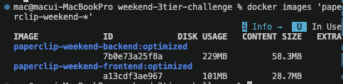 |

### 2. Network / Volume 생성

| 명령 | 설명 | 결과 |
|---|---|---|
| `docker network create paperclip-weekend-front-net` | frontend network 생성 | X |
| `docker network create paperclip-weekend-back-net` | backend network 생성 | X |
| `docker volume create paperclip-weekend-pgdata` | DB volume 생성 | X |
| `docker network ls \| grep paperclip-weekend` | network 목록 확인 | 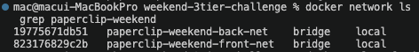 |
| `docker volume ls \| grep paperclip-weekend` | volume 목록 확인 | 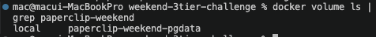 |

### 3. Run DB

| 명령 | 설명 | 결과 |
|---|---|---|
| `docker run -d --name paperclip-weekend-db --network paperclip-weekend-back-net -e POSTGRES_PASSWORD=weekend-only -e POSTGRES_DB=weekend -v paperclip-weekend-pgdata:/var/lib/postgresql/data postgres:16` | DB container 실행 | X |
| `docker logs paperclip-weekend-db --tail 40` | DB readiness 확인 | 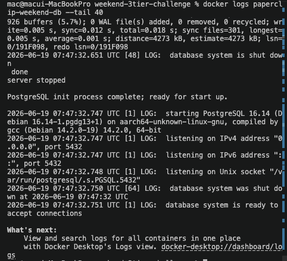 |

### 4. Run Backend

| 명령 | 설명 | 결과 |
|---|---|---|
| `docker run -d --name paperclip-weekend-back --network paperclip-weekend-back-net -e APP_ENV=weekend -e DB_HOST=paperclip-weekend-db -e DB_PORT=5432 paperclip-weekend-backend:optimized` | backend container 실행 | X |
| `docker network connect paperclip-weekend-front-net paperclip-weekend-back` | backend를 front-net에도 연결 | X |
| `docker logs paperclip-weekend-back --tail 40` | backend 기동 확인 | 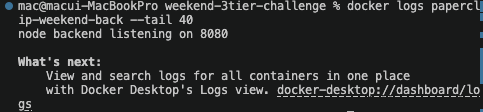 |

### 5. Run Frontend

| 명령 | 설명 | 결과 |
|---|---|---|
| `docker run -d --name paperclip-weekend-front --network paperclip-weekend-front-net -p 18090:80 paperclip-weekend-frontend:optimized` | frontend container 실행 | X |
| `curl -I http://localhost:18090` | HTTP 응답 확인 | 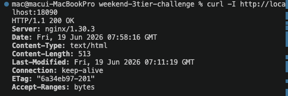 |
| `curl -s http://localhost:18090/api/info` | API 응답 확인 | 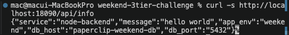 |

### 6. Network Evidence

| 명령 | 설명 | 결과 |
|---|---|---|
| `docker exec paperclip-weekend-front ping -c 2 paperclip-weekend-back` | frontend → backend 연결 확인 (`-c 2` : 2번만 보내고 멈춤. `0% packet loss`가 정상 증거) | 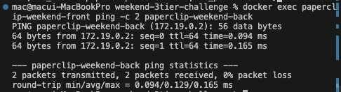 |
| `docker exec paperclip-weekend-front wget -q -O- http://paperclip-weekend-back:8080/health` | frontend → backend HTTP 확인 (`-q` : 진행 출력 숨김, `-O-` : 대문자 O, 응답 본문을 파일 대신 터미널에 출력) | 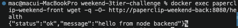 |
| `docker exec paperclip-weekend-back ping -c 2 paperclip-weekend-db` | backend → DB 연결 확인 | 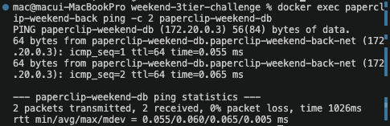 |
| `docker exec paperclip-weekend-back sh -c 'nc -z paperclip-weekend-db 5432 && echo db-port-open'` | backend → DB port 확인 (`nc -z` : 데이터 전송 없이 port가 열려 있는지만 확인. 성공하면 `&&` 뒤의 `echo db-port-open` 출력) | 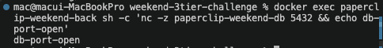 |
| `docker exec paperclip-weekend-front ping -c 2 paperclip-weekend-db \|\| true` | frontend → DB 실패 확인 | 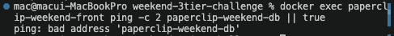 |

### 7. Volume Evidence

| 명령 | 설명 | 결과 |
|---|---|---|
| `docker volume inspect paperclip-weekend-pgdata` | volume 메타데이터 확인 | 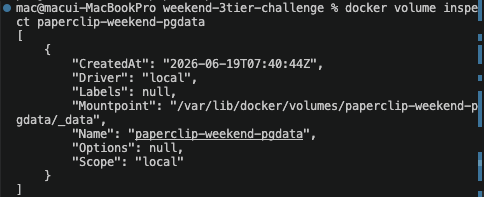 |
| `docker rm -f paperclip-weekend-db && docker run -d --name paperclip-weekend-db --network paperclip-weekend-back-net -e POSTGRES_PASSWORD=weekend-only -e POSTGRES_DB=weekend_changed -v paperclip-weekend-pgdata:/var/lib/postgresql/data postgres:16` | DB container 삭제 후 같은 volume으로 재실행 (`-f` : 실습이라 stop 없이 강제 삭제. DB 이름을 바꿔도 초기화가 다시 안 되는지 확인) | 밑에 결과 확인 |
| `docker logs paperclip-weekend-db --tail 40` | `Skipping initialization` 메시지 확인 (이 줄이 나오면 volume에 기존 데이터가 남아 있어 초기화를 건너뛴 것 → volume 지속성 증거) | 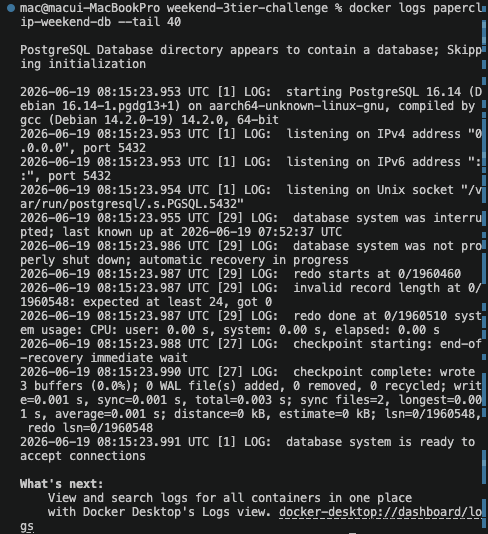 |

### 8. Logs / Troubleshooting

| 명령 | 설명 | 결과 |
|---|---|---|
| `docker logs paperclip-weekend-front --tail 40` | frontend 로그 | 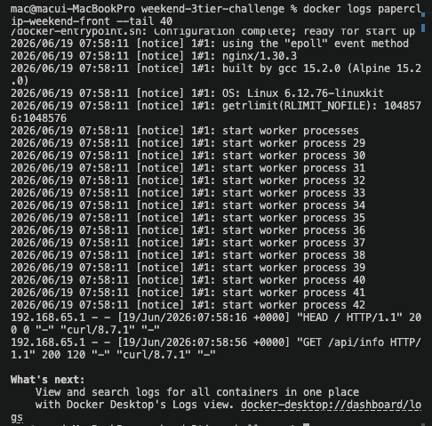 |
| `docker logs paperclip-weekend-back --tail 40` | backend 로그 | 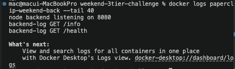 |
| `docker logs paperclip-weekend-db --tail 40` | DB 로그 | 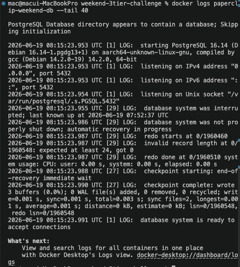 |
| `docker ps --filter name=paperclip-weekend` | 전체 container 상태 | 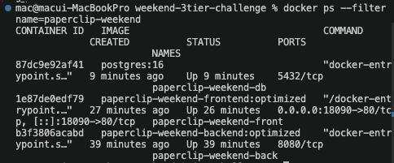 |
| `docker inspect paperclip-weekend-back --format '{{json .NetworkSettings.Networks}}'` | backend network 소속 상세 확인 | 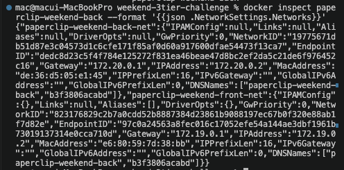 |
| `docker inspect paperclip-weekend-back --format '{{range $k, $v := .NetworkSettings.Networks}}{{$k}}{{"\n"}}{{end}}'` | backend 연결 network 이름만 추출 | 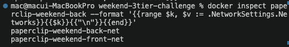 |

### 9. Build Speed / Image Size

| 명령 | 설명 | 결과 |
|---|---|---|
| `sed -n '1,120p' frontend/.dockerignore` | frontend context 위험 파일 제외 확인 | 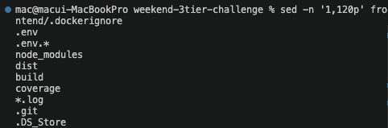 |
| `sed -n '1,120p' backend/.dockerignore` | backend context 위험 파일 제외 확인 | 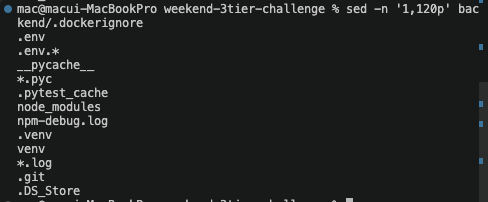 |
| `du -sh frontend backend` | context 크기 확인 | 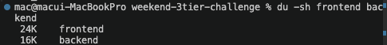 |
| `./scripts/measure-build.sh` | base image별 build 시간 / size 측정 | log가 길어서 밑에 표(Build size 비교 기록)로 정리함 |

#### Build size 비교 기록

| Target | Base image | First build (초) | Size | 선택 여부 | 이유 |
|---|---|---|---|---|---|
| frontend | `nginx:stable` | 3.9s | 256MB | X | alpine 대비 크기 2.5배, 빌드도 느림 |
| frontend | `nginx:stable-alpine` | 0.5s | 101MB | O | 가장 작고 빠름 |
| frontend | `nginx:stable-trixie` | 0.5s | 256MB | X | stable과 크기 동일, alpine 대비 이점 없음 |
| backend | `node:22` | 14.0s | 1.62GB | X | 너무 큼, 빌드도 가장 느림 |
| backend | `node:22-slim` | 5.7s | 348MB | X | alpine보다 크고 느림 |
| backend | `node:22-alpine` | 1.3s | 229MB | O | 가장 작고 빠름 |

## 확인 질문 답변

| 질문 | 답변 |
|---|---|
| backend가 두 network에 붙는 이유는? | frontend와 DB 사이의 중간 tier이기 때문이다. front-net으로 frontend 요청을 받고, back-net으로 DB에 접근한다. |
| frontend에서 DB에 직접 접근이 안 되는 이유는? | frontend는 front-net에만 있고 DB는 back-net에만 있어 같은 network에 속하지 않기 때문이다. |
| named volume을 쓰는 이유는? | container를 삭제해도 DB 데이터가 남아야 하기 때문이다. container filesystem은 container와 함께 사라진다. |
| `Skipping initialization` 메시지의 의미는? | 해당 volume에 이미 DB 데이터가 있어 초기화를 건너뛴다는 뜻이다. volume이 데이터를 유지하고 있다는 증거다. |
| DB에 host port를 publish하지 않는 이유는? | DB는 backend만 접근하면 되고 외부에 노출할 필요가 없기 때문이다. network 분리로 접근 경로를 제한하는 것이 보안 원칙이다. |
| image size가 커지면 생기는 문제는? | push/pull 시간 증가, registry storage 비용 증가, 새 node에서 deploy 속도 저하, 취약점 scan 시간 증가다. |

## notes

### frontend가 back-net에 들어가지 않아도 되는 이유

backend가 `front-net`에 붙으면 frontend → backend 통신이 됩니다. 같은 network 안에 있는 container끼리는 container 이름으로 서로 찾을 수 있기 때문이다.

```text
frontend → (front-net) → backend → (back-net) → DB
              ↑                         ↑
         여기만 같으면 됨          여기만 같으면 됨
```

frontend가 `paperclip-weekend-back:8080`으로 요청을 보내면 Docker가 같은 `front-net` 안에서 그 이름을 찾아준다. frontend가 back-net까지 들어갈 필요가 없다.

오히려 frontend가 `back-net`에도 들어가면 DB에도 직접 접근 가능해져서 network 분리 원칙이 깨진다.

### ping이란

네트워크에서 "야 거기 있어?" 하고 확인하는 명령이다.

```bash
ping -c 2 paperclip-weekend-db
```

| 출력 | 의미 |
|---|---|
| `2 packets transmitted, 2 received` | 연결됨 |
| `bad address 'paperclip-weekend-db'` | 연결 안 됨 (이름조차 못 찾음) |

### frontend → DB ping이 안 돼야 하는 이유

network를 분리한 목적이 "frontend가 DB에 직접 접근하지 못하게 막는 것"이기 때문이다.

```text
frontend (front-net)
    ↓ 가능
backend (front-net + back-net)
    ↓ 가능
DB (back-net)
```

frontend는 `front-net`에만 있고 DB는 `back-net`에만 있다. 같은 network에 없으면 container 이름으로 찾지도 못한다. 그래서 `bad address 'paperclip-weekend-db'`가 나오는 게 **정상이자 목표**다.

실제 운영에서도 같은 원칙이다. DB는 외부에서 절대 직접 접근 못하게 막고, 반드시 backend를 거쳐서만 접근하게 설계한다.

### RCA mini drill

| 증상 | 첫 확인 명령 | 가능한 원인 | 해결 |
|---|---|---|---|
| frontend `/api/info` → 502 | `docker logs paperclip-weekend-front` | backend가 front-net에 없음 | `docker network connect paperclip-weekend-front-net paperclip-weekend-back` |
| backend → DB 연결 실패 | `docker exec paperclip-weekend-back ping paperclip-weekend-db` | backend가 back-net에 없거나 container 이름 오류 | network connect 확인, container 이름 확인 |
| DB 데이터가 초기화됨 | `docker logs paperclip-weekend-db` | volume이 다른 것이거나 삭제된 상태 | `docker volume ls`로 volume 존재 확인 |
| build가 느리거나 image가 큼 | `./scripts/measure-build.sh` | base image 또는 context 크기 문제 | alpine/slim 비교, `.dockerignore` 점검 |

### Cleanup

```bash
# container 정리
docker rm -f paperclip-weekend-front paperclip-weekend-back paperclip-weekend-db || true

# network 정리
docker network rm paperclip-weekend-front-net paperclip-weekend-back-net || true

# volume은 데이터 reset이 필요할 때만 삭제
# docker volume rm paperclip-weekend-pgdata

# image는 필요할 때만 삭제
# docker image rm paperclip-weekend-frontend:optimized paperclip-weekend-backend:optimized
```

## Blocker Log

| 증상 | 확인한 것 |
|---|---|
| | |
