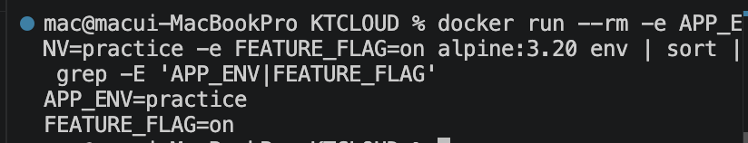
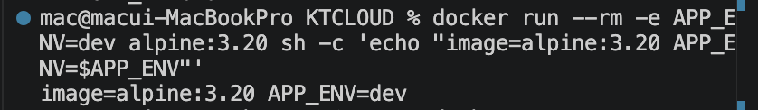
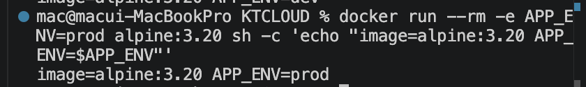
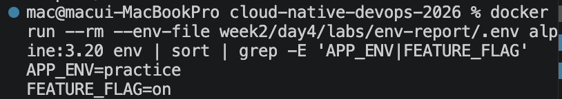
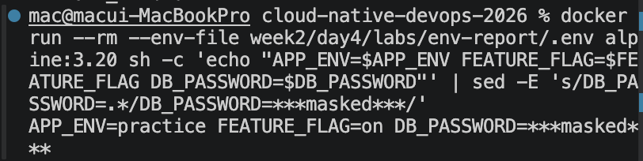
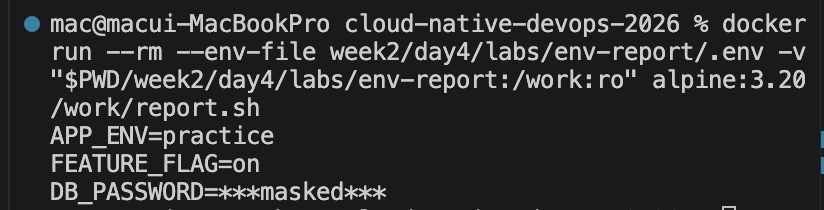

# 1교시: Runtime config, env file, secret masking

## 실습 확인 기록

| 명령 | 설명 | 결과 |
|---|---|---|
| `docker run --rm -e APP_ENV=practice -e FEATURE_FLAG=on alpine:3.20 env \| sort \| grep -E 'APP_ENV\|FEATURE_FLAG'` | `-e`로 env 주입 후 container 안에서 확인 |  |
| `docker run --rm -e APP_ENV=dev alpine:3.20 sh -c 'echo "image=alpine:3.20 APP_ENV=$APP_ENV"'` | 같은 image를 dev 조건으로 실행 |  |
| `docker run --rm -e APP_ENV=prod alpine:3.20 sh -c 'echo "image=alpine:3.20 APP_ENV=$APP_ENV"'` | 같은 image를 prod 조건으로 실행 |  |
| `docker run --rm --env-file week2/day4/labs/env-report/.env alpine:3.20 env \| sort \| grep -E 'APP_ENV\|FEATURE_FLAG'` | `--env-file`로 env 주입 후 확인 |  |
| `docker run --rm --env-file week2/day4/labs/env-report/.env alpine:3.20 sh -c 'echo "APP_ENV=$APP_ENV FEATURE_FLAG=$FEATURE_FLAG DB_PASSWORD=$DB_PASSWORD"' \| sed -E 's/DB_PASSWORD=.*/DB_PASSWORD=***masked***/'` | DB_PASSWORD masking 출력 확인 |  |
| `docker run --rm --env-file week2/day4/labs/env-report/.env -v "$PWD/week2/day4/labs/env-report:/work:ro" alpine:3.20 /work/report.sh` | report.sh로 masking된 env 출력 |  |

## 확인 질문 답변

| 질문 | 답변 |
|---|---|
| env가 image build 없이 바뀌는가? | 바뀐다. 같은 image를 `-e APP_ENV=dev`와 `-e APP_ENV=prod`로 각각 실행하면 출력이 달라진다. image는 그대로고 runtime config만 다른 것이다. |
| `-e`와 `--env-file` 중 언제 무엇을 쓰는가? | 한두 개를 빠르게 실험할 때는 `-e`, 여러 설정을 재사용할 때는 `--env-file`을 쓴다. `--env-file`은 파일 경로를 명시해야 하며 자동으로 `.env`를 읽지 않는다. |
| `.env`는 어떻게 쓰이는가? | `--env-file .env`로 넘기면 파일의 key/value가 container 환경변수로 주입된다. 파일 자체가 container에 복사되는 것이 아니다. |
| 환경별 설정은 어떻게 분리하는가? | `.env.dev`, `.env.staging`, `.env.prod`처럼 같은 key에 다른 value를 담은 파일을 환경마다 둔다. 실행할 때 `--env-file`로 어떤 파일을 쓸지 명시한다. |
| env 값이 어디에 남지 않아야 하는가? | shell history, README, screenshot, 질문 게시글에 실제 secret 값을 남기면 안 된다. 문서에는 key 이름과 `***masked***` 형태만 남긴다. |
| env file은 공유 가능한가? | `.env.example`처럼 key 이름과 placeholder만 담은 파일은 공유 가능하다. 실제 값이 들어간 `.env`는 공유하지 않는다. |
| env file을 수정하면 기존 container에 반영되는가? | 반영되지 않는다. Docker는 container 생성 시점에 파일을 읽는다. 값을 바꿨다면 container를 새로 만들어야 한다. |
| credential 노출이 의심될 때 무엇을 해야 하는가? | 값을 숨기는 것이 아니라 즉시 revoke/rotate한다. 이후 어떤 경로로 노출됐는지 audit log를 확인하고 least privilege를 재검토한다. |

## notes

### 핵심 기준 한 문장

```text
image는 실행할 프로그램을 담고, runtime config는 그 프로그램이 어떤 환경으로 실행될지 정한다.
```

### `-e`와 `--env-file` 비교

| 방식 | 예시 | 적합한 상황 | 주의할 점 |
|---|---|---|---|
| `-e KEY=value` | `-e APP_ENV=practice` | 한두 개 값을 빠르게 실험 | shell history에 값이 남기 쉬움 |
| `--env-file FILE` | `--env-file .env` | 여러 설정을 파일로 묶어 재사용 | 파일을 명시하지 않으면 자동으로 읽히지 않음 |
| `-e KEY` | `-e APP_ENV` | host shell의 export 값을 container로 전달 | host에 값이 없으면 container에도 없음 |

### env file 형식

| 형식 | 의미 |
|---|---|
| `APP_ENV=practice` | 값을 직접 지정 |
| `FEATURE_FLAG=on` | 값을 직접 지정 |
| `LOCAL_ONLY_KEY` | host shell에 export된 값을 가져옴 |
| `# comment` | comment로 무시 |

### 환경별 파일 분리 패턴

```text
.env.dev     → APP_ENV=dev,     FEATURE_FLAG=on,  API_BASE_URL=http://localhost:3000
.env.staging → APP_ENV=staging, FEATURE_FLAG=on,  API_BASE_URL=https://staging.example.com
.env.prod    → APP_ENV=prod,    FEATURE_FLAG=off, API_BASE_URL=https://api.example.com
```

각 파일은 같은 key를 가지되 value만 다르게 둔다. 실행 시 `--env-file`로 환경을 명시한다.

이 패턴은 Docker에서 끝나지 않는다. Kubernetes는 ConfigMap/Secret, Terraform은 `dev.tfvars`/`prod.tfvars`로 같은 원칙을 확장한다.

### report.sh를 쓰는 이유

`report.sh`는 env 값을 출력하되 secret만 masking해서 보여주는 작은 스크립트다.

```sh
#!/usr/bin/env sh
set -eu

echo "APP_ENV=${APP_ENV:-missing}"
echo "FEATURE_FLAG=${FEATURE_FLAG:-missing}"
if [ -n "${DB_PASSWORD:-}" ]; then
  echo "DB_PASSWORD=***masked***"
else
  echo "DB_PASSWORD=missing"
fi
```

| 이유 | 설명 |
|---|---|
| masking 로직을 한 곳에 모은다 | 매번 `sed -E 's/DB_PASSWORD=.*/.../'`를 손으로 치면 빠뜨리거나 오타가 난다. 스크립트로 캡슐화하면 실수 없이 같은 기준으로 출력된다. |
| 재사용 가능하다 | `-v`로 mount해서 어떤 env 조합에서도 같은 스크립트를 돌릴 수 있다. 환경이 바뀌어도 출력 형식은 동일하다. |
| 값 유무를 안전하게 구분한다 | `${APP_ENV:-missing}`로 값이 없으면 `missing`을 출력해, 설정 누락을 secret 노출 없이 확인할 수 있다. |
| secret은 존재 여부만 노출한다 | `DB_PASSWORD`는 값이 있으면 `***masked***`, 없으면 `missing`만 찍는다. 실제 값은 절대 출력에 남지 않는다. |
| 습관을 코드로 고정한다 | "secret은 출력에 남기지 않는다"는 기준을 사람의 기억이 아니라 스크립트로 강제한다. |

핵심은 **masking을 매번 손으로 하지 않고, 검증된 스크립트로 일관되게 하는 것**이다. 11번 실습의 `sed` masking을 스크립트로 옮긴 것이 `report.sh`다.

### 문서 기준

| 문서에 남겨도 되는 것 | 문서에 남기면 안 되는 것 |
|---|---|
| `DB_PASSWORD`라는 key 이름 | 실제 password 값 |
| `--env-file .env` 사용 방식 | `.env` 전체 내용 |
| `DB_PASSWORD=***masked***` | terminal에 찍힌 실제 token |
| `.env.example` | 개인 `.env` |
| `.env.prod.example` | 실제 `.env.prod` |

### 환경별 파일 공유 여부

| 파일 | 공유 여부 | 이유 |
|---|---|---|
| `.env.example` | 가능 | key 이름과 placeholder만 포함 |
| `.env.dev` | 보통 로컬 전용 | 개인 개발값이 들어갈 수 있음 |
| `.env.staging` | 제한 공유 | staging credential 포함 가능 |
| `.env.prod` | 공유 금지 | 운영 secret 포함 가능 |

### TVING 사례 연결

2026년 6월 TVING 사고 보도에서 GitHub 자격증명 노출, AWS access key 폐기, 소스코드 하드코딩 우려가 쟁점이 됐다. 공개 기사만으로 최종 원인을 단정할 수 없지만, 수업에서는 "소스 저장소와 runtime secret 관리가 사고 대응의 핵심 쟁점이 된 사례"로 다룬다.

| 사고 쟁점 | Day 4에서 연결할 원칙 |
|---|---|
| GitHub 자격증명 노출 가능성 | repository에는 실제 `.env`, access key, token을 올리지 않는다. |
| AWS access key 폐기/교체 | 노출이 의심되면 masking이 아니라 즉시 revoke/rotate한다. |
| 소스코드 하드코딩 우려 | credential은 코드 상수가 아니라 env, secret manager, CI/CD secret으로 주입한다. |
| 내부 시스템 직접 접근 정황 | 하나의 credential이 DB, storage, admin API 등 넓은 권한으로 이어지지 않도록 least privilege를 적용한다. |

### `.env`는 로컬 개발 패턴이다

`--env-file .env`와 masking 실습은 production 패턴이 아니다. staging/prod에서는 `.env` 파일이 서버에 존재하는 구조 자체를 쓰지 않는다. `.env`가 서버에 올라가는 순간 이미 설계가 잘못된 것이다.

| 환경 | secret 주입 방식 |
|---|---|
| 로컬 개발 | `.env` (개인 PC에만 존재) |
| staging/prod (Docker) | `docker secret`, 또는 외부 secret manager에서 런타임 주입 |
| Kubernetes | `Secret` 오브젝트 → env로 mount, 또는 Vault/IRSA로 주입 |
| CI/CD | GitHub Actions secrets, GitLab CI variables 등 |

현업 기준으로는 앱이 런타임에 직접 AWS Secrets Manager, HashiCorp Vault 같은 곳에서 값을 가져오는 방식이 표준이 되고 있다. 파일로 남지 않고, 사람이 password를 아는 상태 자체가 사라지는 방향이다.

DB password도 마찬가지다. AWS RDS + Secrets Manager 조합이면 정해진 주기로 password를 자동 교체하고, 앱은 매번 API를 호출해 현재 값을 쓴다. 사람이 편의를 위해 직접 지정하는 방식은 점점 사라지는 추세다.

수업에서 masking 실습이 가르치는 건 production 구조가 아니라 **습관**이다. "secret은 출력에 남기지 않는다"는 감각을 로컬 실습 단계에서 훈련하는 것이고, 실제 구조는 Kubernetes/Vault 단계에서 다시 다룬다.

### 흔한 오해

- env file을 수정하면 바로 반영된다 → 반영 안 됨. container를 새로 만들어야 한다.
- `--env-file`을 쓰면 `.env`를 자동으로 읽는다 → 파일 경로를 명시해야 한다.
- 실습용 password는 노출해도 괜찮다 → 습관이 중요하다. 실습 값이라도 masking 기준을 적용한다.
- masking하면 노출 사고를 막을 수 있다 → masking은 문서 기준이다. 이미 노출된 credential은 revoke/rotate가 답이다.

### docker system prune

안 쓰는 리소스를 한 번에 정리하는 명령이다.

```bash
docker system prune
```

| 대상 | 조건 |
|---|---|
| container | 멈춰 있는 것 (`Exited` 상태) |
| image | 태그가 없는 것 (dangling image) |
| network | container가 연결 안 된 것 |
| build cache | 전부 |

실행 중인 container와 태그가 붙어 있는 image(`alpine:3.20`, `nginx:1.27-alpine` 등)는 지워지지 않는다.

volume까지 지우려면 `--volumes`를 붙인다. 단, 현재 Docker 버전(29.x)에서 `--volumes`는 **anonymous volume만** 지운다. named volume(보통 DB 데이터가 들어 있는 곳)은 이 명령으로 지워지지 않는다.

```bash
docker system prune --volumes   # container/image/network/cache + anonymous volume
```

> 과거 버전에서는 `--volumes`가 named volume까지 지웠다. 그래서 "DB 데이터가 날아간다"는 경고가 돌았지만, 최신 버전에서는 anonymous volume만 대상이다. 버전에 따라 동작이 다르니 `docker system prune --help`로 확인하는 습관을 들인다.

### volume만 따로 지우기

volume만 정리하려면 `docker volume prune`을 쓴다. 이것도 기본은 anonymous volume만 지운다.

```bash
docker volume prune        # anonymous volume만
docker volume prune -a     # named volume까지 (DB 데이터 주의)
docker volume rm <name>    # 특정 named volume을 콕 집어 삭제
```

| 명령 | 청소 범위 | named volume |
|---|---|---|
| `docker volume prune` | volume만 (anonymous) | ❌ (`-a`로 포함) |
| `docker system prune --volumes` | container/image/network/cache + anonymous volume | ❌ |

핵심: **두 명령 모두 기본값으로는 named volume(DB 데이터)을 건드리지 않는다.** named volume을 지우는 것은 `docker volume prune -a`나 `docker volume rm`처럼 명시적으로 의도해야 일어난다. 이게 데이터 보호 안전장치다.

실행 전에 현재 용량을 확인하는 것이 습관으로 좋다.

```bash
docker system df
```

## Blocker Log

| 증상 | 확인한 것 |
|---|---|
| | |
