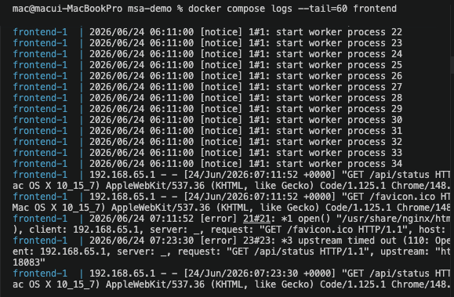
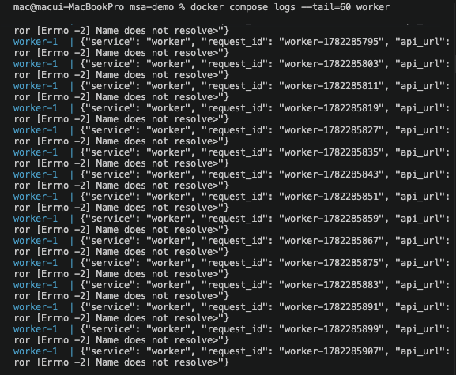
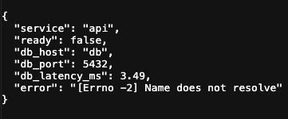
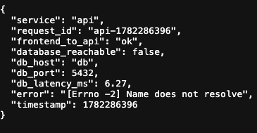
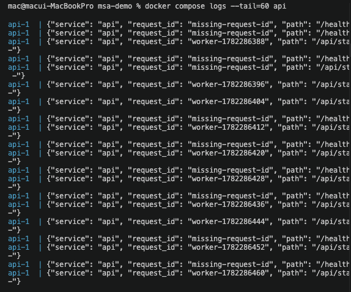
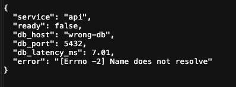
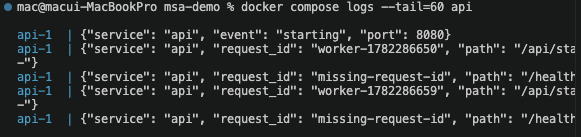

# 7교시: 장애 시나리오 1 - API URL, DB host, 환경변수

## 실습 확인 기록

| 명령/확인 | 결과 |
|---|---|
| `docker compose stop api` → `curl -i localhost:18083/api/status` | frontend 502/실패 (nginx가 upstream `api:8080`에 연결 못 함), worker는 connection refused, db는 healthy |
| `docker compose stop db` → `curl -i localhost:18084/health` | api는 Up이지만 `/health` 503, `database_reachable=false`, 사용자 경로까지 전파 |
| `DB_HOST=wrong-db docker compose up -d` → `curl -i localhost:18084/health` | `db_host=wrong-db`, name resolution/connection error, db container는 healthy (설정 장애) |
| `docker compose exec api env \| grep DB_` | 컨테이너의 실제 환경변수 값 확인 |

## 확인 질문 답변

| 질문 | 답변 |
|---|---|
| API 중지와 DB 중지는 증상이 어떻게 다른가? | API 중지는 nginx가 upstream 연결 실패로 frontend 502. DB 중지는 api는 Up이지만 `/health` 503·`database_reachable=false`. container 상태와 readiness가 다르게 나타난다. |
| DB_HOST 오류는 DB 장애와 어떻게 구분하나? | db container는 healthy인데 api만 name resolution/connection error. DB 자체가 아니라 API 설정(runtime config) 장애다. |
| 상태 확인용 `exec`와 변경용 `exec`의 차이는? | 확인용 `exec`(env, 로그 보기)는 괜찮지만, 운영 container를 임의로 수정하는 shell 작업은 피해야 한다. 둘은 구분해야 한다. |
| 장애 분석은 명령을 많이 치는 것인가? | 아니다. 사용자 증상에서 시작해 dependency map을 따라 가장 먼저 확인할 증거를 고르는 일이다. |

## notes

### 장애 1: API 중지

```bash
docker compose stop api
curl -i http://localhost:18083/api/status
docker compose logs --tail=60 frontend
docker compose logs --tail=60 worker
```

| 관찰 | 의미 |
|---|---|
| frontend 요청이 502 또는 실패 | nginx가 upstream `api:8080`에 연결하지 못함 |
| worker log에 connection refused | worker도 API dependency에 실패 |
| db는 healthy | DB 장애가 아니라 API service 장애 가능성 |

실행 결과:

| 명령 | 결과 |
|---|---|
| `curl -i localhost:18083/api/status` |  |
| `docker compose logs --tail=60 frontend` |  |
| `docker compose logs --tail=60 worker` |  |

복구: `docker compose start api` → `curl localhost:18084/health`

### 장애 2: DB 중지

```bash
docker compose stop db
curl -i http://localhost:18084/health
curl -i http://localhost:18083/api/status
docker compose logs --tail=60 api
```

| 관찰 | 의미 |
|---|---|
| API container는 Up | process는 살아 있음 |
| `/health`가 503 | readiness 실패 |
| `database_reachable=false` | DB dependency 실패 |
| frontend도 정상 표시 못 함 | 사용자 경로에도 전파 |

실행 결과:

| 명령 | 결과 |
|---|---|
| `curl -i localhost:18084/health` |  |
| `curl -i localhost:18083/api/status` |  |
| `docker compose logs --tail=60 api` |  |

복구: `docker compose start db` → `sleep 5` → `curl localhost:18084/health`

### 장애 3: DB_HOST 오류 (환경변수)

```bash
docker compose down
DB_HOST=wrong-db docker compose up --build -d
sleep 5
curl -i http://localhost:18084/health
docker compose logs --tail=60 api
```

| 관찰 | 의미 |
|---|---|
| `db_host`가 `wrong-db` | runtime config가 잘못 들어감 |
| name resolution 또는 connection error | service name DNS 실패 |
| db container는 healthy일 수 있음 | DB 자체 장애가 아니라 API 설정 장애 |

실행 결과:

| 명령 | 결과 |
|---|---|
| `curl -i localhost:18084/health` |  |
| `docker compose logs --tail=60 api` |  |

복구: `docker compose down` → `docker compose up --build -d`

### 세 장애의 차이 (핵심)

| 장애 | container 상태 | 증상 | 구분 포인트 |
|---|---|---|---|
| API 중지 | api stopped | frontend 502 | api가 아예 죽음 |
| DB 중지 | api Up, db stopped | `/health` 503, `reachable=false` | api는 사는데 dependency 실패 |
| DB_HOST 오류 | 전부 Up, db healthy | name resolution error | service 장애 아닌 **설정 장애** |

같은 "안 됨"이라도 원인 계층(service 죽음 / dependency 죽음 / config 오류)이 다르다.

### env 확인 명령

```bash
docker compose exec api env | sort | grep DB_
docker inspect $(docker compose ps -q api) --format '{{json .Config.Env}}'
```

확인용 `exec`와 변경 작업용 `exec`는 다르다. 운영 container를 임의로 수정하는 shell 작업은 피한다.

### 참고: 지역 간 network latency (Verizon IP Latency)

Verizon이 자기 백본 기준 **region 간 왕복 지연(RTT)을 월별로 공개**하는 자료. 강의에서 "지역에 따라 통신 시간이 달라진다"를 보여줄 때 인용.

핵심: 이 차트는 **지역 간 순수 네트워크 전송 시간만** 본다.

| 포함됨 (Verizon 차트) | 포함 안 됨 |
|---|---|
| region ↔ region 백본 RTT | 서버 처리 시간, DB 쿼리 |
| 물리 거리·경로 기반 지연 | TLS 핸드셰이크, DNS, retry, 큐 대기 |

즉 "Korea→Singapore ~90ms"는 **이론상 최소 네트워크 비용**이지 실제 응답 시간이 아니다. 실제 = 네트워크 + 서버/DB 처리 + 부가 오버헤드.

```text
같은 도시 내       : ~1ms 미만
Korea ↔ Japan      : ~30ms
Korea ↔ Singapore  : ~90ms
Korea ↔ US West    : ~130ms
Korea ↔ Europe     : ~230ms+
```

원인은 빛의 속도 + 물리 거리 + 네트워크 경로(직항 케이블 없으면 우회).

**MSA 연결**: 2교시의 "MSA는 함수 호출이 아니라 network 호출"과 직결. Monolith의 함수 호출은 ~0ms지만, MSA는 service가 다른 region에 있으면 호출마다 위 latency가 **누적**된다. 그래서 자주 통신하는 service는 같은 region/zone에 모으고(co-location), region을 넘는 호출은 줄이거나 캐싱한다. **service 배치가 곧 성능.**

### 참고: 버전 지원 종료와 강제 업그레이드 (강사님 코멘트)

- **쿠버네티스는 클러스터 버전 지원이 끝나기 전에 무조건 업그레이드해야 한다 → 사실상 강제.** 새 버전이 약 **4개월에 한 번** 나와서, 그 주기를 계속 따라가야 한다. 그래서 쿠버네티스 엔지니어들은 주기적으로 갈려나간다(넉 달에 한 번씩 죽어간다).
- **RDS(DB)는 업그레이드 자체가 어렵다**는 점을 언급. 지원이 끝나도 돈을 더 내면 쓸 수는 있다. DB 엔진 버전 EOL은 AWS가 아니라 상위 커뮤니티가 정해서 어쩔 수 없는 부분.

핵심: 버전 지원에는 끝이 있고, 지원 종료 전에 올려야 보안 패치가 유지된다. 운영에서 버전 lifecycle 관리도 장애 예방의 일부.

### 장애 리포트 미니 템플릿

| 항목 | 예시 |
|---|---|
| 증상 | frontend `/api/status` 실패 |
| 영향 범위 | frontend 사용자 경로, worker background check |
| 정상 service | db healthy |
| 의심 service | api stopped |
| 첫 확인 명령 | `docker compose ps`, `logs frontend`, `logs worker` |
| 복구 | `docker compose start api` |
| 예방 | healthcheck, alert, runbook |

### 핵심

장애 분석은 많은 명령을 치는 경연이 아니다. **사용자 증상에서 시작해 dependency map을 따라가며 가장 먼저 확인할 증거를 고르는 일**이다.

## Blocker Log

| 증상 | 확인한 것 |
|---|---|
| | |
