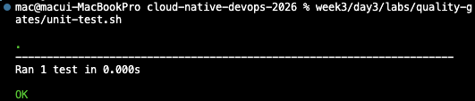
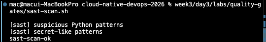
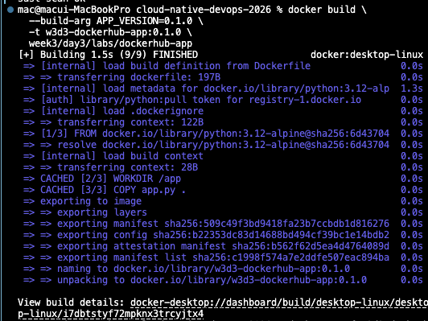
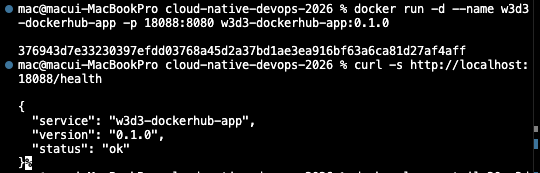
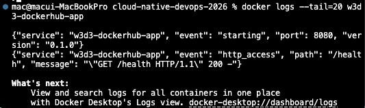

# 6교시: GitHub Actions 1 - 코드, Workflow, Unit/SAST/DAST Gate

## 실습 확인 기록

> sample app: `labs/dockerhub-app` (app.py = `/health` JSON 반환), Docker Server 29.5.3 사용.

| 명령/확인 | 결과 |
|---|---|
| `week3/day3/labs/quality-gates/unit-test.sh` |  |
| `week3/day3/labs/quality-gates/sast-scan.sh` |  |
| `docker build --build-arg APP_VERSION=0.1.0 -t w3d3-dockerhub-app:0.1.0 week3/day3/labs/dockerhub-app` |  |
| `docker run` + `curl /health` |  |
| `docker logs --tail=20 w3d3-dockerhub-app`|  |
| `dast-health-check.sh` | `dast-health-check-ok` (컨테이너 띄워 health 확인 후 자동 정리) |
| `run-all-local.sh` | `quality-gates-ok` (unit→sast→build→dast 통합 통과) |

## 확인 질문 답변

| 질문 | 답변 |
|---|---|
| unit / SAST / DAST가 검증하는 것? | unit=함수·응답 구조 / SAST=위험 코드·hardcoded secret(실행 안 함) / DAST=실행 후 HTTP health(동작 확인) |
| `.dockerignore`가 필요한 이유? | `.git/`·`.env`·cache를 build context에서 빼서 image에 history/secret 포함 방지 + image size 감소 |
| GitHub-hosted runner의 특징? | 매 실행마다 깨끗한 환경 시작 → layer/dependency cache가 기본적으로 안 남음 |
| `type=gha` cache의 역할? | 이전 Actions cache에서 build layer 복원(cache-from)·저장(cache-to)으로 반복 build 시간 단축 |
| local gate를 먼저 도는 이유? | runner에서 실패하기 전에 같은 절차를 로컬에서 검증 → 재현성·디버깅 용이 |
| workflow 파일 위치? | `.github/workflows/*.yml` (GitHub가 이 경로를 읽어 Actions 탭에 표시) |

## notes

### Gate 3종 구분
- unit test(`unit-test.sh`): app 함수/응답 구조. / SAST(`sast-scan.sh`): grep으로 위험 패턴·secret 탐지(코드 실행 안 함). / DAST(`dast-health-check.sh`): container 실행 후 `/health` 응답 확인(실제 동작).

### 스크립트 상세 — unit-test.sh / sast-scan.sh
- **unit-test.sh** = "코드가 제대로 동작하나?" (기능 회귀 방지)
  - `ROOT_DIR`로 repo 루트 이동(어디서 실행하든 경로 일관) → `PYTHONPATH`로 app.py import 경로 지정 → `python3 -m unittest test_app.py`.
  - 검증 대상: app 함수/응답 구조(예: `/health`가 `status: ok`·`version` 반환). Docker·서버 불필요 → 빠름. 결과 `Ran 1 test ... OK`.
- **sast-scan.sh** = "코드에 위험 패턴·비밀번호 섞였나?" (SAST = 정적 분석, 코드 **실행 안 하고** grep으로 텍스트 검사)
  - (1) 위험 코드: `eval(` `exec(` `subprocess...shell=True` `pickle.loads` → 임의 코드 실행/주입 위험.
  - (2) secret 의심: `password|token|secret|access_key` 뒤 8자 이상 문자열 → 하드코딩 비밀 유출.
  - 둘 다 걸리면 `exit 1`(게이트 실패), 없으면 `sast-scan-ok`.
- 게이트 순서: `unit(동작·실행O) → SAST(위험·실행X 정적) → build → DAST(응답·실행O 동적)`.

### 강의 인사이트 — 검증 vs 배포 속도 트레이드오프
- 검증을 싫어하는 이유: gate마다 시간 추가로 **배포가 느려짐**, 급한 핫픽스도 CI 대기, 사고 안 났을 땐 이득이 안 보임.
- 그래도 하는 이유: **느려지는 비용 < 사고 비용.** 회귀·secret 노출이 prod에서 터지면 추적·롤백·신뢰 회복 비용이 훨씬 큼.
- lesson 원문: "느려지는 건 사실이다. 하지만 사람이 매번 수동으로 같은 검증을 기억해 수행하는 것보다 자동화된 gate가 더 재현 가능하다."
- 균형 잡는 법(검증을 빼는 게 아니라 느림을 줄임): 빠른 gate(unit/SAST)를 앞에 배치해 빨리 실패 / `type=gha` cache로 반복 build 단축 / 무거운 검증 병렬화·필요한 branch에만 / 핫픽스 경로는 두되 사후 검증 유지.
- 한 줄: 검증 = 사고를 막는 **보험료**. 비용을 줄이는 방법을 고민하지, 검증 자체를 없애진 않는다. (→ lesson-03 자동화 원칙과 연결)

### Workflow 작성 순서 (조금씩 늘리기)
- `name` → `on` → `jobs` → `runs-on` → `steps` → `uses` → `run` → `env` → `secrets`.

### 최소 workflow (문법 눈에 익히기용)
```yaml
name: w3d3-first-action
on:
  workflow_dispatch:
jobs:
  hello:
    runs-on: ubuntu-latest
    steps:
      - name: Print runner info
        run: |
          pwd
          uname -a
          echo "hello github actions"
```

### 핵심 문법
- `on.workflow_dispatch`(수동 실행) / `on.push.tags: v*.*.*`(tag push) / `jobs.<id>` / `runs-on: ubuntu-latest` / `uses: actions/checkout@v4` / `run:` / `env` / `${{ secrets.NAME }}` / `${{ steps.ID.outputs.KEY }}`.

### Runner & Cache
- runner = Actions에서 명령을 실제 실행하는 컴퓨팅. GitHub-hosted(편함, 매번 깨끗) vs self-hosted(직접 운영, cache·내부망 가능, 관리 책임).
- GitHub-hosted는 checkout/dependency/Docker build에서 cache miss로 느려질 수 있음.
- BuildKit `cache-from: type=gha` / `cache-to: type=gha,mode=max`로 layer cache. 단, cache 복원·저장 시간도 들고 context 자주 바뀌면 효과 작음.

### 최종 Docker Hub workflow 흐름
```text
checkout → version metadata → unit test → SAST → docker build(gha cache)
→ DAST health → Docker Hub login → push → pull/run 명령 출력
```
- step을 잘게 나눠야 Actions에서 실패 위치·소요 시간 분석 가능.

### 핵심 포인트
- Actions에서 바로 push 전, local gate로 같은 절차 먼저 검증: `unit test → SAST → docker build → DAST → push`.

### Evidence Note
```markdown
# W3D3S6 Actions Local Build
- .gitignore checked: .env, node_modules, private/, out_lecture
- .dockerignore checked: .git/, .env, __pycache__, cache/build output
- local image: w3d3-dockerhub-app:0.1.0
- curl result: status ok, version 0.1.0
- unit test: OK
- SAST: sast-scan-ok
- DAST: dast-health-check-ok
- workflow file: .github/workflows/dockerhub-publish.yml
```

## Blocker Log

| 증상 | 확인한 것 |
|---|---|
| `run-all-local.sh` 실행 시 `unit-test.sh: Permission denied` | 하위 스크립트를 직접 호출(`bash` 없이)하는데 +x 권한 없음 → `chmod +x week3/day3/labs/quality-gates/*.sh` 후 정상. (개별 실행은 `bash script.sh`로 권한 없이도 됨) |
