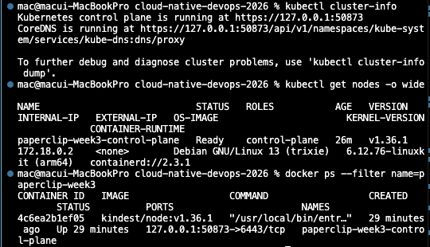
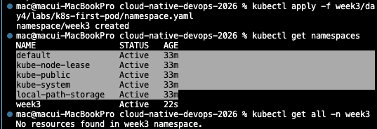
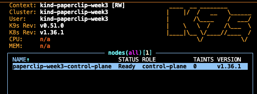
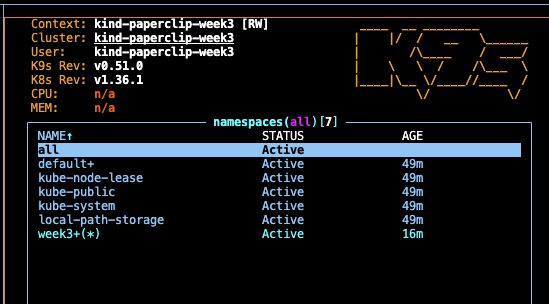
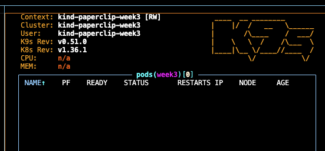
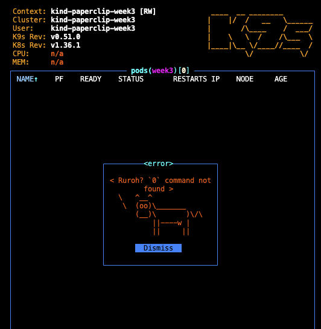

# 8교시: kind Cluster 생성과 확인

## 핵심 정리

### Cluster 생성
```bash
kind create cluster --config week3/day4/labs/kind-cluster/kind-config.yaml
# 이미 있으면: kind get clusters → kind delete cluster --name paperclip-week3 → 재생성
```

### kubectl Context 확인 (매우 중요)
```bash
kubectl config current-context     # 정상: kind-paperclip-week3
kubectl config get-contexts
```
- ⚠️ **context 안 보고 명령하면 다른 cluster에 리소스를 만들거나 지울 수 있음.** (3·7교시에서 본 "kubectl이 어느 cluster를 가리키나"가 바로 이것)

### Cluster 상태 확인
```bash
kubectl cluster-info
kubectl get nodes -o wide
docker ps --filter name=paperclip-week3
```
| Evidence | 정상 기준 |
|---|---|
| cluster-info | control plane URL 출력 |
| node | `Ready` |
| docker ps | kind node container 실행 중 |



### Namespace 준비 (Day5용)
```bash
kubectl apply -f week3/day4/labs/k8s-first-pod/namespace.yaml
kubectl get namespaces
kubectl get all -n week3      # 리소스 거의 없어도 정상 (namespace만 만든 상태)
```

> 드래그 부분은 기본 시스템 부분이다.

### k9s = 상태 탐색 TUI (선택)
- **k9s = 어디를 볼지 빠르게 찾는 도구 / kubectl = 무엇을 확인했는지 기록하는 언어.** evidence는 재현 가능한 kubectl 명령으로 남김.
- k9s 안에서 `:`(콜론) 누르고 명령 입력 → 해당 화면으로 이동.

| 입력 | 화면 | 확인할 것 |
|---|---|---|
| `:nodes` | node 목록 | kind node가 `Ready`인지 |
| `:ns` | namespace 목록 | `week3` namespace가 있는지 |
| `:pods` | Pod 목록 | 아직 거의 비어 있는지 |
| `0` | all namespaces | 전체 namespace 리소스 한눈에 |
| `q` | 종료 | — |

#### `:nodes` — node가 Ready인지


#### `:ns` — week3 namespace가 있는지


#### `:pods` — Pod 목록 (아직 거의 빈 상태)


#### `0` — all namespaces 한눈에 보기


### 삭제 기준
- Day5를 같은 PC에서 바로 이어가면 **유지** (`kind get clusters`, `kubectl get nodes`).
- 정리하려면 **삭제** (`kind delete cluster --name paperclip-week3`).

> ⚠️ **kind는 cluster 삭제하면 그 안의 것이 전부 날아간다** (Pod·namespace·data 모두). Docker는 컨테이너 지워도 volume/image가 남을 수 있지만, **kind delete cluster는 cluster 자체를 통째로 없애서 복구 불가.**
> - 💬 강사님 경험담: 잘못해서 **staging 환경을 날려버린 적**이 있다 → "이렇게 하면 안 되겠다"고 느낌.
> - 교훈: **삭제 같은 destructive 명령은 항상 대상(`--name`)과 현재 context를 확인하고 실행.** 실수 한 번이 환경 전체를 날릴 수 있다. (8교시 context 확인 강조와 같은 맥락)

### Troubleshooting
| 증상 | 원인 후보 | 첫 확인 |
|---|---|---|
| `failed to create cluster` | Docker 미실행·resource 부족 | `docker version`, Docker Desktop resource |
| `node NotReady` | node 초기화 지연 | 1~2분 대기 후 `kubectl describe node` |
| `connection refused` | cluster 삭제/중지 | `kind get clusters`, `docker ps` |
| `no context exists` | kubeconfig context 없음 | `kubectl config get-contexts` |
| `image pull` 지연 | 네트워크 또는 registry 접근 | Docker network, proxy |
| `Reached target ...` log line을 찾지 못함 | kind node 부팅 실패, WSL/Docker/cgroup 문제 가능 | Docker Desktop/WSL 재시작, kind 업데이트, node container logs |

> 위 오류가 나면 `kubectl` 명령을 계속 실행해도 보통 `localhost:8080 connection refused`가 이어진다. 먼저 **cluster 생성 실패 원인부터** 해결해야 한다.

### 오늘(Day4) 전체 요약
> **Kubernetes는 container를 많이 실행하는 명령 묶음이 아니다. 원하는 상태를 API object로 선언하고, control plane과 node가 그 상태에 가까워지도록 조정하는 platform이다.**

## 실습 확인 기록

| 명령/확인 | 결과 |
|---|---|
| | |

## 확인 질문 답변

| 질문 | 답변 |
|---|---|
| cluster 생성 명령은? | `kind create cluster --config .../kind-config.yaml` |
| 정상 context 이름은? | `kind-paperclip-week3` |
| context 확인이 왜 중요? | 잘못된 cluster에 리소스를 만들/지울 수 있어서 |
| cluster 정상 기준은? | cluster-info에 control plane URL, node Ready, kind node container 실행 중 |
| k9s vs kubectl 차이는? | k9s=빠른 상태 탐색 TUI, kubectl=재현 가능한 evidence 기록 |
| Day4 한 줄 요약은? | K8s = 원하는 상태를 선언하면 control plane/node가 조정하는 platform |

## notes

### Deprecation(폐기) 오류와 버전 업그레이드 (강사님: 버전 주기적으로 올려야 함)

> **deprecate(디프리케이트, 지원 중단/폐기)** 오류.

**deprecation = "이 기능 곧 없앨 거니 그만 써라" 미리 알리는 것**
- K8s는 버전이 자주 올라감(1년에 약 3번 minor 릴리스). 올라갈 때마다 **오래된 API가 deprecated → removed(제거)**.

```text
내 YAML: apiVersion: extensions/v1beta1  (옛 방식)
   → cluster 새 버전으로 업그레이드
   → 그 apiVersion 제거됨
   → 배포 에러: "no matches for kind ... in version ..."   ← deprecation 오류
```
- 즉 **잘 돌던 manifest가 버전 올리면 갑자기 안 먹음.**
- 실제 예: `Ingress` `extensions/v1beta1` → `networking.k8s.io/v1`, **PodSecurityPolicy는 1.25에서 제거**.

**왜 주기적으로 올려야 하나**
- K8s 각 버전 지원 기간 ≈ 1년 남짓. 안 올리면 **보안 패치도 못 받음** → 억지로라도 업그레이드해야.
- 올릴 때마다 deprecated API 때문에 manifest 손봐야 함.
- EKS 같은 managed 써도 **언제·어떤 버전으로 올릴지, manifest를 어떻게 맞출지는 팀 책임** (5교시 managed 정리와 연결).

> 한 줄: **K8s는 버전이 자주 오르고 그때마다 옛 API가 deprecated→removed. 안 올리면 지원 끊기고, 올리면 옛 manifest가 깨질 수 있어 — 주기적 업그레이드 + deprecation 대응이 운영의 핵심 부담.**

## Blocker Log

| 증상 | 확인한 것 |
|---|---|
| | |
