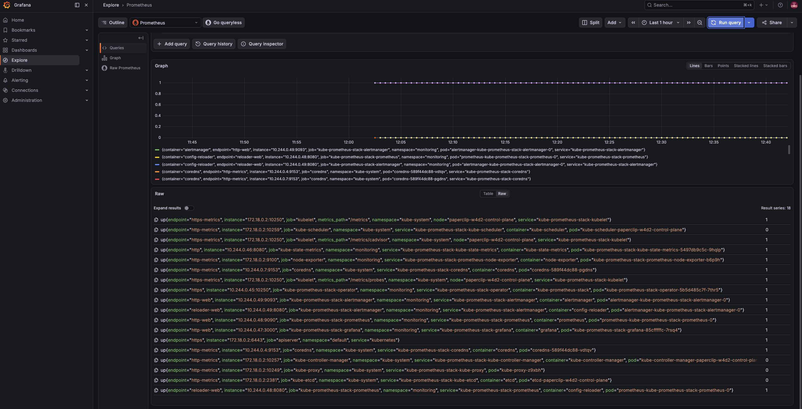
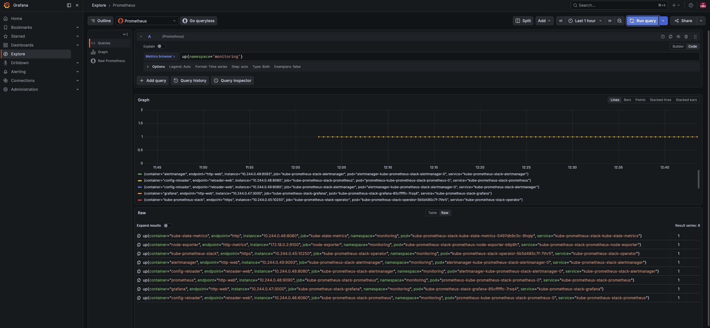

# 3교시: Prometheus Target 확인

## 핵심 정리

### Target = Prometheus가 scrape하는 endpoint
```text
Prometheus → target endpoint scrape → metric 저장 → PromQL
```
- ⭐ target이 `UP`이어야 metric이 들어옴. dashboard가 비면 **먼저 target부터** 확인(확인 계층 최하단).

### `up` 값의 3가지 상태 (헷갈리면 안 됨)
| 상태 | 의미 | 볼 것 |
|---|---|---|
| `up=1` | scrape 성공 | 정상 |
| `up=0` | target **발견됨**, scrape **실패** | target error(연결/포트/path) |
| 결과 없음(series 없음) | target **discovery 자체 실패** | ServiceMonitor/selector |
- ⚠️ `up=0`(발견은 됨)과 `series 없음`(발견 안 됨)은 **다른 문제**. 이걸 섞으면 "scrape 실패"와 "설정 누락"을 착각.

### ServiceMonitor/PodMonitor가 target을 만든다
```text
ServiceMonitor (CRD) → operator가 읽음 → Prometheus scrape config 생성 → target
```
- target이 안 잡히면 ServiceMonitor의 **① namespace selector ② service selector(label) ③ endpoint port 이름 ④ path(/metrics) ⑤ Pod readiness/network** 중 하나가 어긋난 것.
- ⚠️ **port name mismatch가 흔함**: ServiceMonitor가 `port: http-metrics`를 참조하는데 Service엔 `name: http`뿐이면 target 생성 실패.

### target error 읽기
| Error | 해석 |
|---|---|
| `connection refused` | endpoint는 있으나 그 port가 안 열림 |
| `context deadline exceeded` | timeout(network/policy) |
| `server returned HTTP status 404` | `/metrics` path 없음 |
| `no such host` | DNS |
| `403` | auth/RBAC/proxy |

### ⚠️ kind에서 control-plane target DOWN은 정상일 수 있음
- ⭐ scheduler/controller-manager/etcd/kube-proxy는 metrics를 **127.0.0.1에만 바인딩** → Prometheus가 node IP로 scrape하면 `connection refused`. **설치 실패가 아니라 kind 특성**.
- ⭐ 판단: Grafana/Prometheus/kube-state-metrics/kubelet이 UP이면 **stack 설치는 성공**. 특정 control-plane target만 DOWN인 건 별개 문제.

### 한 줄 요약
> **Prometheus target이 없거나 DOWN이면 dashboard보다 먼저 discovery(ServiceMonitor)·Service·Endpoint·port를 확인한다. `up=0`(발견됨/scrape실패)과 series 없음(discovery실패)은 다른 문제이고, kind에서 control-plane target DOWN은 설치 실패가 아니다.**

## 실습 확인 기록

### ① `up` 타깃 job별 UP/DOWN 집계 (Prometheus API)
```text
$ kubectl -n monitoring run promq --rm -i --restart=Never --image=curlimages/curl:8.10.1 --command -- \
    curl -s "http://kube-prometheus-stack-prometheus:9090/api/v1/query?query=up"
  (결과 JSON을 job별로 집계)

job                                        UP DOWN
apiserver                                   1   0
coredns                                     2   0
kube-controller-manager                     0   1   <-- DOWN
kube-etcd                                   0   1   <-- DOWN
kube-prometheus-stack-alertmanager          2   0
kube-prometheus-stack-grafana               1   0
kube-prometheus-stack-operator              1   0
kube-prometheus-stack-prometheus            2   0
kube-proxy                                  0   1   <-- DOWN
kube-scheduler                              0   1   <-- DOWN
kube-state-metrics                          1   0
kubelet                                     3   0
node-exporter                               1   0

총 target: 18  UP: 14  DOWN: 4
```
- 읽는 포인트:
  - ⭐ 앱/모니터링 타깃(grafana·prometheus·alertmanager·kube-state-metrics·kubelet·coredns·apiserver·node-exporter)은 **전부 UP** → stack 설치·수집 정상.
  - ⚠️ DOWN 4종 = **kind control-plane**(scheduler·controller-manager·etcd·kube-proxy). `up=0`이므로 discovery는 됐고 scrape만 실패 = ②에서 원인 확인.

### ①-b Grafana Explore로 `up` 시각 확인 (스크린샷)
`up` 전체 — 각 series 끝의 값이 `1`(UP)/`0`(DOWN):



`up{namespace="monitoring"}` — monitoring namespace로 좁힘(grafana/prometheus/alertmanager/kube-state-metrics/node-exporter 등 UP):



- 읽는 포인트:
  - ⭐ ①의 API 집계와 같은 데이터를 **Grafana Explore(PromQL)** 로도 확인. Raw 테이블의 각 행 오른쪽 값이 `1`/`0`.
  - ⭐ `up{namespace="monitoring"}`처럼 **label로 좁혀가며** 원하는 범위를 보는 게 PromQL 기본 동작(label = query의 필터).

### ② DOWN target의 scrape error — kind localhost 바인딩
```text
$ kubectl -n monitoring run promt --rm -i --restart=Never --image=curlimages/curl:8.10.1 --command -- \
    curl -s "http://kube-prometheus-stack-prometheus:9090/api/v1/targets?scrapePool=serviceMonitor/monitoring/kube-prometheus-stack-kube-scheduler/0"

scrapeUrl: https://172.18.0.2:10259/metrics
health   : down
lastError: Get "https://172.18.0.2:10259/metrics": dial tcp 172.18.0.2:10259: connect: connection refused
```
- 읽는 포인트:
  - ⭐ error = `connection refused` → target error 표의 "endpoint는 있으나 port가 안 열림". scheduler가 metrics를 **node IP(172.18.0.2)가 아니라 127.0.0.1:10259**에만 열어서 Prometheus가 못 붙음.
  - ⭐ 이건 **kind 특성**이지 설치 실패가 아님. 운영 cluster면 이 target들도 정상 UP.

### ③ ServiceMonitor 목록 — target을 만드는 주체
```text
$ kubectl get servicemonitor -A
NAMESPACE    NAME
monitoring   kube-prometheus-stack-alertmanager
monitoring   kube-prometheus-stack-apiserver
monitoring   kube-prometheus-stack-coredns
monitoring   kube-prometheus-stack-grafana
monitoring   kube-prometheus-stack-kube-controller-manager
monitoring   kube-prometheus-stack-kube-etcd
monitoring   kube-prometheus-stack-kube-proxy
monitoring   kube-prometheus-stack-kube-scheduler
monitoring   kube-prometheus-stack-kube-state-metrics
monitoring   kube-prometheus-stack-kubelet
monitoring   kube-prometheus-stack-operator
monitoring   kube-prometheus-stack-prometheus
monitoring   kube-prometheus-stack-prometheus-node-exporter
```
- 읽는 포인트:
  - ⭐ ServiceMonitor 13종이 각각 target job을 만듦(①의 job과 대응). scheduler/controller-manager/etcd/kube-proxy ServiceMonitor는 **있지만** 대상 endpoint가 scrape 불가라 target이 DOWN.
  - ⭐ ①에서 "series 없음"인 게 아니라 **up=0**인 이유 = ServiceMonitor로 discovery는 됐기 때문. discovery 실패였다면 ServiceMonitor/selector를 봐야 함.

## 확인 질문 답변

| 질문 | 답변 |
|---|---|
| target이 UP이어야 하는 이유? | UP=scrape 성공. UP이어야 metric이 저장되고 PromQL/dashboard가 채워짐 |
| `up=0`과 series 없음 차이? | up=0=발견됐지만 scrape 실패(target error 확인), series없음=discovery 실패(ServiceMonitor/selector 확인) |
| target을 만드는 건? | ServiceMonitor/PodMonitor → operator가 읽어 scrape config 생성 |
| target 안 잡히는 흔한 원인? | port name mismatch(SM가 http-metrics 참조, Service엔 http만) |
| 이번에 DOWN인 target은? | kube-scheduler/controller-manager/etcd/kube-proxy (4종, kind control-plane) |
| 왜 DOWN? | metrics가 127.0.0.1에만 바인딩 → node IP scrape 시 connection refused (kind 특성) |
| DOWN이면 설치 실패인가? | 아님. grafana/prometheus/kube-state-metrics/kubelet UP이면 설치 성공 |
| connection refused vs deadline exceeded? | refused=port 안 열림, deadline=timeout(network/policy) |

## notes

### Evidence Note
```markdown
# W4D3S3 Prometheus targets
- 총 target 18개 (UP 14 / DOWN 4)
- UP: apiserver, coredns, kubelet, kube-state-metrics, node-exporter, grafana, prometheus, alertmanager, operator
- DOWN: kube-scheduler, kube-controller-manager, kube-etcd, kube-proxy (kind control-plane)
- target label 예: job=kube-scheduler, namespace=kube-system, endpoint 172.18.0.2:10259
- target error: connection refused (metrics가 127.0.0.1에만 바인딩, node IP로 scrape 실패)
- 관련 ServiceMonitor: kube-prometheus-stack-kube-scheduler 등 13종
- 판단: stack 설치 성공(app/monitoring target 다 UP), control-plane DOWN은 kind 특성
```

### Prometheus API로 target 보기 (UI 없이)
```bash
# up 전체
curl -s "http://<prometheus>:9090/api/v1/query?query=up"
# 특정 job DOWN 여부
curl -s "http://<prometheus>:9090/api/v1/query?query=up{job=\"kube-scheduler\"}"
# target error 포함 상세
curl -s "http://<prometheus>:9090/api/v1/targets?state=active"
```
- ⭐ UI(`http://localhost:9090/targets`) 대신 API로도 State/Error/Labels 확인 가능. port-forward: `kubectl -n monitoring port-forward svc/kube-prometheus-stack-prometheus 9090:9090`.

### target down 진단 순서
```text
1) up 값: 0인가, 아예 없나 (scrape 실패 vs discovery 실패)
2) up=0이면 → target error (refused/deadline/404/dns/403)
3) series 없으면 → ServiceMonitor selector/namespace/port name
4) Service/Endpoint 실물: get svc, get endpoints
5) 그래도 안 되면 operator log
```

### target down 원인 → 증상 → 확인 (레퍼런스)
| 원인 | 증상 | 확인 |
|---|---|---|
| Service 없음 | target discovery 안 됨 | `kubectl get svc` |
| selector 불일치 | endpoint 없음 | `kubectl get endpoints` |
| port 이름 불일치 | target 생성 실패 | ServiceMonitor endpoint port |
| `/metrics` 없음 | scrape HTTP error | target error message |
| NetworkPolicy | timeout | policy, DNS, egress |
| Pod down | connection refused | Pod READY/logs |
- ⭐ 이번 kind control-plane DOWN은 "Pod down"이 아니라 **endpoint 바인딩 위치**(127.0.0.1) 문제 → 증상은 같은 `connection refused`지만 원인은 다름. 증상만으로 단정 말고 원인 후보를 표로 좁힐 것.

## Blocker Log

| 증상 | 확인한 것 |
|---|---|
| | |
