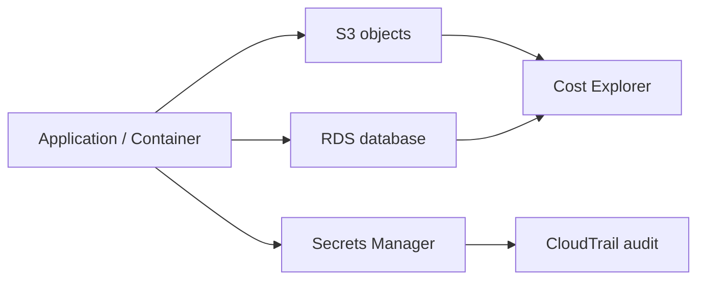

# 1교시: Day3 요약 + storage/database 운영 지도

## 실습 확인 기록

| 명령/확인 | 결과 |
|---|---|
| | |

## 확인 질문 답변

| 질문 | 답변 |
|---|---|
| Day3까지 확인한 것과 오늘 확인할 것의 차이는? | Day3=image 배포·service health·logs(**compute**). 오늘=app **밖에 남는 데이터**(S3 object, RDS row), credential(secret), 그리고 이들이 만드는 **비용/권한/복구** 경계 |
| S3 / RDS / Secrets / Cost는 각각 어떤 질문에 답하나? | S3=**파일(object)을 어디에 두나**, RDS=**관계형 transaction 데이터를 어디에 두나**, Secrets=**credential을 어디에 두나**, Cost=**이 resource들이 만드는 비용을 어떻게 찾나** |
| 오늘의 "성공 기준"은? | resource **생성이 아니라** 접근(누가 되나)·보존(retention/version)·복구(backup/snapshot)·비용(tag/filter) evidence를 남기는 것 |
| storage/database가 compute보다 위험한 이유는? | object·database는 **삭제와 공개의 영향이 compute보다 큼**. 실습 후에도 데이터와 비용이 남고, public 노출·삭제 복구 불가 사고가 가능 |
| "resource 지웠으니 비용 끝"이 왜 틀리나? | snapshot/version/log가 남아 **저장 비용이 계속**될 수 있음. 비용 확인을 삭제 후로 미루지 말고 tag/service filter로 추적 |
| 접근을 막는 계층이 여러 개인 이유는? | S3 bucket policy(+Block Public Access), SG inbound, IAM permission이 **서로 다른 계층**에서 차단. 그래야 app 장애와 보안 사고를 구분 가능 |
| credential은 어디에 둬야 하나? | 코드·markdown·env 문자열이 아니라 **Secrets Manager/IAM 경계**. env에 password 박아두면 로그·캡처·git으로 샘 |

## notes

- **왜 S3인가 (container는 stateless)**: container 안에는 **사용자가 올린 파일/이미지를 저장하지 않는다.** container를 내리거나(재배포·scale-in·crash) 재시작하면 그 안의 파일은 **같이 사라진다**(ephemeral). 그래서 사용자 업로드 같은 영속 데이터는 container 밖 **S3**에 올린다.
  - 흐름: `사용자 업로드 → app(container) → S3에 저장 → container가 죽어도 S3 object는 유지`
  - 같은 이유로 관계형 데이터는 RDS, credential은 Secrets에 **container 밖으로** 뺀다. "container에 남기면 사라진다"가 오늘 전체의 출발점.
- **운영 지도**: `App/Container → S3(objects) / RDS(database) / Secrets Manager → S3·RDS는 Cost Explorer로, Secrets는 CloudTrail audit로`
  - 선은 단순 연결이 아니라 **접근 권한·비용·복구 책임이 나뉘는 지점**
- **구조로 보기**:

- **SM은 "연결"이 아니라 "credential"만 담당**: Secrets Manager가 하는 일은 DB 접속 정보(username/password/host/port)를 **안전하게 보관**하는 것뿐. 네트워크 연결을 열어주지 않는다.
  - ❌ "SM을 통해 container가 RDS에 접근한다" (SM이 통로처럼 들려서 오해)
  - ✅ "container가 **SM에서 credential을 읽고**, 그 credential로 **RDS에 (SG/네트워크로) 접속한다**"
- **접근에는 서로 다른 두 관문이 있다**:
  ```
  ① container(app) ──IAM 권한──> Secrets Manager 에서 secret 값을 읽음 (username/password/endpoint)
  ② container ──그 credential로──> RDS 에 네트워크로 접속 (SG / subnet)
  ```
  | 관문 | 무엇을 통제 | 없으면 |
  |---|---|---|
  | **IAM** (→ Secrets Manager) | secret **값을 읽을 권한** | secret을 못 읽어 password 자체를 모름 |
  | **SG / subnet** (→ RDS) | RDS로 가는 **네트워크 경로** | password를 알아도 **연결이 timeout** |
- **RDS 연결 장애는 두 계층을 분리해서 본다**:
  | 증상 | 계층 | 첫 확인 |
  |---|---|---|
  | secret을 못 읽음 | IAM | task role에 `secretsmanager:GetSecretValue` 있나 |
  | secret은 읽었는데 연결 timeout | 네트워크 | RDS SG가 container SG를 inbound 허용하나, 같은 VPC/subnet인가 |
  | password가 틀림(auth 실패) | 값 최신성 | rotation 후 app이 옛 값을 캐시하고 있나 |
- **핵심**: SM은 "비밀번호를 **어디서 안전하게 꺼내오냐**"를 풀고, 네트워크 연결(SG)은 **별개로** 열려 있어야 한다. 이 둘을 섞으면 장애 원인을 못 찾는다.
- **오늘의 관점 전환**: app을 더 화려하게 만드는 날이 아님. **데이터가 어디 남고, 누가 접근하고, 장애 때 어디까지 되돌리는가**를 확인하는 날
- **resource별 경계 표**:
  | resource | 저장/역할 | 접근 통제 | 복구 | 비용 발생 |
  |---|---|---|---|---|
  | S3 | object(파일/정적) | Block Public Access, bucket policy, IAM | versioning, 원본 재업로드 | 저장량, 요청 수, data transfer |
  | RDS | 관계형 transaction | SG inbound, IAM, subnet | backup/snapshot | 실행 시간, 저장량, snapshot |
  | Secrets | credential | IAM, resource policy | 재발급/rotation | secret 개수 + API 호출 |
  | Cost | (추적 도구) | — | — | (다른 resource 비용을 조회) |
- **Region 성격 구분 (오늘 헷갈리기 쉬움)**:
  | 서비스 | 성격 |
  |---|---|
  | S3 bucket 이름 | **global 유일** (Region에 데이터는 있지만 이름은 전역 고유) |
  | RDS / Secrets | **Region 종속** — 만든 Region에서 봐야 함 |
  | Cost Explorer / Billing | **global/billing** (us-east-1 성격) |
- **복구와 정리 기준**:
  | 항목 | 복구 관점 | 정리 관점 |
  |---|---|---|
  | S3 | versioning/원본으로 복구 가능한가 | object·version·bucket 남았는가 |
  | RDS | backup/snapshot으로 되돌리나 | instance·snapshot·subnet group 남았는가 |
  | Secret | 재발급/rotation 가능한가 | scheduled deletion 상태 확인했는가 |
  | Cost | 어떤 service가 비용을 만들었나 | tag/service filter로 다시 찾나 |
- **공식 문서 읽을 때 볼 질문**: ① 이 기능이 푸는 운영 문제 ② 기본 공개 상태/기본 차단 ③ 비용은 시간·저장량·요청·transfer 중 어디서 ④ 삭제 후 무엇이 남고 무엇을 복구
- 흔한 실패 3개:
  - ① S3와 RDS를 **둘 다 "저장소"**라고만 부름 (object vs 관계형 구분 못 함)
  - ② secret을 **환경변수 문자열**로만 봄
  - ③ **비용 확인을 삭제 후로** 미룸
- **한 줄 요약**: storage/database 운영은 app 밖에 남는 **데이터·권한·복구·비용의 경계**를 읽는 일이다

## Blocker Log

| 증상 | 확인한 것 |
|---|---|
| | |
