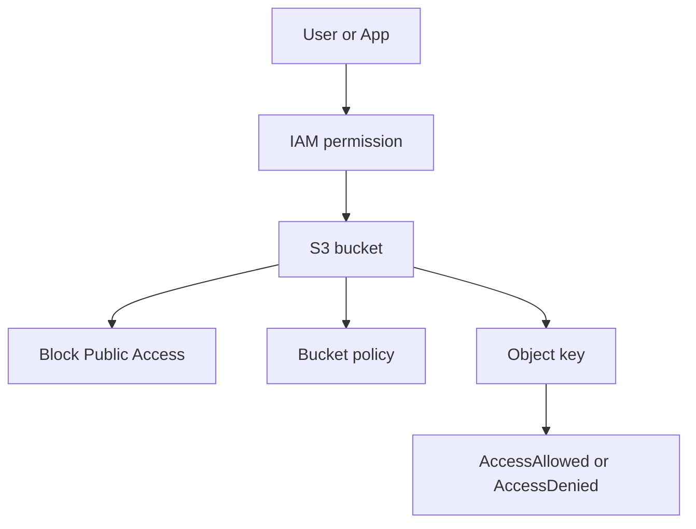

# 2교시: S3 bucket/object/public access

## 실습 확인 기록

| 명령/확인 | 결과 |
|---|---|
| | |

## 확인 질문 답변

| 질문 | 답변 |
|---|---|
| bucket과 object의 차이는? | **bucket**=object를 담는 container(Region 안에 만들지만 이름은 **전역 유일**), **object**=key를 가진 실제 데이터 단위. 삭제·권한 범위를 이 단위로 잡음 |
| object URL이 있으면 public인가? | 아니다. URL은 **주소 표현일 뿐**. 실제 접근은 IAM·bucket policy·Block Public Access가 함께 결정 → URL 있어도 **403 AccessDenied**가 정상 |
| 접근을 결정하는 계층들은? | ① IAM identity policy(누가) ② bucket policy(resource 기반) ③ Block Public Access(공개 차단 안전장치) ④ (ACL은 요즘 비권장). 한 화면만 보고 판단하지 않음 |
| Block Public Access의 역할은? | **의도치 않은 공개를 막는 안전장치**. account/bucket 수준에서 적용되고, public policy가 있어도 **BPA가 우선**해서 차단 |
| 왜 기본이 "차단"이어야 하나? | S3 공개 사고(개인정보·실습 파일 노출)가 흔함. 공개는 **명확한 목적(정적 웹·공개 자료)** 있을 때만, 그것도 **필요한 key 범위만** |
| IAM으로는 되는데 브라우저(curl)로는 안 되면? | 정상. **IAM 경로 접근 ≠ public 접근**. IAM identity는 권한이 있고, 익명 브라우저 요청은 BPA/policy로 막힌 것 |
| ACL 대신 policy를 쓰는 이유는? | 최신 S3는 Object Ownership **bucket owner enforced**로 ACL 비활성 권장. 접근은 IAM/bucket policy로 관리 → ACL·policy 혼용은 복잡도만 늘림 |

## notes

- **한 줄 요약**: S3 public access는 **URL 하나가 아니라** Block Public Access·policy·IAM·object key가 **함께** 결정한다
- **bucket vs object**: bucket=container(전역 유일 이름, Region에 위치), object=key를 가진 데이터. S3는 "서버의 폴더"가 아니라 `bucket + object + key + Region + policy`가 결합된 **object storage**
- **구조로 보기**:

- **접근 결정 계층 (한 화면만 보면 안 됨)**:
  | 계층 | 역할 |
  |---|---|
  | IAM identity policy | 누가(어떤 principal) 접근하나 |
  | bucket policy | resource 기반 접근 규칙(JSON) |
  | Block Public Access | 공개를 막는 안전장치 (policy보다 **우선**) |
  | ACL | (레거시, bucket owner enforced면 비활성) |
- **URL ≠ 공개**: object URL은 존재만으로 접근 허용이 아님. 익명 요청은 **403 AccessDenied**가 기본이자 정상. "URL 있으니 누구나 본다"가 대표 오해
- **공개가 필요할 때의 태도**: 정적 웹/공개 자료처럼 목적이 분명할 때만, **필요한 key 범위만**, 그리고 "의도한 공개"임을 evidence로 남김
- **S3를 직접 공개하지 말고 CloudFront 앞단에 두는 걸 권장**: bucket을 public으로 여는 대신 **CloudFront(CDN)에 매핑**해서 서빙하는 게 실무 패턴.
  - 구조: `User → CloudFront(HTTPS/캐시/edge) → (OAC) → S3(비공개 유지)`
  - bucket은 **Block Public Access를 켠 채 비공개**로 두고, CloudFront의 **OAC(Origin Access Control)**만 접근을 허용 → S3를 인터넷에 직접 노출하지 않음
  - 이점: ① S3 직접 공개 안 함(보안) ② edge 캐시로 latency↓·**S3 요청 비용↓** ③ HTTPS·도메인·WAF를 CloudFront에서 통제
  - 즉 "bucket을 public으로 여는가?"의 더 나은 답은 대개 **"아니오, CloudFront로 서빙한다"**.
  - **OAC(Origin Access Control)란**: CloudFront가 S3(origin)에 접근할 때 쓰는 **전용 접근 신원**. bucket은 비공개로 두고, CloudFront가 **SigV4 서명**으로 요청 → S3 **bucket policy가 "이 distribution ARN만 허용"**. 결과: 사용자가 S3 URL을 직접 치면 **403**, CloudFront 경유하면 **200**.
    | | OAI (구식) | **OAC (현재 권장)** |
    |---|---|---|
    | 정식 | Origin Access **Identity** | Origin Access **Control** |
    | 상태 | 레거시(신규 지양) | AWS 현재 권장 |
    | 서명/지원 | 옛 방식, S3 위주 | **SigV4**, SSE-KMS 암호화 object도 지원 |
    - 새로 만들면 **OAC**를 쓴다. OAI는 기존 구성 호환용.
  - **CloudFront + ACM은 "커스텀 도메인 쓸 때만" 묶인다**:
    | 상황 | ACM 필요? | 인증서 Region |
    |---|---|---|
    | `*.cloudfront.net` 기본 도메인 | ❌ 불필요 (CloudFront 기본 HTTPS 제공) | — |
    | 내 커스텀 도메인(cdn.example.com) 붙이기 | ✅ 필요 (CNAME에 SSL 인증서 필요) | **us-east-1 고정** |
    - ⚠️ CloudFront에 붙일 ACM 인증서는 **반드시 `us-east-1`(버지니아)에서 발급**. 서울(`ap-northeast-2`)에서 만들면 CloudFront 목록에 **안 뜬다**(대표 실수).
    - 전체 그림: `User →(내 도메인, HTTPS) Route 53 → CloudFront (+ ACM, us-east-1) → OAC → S3(비공개)`
- **복구/정리 순서**:
  | 상황 | 먼저 볼 화면 | 조치 |
  |---|---|---|
  | object가 안 열림 | key, BPA, policy | 공개 목적이 맞는지부터 |
  | bucket 삭제 안 됨 | object/version list | **object·version부터 비우고** bucket 삭제 |
  | public 경고 | Permissions tab | 의도한 공개인지 evidence |
- 흔한 실패 3개:
  - ① **Region**을 틀림
  - ② public policy와 **Block Public Access 충돌**을 못 봄 (BPA가 우선)
  - ③ **object 삭제 → bucket 삭제** 순서를 놓침 (안 비우면 삭제 실패)

## Blocker Log

| 증상 | 확인한 것 |
|---|---|
| | |
