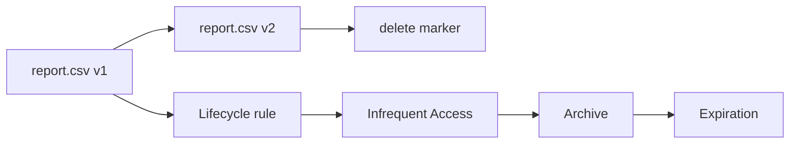

# 3교시: S3 versioning/lifecycle/storage class

## 실습 확인 기록

| 명령/확인 | 결과 |
|---|---|
| | |

## 확인 질문 답변

| 질문 | 답변 |
|---|---|
| Versioning을 켜면 삭제 의미가 어떻게 바뀌나? | 삭제가 **delete marker를 얹는 것**으로 바뀜. current로는 안 보이지만 **이전 version은 그대로 남음**. 그래서 "삭제했다"고 복구 불가라고 단정 못 함 |
| delete marker란? | versioning 상태에서 `delete-object` 시 얹히는 **삭제 표시**. 이걸 지우면 이전 version이 다시 latest가 됨(복구). 즉 삭제가 **비파괴적** |
| Versioning의 숨은 비용은? | 이전 version이 **계속 저장되어 비용**. lifecycle 없이 방치하면 "지운 줄 안 데이터"가 쌓여 요금 발생 |
| Lifecycle rule은 뭘 자동화하나? | 오래된 object를 **더 싼 storage class로 전환(transition)**하거나 **만료(expiration)**시킴. noncurrent version도 별도로 만료 가능 |
| storage class는 뭘 기준으로 고르나? | "싸 보이는 것"이 아니라 **접근 빈도·지연 요구·가용성**. 자주/저지연=Standard, 패턴 모름=Intelligent-Tiering, 가끔=IA, 장기보관=Glacier(복구 시간·비용 evidence) |
| archive로 보내면 안 되는 데이터는? | **자주 읽는 데이터**. Glacier 계열은 다시 읽을 때 **복구 지연·요청 비용**이 생겨 장애처럼 보일 수 있음 |
| Versioning을 suspend하면? | 기존 version은 **그대로 남음**(사라지지 않음). 이후 업로드만 version 관리를 멈춤 → 정리하려면 별도로 version 삭제 필요 |

## notes

- **한 줄 요약**: S3 versioning은 **복구 가능성**을 높이지만, lifecycle 없이 방치하면 **오래된 version도 비용**이 된다
- **핵심**: S3 비용은 bucket 존재만으로 끝이 아니라 **object 크기 · 요청 수 · storage class · version 보존 · lifecycle**의 함수. current object만 보면 비용·삭제 판단이 부족함
- **구조로 보기**:

- **삭제 ≠ 사라짐 (versioning 상태)**: `delete-object` → **delete marker**가 latest로 얹힘 → current로는 안 보임 but **version은 잔존**. marker 제거로 복구 가능(비파괴적)
- **storage class 판단 (4가지 질문)**:
  | 접근 패턴 | 후보 | 주의 |
  |---|---|---|
  | 자주 읽고 저지연 | S3 Standard (기본) | — |
  | 패턴을 모름 | Intelligent-Tiering | 자동 계층화(모니터링 비용 소액) |
  | 가끔 읽음 | Standard-IA / One Zone-IA | 가용성 조건 함께 봄(One Zone=단일 AZ) |
  | 장기 보관/아카이브 | Glacier 계열 | **복구 시간·요청 비용**을 evidence로 |
  - Express One Zone(초저지연)은 latency-sensitive workload 만났을 때 문서로 재확인할 확장 주제
- **비용 구조는 "저장 vs 꺼내기"가 반대로 간다 (핵심)**:
  | class | 저장(storage) | 꺼내기(retrieval) | 성격 |
  |---|---|---|---|
  | Standard | **비쌈** | **싸고 빠름**(즉시) | 자주 읽는 데이터 |
  | Glacier/archive | **쌈** | **비싸고 느림**(복구 지연) | 거의 안 읽는 데이터 |
  - 즉 archive는 "저장은 싸지만 꺼낼 때 비싸고 느린" 대신, Standard는 "저장은 비싸지만 즉시 싸게 꺼내는" 구조. **어느 쪽이 싼지는 "얼마나 자주 꺼내느냐"에 달림.**
- **법적 보관(legal retention) 시나리오 = archive의 대표 용도**:
  - 규정상 **N년 보관 의무**가 있지만 실제로는 **거의 꺼내볼 일이 없는** 데이터(예: 오래된 거래·로그·계약 기록).
  - 이런 걸 **Standard에 계속 두면**: 꺼내지도 않는데 **비싼 저장료**를 계속 냄(=빠른 꺼내기 프리미엄을 낭비).
  - 그래서 **일정 기간이 지나면 lifecycle transition으로 Glacier 같은 싼 class로 옮김.** 꺼낼 일이 거의 없으니 retrieval이 비싸도 총비용이 훨씬 낮음.
  - 판단 공식: **"보관 의무 있음 + 접근 거의 없음" → 기간 경과 후 archive로 자동 전환**(lifecycle). 삭제(expiration)는 보관 의무가 끝난 뒤에만.
  - **archive를 꺼내는 전형적 순간**: 감사(audit)·법적 분쟁(e-discovery)·연말 정산/결산(1년치 몰아서)·사고 조사. 공통점은 **평상시 접근≈0, 필요할 때만 대량으로 한 번**. "감사·연 1회 정산 때나 1년치를 본다"면 그건 archive의 교과서적 대상.
  - archive 안에서도 복구 속도로 나뉨: `Glacier Instant Retrieval`(즉시) / `Glacier Flexible`·`Deep Archive`(몇 시간, 더 쌈) → **얼마나 빨리 꺼내야 하나**로 선택.
- **lifecycle 3요소**: transition(더 싼 class로 전환) / expiration(current 만료) / **NoncurrentVersionExpiration**(이전 version 만료) — versioning 켰으면 이게 비용 정리의 핵심
- **S3 지표는 하루 1회라 실시간 판단에 부적절**:
  | 지표 종류 | 주기 | 비용 | 용도 |
  |---|---|---|---|
  | 스토리지 지표(`BucketSizeBytes`, `NumberOfObjects`) | **하루 1회** | 무료·자동 | 용량/비용 **추세** |
  | 요청 지표(`AllRequests`, `4xxErrors`, `FirstByteLatency` 등) | **1분** | 유료·bucket별 opt-in | 실시간 운영 모니터링 |
  - "S3 지표가 하루 한 번이라 의미 없다"는 **스토리지 지표** 얘기 → 실시간이 필요하면 **요청 지표를 켜거나** S3 access log/CloudTrail을 봄.
  - **"UTC 9시"의 정체 = 시간대**: 스토리지 지표 timestamp는 보통 **00:00 UTC** 기준인데, KST=UTC+9라 콘솔에서 **오전 9시**에 찍힌 것처럼 보임. 실제 수집 주기는 하루 1회(`00:00 UTC == 09:00 KST`).
- **불완전 multipart upload = 눈에 안 보이는 비용 함정**:
  - S3는 **single object 최대 5TB**. 큰 파일을 SDK로 올리면 한 트래픽으로 안 보내고 **multipart로 쪼개 병렬 업로드** → 빠르고 재시도에 강함.
  - 문제: 네트워크 등으로 **중간에 끊기면** 이미 올라간 part들이 **완성되지 않은 채 bucket에 남음**.
  - 이 불완전 part는 **일반 object 목록/콘솔에는 안 보이지만 저장 비용은 그대로 나감** → "object도 없는데 왜 요금이?"의 흔한 원인.
  - 정리법: **lifecycle rule의 `AbortIncompleteMultipartUpload`** (예: 7일 지난 미완성 업로드 자동 삭제), 또는 `aws s3api list-multipart-uploads`로 찾아 `abort-multipart-upload`.
  - 즉 lifecycle은 object/version뿐 아니라 **미완성 multipart까지** 정리 대상에 넣어야 비용 누수를 막음.
- **복구/정리 기준**:
  | 설정 | 도움 | 주의 |
  |---|---|---|
  | Versioning enabled | 덮어쓴 object 복구 | 이전 version이 비용 |
  | Lifecycle transition | 오래된 object 비용 절감 | archive 복구 지연 |
  | Expiration | 실습/임시 파일 자동 정리 | 필요한 데이터가 사라질 수 있음 |
  | Delete marker | 삭제 상태 표현 | 실제 version은 남아 있음 |
- 흔한 실패 3개:
  - ① versioning 켜놓고 **오래된 version 방치**(lifecycle 없음 → 비용 누적)
  - ② **archive 전환 후 즉시 읽을 수 있다고** 생각(복구 지연)
  - ③ lifecycle rule **scope를 전체 bucket으로** 잘못 설정(의도치 않은 만료)

## Blocker Log

| 증상 | 확인한 것 |
|---|---|
| | |
