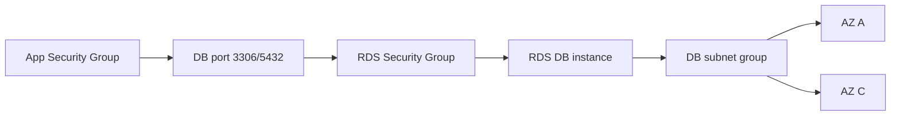

# 4교시: RDS 생성 전 운영 경계

## 실습 확인 기록

| 명령/확인 | 결과 |
|---|---|
| | |

## 확인 질문 답변

| 질문 | 답변 |
|---|---|
| "managed service니까 보안 신경 안 써도 된다"가 왜 틀리나? | RDS는 engine 설치·패치를 대신해줄 뿐, **VPC·subnet group·public access·SG·backup·deletion protection은 내가 결정**. managed ≠ 보안 책임 소멸 |
| DB 접속 실패, 첫 확인은 password인가? | 아니다. **network boundary**부터: ① public access ② subnet route ③ **SG inbound** ④ 그다음 credential. password보다 SG/network 문제가 흔함 |
| DB subnet group이 필요한 이유는? | RDS는 VPC 안에 놓이고, 장애 대비로 **최소 2개 AZ의 subnet 묶음**을 요구. 어느 AZ/subnet에 배치될지의 경계 |
| Public access와 SG의 관계는? | PubliclyAccessible=true여도 **SG inbound가 막으면 접속 불가**, false여도 SG가 열려 있어야 VPC 내부에서 접속. **둘을 함께** 봐야 함 |
| DB port를 `0.0.0.0/0`으로 열면? | DB가 **public internet에 노출** → 스캔·무차별 대입 표적. inbound source는 반드시 **app SG(또는 특정 관리 경로)**로 제한 |
| 실습에서 실제 생성 대신 뭘 하나? | 비용/삭제 시간이 부족하면 **Create database 화면·파라미터를 읽는 시뮬레이션**으로 대체. 선택값과 **선택하지 않은 이유**를 evidence로 |
| RDS 생성 전 먼저 정할 3가지 경계는? | **network**(VPC/subnet group), **security**(public access/SG inbound), **cost/삭제**(instance class/Multi-AZ/backup/deletion protection) |

## notes

- **한 줄 요약**: RDS는 database보다 먼저 **VPC · subnet group · Security Group · public access 경계**를 읽어야 한다
- **핵심**: RDS는 단독 서버가 아니라 **VPC/subnet/SG 경계 안**에 놓인 managed DB. **DB 접속 실패는 password보다 network boundary 문제일 때가 많다**
- **구조로 보기**:

- **접속 실패 진단 순서 (password는 맨 나중)**:
  | 순서 | 확인 | 증상 |
  |---|---|---|
  | ① public access | PubliclyAccessible + 접근 경로 | 외부에서 아예 안 닿음 |
  | ② subnet/route | subnet group·라우팅 | VPC 밖에서 도달 불가 |
  | ③ **SG inbound** | DB port가 app SG 허용? | **timeout**(대부분 여기) |
  | ④ credential | username/password | **auth 실패**(연결은 됨) |
- **필수 결정 항목 (생성 전)**:
  | 항목 | 운영 기준 | 실습 기준 |
  |---|---|---|
  | Engine | app 요구·운영 경험 | MySQL/PostgreSQL 중 하나 |
  | Instance class | 성능·비용 균형 | 가장 작은 실습 크기 |
  | Public access | **private 우선** | 공개 필요 시 사유 기록 |
  | Security Group | **app SG에서만** DB port | **`0.0.0.0/0` DB port 금지** |
  | Multi-AZ / backup / deletion protection | 가용성·복구 | 5교시에서 다룸 |
- **port 기본값**: MySQL/MariaDB **3306**, PostgreSQL **5432** — SG inbound·app 연결 문자열이 이 port와 맞아야 함
- **public access ↔ SG는 AND 조건**: 둘 중 하나만 봐서는 접속 가능 여부를 판단 못 함. endpoint 공개 여부와 SG 허용을 **함께** 확인
- **DB public access의 현실 원칙 (운영 vs 개발)**:
  - **운영(production): 아예 열지 않는다 — 금기 사항.** DB를 인터넷에 노출하는 건 스캔·무차별 대입의 직접 표적. app은 VPC 내부(private)에서만 접근.
  - **개발(dev): 급할 때 가끔 임시로** 열기도 함(로컬에서 직접 붙어 디버깅 등). 단 **내 IP만 SG로 한정 + 끝나면 즉시 닫기**, `0.0.0.0/0`은 개발에서도 지양.
  - 즉 "public access를 켤 것인가?"의 기본 답은 **운영=절대 No, 개발=필요 시 한시적 Yes(범위 최소화)**. 열었으면 evidence에 **이유·기간·닫음**을 남긴다.
- **RDS storage: gp2 vs gp3 (IOPS가 용량에 묶이냐 분리되냐)**:
  - **gp2**: IOPS = **3 × 용량(GB)**, baseline이 용량에 종속. → **3000 IOPS를 상시로 내려면 1TB(1000GB)** 필요. 작은 볼륨은 **burst로만 잠깐 3000**, credit 소진되면 baseline으로 하락. 성능 때문에 **필요 없는 용량까지 사야 하는** 낭비 발생.
  - **gp3**: 기본 **3000 IOPS + 125 MB/s가 용량과 무관하게 baseline**. RDS gp3는 **최소 20GB로도 3000 IOPS 상시**(burst 아님). 성능이 더 필요하면 **IOPS/처리량만 용량과 따로 증설**(최대 16000 IOPS·1000 MB/s).
  | | gp2 | gp3 |
  |---|---|---|
  | IOPS 결정 | **용량 종속**(3 IOPS/GB) | **용량과 분리**, 기본 3000 |
  | 3000 IOPS 상시 | **1TB 필요** | **20GB로도 가능** |
  | 작은 볼륨 | burst 의존(소진 시 하락) | baseline이 이미 3000 |
  | 성능 더 필요 | 용량을 키워야 | **IOPS만 따로** 증설 |
  - 결론: **gp3가 "작은 용량 + 높은 성능"을 싸게 낸다** → 요즘 RDS/EBS 기본 권장은 **gp3**. 같은 3000 IOPS도 gp2는 1TB, gp3는 20GB.
  - **그럼 gp2는 언제 쓰나? → 신규 선택지가 아니라 "레거시"**:
    - gp3가 단가(~20% 저렴)·성능 모두 우위라 **gp2를 새로 고를 기술적 이유는 거의 없음**.
    - gp2가 아직 보이는 건 대부분 **관성**: ① gp3(2020말 출시) 이전 만든 레거시 볼륨 ② 오래된 AMI/모듈/서비스 기본값이 gp2 ③ 운영 중 DB를 안 건드림 ④ 드문 미지원 환경.
    - 판단: **신규=gp3**, **기존 gp2=특별한 이유 없으면 gp3로 전환**(보통 무중단), **3000 IOPS↑ 극한 성능·고가용=io2 Block Express**. gp2는 "선택"이 아니라 "아직 남아 있는 것".
- **RDS Proxy = 많은 바깥 연결을 소수 DB 연결 pool로 좁히는 관리형 connection pooler**:
  - 밖(client→proxy): app 연결이 **수백~수천 개**(Lambda/container 스케일아웃 시 폭증). 안(proxy→DB): proxy가 **작은 연결 pool을 재사용** → DB가 감당하는 실제 연결은 훨씬 적음. ("하나로"까지는 아니고 **다수→소수 재사용**)
  - 배경 문제: DB는 **동시 연결 수 한계 + 연결마다 메모리** 소비. Lambda/container가 스케일아웃하면 **connection 고갈 → 장애**. 4교시 앞부분의 "Lambda가 RDS 많이 열고 닫으면 고갈"의 해법이 이것.
  - 이점: 연결 고갈 억제(pooling), 연결 재사용, **failover를 proxy가 흡수**해 앱 체감 다운타임↓, Secrets Manager 연동 인증.
  - **요금**: 공짜 아님. **DB instance vCPU 수 × 시간**(대략 vCPU당 ~$0.015/h, 리전별 상이) → 상시 켜두면 상시 비용. **connection 고갈이 실제 문제인 워크로드에만** 쓰는 게 합리적.
- 흔한 실패 3개:
  - ① **free tier만 보고** instance class 선택(요구·비용 무시)
  - ② **DB port를 public**(`0.0.0.0/0`)으로 엶
  - ③ **subnet group 의미**를 놓침(2 AZ 요구·배치 경계)

## Blocker Log

| 증상 | 확인한 것 |
|---|---|
| | |
