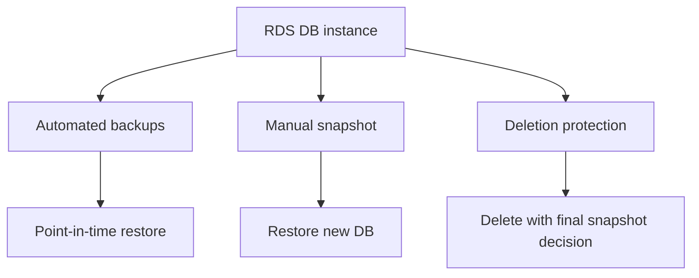

# 5교시: RDS backup/snapshot/deletion protection

## 실습 확인 기록

| 명령/확인 | 결과 |
|---|---|
| | |

## 확인 질문 답변

| 질문 | 답변 |
|---|---|
| automated backup과 manual snapshot의 차이는? | **automated**=retention 기간 안에서 자동 생성, DB 삭제 시 원칙적으로 함께 정리(retention 만료로 사라짐). **manual**=사용자가 명시적으로 남기는 시점 백업, **직접 지우기 전까지 유지**(중요 변경 전후에) |
| restore는 원본 DB를 되살리나? | 아니다. restore는 **새 DB instance를 만드는** 흐름. 원본을 덮어쓰지 않음 → endpoint/이름이 새로 생기고 app 연결도 새로 맞춰야 함 |
| point-in-time restore(PITR)의 조건은? | **automated backup이 켜져 있고**, retention 구간 내 시점이어야 함. `LatestRestorableTime`과 earliest 사이의 임의 시점으로 새 DB 생성 |
| backup retention이 짧으면? | 원하는 **과거 시점으로 못 돌아감**. retention이 곧 **RPO(어디까지 되돌리나)의 상한**. 운영은 요구사항에 맞게, 실습은 짧게 |
| deletion protection 때문에 삭제가 안 되면? | 오류가 아니라 **의도된 안전장치**. `modify --no-deletion-protection`으로 **의도 확인 후** 해제해야 삭제 가능 |
| 삭제 시 final snapshot은? | 삭제 직전 **마지막 복구 지점**. 남기면 안전(단 비용), `--skip-final-snapshot`이면 복구 지점 없이 완전 삭제. 실습 DB는 비용/복구 비교로 결정 |
| "resource 지웠으니 비용 끝"이 RDS에서도 틀린 이유는? | **manual snapshot·retained automated backup·final snapshot이 남아 storage 비용**. 삭제 후 snapshot 목록을 확인해야 진짜 정리 |

## notes

- **한 줄 요약**: RDS 삭제는 resource 제거가 아니라 **마지막 복구 지점과 남을 비용을 결정하는 절차**
- **핵심**: backup은 체크박스가 아니라 **복구 약속**. 자동 백업이 켜져도 **retention이 짧으면** 원하는 시점으로 못 돌아감. 삭제 버튼보다 **final snapshot 판단이 먼저**
- **구조로 보기**:

- **automated vs manual snapshot**:
  | | Automated backup | Manual snapshot |
  |---|---|---|
  | 생성 | 자동(backup window) | 사용자가 명시적으로 |
  | 보존 | **retention 기간**만(만료 시 삭제) | **직접 지울 때까지** |
  | 복구 | **PITR**(임의 시점) | 그 snapshot 시점으로 새 DB |
  | 용도 | 일상적 복구 지점 | 중요 변경 전/삭제 전 명시적 백업 |
- **restore = 새 DB 생성 (원본 덮어쓰기 아님)**: 복구하면 **새 instance**가 뜸 → endpoint/이름 바뀜, app 연결 문자열·SG 다시 맞춰야 함. "원래 DB가 즉시 되돌아온다"는 오해
- **RPO / RTO (복구 목표 용어 세트)**:
  | 약자 | 풀네임 | 질문 | 성격 |
  |---|---|---|---|
  | **RPO** | Recovery **Point** Objective | **얼마나 옛날 데이터까지** 잃어도 되나 | 데이터 손실량(시점) |
  | **RTO** | Recovery **Time** Objective | **얼마나 빨리** 복구해야 하나 | 다운타임(시간) |
  - RPO = "마지막 복구 지점 ~ 장애" 사이 **날아가는 데이터의 최대치**. RPO 5분=최근 5분치까지만 손실 허용, RPO 0=한 건도 안 됨(실시간 복제 등 비쌈).
  - RDS 연결: **backup retention이 RPO 상한**, **PITR log 주기(~5분)**가 실질 RPO 하한. "retention 며칠?"이 곧 "RPO 설명 가능한가".
  - 앞 PITR에서 "복원이 오래 걸린다"=**RTO**, "X 이후 데이터 사라짐"=**RPO**.
- **PITR(Point-in-Time Recovery) = 임의 "시각"으로 정밀 복구**:
  - snapshot은 "찍어둔 그 지점"만 고르지만, PITR은 **retention 구간 안의 아무 시각이나(초 단위)** 지정해 그 순간 상태로 복구.
  - 원리: **automated backup(기준점) + transaction log(약 5분 간격 S3 저장)**를 **재생(replay)** → 지정 시각 상태의 **새 DB** 생성.
  - 조건: **automated backup 켜져 있어야**(retention ≥ 1일). 복구 범위 = `EarliestRestorableTime ~ LatestRestorableTime`(보통 현재-약5분). **retention 길이가 되돌릴 수 있는 상한(RPO)**.
  - 용도: "어제 15시에 테이블 날림" → **15시 직전 시각**으로 PITR = 사고 직전 복구. snapshot으론 그 사이 시점을 못 잡음.
  - PITR vs snapshot: **PITR=자동백업 기반 임의 시각 정밀 복구**, **snapshot=내가 명시적으로 남긴 지점 복구**. 둘 다 결과는 **새 instance**.
- **PITR 운영 현실 (retention 범위 + "시점을 알아야" 빠르다)**:
  - RDS PITR은 **분 단위** 복구를 제공하고, retention은 **기본 7일 / 최대 35일**(1~35일 설정 가능, 0이면 비활성). 이 구간 안에서 원하는 시각을 골라 recovery.
  - 전형적 요청: 다른 팀이 "**이 시각 이전으로 되돌려 주세요**" → 그 직전 시각으로 PITR.
  - ⚠️ **함정: 에러 시점을 정확히 모르면 시행착오 지옥**. "이때 아닌 것 같아요, 몇 시 몇 분인 것 같아요" 식으로 **여러 번 복구를 반복**하면 매우 오래 걸림. **복원 자체도 새 instance를 만드는 거라 시간이 많이 걸림**(데이터·log 재생) → 추측 복구를 반복하면 시간이 배로.
  - 그래서 **정확한 사고 시각을 먼저 확보**하는 게 핵심: CloudWatch Logs/Metrics, CloudTrail, app error 로그로 **"몇 시 몇 분에 무슨 일"**을 특정하고 그 직전 시각 1회로 복구. 시점을 알면 PITR이 강력하고, 모르면 느리고 비싸다.
  - ⚠️ **복구는 기술 결정이 아니라 합의가 먼저**: 복원한 DB로 전환하려면 보통 app을 **그쪽으로 cut-over**해야 하고, 그 사이 **서버 다운(사용자 접속 차단)**이 생김 → **"서버 내려도 되는지" 사전 허락**을 관계자에게 받아야 함.
    - **cut-over란**: 준비된 **새 대상으로 실제 트래픽/연결을 전환하는 순간의 작업**. PITR은 새 DB를 만들 뿐이라, app의 **연결 엔드포인트(연결 문자열/Secrets/환경변수)** 또는 **DNS(Route 53)**를 새 DB로 바꿔 끼워야 트래픽이 넘어감. 옛 DB를 계속 보고 있으면 복구가 무의미. 이 전환 순간에 보통 **다운타임**이 생겨 사전 계획·승인 필요. (DB 복구뿐 아니라 마이그레이션·배포·시스템 교체에서 두루 쓰는 용어.)
  - 또한 "X 시각 이전으로 되돌리면" **X 이후에 쌓인 데이터는 사라짐** → 이 **데이터 손실 범위도 합의** 대상. 즉 복구 전에 ① 다운타임 승인 ② 손실 데이터 범위 ③ 복구 대상 시각을 관계자와 확정하고 evidence로 남긴다.
- **삭제 전 체크리스트**:
  | 확인 | 값 | 판단 |
  |---|---|---|
  | 어느 시점 복구 가능? | retention, LatestRestorableTime | RPO 설명 가능한가 |
  | final snapshot 남길까? | final snapshot option | 복구 필요성 vs 비용 |
  | 삭제가 막히나? | deletion protection | 의도적 안전장치인지 |
  | 뭐가 남나? | snapshots, retained backups | **비용 후보로 기록** |
- **SDK란 (용어 정리)**: **Software Development Kit** — 앱 코드에서 AWS(또는 어떤 서비스)를 **함수 호출로 다루게 해주는 언어별 라이브러리**. 사람이 콘솔에서 클릭하는 걸 프로그램이 코드로 자동화.
  | 방법 | 형태 | 예 |
  |---|---|---|
  | 콘솔 | 웹 화면 클릭 | 브라우저 S3 업로드 |
  | CLI | 터미널 명령 | `aws s3 cp ...` |
  | **SDK** | **앱 코드 내 함수 호출** | `s3.upload_file(...)` |
  - 언어별 이름: Python=**boto3**, JS/Node=AWS SDK for JavaScript, Java=AWS SDK for Java 등.
  - 연결: 3교시 "SDK로 큰 파일 올리면 multipart로 병렬 업로드"·6교시 "Secrets Manager를 SDK `get_secret_value`로 읽음"이 다 이 맥락.
- **RDS stop(일시 중지)은 "최대 7일"뿐 — 자동 재기동에 주의**:
  - 중지한 DB instance는 **최대 7일 후 AWS가 자동으로 다시 켬** → "꺼놨으니 안심"하다 **모르게 다시 과금** 시작.
  - 게다가 **중지 중에도 storage·automated backup·PITR log 비용은 계속** 나감(compute만 멈춤). 즉 stop은 장기 비용 절감 수단이 아님.
  - 판단: **장기 미사용이면 snapshot 남기고 삭제**가 맞음(snapshot으로 언제든 새 DB 복원). stop은 **며칠 안에 다시 쓸 때만** 임시로.
- **instance class: T 시리즈(burstable)를 운영에서 피하는 이유**:
  - **T(t3/t4g)=burstable**: 평소 baseline 성능만 주고 안 쓴 동안 **CPU 크레딧을 모음**, 부하 오면 크레딧 태워 **잠깐 burst**, **크레딧 소진 시 baseline으로 추락**(unlimited면 추가 요금). → gp2 IOPS burst와 같은 구조.
  - 운영 DB/서버는 보통 **꾸준한 부하** → 크레딧을 계속 태우다 **소진되면 갑자기 느려짐**(그것도 부하 몰릴 때). 이 예측 불가 저하 때문에 **일관된 성능이 필요한 production은 고정 성능 M/C/R**을 씀.
    | 시리즈 | 성격 | 용도 |
    |---|---|---|
    | **T** (t3/t4g) | burstable·저렴 | 낮거나 가끔 튀는 부하 |
    | **M** (m6i/m7g) | 범용 균형(고정) | 일반 운영 DB/앱 |
    | **C** | compute 최적 | CPU 집약 |
    | **R** | memory 최적 | 대용량 메모리 DB |
  - 단 **"운영에서 절대 금지"는 과장**: 트래픽 낮고 간헐적(내부 툴·소규모 API·dev/staging)이면 T도 정당. 판단 기준은 **"운영이냐"가 아니라 "부하가 꾸준하냐 간헐적이냐"**(gp2/gp3 IOPS 고를 때와 같은 사고).
- 흔한 실패 3개:
  - ① **backup retention을 모름**(복구 가능 시점을 설명 못 함)
  - ② **final snapshot 비용**을 고려 안 함(남겨놓고 방치)
  - ③ **deletion protection을 오류로** 봄(안전장치인데 당황)

## Blocker Log

| 증상 | 확인한 것 |
|---|---|
| | |
