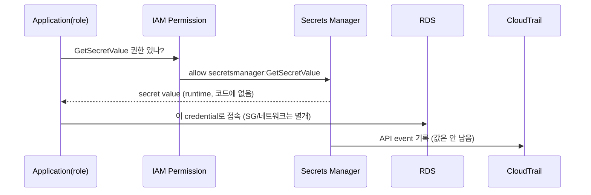

# 6교시: Secrets Manager와 credential 운영

## 실습 확인 기록

| 명령/확인 | 결과 |
|---|---|
| | |

## 확인 질문 답변

| 질문 | 답변 |
|---|---|
| credential을 코드·README·screenshot·메신저에 남기면 왜 위험한가? | 그 노출면이 전부 **영구 유출 경로**. git은 지워도 history/포크에 남고, screenshot·로그·메신저는 캡처·백업으로 퍼짐. 한 번 샌 password는 **교체 전까지 계속 유효** → 코드가 아니라 **secret store + 런타임 읽기**로 분리 |
| Secrets Manager가 하는 일과 안 하는 일은? | **하는 일**=secret 값을 저장하고 IAM으로 접근 제어, rotation·audit 연동. **안 하는 일**=네트워크 연결을 열어주지 않음. app은 SM에서 credential을 **읽고** 그 값으로 (SG/네트워크로) RDS에 접속 |
| app이 secret을 읽으려면 무엇이 필요한가? | IAM 권한 **`secretsmanager:GetSecretValue`**(+ KMS `kms:Decrypt`). 값은 코드에 박지 않고 **런타임에 `get-secret-value`로** 읽음. 권한이 없으면 값은 못 봄(AccessDenied) |
| IAM policy와 resource policy의 차이는? | **identity policy**=이 principal이 "무엇을 할 수 있나"(app role에 GetSecretValue). **resource policy**=secret 쪽에서 "누가 접근 가능한가"를 명시(교차 계정 등). 최소 권한은 **읽어야 할 role에게만** GetSecretValue |
| rotation은 무엇이고 backup과 어떻게 다른가? | rotation=**credential을 주기적으로 자동 교체**(보통 Lambda가 새 password 생성→DB 반영→secret 갱신). backup=값 **복구**용. rotation은 "오래된 password를 계속 쓰지 않게" 하는 것 → **backup이 아님** |
| secret 접근은 어떻게 감사하나? | **CloudTrail**에 `GetSecretValue`·`CreateSecret`·`DeleteSecret` 등 API event가 기록됨 → "누가 언제 이 secret을 읽었나"를 설명 가능. 값 자체는 CloudTrail에 안 남음 |
| secret 삭제는 즉시인가? | 기본은 **scheduled deletion**(recovery window **최소 7~최대 30일**, 그 사이 `restore-secret`로 복구 가능). 즉시 지우려면 `--force-delete-without-recovery`(복구 불가). 이름 재사용도 window 동안 막힘 |
| evidence에는 무엇을 남기나? | secret **값은 절대 X**. secret **이름**, ARN 일부, **IAM 권한 방향**(어느 role이 GetSecretValue), **CloudTrail event 위치** 중 최소 두 가지. "값이 숨겨진 화면"이 evidence |

## notes

- **한 줄 요약**: secret 운영은 **값을 숨기는 것만이 아니라** 누가 읽고(IAM) · 언제 바뀌고(rotation) · 어떻게 감사되는지(CloudTrail)를 설명하는 것
- **핵심**: password는 코드·git·screenshot에 남기는 순간 **교체 전까지 유효한 영구 유출**. Secrets Manager는 값을 저장·IAM으로 접근 제어하고, **런타임에 `GetSecretValue`로만** 읽게 해서 노출면을 줄인다
- **구조로 보기**:

- **credential이 새는 노출면 (왜 코드에 못 두나)**:
  | 노출면 | 왜 위험 |
  |---|---|
  | git repository | 커밋 지워도 **history·fork·PR**에 잔존, 공개 repo면 봇이 즉시 스캔 |
  | screenshot/배움일기 | 캡처·클라우드 백업으로 퍼짐, 회수 불가 |
  | 로그/메신저 | 검색·백업·타인 열람. env에 박은 password는 로그로 샘 |
  | 컨테이너 image | layer에 박히면 image 배포마다 유출 |
  - 공통점: 한 번 새면 **password 교체 전까지 계속 유효** → "지웠으니 괜찮다"가 안 통함
- **Secrets Manager vs SSM Parameter Store (흔한 선택)**:
  | | Secrets Manager | SSM Parameter Store(SecureString) |
  |---|---|---|
  | 목적 | **secret 전용**(rotation 내장) | 일반 설정 + secret |
  | rotation | **자동(Lambda)** 지원 | 기본 없음(직접 구현) |
  | 비용 | secret당 월 요금 + API 요금 | 표준 파라미터 **무료**(advanced만 유료) |
  | 판단 | rotation/교차계정/RDS 연동 필요 | 단순 설정값·비밀 최소 |
  - 결론: **rotation·RDS 통합·감사**가 중요하면 Secrets Manager, 단순 설정/비용 최소면 Parameter Store. "비용 아끼려 password를 코드에" 대신 최소한 SecureString
- **secret type = "DB password 금고"가 아니라 "credential 금고" 전반**: create secret 화면의 type 목록엔 DB(RDS·**DocumentDB**·Redshift)뿐 아니라 **SaaS API key**(Datadog·Snowflake·Confluent·GitLab·Paddle 등)도 있음. type을 고르게 하는 이유 = Secrets Manager가 **그 서비스에 맞는 rotation 방법**(새 key 생성·반영)을 자동으로 붙이기 위해. 우리 실습 RDS credential type도 같은 맥락.
  - ⚠️ **DocumentDB "MongoDB 호환" 함정**: DocumentDB는 MongoDB **API(wire protocol) 호환**일 뿐 MongoDB 그 자체가 아님 → 일부 기능 미지원. 완전 호환은 MongoDB사의 **Atlas**. **API 호환 ≠ 동일 제품**(마이그레이션 시 미지원 기능 확인).
- **`GetSecretValue` = 런타임 읽기 (코드엔 값이 없음)**: app은 시작 시 `get-secret-value`로 값을 받아 메모리에서 사용. 필요 권한 = IAM `secretsmanager:GetSecretValue` + (암호화 KMS면) `kms:Decrypt`. 값이 코드/env에 없으니 유출면이 줄고, **누가 읽었는지 CloudTrail로 추적**됨
- **IAM 최소 권한 (identity vs resource policy)**:
  - **identity policy**: role/user에 붙여 "이 principal이 무엇을 하나". app role에 해당 secret ARN만 GetSecretValue 허용(`Resource`를 secret ARN으로 좁힘).
  - **resource policy**: secret에 붙여 "누가 접근 가능한가"(교차 계정·특정 role 한정).
  - 함정: 모든 user에게 read를 주면 credential이 사실상 공개. **읽어야 하는 role에게만**, ARN 단위로.
- **"RDS credential type"이 어려운 이유 = rotation Lambda의 VPC/SG 배선 (4교시 경계)**: password를 그냥 **저장**만 하면 쉬움. 어려운 건 **rotation까지 도는 것**:
  - type을 고르려면 **실제 RDS instance가 먼저** 있어야 함(실습은 비용·시간 → 시뮬레이션으로 대체하곤 함).
  - rotation을 켜면 Secrets Manager가 **Lambda(rotation function)**를 만들고, 그 Lambda가 **VPC 안에서 DB에 실제 접속**해 password를 바꿔야 함. 조건:
    | 배선 | 필요 |
    |---|---|
    | 네트워크 | Lambda를 **DB와 같은 VPC/subnet**에 배치 |
    | SG | DB **SG inbound가 Lambda(SG)를 DB port로 허용** |
    | 도달·복호화 | RDS **endpoint 도달** + **KMS `Decrypt`** 권한 |
    - 하나만 어긋나도 rotation이 **조용히 실패** → 4교시 "접속 실패는 password보다 SG/network" 그대로.
  - rotation 전략: **single-user**(그 계정 password만 교체) vs **alternating-user**(무중단 위해 **DB에 두 번째 user 필요**) → 후자는 DB 준비가 더 듦.
  - 그래서 실습은 rotation을 **설정 위치·필요 조건만 확인**하고 실제 구현은 생략(원본 강의도 "구현보다 만들고·누가 읽는지에 집중").
- **rotation ≠ backup (자주 헷갈림)**: rotation은 credential을 **새 값으로 교체**하는 것(오래된 password 무효화). Lambda가 ① 새 password 생성 ② DB에 반영 ③ secret 갱신을 자동 수행. backup(snapshot/version)은 **값 복구**용 → 목적이 반대. "rotation 켜면 복구된다"는 오해
- **삭제는 recovery window가 기본 (즉시 아님)**:
  | 방식 | 명령 | 성격 |
  |---|---|---|
  | scheduled deletion | `--recovery-window-in-days 7~30` | window 동안 `restore-secret`로 복구 가능, 이름 재사용 차단 |
  | 즉시 삭제 | `--force-delete-without-recovery` | **복구 불가**, 실습 정리용 |
  - 실무 기본은 recovery window(오삭제 안전장치). 실습 마무리는 비용 없애려 force delete.
- **비용 구조 (저장 + 호출, 호출은 배포량에 비례)**:
  | 항목 | 요금(대략) | 무엇에 비례 |
  |---|---|---|
  | 저장 | secret **개당 월 ~$0.40** | 만들어두면 방치해도 매달 |
  | API 호출 | **10,000건당 ~$0.05** | `GetSecretValue` 호출 수 |
  - **호출 수 = 배포/기동량**: pod·container가 **뜰 때마다** 시작 시 `GetSecretValue`를 부름 → **재배포·scale-out·pod churn이 많을수록 호출 수↑ → 비용↑**. "배포량만큼 API 비용"이 이 뜻.
  - ⚠️ **10,000건은 "무료 한도"가 아니라 "과금 단위"**: 10,000건당 $0.05라 소량이면 **몇 센트 수준(매우 저렴)**이지만 **0원은 아님**. 상시 무료 10,000건은 없고, 무료는 **30일 free trial**(secret당 월 요금 면제)뿐.
  - 절감: app이 값을 **캐시**해 매 요청·매 기동마다 안 부르게(=호출 수를 배포량 밑으로 낮춤). 실습 secret은 끝나고 삭제
- **CloudTrail로 audit (언제·누가·얼마나)**: `GetSecretValue`/`CreateSecret`/`DeleteSecret` 등 API 호출이 event로 남음. 각 event가 세 축을 답한다:
  | 축 | CloudTrail 필드 | 무엇을 답하나 |
  |---|---|---|
  | **언제** | `eventTime` | 접근 시각(초 단위) |
  | **누가** | `userIdentity`(ARN/role/user), `sourceIPAddress` | 어느 principal이 어디서 |
  | **얼마나** | 같은 secret에 대한 **event 개수·빈도** | 몇 번·얼마나 자주 읽었나(비정상 급증 탐지) |
  - 즉 "언제 누가 얼마나 Secrets Manager에 접근했는지"가 event 스트림으로 기록됨. **secret 값 자체는 CloudTrail에 안 남음** → 감사와 비밀 유지가 양립. 실습 ⑧이 이 event를 조회하는 명령
- **⚠️ CLI로 secret 만들 때 shell history 함정**: `--secret-string '{"password":"..."}'`를 인자로 주면 **shell history/프로세스 목록에 평문**으로 남음. 그래서 실습은 `file://cred.json`으로 읽고 **즉시 `rm`**. 이게 "credential을 안 남긴다"의 실전판
- **evidence 규칙 (값 대신 메타데이터)**: 남기는 것 = secret **이름**, ARN 일부, **어느 role이 GetSecretValue** 권한을 갖는지, **CloudTrail event 위치**. 남기지 않는 것 = secret 값, access key, token. "값이 hidden된 상세 화면"이 좋은 evidence
- 흔한 실패 3개:
  - ① secret **값을 캡처**해 배움일기/evidence에 남김(값은 숨기고 name/권한만)
  - ② **모든 user에게 read 권한**(=credential 공개, 읽을 role에게만 ARN 단위로)
  - ③ **rotation을 backup으로 오해**(rotation=교체, backup=복구, 목적 반대)

## Blocker Log

| 증상 | 확인한 것 |
|---|---|
| | |
