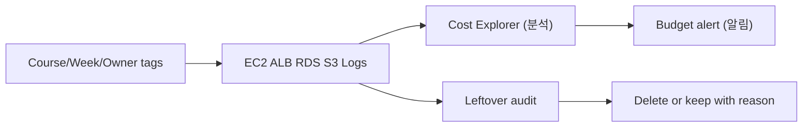

# 7교시: Cost Explorer/tag/잔여 비용 점검

## 실습 확인 기록

| 명령/확인 | 결과 |
|---|---|
| | |

## 확인 질문 답변

| 질문 | 답변 |
|---|---|
| Cost Explorer와 Budget은 각각 무엇에 답하나? | **Cost Explorer**=과거 비용을 service/기간/tag로 **분석**(영수증 해석). **Budget**=임계값 넘으면 **알림**. **둘 다 resource를 삭제·차단하지 않음** → cleanup은 별도 |
| "Budget 만들었으니 비용이 자동 차단"이 왜 틀리나? | Budget은 **알림(notification)**일 뿐 과금을 막지 않음. threshold 넘어도 resource는 계속 돎 → 비용을 멈추려면 **직접 삭제/중지**. (자동 대응은 Budget Action을 따로 구성해야) |
| tag를 붙이면 바로 비용 필터에 뜨나? | 아니다. **cost allocation tag를 활성화(activate)**해야 하고, 반영에 **최대 ~24시간** 지연. 게다가 tag는 **활성화 이후 비용부터** 잡힘(소급 제한) → tag는 **생성 시점에** 붙여야 |
| Cost Explorer 숫자는 실시간인가? | 아니다. **최대 ~24시간 지연**. 그래서 수업 종료 전 + **다음 날** 두 번 확인해야 잔여 비용이 제대로 보임 |
| "resource 지웠으니 비용 끝"이 왜 반복해서 틀리나? | 눈에 안 보이는 **잔여**가 남음: unattached **EIP**, available **EBS volume**, **snapshot**(EBS/RDS), **S3 version**, retention 없는 **CloudWatch log**, **ALB/NAT**. 삭제 **후 검색 결과**가 진짜 evidence |
| 상시 과금과 저장 과금은 어떻게 다른가? | **상시(시간당)**=존재만으로 과금(ALB·NAT·running RDS·**안 붙은 EIP**) → 빨리 지워야. **저장(GB-월)**=데이터 남는 만큼(snapshot·version·log) → 양·retention 관리. 정리 우선순위가 다름 |
| Elastic IP는 왜 "안 쓸 때" 과금되나? | EIP는 **instance에 붙어 running이면 무료**, **안 붙었거나(unattached) stopped**면 **시간당 과금**. "예약만 하고 안 쓰는" 주소가 낭비 → 실습 후 **release** |
| tag는 언제·무엇을 붙이나? | **생성 시점**에 `Course/Week/Owner/Purpose`. 나중에 붙이면 이전 비용은 소급이 안 되고, 누락 resource는 비용 주인을 못 찾음. 활성화까지 해야 필터에 뜸 |

## notes

- **한 줄 요약**: AWS 비용 관리는 마지막 영수증이 아니라 **생성 시 tag → Cost Explorer로 확인 → 잔여 cleanup**으로 도는 운영 루프
- **핵심**: Cost Explorer는 **분석**, Budget은 **알림** — **둘 다 삭제를 대신하지 않는다**. 비용을 멈추는 건 언제나 **직접 cleanup**. 특히 눈에 안 보이는 **잔여 resource**가 "지웠는데 왜 요금?"의 범인
- **구조로 보기**:

- **Cost Explorer vs Budget (역할 구분)**:
  | | Cost Explorer | Budget |
  |---|---|---|
  | 답하는 질문 | **얼마 썼나**(과거 분석) | **넘었나**(임계값 알림) |
  | 기준 | service·기간·**tag** filter | 금액/사용량 threshold |
  | 삭제/차단 | **안 함** | **안 함**(알림뿐, Action 별도) |
  | 지연 | ~24시간 | 알림도 지연 가능 |
  - 공통 함정: **둘 다 resource를 안 지운다.** "봤으니 됐다"가 아니라 **cleanup**까지가 루프.
- **tag는 "생성 시점 + 활성화"가 핵심**:
  - cost allocation tag는 **활성화(activate)**해야 비용 필터에 등장, 반영 **~24h 지연**.
  - "나중에 붙이면 터진다/인식 안 된다"의 원인은 **둘**: ① **활성화 누락**(리소스에 태그가 있어도 Billing에서 활성화 안 하면 필터에 안 뜸) ② **그 기간에 리소스가 untagged**(과거 사용량 자체가 태그 없음 → "no tag value").
  - **AWS의 완화 = backfill(2023~)**: 태그를 활성화하면 **과거(대략 최대 12개월) 비용에도 소급 반영**. 즉 **원인 ①(활성화 지연)은 backfill로 해결**됨 → "늦게 활성화해도 예전 거랑 같이 잡히게" 가는 방향이 맞음.
  - **그래도 한계 = 원인 ②는 못 고침**: backfill도 **그 기간에 태그가 실제로 붙어 있었을 때만** 소급. **처음부터 untagged로 돈 사용량은 소급해도 태그가 안 생김**(없던 걸 만들지 않음). → 그래서 **"생성 시점에 붙여라"는 여전히 유효**.
  - 정리: AWS는 **활성화 타이밍**은 관대해지는 중(backfill), **태그 자체의 부재**는 여전히 소급 불가. 만들 때 `Course/Week/Owner/Purpose`를 붙이는 게 답.
  - 누락 resource 찾기 = Resource Groups **Tag Editor** 또는 실습 ④ `resourcegroupstaggingapi`.
- **잔여 비용 후보 checklist (상시 과금 vs 저장 과금)** — 오늘의 핵심 표:
  | 유형 | resource | 왜 남나 | 확인(실습) |
  |---|---|---|---|
  | **상시(시간당)** | **ALB/NLB** | 트래픽 0이어도 시간당 | ⑨ |
  | 상시 | **NAT Gateway** | 존재만으로 시간당 + 데이터 처리 | ⑩ |
  | 상시 | **Elastic IP(unattached)** | 안 붙으면 과금 | ⑤ |
  | 상시 | **running RDS / RDS Proxy** | 인스턴스·vCPU 시간 | 5·4교시 |
  | **저장(GB-월)** | **EBS volume(available)** | instance 지워도 볼륨 잔존 | ⑥ |
  | 저장 | **snapshot(EBS/RDS)** | 삭제 후에도 남음(final snapshot 포함) | ⑦⑧ |
  | 저장 | **S3 object/version** | versioning 이전 버전 누적 | ⑫→versions |
  | 저장 | **CloudWatch Logs(retention 없음)** | 기본 **never expire**=영구 저장 | ⑪ |
  - 우선순위: **상시 과금부터** 끊고(시간마다 새어나감), 그다음 저장 과금 정리.
- **Elastic IP 역설**: 붙여서 **쓰면 무료**, **안 쓰면(unattached/stopped) 과금**. 주소는 유한 자원이라 "예약만" 막으려는 요금 → 실습 후 `release-address`. (⑤가 안 붙은 EIP를 찾는 명령)
- **CloudWatch Logs retention 함정**: log group은 기본 **retention 없음(never expire)** → 로그가 **영구히 쌓여 저장 비용**. `put-retention-policy`로 기간을 걸어야 함. ⑪이 retention 없는 group을 골라냄.
- **"삭제 후 검색 결과"가 삭제 버튼보다 중요**: evidence는 "지웠다"가 아니라 **지운 뒤 목록/검색이 비었는지**. snapshot·version·EIP는 삭제 화면과 실제 잔존이 어긋나기 쉬움 → cleanup evidence = **삭제 후 재조회**.
- **데이터 지연 ~24h → 두 번 확인**: Cost Explorer는 실시간이 아님. **수업 종료 전**과 **다음 날** 두 번 봐야 그날 만든 잔여가 비용으로 드러남.
- **남길 resource는 사유와 함께**: 지우지 않는다면 evidence에 **유지 사유·예상 비용·삭제 예정 시각**을 함께 기록(방치 ≠ 유지 결정).
- 흔한 실패 3개:
  - ① **tag를 나중에** 붙이려 미룸(소급 안 됨, 비용 주인 못 찾음)
  - ② **Budget을 차단 장치로** 오해(알림일 뿐, 직접 cleanup 필요)
  - ③ **snapshot/version/EIP/log**를 남김("resource 지웠으니 끝" 착각)

## Blocker Log

| 증상 | 확인한 것 |
|---|---|
| | |
