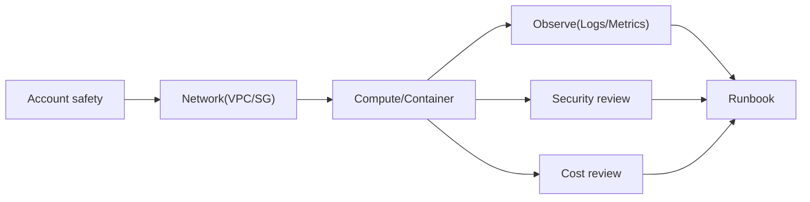

# 1교시: Week 5 통합 운영 지도

## 실습 확인 기록

| 명령/확인 | 결과 |
|---|---|
| | |

## 확인 질문 답변

| 질문 | 답변 |
|---|---|
| Week 5의 최종 목표는 무엇인가? | AWS 서비스를 **많이 보는 것이 아니라**, 각 resource를 **운영 경계(account/network/runtime/observe/security/cost)** 안에서 어떻게 운영하는지 **evidence와 runbook으로 연결**하는 것 |
| 운영 경계로 나눈다는 게 무슨 뜻인가? | 같은 resource도 **어느 책임 영역에서 보느냐**로 질문이 다름. EC2 하나도 network(SG)·runtime(상태)·observe(로그)·cost(요금) 경계에서 각각 확인 → "목록"이 아니라 "경계별 판단" |
| Evidence chain이란? | 상태(health)→로그(CloudWatch Logs)→이벤트(CloudTrail)→비용(Cost Explorer)이 **끊기지 않고 연결**되는 것. 장애/비용 질문에 "이 화면→이 판단→이 행동"으로 답할 수 있어야 함 |
| runbook과 portfolio packet의 차이는? | **runbook**=반복 가능한 **운영 절차**(다음 사람이 같은 조치를 재현). **portfolio packet**=학습 결과를 **현업형 산출물**(README+evidence+checklist)로 묶은 것. 캡처 묶음으로 끝내지 않음 |
| 어떤 resource를 핵심으로 볼까? | 실습에서 **실제 traffic이나 비용을 만든** resource 우선(ALB·RDS·running instance). 만들다 만 것보다 **살아서 과금·트래픽을 낸 것**이 운영 evidence의 중심 |
| 판단은 어떤 형식으로 남기나? | **`확인한 값 → 판단 → 다음 행동`** 3단. 예: "SG inbound 0.0.0.0/0 → DB 노출 위험 → source를 app SG로 제한". "성공했다"가 아니라 값·판단·행동을 남김 |
| screenshot에 민감정보가 보이면? | account email·secret value·access key·token·password는 **폐기하거나 가린 뒤 다시 저장**. evidence는 resource name·Region·상태값·tag처럼 **재현 가능한 값**만 |

## notes

- **한 줄 요약**: Week 5의 결론은 서비스 나열이 아니라 **운영 경계를 evidence와 runbook으로 연결**하는 것 — D5는 특정 서비스가 아니라 **evidence↔decision의 연결**이 중심
- **핵심**: EC2·ALB·ECR/ECS·S3/RDS·Secrets·CloudWatch·CloudTrail·Cost Explorer를 **따로 보지 않고**, 하나의 resource가 **account·network·runtime·observe·security·cost 경계** 안에서 어떻게 운영되는지 다시 묶는다
- **구조로 보기**:

- **6개 운영 경계 (오늘의 재분류 축)**:
  | 경계 | 답하는 질문 | 대표 evidence | Week5 연결 |
  |---|---|---|---|
  | **Account** | 누구 계정·권한인가 | `sts get-caller-identity`, IAM | D1 |
  | **Network** | 어디에 놓였고 뭐가 열렸나 | VPC/subnet, **SG inbound** | D2·D4 |
  | **Runtime** | 무엇이 실행 중인가 | EC2/ECS/App Runner, ALB, ECR | D2·D3 |
  | **Observe** | 무슨 일이 있었나·얼마나 | CloudWatch Logs/Metrics, CloudTrail | D3 |
  | **Security** | 누가 접근·뭐가 공개됐나 | Secrets, public access, IAM | D4 |
  | **Cost** | 비용 원인·owner는 | Cost Explorer, tag, 잔여 audit | D4 |
- **"방패" 세 개는 서로 다른 계층 (SG / Shield / WAF)**: 네트워크 경계에 방패 아이콘이 여럿 나오는데 **막는 계층이 다름** — 헷갈리면 안 됨:
  | | 계층 | 무엇을 보나 | 위치 |
  |---|---|---|---|
  | **Security Group** | L3/L4 | **IP·port**(연결 허용/차단) | VPC, resource 앞 |
  | **AWS Shield** | L3/L4 | **DDoS**(대량 트래픽 공격) | 인터넷 진입(ALB/CloudFront) |
  | **AWS WAF** | **L7** | **요청 내용**(SQLi·XSS·rate·봇) | **ALB·CloudFront·API GW 앞** |
  - **WAF**=Web Application Firewall. 들어오는 HTTP 요청을 **규칙(managed rule group·IP set·rate-based)**으로 검사해 **Block/Allow/Count**. "누가 port에 닿나"(SG)나 "공격 트래픽 방어"(Shield)가 아니라 **"요청 하나하나가 악성인가"**를 봄.
  - 셋은 대체가 아니라 **함께**: SG(연결)+Shield(DDoS)+WAF(요청 내용)가 각 계층에서 각각 막음 → D5 network/security 경계 evidence.
- **Evidence chain = 끊기지 않게 연결**: 상태(health) → 로그(Logs) → 이벤트(CloudTrail) → 비용(Cost Explorer). 한 축만 있으면 "봤다"에 그침. **세 축 이상 연결**돼야 장애·비용 질문에 답 가능 → D5 산출물 기준
- **runbook vs portfolio packet**:
  | | runbook | portfolio packet |
  |---|---|---|
  | 목적 | 반복 가능한 **운영 절차** | 학습 결과를 **현업형 산출물**로 |
  | 독자 | 다음 운영자(재현) | 평가자·본인 |
  | 형태 | "증상→확인→조치" 절차 | README + evidence + checklist |
- **판단 기록 형식 = `확인한 값 → 판단 → 다음 행동`**: evidence는 "성공"이 아니라 **값·판단·행동**. 예) `SG inbound=0.0.0.0/0:3306 → DB 인터넷 노출 → source를 app SG로 제한 후 재확인`
- **핵심 resource 우선순위**: 만들다 만 것보다 **실제 traffic·비용을 낸** resource(ALB·running RDS·EIP 등)를 먼저 evidence로. 살아서 과금·트래픽을 낸 것이 운영의 중심
- 흔한 실패 3개:
  - ① **서비스 이름만 나열**하고 운영 경계 설명 못 함(→ 경계로 재분류)
  - ② **evidence 없는 캡처**(값·판단·행동 없는 screenshot)
  - ③ **비용/보안 질문 누락**(runtime만 보고 cost·security 경계를 안 봄)

## Blocker Log

| 증상 | 확인한 것 |
|---|---|
| | |
