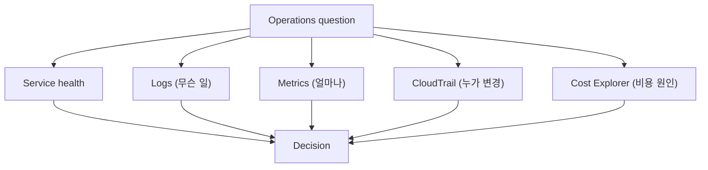

# 2교시: 운영 evidence dashboard

## 실습 환경 변수

```bash
export REGION=ap-northeast-2
export LOG_GROUP=/ecs/w5-app        # 실제 log group 이름으로 교체
export INSTANCE_ID=i-0123456789abc  # 실제 instance id로 교체
export START=2026-07-01
export END=2026-07-11
```

> dashboard 실습의 핵심은 화면을 모으는 게 아니라 **"이 질문엔 이 화면"**을 고르는 것. 아래 명령은 Logs→Metrics→Alarm→CloudTrail→Cost 순서로 같은 운영 질문에 대는 evidence다.

## 실습 확인 기록

| 명령/확인 | 결과 |
|---|---|
| ① (logs) `aws logs describe-log-groups --region $REGION --query 'logGroups[].logGroupName'` | |
| ② (logs) `aws logs filter-log-events --log-group-name $LOG_GROUP --filter-pattern ERROR --max-items 10 --region $REGION` | |
| ③ (metrics) `aws cloudwatch list-metrics --namespace AWS/EC2 --region $REGION --query 'Metrics[].MetricName' --output text` | |
| ④ (metrics) `aws cloudwatch get-metric-statistics --namespace AWS/EC2 --metric-name CPUUtilization --dimensions Name=InstanceId,Value=$INSTANCE_ID --start-time $(date -u -v-3H +%Y-%m-%dT%H:%M:%SZ) --end-time $(date -u +%Y-%m-%dT%H:%M:%SZ) --period 300 --statistics Average --region $REGION` | |
| ⑤ (alarm) `aws cloudwatch describe-alarms --region $REGION --query 'MetricAlarms[].[AlarmName,StateValue]'` | |
| ⑥ (trail) `aws cloudtrail lookup-events --max-results 10 --region $REGION --query 'Events[].[EventTime,EventName,Username]'` | |
| ⑦ (trail) `aws cloudtrail lookup-events --lookup-attributes AttributeKey=EventName,AttributeValue=RunInstances --max-results 5 --region $REGION` | |
| ⑧ (cost) `aws ce get-cost-and-usage --time-period Start=$START,End=$END --granularity DAILY --metrics UnblendedCost --group-by Type=DIMENSION,Key=SERVICE` | |
| ⑨ (dashboard) `aws cloudwatch list-dashboards --region $REGION` | |
| ⑩ (dashboard) `aws cloudwatch put-dashboard --dashboard-name w5d5-ops --dashboard-body file://dashboard.json --region $REGION` | |

## 확인 질문 답변

| 질문 | 답변 |
|---|---|
| 좋은 dashboard의 기준은? | **화면 수가 아니라** 운영 질문에 답하는 **evidence 연결**. 각 panel이 "어떤 질문에 답하나"를 말할 수 있어야 함. 예쁜 그래프 묶음 ≠ dashboard |
| 같은 장애인데 첫 화면이 달라지는 이유는? | **질문이 다르기 때문**. "응답 느림"→metric·log, "설정이 갑자기 바뀜"→CloudTrail, "비용 늘어남"→Cost Explorer·tag. 증상이 같아도 **묻는 게 다르면 먼저 볼 evidence가 다름** |
| Logs와 Metrics의 차이는? | **Logs**=무슨 일이 있었나(**text/event**, 원인). **Metrics**=얼마나 자주·크게(**number over time**, 규모·추세). error 원인을 숫자 그래프에서만 찾으면 놓침 |
| CloudTrail은 app log와 어떻게 다른가? | **CloudTrail**=누가 어떤 **API 변경**을 했나(control plane). **app log**=app 안에서 무슨 일(data plane). "설정이 언제 누구에 의해 바뀌었나"는 app log가 아니라 **CloudTrail** |
| 사용자 장애인지 설정 변경인지 어떻게 나누나? | health/log/metric(=지금 상태·증상)과 **CloudTrail**(=최근 변경)을 **나눠서** 봄. **변경 시각 vs 증상 시각**을 비교 → 변경 직후 증상이면 그 변경이 원인 후보 |
| alarm은 어떤 metric에만 다나? | **반복적이고 행동 가능한** metric에만. 볼 때마다 다른 조치가 필요 없거나 대응 불가능한 지표에 alarm을 달면 **노이즈**만 늘어 진짜 알림을 묻음 |
| dashboard evidence는 무엇을 남기나? | log group/metric graph, **CloudTrail event**, Cost Explorer filter 중 **최소 두 가지**를 `확인한 값→판단→다음 행동`으로. resource name·Region·상태값 등 재현 가능한 값만 |

## notes

- **한 줄 요약**: 좋은 dashboard는 **화면 수가 아니라 운영 질문에 답하는 evidence 연결**로 평가한다
- **핵심**: dashboard는 모든 화면을 한 번에 띄우는 **장식이 아니라**, 문제 질문에 맞는 evidence를 **빠르게 찾는 지도**. 같은 장애라도 **질문이 다르면 첫 화면이 다르다**
- **구조로 보기**:

- **5개 evidence 소스 (무엇에 답하나)**:
  | 소스 | 답하는 질문 | 형태 |
  |---|---|---|
  | **Health** | 지금 정상인가 | 상태값(healthy/unhealthy) |
  | **Logs** | **무슨 일**이 있었나(원인) | text/event |
  | **Metrics** | **얼마나** 자주·크게(규모·추세) | number over time |
  | **CloudTrail** | **누가** 어떤 API를 바꿨나 | 변경 event |
  | **Cost Explorer** | 비용 **원인·owner**는 | service/tag 금액 |
- **증상 → 첫 화면 매핑 (질문이 화면을 정한다)**:
  | 증상/질문 | 먼저 볼 화면 | 왜 |
  |---|---|---|
  | 응답이 느림 | **Metrics + Logs** | 규모(latency/CPU) + 원인(error) |
  | 설정이 갑자기 바뀜 | **CloudTrail** | 누가·언제 API 변경 |
  | 비용이 늘어남 | **Cost Explorer + tag** | service별 원인·owner |
  | 공개·권한 의심 | **IAM / SG / secret** | 접근 범위 |
  | 알림이 울렸는데 상태 모름 | **Alarm state + Metrics** | INSUFFICIENT_DATA인지 실제 초과인지 |
- **예시 walkthrough: "로그인이 느리다" → ① Metrics → ② Logs (순서가 중요)**:
  - **① 먼저 Metrics** — **어디가·얼마나** 느린지 규모부터. ALB `TargetResponseTime`(어느 구간이 느린가), EC2/ECS `CPUUtilization`, RDS `DatabaseConnections`·`CPU`·`ReadLatency`. → "언제부터, 얼마나, 어느 계층"을 좁힘.
  - **② 그다음 Logs** — 좁혀진 구간의 **원인**. app log의 error·느린 요청, DB 쪽이면 slow query. metric이 가리킨 **시각·계층**의 로그만 보면 빠름.
  - **왜 이 순서인가**: metric 없이 로그부터 뒤지면 **어디를 볼지 몰라** 로그 바다에서 헤맴. metric이 **"DB 연결 폭증·11시부터·app 아닌 DB"**로 좁혀주면, 그 시각 DB 로그만 확인 → 원인 도달이 빠름. **규모(Metrics)로 좁히고 원인(Logs)으로 확인.**
  - (설정 변경이 의심되면 여기에 **CloudTrail**을 더해 "11시에 누가 SG/파라미터를 바꿨나"까지 연결)
- **Logs ≠ Metrics (반복이지만 핵심)**: Logs=**무슨 일**(text, 원인 추적), Metrics=**얼마나**(수치, 규모·추세). error 원인을 그래프에서만 찾거나, 장애 규모를 로그 몇 줄로만 판단하면 어긋남 → **둘을 짝지어** 봄
- **CloudTrail ≠ app log (자주 착각)**: CloudTrail은 **누가 어떤 AWS API를 호출·변경**했나(control plane). app이 내부에서 무슨 일을 했나는 **app log(CloudWatch Logs)**. "설정이 언제 바뀌었나"를 app log에서 찾으면 안 나옴 → CloudTrail Event history
- **변경 vs 증상 = 시각 비교**: "사용자 장애인가 내가 바꾼 건가"는 **변경 시각(CloudTrail) vs 증상 시각(metric/log)**을 나란히 놓고 판단. 변경 직후 증상 시작이면 그 변경이 1순위 원인 후보
- **alarm은 반복적·행동 가능한 metric에만**: 대응이 필요 없거나(무해한 스파이크) 대응 불가능한 지표에 alarm을 달면 **노이즈**가 쌓여 진짜 알림을 묻음. 좋은 metric = **다음 행동으로 연결**되는 것(3교시 D3 alarm 튜닝과 같은 맥락)
- **evidence 기록 형식**: dashboard 산출물도 `확인한 값 → 판단 → 다음 행동`. "그래프 있음"이 아니라 "CPU 90%가 10분 지속 → 부하 과다 → desired count 상향 검토"
- 흔한 실패 3개:
  - ① **Region mismatch**(다른 Region 보고 "로그 없음"으로 오판)
  - ② **metric 지연을 장애로** 오해(수집·표시 지연 있음, 특히 저빈도 metric)
  - ③ **CloudTrail을 app log로** 착각(변경 이력 ≠ app 내부 동작)

## Blocker Log

| 증상 | 확인한 것 |
|---|---|
| | |
