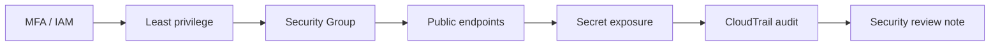

# 3교시: Security review

## 실습 확인 기록

| 명령/확인 | 결과 |
|---|---|
| | |

## 확인 질문 답변

| 질문 | 답변 |
|---|---|
| security review란 무엇인가? | "보안이 중요하다"는 **선언이 아니라**, **누가 접근 가능**(IAM/MFA)·**어디가 공개**(SG/public endpoint)·**뭐가 노출**(secret)·**무슨 변경이 감사에 남나**(CloudTrail)를 **항목마다 확인하는 절차/표** |
| MFA를 왜 첫 항목에 두나? | 계정 **탈취 위험을 줄이는 첫 안전장치**. 특히 **root**는 최고 권한이라 MFA 필수. password만으론 유출 시 바로 뚫림 → MFA로 2차 방어 |
| least privilege는 어떻게 확인하나? | user/role의 policy를 보고 **필요한 권한만** 있는지. 특히 `AdministratorAccess`가 실습 user에 붙어 있으면 **과도**. credential report로 각 user의 key·MFA·권한을 한눈에 |
| "어디가 공개됐나"는 어디서 보나? | **SG source(0.0.0.0/0)**, **ALB scheme(internet-facing)**, **RDS PubliclyAccessible**, **EC2 public IP**, **S3 Block Public Access**. 한 곳이 아니라 **여러 노출면을 함께** |
| SG에 0.0.0.0/0이 있으면 무조건 문제인가? | 아니다. **80/443(웹) 같은 의도된 공개**는 정당. 문제는 **관리 port(22/3389)·DB port(3306/5432)**가 0.0.0.0/0인 것 → **어느 port가 열렸나**를 봐야. 의도면 사유를 evidence로 |
| 민감 정보 확인은 어떻게 하나? | screenshot·markdown·git diff에서 **secret 값·access key·token 제거**. secret은 **이름만** evidence로. "노출 없음"도 증거(값 없는 상세 화면) |
| CloudTrail은 security review에서 무슨 역할인가? | **변경 감사**. "누가 언제 SG를 열었나(`AuthorizeSecurityGroupIngress`)", "누가 policy를 붙였나"를 추적. trail이 **켜져 있어야**(logging) 사후 추적 가능 |

## notes

- **한 줄 요약**: 보안 리뷰는 원칙 문장이 아니라 **접근 주체·공개 범위·민감 정보·감사 증거**를 확인하는 **표**
- **핵심**: "보안이 중요하다"는 선언은 evidence가 아님. **누가 접근(IAM/MFA)·어디 공개(SG/public)·뭐가 노출(secret)·무슨 변경이 감사에 남나(CloudTrail)**를 항목마다 **Console 위치 + 확인 값 + 판단**으로 남긴다
- **구조로 보기**:

- **보안 리뷰 5축 (항목마다 화면·값·판단)**:
  | 축 | 확인 질문 | 화면/명령 | 위험 신호 |
  |---|---|---|---|
  | **Identity** | 누구고 MFA 있나 | IAM, `get-account-summary`(①③) | root MFA off, MFA 없는 user |
  | **Access** | 필요한 권한만인가 | credential report(⑤), policy(⑥) | `AdministratorAccess` 남발 |
  | **Exposure** | 어디가 공개됐나 | SG·ALB·RDS·EC2·S3(⑦~⑪) | 관리/DB port 0.0.0.0/0, RDS public |
  | **Secret** | 민감값 노출됐나 | Secrets(⑫), git/screenshot | secret 값이 evidence에 |
  | **Audit** | 변경 추적되나 | CloudTrail(⑬⑭) | trail off, 변경 이력 없음 |
- **MFA = 첫 안전장치 (root 우선)**: password 유출돼도 2차 인증으로 방어. **root 계정 MFA는 필수**(최고 권한), IAM user도 콘솔 접근이면 권장. `AccountMFAEnabled`로 root MFA 확인
- **least privilege = "관리자 권한 남발" 점검**: 실습 편의로 `AdministratorAccess`를 user에 붙이면 편하지만 **과도 권한**. ⑥으로 admin 붙은 주체를 세고, 필요하면 **좁은 policy**로. credential report는 **각 user의 key 나이·MFA·마지막 사용**을 표로 → 안 쓰는 key·MFA 없는 user 색출
- **exposure = 한 곳이 아니라 노출면 전부**: 
  - **SG**: 어느 port가 0.0.0.0/0인가 — **80/443은 의도된 공개일 수 있으나 22/3389(관리)·3306/5432(DB)는 위험**.
  - **ALB**: `internet-facing` vs `internal`.
  - **RDS**: `PubliclyAccessible=true`면 재검토(4교시 원칙: 운영은 No).
  - **EC2**: public IP 붙은 instance.
  - **S3**: account/bucket **Block Public Access** 켜졌나.
- **SG 0.0.0.0/0은 port로 판단**: "0.0.0.0/0 = 무조건 나쁨"이 아니라 **열린 port가 뭐냐**가 핵심. 웹 공개는 정당, **SSH/RDP/DB port 전체 공개**는 즉시 좁힘. 의도된 공개면 **사유·범위**를 evidence로
- **secret 노출 = 값을 안 남기는 게 evidence**: security review에서 secret은 **이름만**. "값 없음"을 보여주는 화면·git diff가 오히려 증거. 값·key·token이 캡처에 보이면 그 자체가 리뷰 실패
- **CloudTrail = 사후 추적 가능성**: 변경(누가 SG 열고 policy 붙였나)을 추적하려면 **trail이 켜져 로그를 남기고 있어야** 함. review에서 `describe-trails`로 logging 여부, `AuthorizeSecurityGroupIngress` 같은 **위험 변경 event**를 확인
- **기록 형식 = `확인한 값 → 판단 → 다음 행동`**: 예) `SG sg-123 inbound 22 0.0.0.0/0 → SSH 전체 공개 위험 → 내 IP/bastion으로 제한 후 재확인`. "확인함"이 아니라 값·판단·행동
- 흔한 실패 3개:
  - ① **root로 실습**(최고 권한 상시 사용 → IAM user + MFA로)
  - ② **SG 0.0.0.0/0 방치**(특히 관리·DB port)
  - ③ **secret 값을 캡처**(evidence에 민감값 노출)

## Blocker Log

| 증상 | 확인한 것 |
|---|---|
| | |
